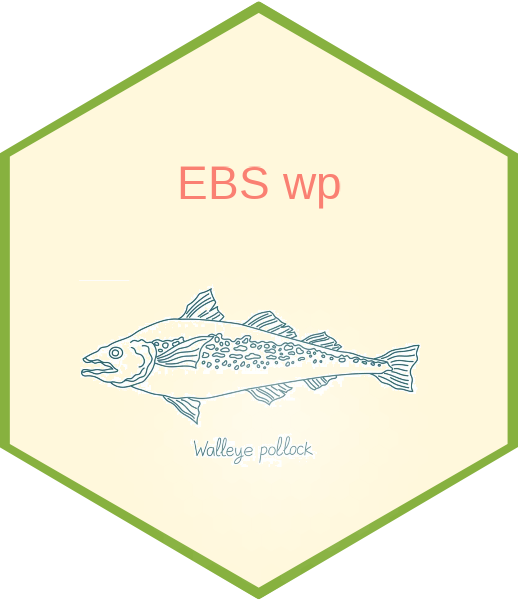

<!-- README.md is generated from README.Rmd. Please edit that file -->

```{r setup, include = FALSE}
knitr::opts_chunk$set(
  collapse = TRUE,
  comment = "#>",
  fig.path = "man/figures/README-",
  out.width = "100%"
)
```

# East Bering Sea pollock 

The R package `ebswp` was developed for doing stock assessments of 
eastern Bering Sea walleye pollock for the AFSC.
The stock assessment model was coded using the Autodif Model 
Builder (`ADMB`) software.

## Cloning the repository (optional)

The R package `ebswp` lives on a private GitHub repository. The repository can be 
cloned to your computer from the command line or using a user interface. From 
the command line using Linux the repository can be cloned using:

``` r
git clone https://github.com/afsc-assessments/ebswp
```

## Installation

There are several options for installing the `ebswp` R package.

### Option 1

The `ebswp` package can be installed from within R using:

``` r
devtools::install_github(repo = "afsc-assessments/ebswp", dependencies = TRUE, 
                         build_vignettes = TRUE, auth_token = "your_PAT")
```

### Option 2

The GitHub repository can be cloned to your computer and the package installed 
from the command line. From Linux this would involve:

``` r
git clone https://github.com/afsc-assessments/ebswp
R CMD INSTALL ebswp
```

### Option 3

This time from within R using:

``` r
devtools::install("ebswp")
```

## Help

Help for all `ebswp` functions and data sets can be found on the R help pages 
associated with each function and data set. Help for a specific function can be 
viewed using `?function_name`, for example:

``` r
?run_model
?tab_fit
?plot_sel
```

Alternatively, to see a list of all available functions and data sets use:

``` r
help(package = "ebswp")
```

## Examples

The package vignettes are a great place to see what `ebswp` can do. You can view 
the package vignettes from within R using:

``` r
browseVignettes(package = "ebswp")
vignette(topic = "ebswp", package = "ebswp")
```

## Website

All of the vignettes and the help pages for each function are bundled together 
and published on the website https://afsc-assessments.github.io/ebswp/.

## Developers

Developers will want to do things slightly differently. See the 
`Model development` vignette.
