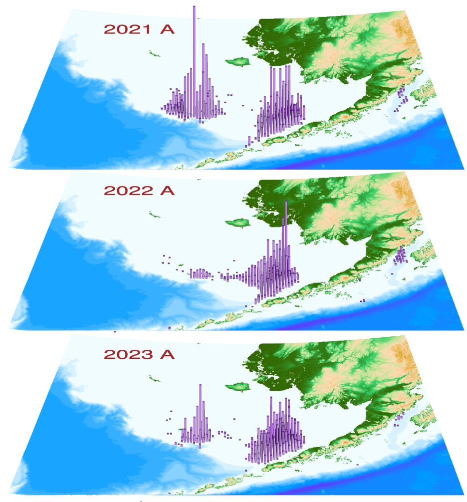
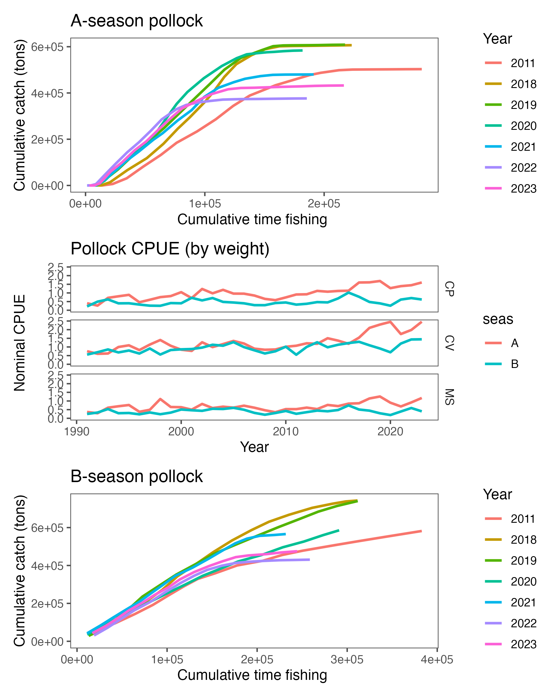
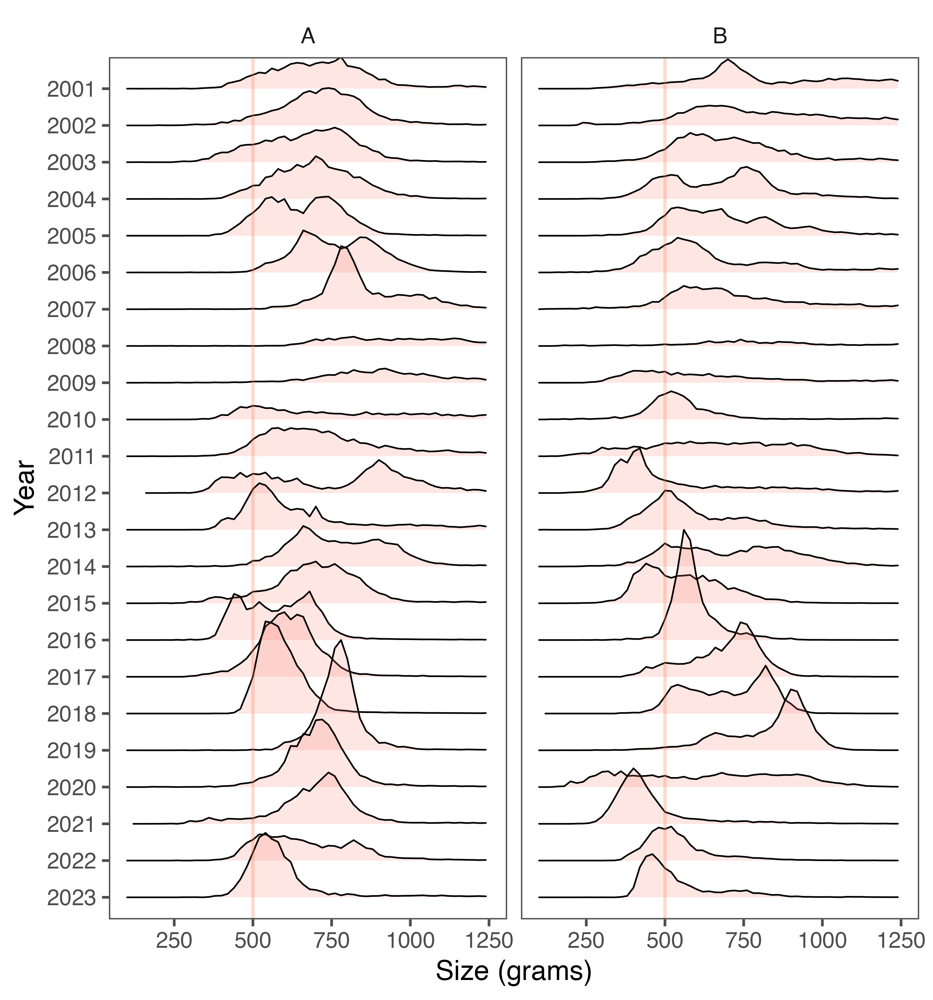
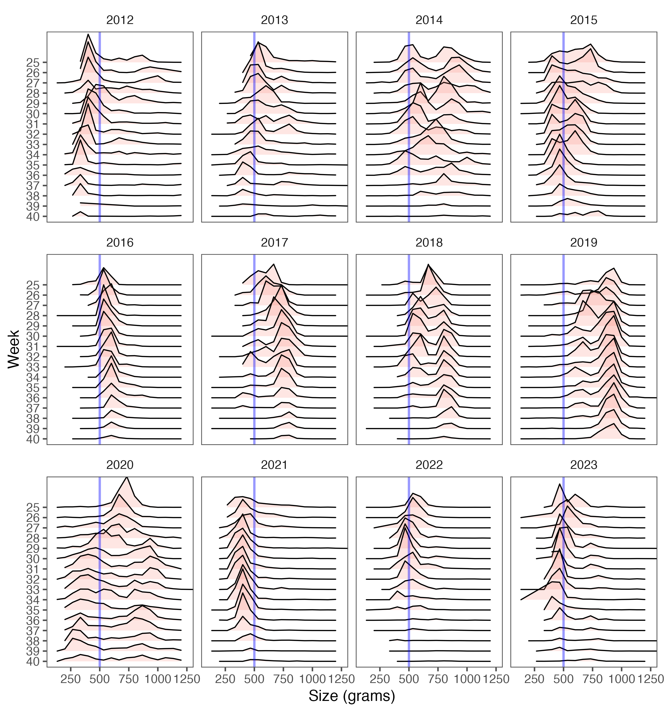
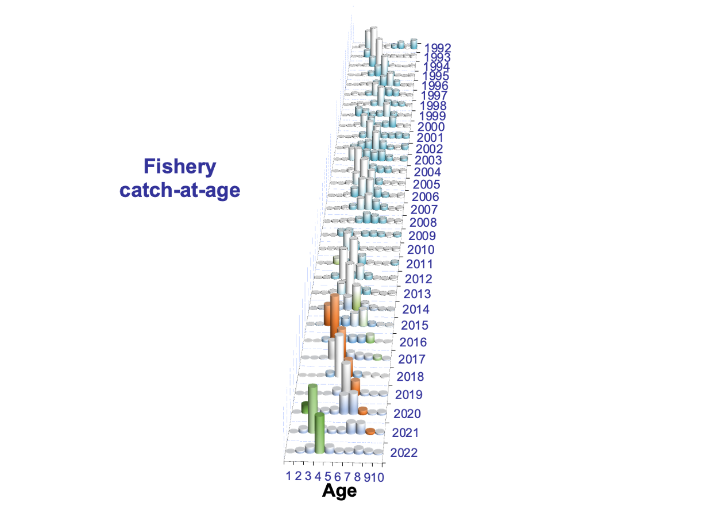

\pagenumbering{gobble}


----


\begin{centering}
  James Ianelli, Ben Fissel, Kirstin Holsman, Alex De Robertis, Taina Honkalehto, \\
  Stan Kotwicki, Cole Monnahan, Elizabeth Siddon, and James Thorson \\
\fontfamily{cmr}
\fontsize{10}{12}
\selectfont
  Alaska Fisheries Science Center, National Marine Fisheries Service \\
  National Oceanic and Atmospheric Administration \\ 
  7600 Sand Point Way NE., Seattle, WA 98115-6349 \\ October 21, 2021 \\ 
	\end{centering}
----


#  Executive summary

This chapter covers the Eastern Bering Sea (EBS) region—the Aleutian Islands
region (Chapter 1A) and the Bogoslof Island area (Chapter 1B) are presented
separately.

### Summary of changes in assessment inputs

Relative to last year’s BSAI SAFE report, the
following substantive changes have been made in the EBS pollock stock
assessment. Notably, a number of surveys were cancelled including the
 2020 NMFS bottom-trawl survey (BTS),
   the 2020 NMFS acoustic-trawl survey (ATS), and 
   th 2020 opportunistic acoustic data from vessels (AVO).  

#### Changes in the data

   1.  Observer data for catch-at-age and average weight-at-age from
   the 2019 fishery were finalized and included. 

   2.  Total catch as reported by NMFS Alaska Regional office was updated and included through 2020.
   
   3.  In summer 2020, the AFSC coordinated a survey conducted by three uncrewed surface vehicles (USVs) using acoustics.

### Changes in the assessment methods

There were some minor changes to data used for the assessment model this year. 
We continued to refine treatment of survey data via spatial-temporal models
for  creating an alternative index including the broader region of the
northern Bering Sea, mainly by improving the documentation. 

## Summary of EBS pollock results
The following table applies for Model 20.0, the model used for last year's assessment but with data from the 
uncrewed surface vehicles (USVs) included as an extension of the acoustic trawl survey. 
An alternative table is provided for this model which excludes the USV data from 2020.
As in past years,  the ABC recommendation reflects the Tier 3 estimate.

\begin{table}[ht]
\centering
\begin{tabular}{lrr|rr}
  \hline
       & \multicolumn{2}{c|}{As estimated or $\mathit{specified}$ } & \multicolumn{2}{c}{As estimated or $\mathit{recommended}$ }  \\
       & \multicolumn{2}{c|}{$\mathit{last}$ year for:}  & \multicolumn{2}{c}{$\mathit{this}$ year for: }               \\
        Quantity & 2020      &2021   & 2021      &2022 \\ 
  \hline
  M            (natural mortality rate, ages 3+)	&	0.3	&	0.3	&	0.3	&	0.3 \\
  Tier         &	1a	&	1a	&	1a	&	1a \\
  Projected    total (age  3+) biomass (t)     & 9,128,000 t & 8,494,000 t & 8,145,000 t & 7,641,000 t \\
  Projected    female  spawning  biomass (t)   & 2,991,000 t & 2,674,000 t & 2,602,000  t & 2,406,000  t \\  
  $B_0$        & 5,777,000 t & 5,777,000 t & 5,792,000  t & 5,792,000  t \\          
  $B_{msy}$    & 2,148,000 t & 2,148,000 t & 2,257,000  t & 2,257,000  t \\          
  $F_{OFL}$    & 0.449 & 0.449 & 0.341  & 0.341  \\                  
  $maxF_{ABC}$ & 0.383 & 0.383 & 0.304  & 0.304  \\                  
  $F_{ABC}$    & 0.225& 0.225& 0.214 & 0.214 \\                  
  $OFL$        & 4,085,000 t & 3,385,000 t & 2,594,000  t & 2,366,000  t \\          
  $maxABC$     & 3,485,000 t & 2,888,000 t & 2,307,000 t & 2,105,000 t \\      
  $ABC$        & 2,043,000 t & 1,767,000 t & 1,626,000 t & 1,484,000  t \\        
  \hline
  Status	                              &	2018  & 2019&			2019             &	2020          \\
  \hline
  Overfishing	                          &	No	        &	n/a	      &	No	                       &	n/a                 \\
  Overfished	                          &	n/a	        &	No	      &	n/a	                       &	No                  \\
  Approaching overfished	              &	n/a	        &	No	      &	n/a	                       &	No                  \\
  \hline
\end{tabular}
\end{table}

## Response to SSC and Plan Team comments

### General comments 

The SSC recommended that a detailed review of the support for retaining the EBS Pollock assessment in Tier 1 
versus reclassifying it as Tier 3 be pursued in the 2020 assessment. 

  - _We evaluated factors affecting the Tier classification._     

**The SSC had a number of recommendations for additional research supporting this assessment:**

The SSC encourages further investigation of the apparent shift between a clear 2012 year-class to mixed 2012-2013 year classes in the data, suggestive of potentially variable ageing bias.   

  - _The newly available 2019 fishery age data shows a similar relative proportion of these two year classes; this suggests (based on earlier inquiries with the age-determination experts) that this pattern is reasonable._     

Noting the work in deriving an external estimate of temporal variability in catchability for the bottom trawl survey (relative to the acoustic survey) due to vertical availability, 
the SSC noted that catchability would logically also vary for the acoustic survey. The SSC encourages 
further work to develop the simultaneous modelling of these two surveys, accounting for vertical and distributional 
shifts (including into the northern Bering Sea survey area; NBS). When
sufficiently explored, the SSC looks forward to assessment model configurations that explore the
use of a time-series from this method.  

  - _Work on this topic stalled as analysts focused their efforts on methods
  to incorporate the uncrewed surface vessels (USVs) to collect acoustic data._


The SSC supports ongoing genetic studies to determine the relationship between pollock in the NBS and EBS,  as well as other surrounding regions (AI, GOA).  

  - _A post doctoral researcher has begun this work but
  progress has been limited due to lab access and other factors related to the pandemic._

The SSC supports the continued use of a formal decision table to illustrate risks of alternative harvest strategies.  

  - _This was included in this year's assessment report._

The SSC supports the GPT’s recommendation to revisit the treatment of all variance parameters 
in the next assessment, particularly those that are set at fixed values 
(e.g., the value of 0.2 for the acoustic survey).    

  - _This planned activity is only partially underway. More work is planned on estimating process error parameters._

The SSC also looks forward to estimates of movement and abundance along the US-Russia EEZ 
boundary based on echosounders fixed to moorings in this area.     

  - _The moored sounders have been recovered in September 2020 but the data have yet to be processed._     

**From previous requests:**

Re-examine the geographic subset of data currently used to develop the AVO
index, specifically to see if including Bristol Bay data improves the
correlation.    

  -  _Work on this continues but was given lower priority given that the AVO was not part of this year's assessment._     

Explore “A” season trends in mean weight-at-length with a GAM or
similar technique, to determine if the trends are either predominantly
environmental or predominantly fishery-driven, Regarding $\sigma_R$, explore
alternative fixed values or estimation methods.

  - _Trends in mean weight given length are again presented. The extent that fishery affects this pattern was shown to be related to timing. Further work is needed to establish a mean baseline (in time and space) to try to sort out environmental effects hypotheses. Values of $\sigma_R$ were explored in previous years, no further work was done on this in 2020._           

\pagebreak

# Introduction

## General

Walleye pollock (_Gadus chalcogrammus_; hereafter referred to as pollock) are
broadly distributed throughout the North Pacific with the largest
concentrations found in the Eastern Bering Sea. Also  known as
Alaska pollock, this species continues to play important roles ecologically
and economically.

## Review of Life History 
In the EBS pollock spawn generally in the period
March-May and in relatively localized regions during specific periods (Bailey
2000). Generally spawning begins nearshore north of Unimak Island in March and
April and later near the Pribilof Islands (Jung et al. 2006, Bacheler et al.
2010). Females are batch spawners with up to 10 batches of eggs per female per
year. Eggs and larvae of EBS pollock are planktonic for a period of about 90
days and appear to be sensitive to environmental conditions. These conditions
likely affect their dispersal into favorable areas (for subsequent separation
from predators) and also affect general food requirements for over-wintering
survival (Gann et al. 2015, Heintz et al., 2013, Hunt et al. 2011, 
Ciannelli et al. 2004). Duffy-Anderson et al. (2015) provide a
review of the early life history of EBS pollock.

Throughout their range juvenile pollock feed on a variety of planktonic
crustaceans,  including calanoid copepods and euphausiids. In the EBS shelf
region, one-year-old pollock are found throughout the water column, but also
commonly occur in the NMFS bottom trawl survey. Ages 2 and 3 year old pollock
are rarely caught in summer bottom trawl survey gear and are more common in
the  midwater zone as detected by mid-water acoustic trawl surveys. Younger
pollock are  generally found in the more northern parts of the survey area and
appear to move to the southeast as they age (Buckley et al. 2009).
Euphausiids, principally _Thysanoessa inermis_ and _T. raschii_, are among the
most important prey items for pollock in the Bering Sea (Livingston, 1991;
Lang et al., 2000; Brodeur et al., 2002; Cianelli et al., 2004; Lang et al.,
2005).  Pollock diets become more piscivorous with age, and cannibalism has
been commonly observed in this region. However, Buckley et al. (2016) showed
spatial patterns of pollock foraging by size of predators. For example, the
northern part of the shelf region between the 100 and 200 m isobaths
(closest to the shelf break) tends to be more piscivorous than counterparts in
other areas.


## Stock structure 
Genetic samples were taken from pollock and collections
have continued from sources including observers and AFSC research surveys. A
large study using whole genome sequencing is currently underway for samples of
walleye pollock from Zhemchug Canyon, Japan, Prince William Sound, Bogoslof,
Shelikof, and the Northern Bering Sea. This project is a collaboration between 
the Joint Institute for the Study of Atmosphere and Oceans (currently
CICOES, the Cooperative Institute for Climate, Ocean, and Ecosystem Science)
and the Alaska Fisheries Science Center Cooperative Research Program. The
goals of the project include investigating whether genetic stock structure
exists in walleye pollock, if these patterns are temporally stable, and if
distributional shifts under climate change are detectable using genomic data.
Whole genome sequencing is a new approach to the study of pollock stock structure that 
is expected to yield higher statistical power than previous results using
microsatellite DNA markers. This planned study should help improve stock
structure evaluation (last done in Ianelli et al. 2015).

# Fishery  
## Description of the directed fishery 
Historically, EBS pollock catches were low until directed foreign fisheries
began in 1964. Catches increased rapidly during the late 1960s and reached a
peak in 1970--75 when they ranged from 1.3 to 1.9 million t annually.
Following the peak catch in 1972, bilateral agreements with Japan and the USSR
resulted in reductions. During a 10-year period, catches by foreign vessels
operating in the “Donut Hole” region of the Aleutian Basin were substantial
totaling nearly 7 million t (Table \ref{tab:catch}).   A fishing moratorium
for this area was enacted in 1993 and only trace amounts of pollock have been
harvested from the Aleutian Basin region since then.  Since the late 1970s,
the average EBS pollock catch has been about 1.2 million t, ranging from 0.810
million t in 2009 to nearly 1.5 million t during 2003--2006 (Table
\ref{tab:catch}).  United States vessels began fishing for pollock in 1980 and
by 1987 they were able to take 99\% of the quota. Since 1988, U.S. flagged
vessels have been operating in this fishery.  The current observer program for
the domestic fishery formally began in 1991 and prior to that, observers were
deployed  aboard the foreign vessels since the late 1970s.  From the period
1991 to 2011 about 80\% of the catch was observed at sea or during dockside
offloading. Since 2011, regulations require that all vessels participating in
the pollock fishery carry at least one observer so nearly 100% of the pollock
fishing operations are monitored by scientifically trained observers.
Historical catch estimates used in the assessment, along with management
measures (i.e., ABCs and TACs) are shown in Table \ref{tab:abc_tac}. 


### Catch patterns
The \"A-season\" for directed EBS pollock fishing opens on January 20th and
fishing typically extends into early-mid April. During this season the fishery
targets pre-spawning pollock and produces pollock roe that, under optimal
conditions, can comprise over 4\% of the catch in weight. The summer, or
\"B-season\" presently opens on June 10th and fishing extends through noon on
November 1st. The A-season fishery concentrates primarily north and west of
Unimak Island depending on ice conditions and fish distribution. There has
also been effort along the 100m depth contour (and deeper) between Unimak
Island and the Pribilof Islands. The general pattern by season (and area) has
varied over time with recent B-season catches occurring in the southeast
portion of the shelf (east of 170$^\circ$W longitude; Fig. \ref{fig:catch}).
Since 2011, regulations and industry-based measures to reduce Chinook salmon
bycatch have affected the spatial distribution of the fishery and to some
degree, the way individual vessel operators fish (Stram and Ianelli, 2014). In 
2020, the fishing fleet encountered higher than normal bycatch of herring and this
has further constrained the fishing grounds due to area closures. Additionally,
sablefish appear to be highly abundant in the region and have comprised a significant
proportion of the incidental catches in the pollock fishery (proportionally still less
than 1% of the total landings). Comparing encounters of bycatch and pollock
relative to the effort (total duration of all tows) the pollock fleet
the Chinook salmon bycatch rate was relatively flat whereas the encounters with
sablefish were markedly higher (Fig. \ref{fig:fsh_psc_cpue}). 


The catch estimates by sex for the seasons indicate that over time, the number
of males and females has been fairly equal but in the period 2017-2019
the A-season catch of females has been slightly higher and conversely, in the B-season
there has been a slightly higher number of males taken (Fig. \ref{fig:catch_sex}). The
2020 A-season fishery spatial pattern had relatively high concentrations of
fishing on the shelf north of Unimak Island and extended along the 200m depth
contour similar to 2019 but with a more dispersed distribution 
(Fig. \ref{fig:catch_distn_a}). The 2020 A-season nominal catch rates
were high similar to the good conditions observed in other recent A 
seasons (Fig. \ref{fig:fsh_cpue}). Beginning in 2017, due to  a regulatory
change, up to 45\% of the TAC could be taken in the A-season (previously only
40\% of the TAC could be taken). This conservation measure was made to allow
greater flexibility to avoid Chinook salmon in the B-season. To date, it
appears that the pollock fleet as a whole took advantage of  this added
flexibility (Fig. \ref{fig:prop_a_season}). While an important product from the
winter fishery is  the sale of pollock roe, production during the B-season is 
consistently about 10\% of the annual commercial products produced (Fig. \ref{fig:roe}).


The fishing in summer-fall 2020 was characterized as having low nominal catch
rates (Fig. \ref{fig:fsh_cpue}). The number of hours the fleet required to catch
the same tonnage of pollock was much higher than in recent years. 

 Catches in the northwestern area continued to increase over the past three years 
 (Fig. \ref{fig:catch_distn_b}). Also, the approach presented in 2019 to compute 
 the fleet dispersion 
(the relative distance or spread of the fishery in space) indicated that 
the A-season in 2019 and 2020 was relatively more concentrated compared to 
other years since 2000. Conversely, the B-season indicated the most dispersed
fishing activity over the same period (Fig \ref{fig:fleet_dispersal}).

In addition to logistic issues related to ensuring crew and observer
safety due to the COVID19 pandemic, there were reports of unusually small 
pollock in the catch. Consequently, we investigated whether the amount
of small fish has occurred in the past. The NMFS observer collections, in
addition to containing value length and weight data, also include a large number
of observations for the observed tows that provide a direct mean somatic mass
for pollock within that tow. This is based on the sampled total weight (e.g.,
of a basket of pollock) divided by the enumerated number of fish in that sample.
Such records exist for each tow. Summing these by extrapolated weight of the
pollock catch within that tow, and binning by weight increments (here by 50
gram intervals), allows us to obtain some additional fine-scale information on
the size trends in the pollock fishery. The annual patterns of these data show
that overall, 2020 was different, particularly for the B-season 
(Fig. \ref{fig:fsh_wt_freq}). To look more closely at the B-season fishery, we
compiled these data by week over recent years and found that there were very
smaller fish predominated in the catch (Fig. \ref{fig:fsh_wt_freq_week}). 


The catch of EBS pollock has averaged 1.21 million t in the period since 1979. 
The lowest catches occurred in 2009 and 2010
when the limits were set to 0.81 million t due to stock declines (Table
\ref{tab:abc_tac}). The recent 5-year average (2016-2020) catch has been 1.365
million t. Pollock catches that are retained or discarded (based on NMFS
observer estimates) in the Eastern Bering Sea and Aleutian Islands for 
1991--2020 are shown in Table \ref{tab:catch_disc}. Since 1991, estimates of
discarded pollock have ranged from a high of 9.1\% of total pollock catch in
1992 to recent lows of around 0.6\%. These low values reflect the
implementation of the NMFS' Improved Retention /Improved Utilization
program. Prior to the implementation of the American Fisheries Act (AFA) in
1999, higher discards may have occurred under the “race for fish” and
pollock marketable sizes were caught incidentally. Since
implementation of the AFA, the vessel operators have more time to pursue
optimal sizes of pollock for market since the quota is allocated to vessels
(via cooperative arrangements). In addition, several vessels have made gear
modifications to avoid retention of smaller pollock. In all cases, the
magnitude of discards counts as part of the total catch for management (to
ensure the TAC is not exceeded) and within the assessment. Bycatch of other
non-target, target, and prohibited species is presented in the section titled
Ecosystem Considerations below. In that section it is noted that the bycatch
of pollock in other target fisheries is more than double the bycatch of other
target species (e.g., Pacific cod) in the pollock fishery.

## Management measures
The EBS pollock stock is managed by NMFS regulations that provide limits on
seasonal catch. The NMFS observer program data provide near real-time
statistics during the season and vessels operate within well-defined limits.
In most years, the TACs have been set well below the ABC value and catches have
stayed within these constraints (Table \ref{tab:abc_tac}). Allocations
of the TAC split first with 10\% to western Alaska communities as part of the
Community Development Quota (CDQ) program and the remainder between at-sea
processors and shore-based sectors. For a characterization of the CDQ program
see Haynie (2014).  Seung and Ianelli (2016) combined a fish population
dynamics model with an economic model to evaluate regional impacts.

Due to concerns that groundfish fisheries may impact the rebuilding of the
Steller sea lion population, a number of management measures have been
implemented over the years. Some measures were designed to reduce the
possibility of competitive interactions between fisheries and Steller sea
lions. For the pollock fisheries, seasonal fishery catch and pollock biomass
distributions (from surveys) indicated that the apparent disproportionately
high seasonal harvest rates within Steller sea lion critical habitat could
lead to reduced sea lion prey densities. Consequently, management measures
redistributed the fishery both temporally and spatially according to pollock
biomass distributions. This was intended to disperse fishing so that localized
harvest rates were more consistent with estimated annual exploitation rates. The
measures include establishing: 1) pollock fishery exclusion zones around sea
lion rookery or haulout sites; 2) phased-in reductions in the seasonal
proportions of TAC that can be taken from critical habitat; and 3) additional
seasonal TAC releases to disperse the fishery in time.

Prior to adoption of the above management measures, the pollock fishery
occurred in each of the three major NMFS management regions of the North
Pacific Ocean: the Aleutian Islands (1,001,780 km$^2$  inside the EEZ), the
Eastern Bering Sea (968,600 km$^2$), and the Gulf of Alaska (1,156,100 km$^2$). The
marine portion of Steller sea lion critical habitat in Alaska west of 150$^{\circ}$W
encompasses 386,770 km$^2$ of ocean surface, or 12\% of the fishery management
regions.

From 1995--1999 84,100 km$^2$, or 22\% of the Steller sea lion critical
habitat was closed to the pollock fishery. Most of this closure consisted of
the 10 and 20 nm radius all-trawl fishery exclusion zones around sea lion
rookeries (48,920 km$^2$, or 13\% of critical habitat). The remainder was
largely management area 518 (35,180 km$^2$, or 9\% of critical habitat) that
was closed pursuant to an international agreement to protect spawning stocks
of central Bering Sea pollock. In 1999, an additional 83,080 km$^2$ (21%) of
critical habitat in the Aleutian Islands was closed to pollock fishing along
with 43,170 km$^2$  (11%) around sea lion haulouts in the GOA and Eastern
Bering Sea. In 1998, over 22,000 t of pollock were caught in the Aleutian
Island region, with over 17,000 t taken within critical habitat region.
Between 1999 and 2004 a directed fishery for pollock was prohibited in this
region. Subsequently, 210,350 km$^2$  (54%) of critical habitat was closed to
the pollock fishery. In 2000 the remaining phased-in reductions in the
proportions of seasonal TAC that could be caught within the BSAI Steller sea
lion Conservation Area (SCA) were implemented.

On the EBS shelf, an estimate (based on observer at-sea data) of the
proportion of pollock caught in the SCA has averaged about 44% annually.
During the A-season, the average is also about 44%. Nonetheless, the
proportion of pollock caught within the SCA varies considerably, presumably
due to temperature regimes and the relative population age structure.  The
annual proportion of catch within the SCA varies and has ranged from an annual
low of 11% in 2010 to high of 60% in 1998--the 2019 annual value was 58% but
and quite high again in the A-season (68\%; Table \ref{tab:catch_sca}).  The higher
values in recent years  were likely due to good fishing conditions close to
the main port.

The AFA reduced the capacity of the catcher/processor fleet and permitted the
formation of cooperatives in each industry sector by the year 2000. Because of
some of its provisions, the AFA gave the industry the ability to respond
efficiently to changes mandated for sea lion conservation and salmon bycatch
measures. Without such a catch-share program, these additional measures would
likely have been less effective and less economical (Strong and Criddle 2014).

An additional strategy to minimize potential adverse effects on sea lion
populations is to disperse the fishery throughout more of the pollock range on
the Eastern Bering Sea shelf. While the distribution of fishing during the
A-season is limited due to ice and weather conditions, there appears to be
some dispersion to the northwest area (Fig. \ref{fig:catch_distn_a}).

The majority (about 56\%) of Chinook salmon caught as bycatch in the pollock
fishery originate from western Alaskan rivers. An Environmental Impact
Statement (EIS) was completed in 2009 in conjunction with the Council’s
recommended bycatch management approach. This EIS evaluated the relative
impacts of different bycatch management approaches as well as estimated the
impact of bycatch levels on adult equivalent salmon (AEQ) returning to river
systems (NMFS/NPFMC 2009). As a result, revised Chinook salmon bycatch
management measures went into effect in 2011 which imposed new prohibited
species catch (PSC) limits. These limits, when reached,  close the fishery by
sector and season (Amendment 91 to the BSAI Groundfish Fishery Management Plan
(FMP) resulting from the NPFMC’s 2009 action). Previously, all measures for
salmon bycatch imposed seasonal area closures when PSC levels reached the
limit (fishing could continue outside of the closed areas). The current
program imposes a dual cap system by fishing sector and season. A  goal of
this system was to maintain incentives to avoid bycatch at a broad range of
relative salmon abundance (and encounter rates). Participants are also
required to take part in an incentive  program agreement (IPA). These IPAs are
approved and reviewed annually by NMFS  to ensure individual vessel
accountability. The fishery has been operating under  rules to implement this
program since January 2011.

Further measures to reduce salmon bycatch in the pollock fishery were
developed and the Council took action on Amendment 110 to the BSAI Groundfish
FMP in April 2015. These additional measures were designed to add protection
for Chinook salmon by imposing more restrictive PSC limits in times of low
western Alaskan Chinook salmon abundance. This included provisions within the
IPAs that reduce fishing in months of higher bycatch encounters and mandate
the use of salmon excluders in trawl nets. These provisions were also included
to provide more flexible management measures for chum salmon bycatch within
the IPAs rather than through regulatory provisions implemented by Amendment 84
to the FMP. The new measure also included additional seasonal flexibility in
pollock fishing so that more pollock (proportionally) could be caught during
seasons when salmon bycatch rates were low.  Specifically, an additional 5% of
the pollock can be caught in the A-season (effectively changing the seasonal
allocation from 40% to 45% (as noted above in Fig. \ref{fig:prop_a_season}).
These measures are all part of Amendment 110 and a summary of this and other
key management measures is provided in Table \ref{tab:mgt}.

There are three time/area closures in regulation to minimize herring PSC
impacts: *Summer Herring Savings Area 1* an area south of 57$^\circ$N
latitude and between 162$^\circ$W
and 164$^\circ$W longitude from June 15 through July 1st.
*Summer Herring Savings Area 2* an area south of 56$^\circ$ 30' N latitude and
between
164$^\circ$W  and 167$^\circ$W longitude from July 1 through August 15.
*Winter Herring Savings Area* an area between 58$^\circ$  and 60$^\circ$N 
latitude and between 172$^\circ$W and 175$^\circ$W longitude from 
September 1st through  March 1st of the next fishing year.

The pollock fishery exceeded the herring PSC limit late in the 2020 A season 
which invoked two directed pollock fishing closures: the Summer Herring Savings 
Area 1 and the Winter Herring Savings Area (closed since September 1, 2020 through March 1, 2021).
Voluntary closures by the CV fleet for directed fishing for pollock.
2nd closure for trawl CVs for herring.
Additionally, voluntary closure areas were announced throughout
the B-season 2020 and intended to minimize herring bycatch in areas where
herring occurred.


## Economic conditions as of 2019

Alaska pollock is the dominant species in terms of catch in the Bering Sea \&
Aleutian Island (BSAI) region. In 2019 pollock accounted for 73\% of the
BSAI's FMP groundfish harvest and 92\% of the total pollock harvest in Alaska.
Retained catch of pollock increased 2.2\% to 1.41 million t in 2019 (Table \ref{tab:bsaiplck_exv}). BSAI
pollock first-wholesale value was \$1.55 billion 2019, which was 12\% increase
from 2018 and above the 2010--2014 average of \$1.26 billion (Table \ref{tab:bsaiplck_wsl}). The higher revenues
in recent years is the combined effect of strong catch and production levels and
a steady increase in the average first-wholesale price since 2016. The
increases in the average  first-wholesale price of pollock products in 2016 and 2017
were largely due to increases the price of surimi products while the price increase
in 2018 was largely due to an increase in the price of fillets. Price increases in 2019 
were the combined effect of price increases in both fillets and surimi.

Pollock is targeted exclusively with pelagic trawl gear. The catch of pollock
in the BSAI was rationalized with the passage of the
AFA in 1998,\footnote{The AFA was implemented in 1999 for
catcher/processors, and in 2000 for catcher vessel and motherships.} which,
among other things, established a proportional allocation of the total
allowable catch (TAC) among vessels in sectors which were allowed to form into
cooperatives.\footnote{The BSAI pollock TAC is divided between Community
Development Program (10\% off the top), with the remaining amount split among shore-based
catcher vessels (50\%), at-sea catcher/processors (40\%) and motherships (10\%).}

Prior to 2008 pollock catches were high at approximately 1.4 million t in the
BSAI for an extended period (Table \ref{tab:bsaiplck_exv}). The U.S. accounted
for over 50\% of the global pollock catch (Table \ref{tab:bsaiplck_glbl}).
Between 2008--2010 conservation reductions in the pollock total allowable catch
(TAC) trimmed catches to an average 867 kt. The supply reduction
resulted in price increases for most pollock products, which mitigated the
short-term revenue loss (Table \ref{tab:bsaiplck_glbl}). Over this same
period, the pollock catch in Russia increased from an average of 1 million t
in 2005--2007 to 1.4 million t in 2008--2010 and Russia's share of global catch
increased to over 50\% and the U.S. share decreased to 35\%. Russia lacks the
primary processing capacity of the U.S. and much of their catch is exported to
China and is re-processed as twice-frozen fillets. Around the mid- to late-
2000s, buyers in Europe, an important segment of the fillet market, started to
source fish products with the MSC sustainability certification, and
retailers in the U.S. later began to follow suit. Asian markets, an important
export destination for a number of pollock products, have shown less interest
in requiring MSC certification. The U.S. was the only producer of MSC
certified pollock until 2013 when roughly 50\% of the Russian catch became MSC
certified.\footnote{Alaska caught pollock in
the BSAI became certified by the Marine Stewardship Council (MSC) in 2005, an
NGO based third-party sustainability certification, which some buyers seek.}
Since 2010 the U.S. pollock stock rebounded with catches in the
BSAI ranging from 1.2--1.3 million t and Russia's catch has stabilized at 1.5
to 1.6 million t. The majority of pollock is exported; consequently exchange
rates can have a significant impact on market dynamics, particularly the
Dollar-Yen and Dollar-Euro.\footnote{Aggregate exports in Table \ref{tab:bsaiplck_glbl}
may not fully account for all pollock exports as products such as meal,
minced fish and other ancillary product may be coded as generic fish type for export purposes.}
In 2015 the official U.S. market name changed from "Alaska pollock" to
"pollock" enabling U.S. retailers to differentiate between pollock caught in
Alaska and Russia. Additionally, pollock more broadly competes with other whitefish that,
to varying degrees, can serve as substitutes depending on the product. The pollock industry
has avoided U.S. tariffs that would have a significant negative impact on them in the
U.S.-China trade war. However, Chinese tariffs on U.S. products could
inhibit growth in that market.

This market environment accounts for some of the major trends in prices and
production across product types. Fillet prices peaked in 2008--2010 but
declined afterwards because of the greater supply from U.S. and Russia. The
2013 MSC certification of Russian-caught pollock enabled access to segments of
European and U.S. fillet markets, which has put continued downward pressure on
prices. Pollock roe prices and production have declined steadily over the last
decade as international demand has waned with changing consumer preferences in
Asia. Additionally, the supply of pollock roe from Russia has increased with
catch. The net effect has been not only a reduction in the supply of roe from
the U.S. industry, but also a significant reduction in roe prices which are
roughly half pre-2008 levels. Prior to 2008, roe comprised 23\% of the U.S.
wholesale value share, and since 2011 it has been roughly 10\% (Table \ref{tab:bsaiplck_wsl}). With the U.S.
supply reduction in 2008--2010, surimi production from pollock came under
increased pressure as U.S. pollock prices rose and markets sought cheaper
sources of raw materials (see Guenneugues and Ianelli 2013 for a global review
of surimi resources and market). This contributed to a growth in surimi from
warm-water fish of southeast Asia. Surimi prices spiked in 2008--2010 and have
since tapered off as production from warm-water species increased (as has
pollock). A relatively small fraction of pollock caught in Russian waters is
processed as surimi. Surimi is consumed globally, but Asian markets dominate
the demand for surimi and demand has remained strong.

The catch of pollock can be broadly divided between the shore-based sector
where catcher vessels make deliveries to inshore processors, and the at-sea
sector where catch is processed at-sea by catcher/processors and motherships
before going directly to the wholesale markets. The retained catch of the
shore-based sector increased 1\% to 710 kt. The value of these
deliveries (shore-based ex-vessel value) totaled \$259.8 million in 2019,
which was up 10\% from the ex-vessel value in 2018 driven mostly by a 7\%
increase in the ex-vessel price which is above the 2010-2014 average
(Table \ref{tab:bsaiplck_exv}). The first-wholesale value of pollock products was
\$920 million for the at-sea sector and \$630 million for the shore-based
sector (Table \ref{tab:bsaiplck_wsl}). The higher revenue in recent years is
combined effect of increased catch levels and price increases of pollock
products of fillet and surimi products. The
average price of pollock products in 2019 increased 9\% for the at-sea sector to
$1.38 and increased 5\% for the shore-based sector to $1.12. Surimi prices increased 
8\% and fillet prices increased 11\% in 2019. Roe prices decreased 26\% while
production increased 36\%---the highest level observed in the last decade.

The portfolios of products shore-based and at-sea processors produce are
similar. In both sectors the primary products processed from pollock are
fillets, surimi and roe, with each accounting for approximately 40\%, 40\%,
and 10\% of first-wholesale value (Table \ref{tab:bsaiplck_wsl}). The price of
products produced at-sea tend to be higher than comparable products produced
by the shore-based because of the shorter time span between catch, processing and
freezing. Since 2014 the price of fillets produced at-sea tend to be about
10\% higher, surimi prices tend to be about 30\% higher and the price of roe
about 50\% higher. Average prices for fillets produced at-sea also tend to be
higher because they produce proportionally more higher-priced fillet types
(like deep-skin fillets). The at-sea price first wholesale premium averaged
roughly \$0.21 per pound between 2010--2014 and has increased to an average of
\$0.27 per pound between 2015--2019.\footnote{The at-sea price
premium is the difference between the average price of first-wholesale
products at-sea and the average price of first-wholesale products shore-
based.}

### Pollock fillets

A variety of different fillets are produced from pollock, with pin-bone-out
(PBO) and deep-skin fillets typically accounting for approximately 70\% and
30\% of production in the BSAI, respectively. Deep-skin fillet's share of fillet
production was 33\% in 2019. Total fillet production increased 11.5\%
to 187 kt in 2019, and since 2010 has increased with aggregate production and
catch and was higher than the 2010--2014 average (Table
\ref{tab:bsaiplck_wsl}). The average price of fillet products in the BSAI
increased 11\% to \$1.52 per pound and is below the inflation adjusted average
price of fillets in 2010--2014 of \$1.69 per pound (2019 dollars).  Media
reports indicate that fillet prices tended to be
strong throughout much of 2019. Pollock fillets sourced from Russia
are the direct competitor to Alaska sourced pollock fillets.
Fillets were a relatively small portion of Russian primary production
however, they are increasing their fillet production capacity. Much of the
Russian catch goes to China for secondary processing into fillets so
this would do little to increase the overall volume, however, increased
primary fillet processing in Russia could increase competition with U.S.
produced single-frozen fillet products. Approximately 30\% of the fillets
produced in Alaska are estimated to remain in the domestic market, which
accounts for roughly 45\% of domestic pollock fillet consumption (AFSC
2016).\footnote{Additionally, roughly 10\% of the at-sea BSAI production is
processed as H\&G which is mostly exported, primarily to China, where is
reprocessed as fillets and some share of which returns to the U.S.. China also
processes H\&G from Russia into fillets which are also imported into the
domestic market. Current data collection does not allow us to estimate the
share of U.S. returning imports.} The U.S. industry has tried to maintain value by
increasing domestic marketing for fillet based product and creating product
types that are better suited to the American palette, in addition to increased
utilization of by-products. Reductions in global pollock supplies in 2020 reported by the
Groundfish Forum may upward pressure on pollock fillet prices.

### Surimi seafood

Surimi production in 2019 was 192.2 kt, which was down 2.2\%
and was above the 2010--2014 average. Prices have generally increased since 2013
and resumed their upward progress in 2019 increasing 8\% to \$1.37 (Table
\ref{tab:bsaiplck_wsl}). Because surimi and fillets are both made from pollock
meat, activity in the fillet market can influence the decision of processors
to produce surimi as smaller average size of fish can incentivize surimi
production, particularly if it yields a higher value than fillets. Additionally,
strong demand for surimi has put upward pressure on prices.

### Pollock roe

Roe is a high priced product that is the focus of the A season catch destined
primarily for Asian markets. Roe production in the BSAI tapered off in the
late--2000s and since has generally fluctuated at under or near 20 kt annually.
Roe production increased to 28 kt in 2019
Production averaged 27 kt in 2005--2007 and was 20.6 kt in 2018, which was up
12\% from 2017 (Fig. \ref{fig:roe}). Prices peaked in the mid-2000s and have
followed a decreasing trend over the last decade which continued until 2015,
after which prices increased to \$2.89 per pound in 2018.
The Yen to U.S. Dollar exchange rate can influence prices and weakened against 
the Yen in 2019. The average roe price in the BSAI was down 26\% in
2019 to \$2.15 per pound, but value rose 1\% with the increase in
production to \$132.2 million (Table \ref{tab:bsaiplck_wsl}).

### Fish oil

Using oil production per 100 tons as a basic index (tons of oil per ton
retained catch) shows increases for the at-sea sector. In 2005--2007 it was
0.3\% and starting in 2008 it increased and leveled off after 2010 with over
1.5\% of the catch being converted to fish oil (Table \ref{tab:bsaiplck_oil}).
This represents about a 5-fold increase in recorded oil production during this
period. Oil production from the shore-based fleet was somewhat higher than the
at-sea processors prior to 2008 but has been relatively stable. Oil production
estimates from the shore-based fleet may be
biased low because some production occurs at secondary processors (fishmeal
plants) in Alaska. The increased production of oil beginning in 2008 can be
attributed to the steady trend to add more value per ton of fish landed.
The oil production index increased 15\% in 2019 and was at levels not seen 
since before 2015.

# Data

The following lists the data used in this assessment: 

\begin{table}[ht]
\centering
\label{tab:dataextent}
\begin{tabular}{p{1.5in}p{1.8in}p{2.8in}}
\hline
 Source & Type & Years \\
\hline
 Fishery & Catch biomass & 1964--2020 \\
 Fishery & Catch age composition & 1964--2019 \\
 Fishery & Japanese trawl CPUE & 1965--1976 \\
 EBS bottom trawl & Area-swept biomass and age-specific proportions & 1982--2019 \\ 
 Acoustic trawl survey & Biomass index and age-specific
 proportions & 1994, 1996, 1997, 1999, 2000, 2002, 2004, 2006--2010, 2012, 2014, 2016, 2018, 2020 \\
 Acoustic vessels of opportunity (AVO) & Biomass index & 2006--2019 \\
\hline
\end{tabular}
\end{table}
_Note the 2020 acoustic survey data based on unmanned surface vessel (USV) transects_ 

## Fishery

### Catch

The catch-at-age composition was estimated using the methods described by
Kimura (1989) and modified by Dorn (1992). Length-stratified age data are used
to construct age-length keys for each stratum and sex. These keys are then
applied to randomly sampled catch length frequency data. The stratum-specific
age composition estimates are then weighted by the catch within each stratum
to arrive at an overall age composition for each year. Data were collected
through shore-side sampling and at-sea observers. The three strata for the EBS
were:  i) January–June (all areas, but mainly east of 170$^\circ$W); ii) INPFC area
51 (east of 170$^\circ$W) from July–December; and iii) INPFC area 52 (west of 170$^\circ$W)
from July–December. This method was used to derive the age compositions from
1991--2019 (the period for which all the necessary information is readily
available). Prior to 1991, we used the same catch-at-age composition estimates
as presented in Wespestad et al. (1996).

The catch-at-age estimation method uses a two-stage bootstrap re-sampling of
the data. Observed tows were first selected with replacement, followed by re-
sampling actual lengths and age specimens given that set of tows. This method
allows an objective way to specify the effective sample size for fitting
fishery age composition data within the assessment model. In addition,
estimates of stratum-specific fishery mean weights-at-age (and variances) are
provided which are useful for evaluating general patterns in growth and growth
variability. For example, Ianelli et al. (2007) showed that seasonal aspects
of pollock condition factor could affect estimates of mean weight-at-age. They
showed that within a year, the condition factor for pollock varies by more
than 15%, with the heaviest pollock caught late in the year from October-
December (although most fishing occurs during other times of the year) and the
thinnest fish at length tending to occur in late winter. They also showed that
spatial patterns in the fishery affect mean weights, particularly when the
fishery is shifted more towards the northwest where pollock tend to be smaller
at age. In 2011 the winter fishery catch consisted primarily of age 5 pollock
(the 2006 year class) and later in that year age 3 pollock (the 2008 year
class) were present. In 2012--2016 the 2008 year class was prominent in the
catches with 2015 showing the first signs of the 2012 year-class as three
year-olds in the catch (Fig. \ref{fig:catage}; Table \ref{tab:fsh_age}). The
sampling effort for age determinations, weight-length measurements, and length
frequencies is shown in Tables \ref{tab:fsh_meas}, \ref{tab:lw_meas}, and
\ref{tab:fsh_n}. Sampling for pollock lengths and ages by area has been shown
to be relatively proportional to catches (e.g., Fig. 1.8 in Ianelli et al.
2004).  The precision of total pollock catch biomass is considered high with
estimated  CVs to be on the order of 1\% (Miller 2005).

Scientific research catches are reported to fulfill requirements of the
Magnuson-Stevens Fisheries Conservation and Management Act. The annual
estimated research catches (1963--2018) from NMFS surveys in the Bering Sea
and Aleutian Islands Region are given in (Table \ref{tab:res_catch}). Since
these values represent extremely small fractions of the total removals
(about 0.02%) they are ignored for assessment purposes.

## Surveys

### Bottom trawl survey (BTS)

Trawl surveys have been conducted annually by the AFSC to assess the abundance
of crab and groundfish in the Eastern Bering Sea since 1979 and since 1982
using standardized gear and methods. For pollock, this survey has been
instrumental in providing an abundance index and information on the population
age structure. This survey is complemented by the acoustic trawl (AT) surveys
that sample mid-water components of the pollock stock. Between 1991 and 2019
the BTS biomass estimates ranged from 2.28 to 8.39 million t 
(Table \ref{tab:bts_biom}; Fig. \ref{fig:bts_biom}). In the mid-1980s and early
1990s several years resulted in above-average biomass estimates. The stock
appeared to be at lower levels during 1996--1999 then increased moderately
until about 2003 and since then has averaged just over 4 million t. These
surveys also provide consistent measurements of environmental conditions, such
as the sea surface and bottom temperatures. Large-scale zoogeographic shifts in
the EBS shelf documented during a warming trend in the early 2000s were
attributed to temperature changes (e.g., Mueter and Litzow 2008). However,
after the period of relatively warm conditions ended in 2005, the next eight
years were mainly below average, indicating that the zoogeographic responses
may be less temperature-dependent than they initially appeared (Kotwicki and
Lauth 2013). Bottom temperatures increased in 2011 to about average from the
low value in 2010 but declined again in 2012--2013. However, in the period
2014--2016, bottom temperatures increased and reached a new high in 2016. In
2018 bottom temperatures were nearly as warm (after 2017 was
slightly above average) but was highly unusual due to the complete lack of 
"cold pool" (i.e., a defined area where water near bottom was less 
than zero degrees. In 2019, the mean bottom temperature was the warmest during
the period the survey has occurred (since 1982;  Fig. \ref{fig:bts_temp}).  In
2020 the survey was canceled and detailed data were
unavailable. The 2020 Ecosystem report (Siddon 2020) contains model
estimates of temperature distributions for the region and indicates that the bottom temperatures 
and cold pool extent were about average in 2020.

The AFSC has expanded the area covered by the bottom trawl survey over time.
In 1987 the "standard survey area" comprising 6 main strata was increased 
farther to the northwest and covered in all subsequent years. These two
northern strata have varied in estimated pollock abundance.
In 2019 about 9\% of the pollock biomass was found in these strata compared
to a long term average of 5\% (Table \ref{tab:bts_biom}). 
Importantly, this region is contiguous with the Russian
border and the NBS region, and measures to increase consideration of those regions
relative to the exploited pollock stock continues (e.g., O'leary et al.
Submitted).

As noted last year, the 2019 bottom-trawl survey biomass estimate (design-based,
area swept) was 5.48 million t, above the average for this survey (4.7 million t). 
This was a substantial increase over the 3.11 million t estimated from
the 2018 estimates. Both years were unusual in
that there was a near-complete lack of cold water on the bottom 
throughout the survey area (Fig. \ref{fig:bts_temp_cpue}). 
Pollock appeared to be distributed more broadly over the shelf
 in 2019, different than in 2017 and 2018 where fish were more concentrated
  (Fig. \ref{fig:bts_3d}).  

The BTS abundance-at-age estimates show variability in year-class strengths
with substantial consistency over time (Fig. \ref{fig:bts_age}). Pollock above
40 cm in length generally appear to be fully selected and in some years many
1-year olds occur on or near the bottom (with modal lengths around 10--19 cm).
Age 2 or 3 pollock (lengths around 20--29 cm and 30--39 cm, respectively) are
relatively rare in this survey presumably because they are more pelagic as
juveniles. Observed fluctuations in survey estimates may be attributed to a
variety of sources including unaccounted-for variability in natural mortality,
survey catchability, and migrations. As an example, some strong year classes
appear in the surveys over several ages (e.g., the 1989 year class) while
others appear only at older ages (e.g., the 1992 and 2008 year class).
Sometimes initially strong year classes appear to wane in successive
assessments (e.g., the 1996 year class estimate (at age 1) dropped from 43
billion fish in 2003 to 32 billion in 2007 (Ianelli et al. 2007).
Retrospective analyses (e.g., Parma 1993) have also highlighted these
patterns, as presented in Ianelli et al. (2006, 2011). Kotwicki et al. (2013)
also found that the catchability of either the BTS or AT survey for pollock is
variable in space and time because it depends on environmental variables, and
is density-dependent in the case of the BTS survey.

The 2019 survey age compositions were developed from age-structures collected
during the survey (June-July) and processed at the AFSC labs within a few
weeks after the survey was completed. The level of sampling for lengths and
ages in the BTS is shown in (Table \ref{tab:bts_n}). The estimated numbers-at-
age from the BTS for strata (1--9 except for 1982--84 and 1986, when only strata
1--6 were surveyed) are presented in Table \ref{tab:bts_age} 
(based on the method in Kotwicki et al. 2014). Mean body mass at ages from the survey are
shown in (Table \ref{tab:wt_bts}) and the different alternative time series
of BTS survey indices is shown in Table \ref{tab:bts_abund}.

The NBS survey area was sampled in 2010, 2017, 2018 (limited
to 49 stations), and in 2019. Given that the pollock abundance
was quite high in 2017 and 2018, a method for incorporating this information
as part of the standard survey was desired. One approach for constructing a
full time series  that included the NBS area is to use observed spatial and
temporal correlations. We used the vector-autoregressive spatial temporal
(VAST) model of Thorson (2018b) together with the density- dependent corrected
CPUE values from each station (including stations where pollock were absent;
Table \ref{tab:bts_abund}). Please refer to the appendix for further details
on the implementation. The appendix also shows results that indicate the VAST
model diagnostics are reasonable and provide consistent interpretations
relative to the observations. Notably, results indicate increased uncertainty
in years and areas when stations were missing.  As noted in past
assessments, application of this index
within the stock assessment model required accounting for the temporal
covariation. 

### Acoustic trawl (AT) surveys

Acoustic trawl (AT) surveys The AT surveys are typically conducted every other year and are designed
to estimate the off- bottom component of the pollock stock (compared to the BTS which are conducted
annually and provide an abundance index of the near-bottom pollock). The number of trawl hauls,
lengths, and ages sampled from the AT survey are presented in  (Table \ref{tab:bts_abund}).
Estimated pollock biomass (to 0.5m from bottom) for the EBS shelf was above 4 million tons in the
early years of the time series (prior to 1998  Table \ref{tab:bts_abund} ).   Biomass dipped below 2
million t in 1991. Since 1994, the years for which AT survey estimates are  available to within 0.5
m of bottom, the biomass increased and remained between about 3 and 4.5 million t for a decade
(1994–2004). The early 2000s (a relatively ‘warm’ period) were characterized by low  pollock
recruitment, which was subsequently reflected in lower pollock biomass estimates between 2006 and
2012 (a ‘cold’ period; Honkalehto and McCarthy 2015). In 2014 and 2016 (another ‘warm’ period) with
the growth of the strong 2012 year class, AT biomass estimates increased to over 4 million t,
exceeding levels observed in 1994-2004  (Tables \ref{tab:bts_abund}).

Relative estimation errors for the total biomass were derived from a one-dimensional (1D)
geostatistical method, which accounts for observed spatial structure for sampling along transects 
(Table 21; Petitgas 1993, Walline 2007, Williamson and Traynor 1996).  As in previous assessments,
the other sources of error (e.g., target strength, trawl selectivity) were accounted for by
inflating the annual error estimates to have an overall average CV of 20% for  application within
the assessment model.  The age composition data from the ATS sampling are provided in  Table 22. 

#### Uncrewed surface vehicle (USV) deployment and data processing  

NOAA’s fisheries research vessel
was unable to perform the planned 2020 acoustic-trawl survey due to the COVID-19 pandemic. 
Instead, three chartered  Saildrone$^{(TM)}$ uncrewed surface vehicles (USVs) were
deployed from Alameda, CA, to the Bering Sea to perform this task. 
AFSC scientists acted quickly with support from NOAA’s office
of science and technology in the late spring to organize this as an option given the potential for
surveys to be canceled or curtailed. 
This contingency plan was possible due to AFSC’s previous
experience working closely as part of a private-public partnership between Saildrone, Simrad, and
NOAA Research’s Pacific Marine Environmental Laboratory (PMEL). 
Saildrone has collaborated with the
AFSC and PMEL on several missions in the Arctic since 2016 to develop the vehicle’s capabilities and
refine the sensors (Meinig et al., 2019).  
The USVs were equipped with Simrad EK80 mini split-beam
echo sounders equivalent to those used on NOAA surveys (De Robertis et al., 2019).  
In addition, they are equipped with a suite of instruments to collect oceanographic and meteorological data above
and below the sea surface including air and sea temperatures, wind speed and direction, relative
humidity, barometric pressure, photosynthetically active radiation, salinity, dissolved oxygen,
chlorophyll fluorescence, and wave height and period (Mordy et al., 2017). 
Data summaries are transmitted to shore via a satellite link, and the vehicles are controlled over this link.  
Missions include studying the impacts of climate variability and other environmental aspects on northern fur
seals and other marine mammal populations, measuring carbon dioxide and the abundance of Arctic cod,
collecting observations for sea ice prediction and satellite algorithm development, and tracking
Alaska red king crab (e.g. Mordy et al., 2017, De Robertis et al. 2019, Levine et al., in press).
Comparisons of backscatter recorded from saildrone USVs and ‘follow the leader’ vessel comparisons
conducted during the 2016 EBS survey have confirmed that the USVs and the NOAA ship Oscar Dyson
produce equivalent measurements of pollock backscatter under survey conditions (De Robertis et al.,
2019).

The three USVs reached the Bering Sea on July 4 and conducted a survey until August 20. Each vehicle
covered about one third of the total survey area normally covered by research vessel, with each USV
proceeding from south to north.  The timing of the survey was within the window of other acoustic
surveys in the EBS (Fig. \ref{fig:at_timing}). 
The USVs were equipped with Simrad EK80 mini split-beam 
echo sounders equipped with 38/200 kHz combi-split transducers which were calibrated before and after 
the survey The instruments were similar to those used on previous ship-based AT surveys. 
One important difference is that the USVs were equipped with
smaller transducers which transmit an 18 degree beam---larger than the 7 degree beam
emitted from the larger transducers carried by NOAA survey vessels.  
Given the larger beamwidth, the so-called ‘acoustic dead zone’ differs. 
This zone refers to a near seafloor area within the beam where fish may go 
undetected (and this varies with beamwidth angle). 
To correct for this difference, we applied the method of Ona and Mitson (1996) and found that, given the physical differences from the 
equipment and the degree to which fish aggregate near the seafloor, the adjustment to the data meant
a 6.7% increase in total backscatter. 

The ship-based AT surveys use trawls to sample fish aggregations observed acoustically. One 
drawback of using the USVs is the inability to confirm the species, size, and
biological characteristics of the acoustic backscatter. The lack of biological
samples affects the ability to convert the areal measures of acoustic backscatter (sA, m2 nmi-2)
into pollock biomass. The conversion depends on the species composition and size distribution of 
the backscattering organisms. Also, biological samples help determine the age composition of the pollock
that are within the backscatter. Fortunately, midwater fish in the survey area are
predominately pollock (Fig. \ref{fig:at_pollock_in_sa}). 
This simplifies the interpretation of acoustic measurements since fish aggregations are most likely to be pollock (e.g. as is assumed in the AVO
backscatter index derived from the bottom trawl charter vessels (Honkalehto et al., 2011). 
Nonetheless, retrospective analysis indicates that there is a strong relationship between total
backscatter and biomass estimates from the research ships (Fig. \ref{fig:at_sa_biom}).
As a result, linear regressions of these relationships (Fig. \ref{fig:at_sa_biom_regress})
were used to convert the acoustic backscatter to biomass for the USV data collected in 2020. 
As in previous surveys, the midwater component (>3m above bottom), and the demersal component ( 0.5 to 3m above bottom) were converted to biomass using
separate relationships and then combined as demersal community composition is more diverse than in
midwater (Lauffenburger et al., 2017). 
A sensitivity analysis in which the biomass in each year was
predicted based on the trawl samples in other years rather than the trawl observations in that year
suggests that this conversion does not alter the primary trends in the time series 
(Fig. \ref{fig:at_usv_biom}).

Another component of uncertainty for the USV data was the fact that due to time constraints, the
transect spacing to cover the area of the EBS had to be doubled (this survey design was a
contingency plan in case the Dyson was delayed but available for the survey). 
To evaluate the impact of this, we compared past surveys and computed biomass and uncertainty 
estimates as if the even number (20-mile transects) were dropped or alternatively the odd numbered transects. 
Results from this showed that the estimates were consistent with the “full” survey (at 20-mile transects) but
that the uncertainty increased (Fig. \ref{fig:at_transect_spacing}).
Similar comparisons using the 1-D geostatistical technique are ongoing and have produced similar 
initial results (i.e. the coefficient of variation
(CV) increases approximately two fold for 40 nmi spacing compared to 20 nmi spacing). 
The uncertainty of the survey was characterized by increasing the observed 1-D CV based on the
prediction intervals based on a Monte-Carlo which accounts for the additional variance introduced by
the unit conversion from backscatter to biomass. 
  
In 2020 the acoustic backscatter index increased by 45.2\% relative to 
the last survey in 2018  (Fig. \ref{fig:at_sa_biom}).
Converting to biomass, the estimate increased by 44.5% to 3.6 million t 
(the 2018 estimate was 2.5 million t; Fig. \ref{fig:at_biom}).
The CV based on the 1-D geostatistical estimate for backscatter
measurements 2020 was 6.9%, which increased to 9.7% when the additional uncertainty of the
backscatter to biomass conversion was added (Fig. \ref{fig:at_biom}). 
This CV is 2.6 times the average CV of the 1994-2020 time series  (3.8%, see (Fig. \ref{fig:at_biom}).
The backscatter data show that the density of pollock was highest in the northwest portion of the survey area
(Fig. \ref{fig:at_sa_map}). The proportion of backscatter in the lower three meters was consistent with observations in previous years 
(Fig. \ref{fig:at_sa_prop}). which suggests that the difference in beamwidth between the USV and the research vessels used for previous
surveys did not introduce a major bias.  Finally, a VAST-spatio-temporal model based on backscatter
data which expanded the survey grid to the area covered by the BTS survey (see appendix for details)
was used to enabled visualization of past surveys, and to computing an alternate index extrapolated
over a larger survey area than that occupied by the survey  (Fig. \ref{fig:at_sa_density}).
The VAST and design based survey estimates were considered as inputs to the assessment model.

## Other time series used in the assessment

### Japanese fishery CPUE index 
An available time series relating the
abundance of pollock during the period 1965--1976 was included. This series is
based on Japanese  fishery catch rates which used the same size class of trawl
vessels   as presented in  Low and Ikeda (1980). A coefficient of variation of
20\% was applied.

### Biomass index from Acoustic-Vessels-of-Opportunity (AVO)
The details of how acoustic backscatter data from the two commercial fishing
vessels chartered for the eastern Bering Sea bottom trawl survey (BTS) were
used to compute a midwater abundance index for pollock can be found in
Honkalehto et al. (2011). Since the BTS was canceled this year, the AVO data are
only available through to 2019 (Table \ref{tab:avo}).

#  Analytic approach

##  General model structure

A statistical age-structured assessment model conceptually outlined in
Fournier and Archibald (1982) and like Methot’s (1990) stock synthesis model
was applied over the period 1964--2020. A technical description is 
presented in the Model Details section attached. The analysis was first 
introduced in the 1996 SAFE report and compared to the cohort analyses 
that had been used previously and was later documented in Ianelli and Fournier (1998). 
The model was written in "ADMB"--a library for non-linear estimation and statistical
applications (Fournier et al. 2012). The data updated from last year’s
analyses include:

  - The 2019 fishery age composition data were added 

  - The catch biomass estimates were updated through to the current year    

  - The USV backscatter data collected in 2020 was converted to biomass and
   applied as an extension of the ATS time series

A simplified version of the assessment (with mainly the same data and
likelihood-fitting method) is included as a supplemental multi-species
assessment model. As presented since 2016, it allows for trophic interactions
among key prey and predator species and for pollock, and it can be used to
evaluate age and time-varying natural mortality estimates in addition to
alternative catch scenarios and management targets (see this volume:
[EBS multi-species model](https://archive.fisheries.noaa.gov/afsc/refm/stocks/plan_team/2020/EBSmultispp.pdf)).

## Description of alternative models
In the 2019 assessment, the spatio-temporal model fit to
BTS CPUE data _including stations from the NBS_ was expanded using
the VAST methods detailed in Thorson (2018). This data treatment was
included as a model alternative and adopted for ABC/OFL specifications
by the SSC. This application also included a spatio-temporal treatment of the
age composition data which showed minor differences 
compared to the standard design-based expansion of ages. Using the SSC
convention for model numbering, we designated it as "Model 16.2". Given that this
year we present a new data type, we examined the following models:

  * Model 16.2 (identical to 2019 model selected by the SSC but includes updated fishery catch-at-age and catch biomass data)

  * Model 20.0, a model which includes the 2020 USV data extending the time
  series of ATS biomass estimates

  * Model 20.1, a model which includes the 2020 USV data but applies a
  spatio-temporal model (VAST) to the backscatter data from 1994-2018 (RV Oscar
  Dyson) in addition to the USV backscatter data from 2020.

### Tier 1 considerations
For the latter set of evaluations (Model 20.0), we examined the factors
affecting Tier 1 classifications including the reliable pdf of $F_{MSY}$, 
i.e., the influence of assumptions related to the uncertainties on the stock 
recruitment relationship, body mass-at-age, maturation, and fishery selectivity.
For a number of years the Tier 1 ABC and OFL specifications for EBS pollock have
been very high, in excess of the 2 million t OY for combined groundfish stocks
managed within this FMP area. This has been because the spawning stock estimates
have been well above target and mean levels. To add precaution to these
estimates, ABC recommendations have been below the maximum permissible under
Tier 1 but the rationale for such an adjustment could be improved.
As such, the SSC requested an examination of the issues related to
classifying this stock in Tier 1 versus Tier 3. The FMP (under amendment
56) guides this classification. It notes that a reliable estimate of
$F_{MSY}$ and its uncertainty (as expressed through a probability
distribution or PDF) is required. Since these values depend primarily on
the stock-recruitment relationship (SRR), the following sensitivities were pursued
relative to the status quo (Model 20.0) configuration:

  a) As status quo but ignore influence of the 1978 year class on SRR 

  b) As in sensitivity a) but with a less informative prior on steepness

  c) As in status quo but the SRR conditioned such that $F_{MSY}=F_{35\%}$

  d) As in status quo but the SRR conditioned such that $F_{MSY}=F_{45\%}$


The first option is intended to reflect that the high value observed of the 1978
year-class occurred under an estimated low level of spawning biomass (designated Model 20.0a). The
rationale for excluding this influential value would be that the stock structure
and environmental conditions may differ now. This could be an aspect of
non-stationarity in the relationship that is worth considering. Also, it is
unknown if spawning from other adjacent regions (e.g., the spawning biomass
that contributed to the Aleutian Basin fishery throughout the 1980s) contributed
to the success of this year-class. Sensitivity test b) is intended to
illustrate the role of the prior mean and variance on the steepness estimate.
Finally sensitivities c) and d) were considered as how the SRR may translate an
implicit assumption under Tier 3 since $F_{35\%}$ is a proxy for $F_{MSY}$ and
$F_{45\%}$ is closer to the recent mean SPR rate.

### Input sample size
Sample sizes for age-composition data were re-evaluated in 2016 against
the trade-off with flexibility in time and age varying selectivity. This 
resulted in tuning the recent era (1991-present year) to average sample 
sizes of 350 for the fishery and then using estimated values for the 
intermediate and earliest period (Table \ref{tab:input_n}).  
We assumed average values of 100 and 50 for the BTS and
ATS data, respectively with inter-annual variability reflecting the
variability in the number of hauls sampled for ages. The tuning aspects for
these effective sample size weights were estimated following Francis 2011
(equation TA1.8, hereafter referred to as Francis weights).

## Parameters estimated outside of the assessment model
### Natural mortality and maturity at age
The baseline 16.1 (and 16.2) model specification has been to use constant
natural mortality rates at age (M=0.9, 0.45, and 0.3 for ages 1, 2, and 3+
respectively (Wespestad and Terry 1984). 
When predation was explicitly considered estimates
tend to be higher and more variable (Holsman et al. _this volume_; Holsman et
al. 2015; Livingston and Methot 1998; Hollowed et al. 2000). 
Clark (1999) found that specifying a
conservative (lower) natural mortality rate may be advisable when natural
mortality rates are uncertain. More recent studies confirm this (e.g., Johnson 
et al. 2015). 

In the supplemental multi-species assessment model alternative values of age
and time-varying natural mortality are presented. As in past years the
estimates indicate higher values than used here.  In the 2018 assessment we
evaluated natural mortality it was noted that the survey age compositions favored lower
values of _M_ while the fishery age composition favored higher values.  This is
consistent with the patterns seen in the BTS survey data as they show
increased abundances of “fully selected” cohorts. Hence, given the model
specification (asymptotic selectivity for the BTS age composition data), lower
natural mortality rates would be consistent with those data. Given these
trade-offs, structural model assumptions were held to be the same as previous
years for consistency (i.e., the mortality schedule presented below).

Maturity-at-age values used for the EBS pollock assessment were originally
based on Smith (1981) and were reevaluated (e.g., Stahl 2004; Stahl and
Kruse 2008a; and Ianelli et al. 2005). These studies found inter-annual
variability but general consistency with the current assumed schedule of
proportion mature at age. 

The values assumed for pollock natural mortality-at-age and maturity-at-age (for all models; Smith 1981) 
were kept the same as in previous assessments:

\begin{table}[ht]
\centering
\label{tab:dataextent}
\scalebox{0.9}{
\begin{tabular}{rrrrrrrrrrrrrrrr}
\hline
Age&1&2&3&4&5&6&7&8&9&10&11&12&13&14&15 \\
\hline
$M$&0.90&0.45&0.30&0.30&0.30&0.30&0.30&0.30&0.30&0.30&0.30&0.30&0.30&0.30&0.30 \\
$P_{mat}$&0.00&0.008&0.29&0.64&0.84&0.90&0.95&0.96&0.97&1.00&1.00&1.00&1.00&1.00&1.00 \\
\hline
\end{tabular}
}
\end{table}


### Length and weight-at-age
Age determination methods have been validated for pollock (Kimura et al. 1992;
Kimura et al. 2006, and Kastelle and Kimura 2006). EBS pollock size-at-age
show important differences in growth with differences by area, year, and
year class. Pollock in the northwest area are typically smaller at age than
pollock in the southeast area. The differences in average weight-at-age are
taken into account by stratifying estimates of catch-at-age by year, area,
season, and weighting estimates proportional to catch.

The assessment model for EBS pollock accounts for numbers of individuals in
the population. As noted above, management recommendations are based on
allowable catch levels expressed as tons of fish. While estimates of pollock
catch-at-age are based on large data sets, the data are only available up
until the most recent completed calendar year of fishing (e.g., 2019 for this
year). Consequently, estimates of weight-at-age in the
current year are required to map total catch biomass (typically equal to the
quota) to numbers of fish caught (in the current year). Therefore, if there
are errors (or poorly accounted uncertainty) in the current and future mean
weight-at-age, this can translate directly into errors between the expected
fishing mortality and what mortality occurs. For example, if the mean weight at
age is biased high, then an ABC (and OFL) value will result in greater numbers
of fish being caught (and fishing mortality being higher due to more fish
fitting within the ABC).

To explore patterns in size-at-age and fish condition, we applied the extensive
fishery observer data weight given length. We began by standardizing for length
over all available years and areas (1991--2019) as follows:
 
  1. extract all data where non-zero measurements of pollock length and weight 
	 were available between the lengths of 35 and 60 cm for the EBS region

  2. compute the mean value of body mass (weight) for each cm length bin 
      over all areas and time

  3. divide each weight measurement by that mean cm-specific value (the "standardization" step)

  4. plot these standardized values by different areas, years, months etc. to evaluate condition 
	 differences (pooling over ages is effective as there were no size-specific biases apparent)

In the first instance, the overarching seasonal pattern in body mass relative
to the mean shows that as the winter progresses prior to peak spawning,
pollock are generally skinnier than average whereas in July, the median is
about average (Fig. \ref{fig:fsh_lw_month}). As the summer/fall progresses,
fish were at their heaviest given length (Fig. \ref{fig:fsh_lw_month}). This
is also apparent when the data are aggregated by A- and B-seasons (and by east
and west of 170$^\circ$W; referred to as SE and NW respectively) when plotted
over time (Fig. \ref{fig:fsh_lw_anom_str_yr_box}). 
Combining across seasons, the fishery data show that the 2020 fish were well
below average weight given length (Fig. \ref{fig:fsh_lw_anom_yr_box}).

Examining the weight-at-age, there are also consistent patterns of variability
that vary due to environmental conditions in addition to spatial and temporal 
patterns of the fishery. Based on the bootstrap distributions and large sample
sizes, the within-year sampling variability for pollock is small.
However, the between-year variability in mean weights-at-age is relatively high
(Table \ref{tab:wtage}). The coefficients of variation between years are on the 
order of 6\% to 9\% (for the ages that are targeted) whereas the sampling variability 
is generally around 1\% or 2\%. The approach to account for the identified 
mean weight-at-age having clear year
and cohort effects was continued (e.g., Fig. \ref{fig:fsh_wtage_comb}).
Details were provided in appendix 1A of Ianelli et al. (2016). The results
from this method showed the relative variability between years and cohorts and
provide estimates (and uncertainty) for 2020--2022
(Table \ref{tab:wtage}). 

In the 2019 fishery, the average weight-at-age for the two most important year
classes (2012 and 2013) appeared to be average whereas in 2018, those
year-classes appeared to be below average body weight 
(Fig. \ref{fig:fsh_wtage_comb}). To examine this more closely, we split the bootstrap results into area-season 
strata and were able to get an overall picture of the pattern by strata (Fig. \ref{fig:fsh_wtage_strata}) and
Fig. \ref{fig:fsh_wtage_strata_yr}). This showed that the mean weight-at-age is
higher in the the B-season in the area east of 170$^\circ$W compared to the
A-season and B-season in the area west 170$^\circ$W.


## Parameters estimated within the assessment model
For the selected model, 979 parameters were estimated conditioned on data and
model assumptions. Initial age composition, subsequent recruitment, and stock-
recruitment parameters account for 79 parameters. This includes vectors
describing the initial age composition (and deviation from the equilibrium
expectation) in the first year (as ages 2--15 in 1964) and the recruitment mean
and deviations (at age 1) from 1964--2019 and projected recruitment variability
(using the variance of past recruitments) for five years (2021--2026). The two-
parameter stock-recruitment curve is included in addition to a term that
allows the average recruitment before 1964 (that comprises the initial age
composition in that year) to have a mean value different from subsequent
years. Note that the stock-recruit relationship is fit only to stock and
recruitment estimates from 1978 year-class through to the 2018 year-class.

Fishing mortality is parameterized to be semi-separable with year and age
(selectivity) components. The age component is allowed to vary over time;
changes are allowed in each year. The mean value of the age component is
constrained to equal one and the last 5 age groups (ages 11--15) are specified
to be equal. This latter specification feature is intended to reduce the
number of parameters while acknowledging that pollock in this age-range are
likely to exhibit similar life-history characteristics (i.e., unlikely to
change their relative availability to the fishery with age). The annual
components of fishing mortality result in  57 
parameters and the age-time
selectivity schedule forms a 10x57 matrix of 570 
parameters bringing the total
fishing mortality parameters to 627. The rationale for including time-
varying selectivity has recently been supported as a means to improve
retrospective patterns (Szuwalski, Ianelli, and Punt 2017) and as best
practice (Martell and Stewart, 2013).

For surveys and indices, the treatment of the catchability coefficient, and
interactions with age-specific selectivity require consideration. For the BTS
index, selectivity-at-age is estimated with a logistic curve in which year
specific deviations in the parameters is allowed. Such time-varying survey
selectivity is estimated to account for changes in the availability of pollock
to the survey gear and is constrained by pre-specified variance terms. For the
AT survey, which originally began in 1979 (the current series including data
down to 0.5 m from bottom begins in 1994), optional parameters to allow for
age and time-varying patterns exist but for this assessment and other recent
assessments, ATS selectivity is constant over time. Overall, five
catchability coefficients were estimated: one each for the early fishery
catch-per-unit effort (CPUE) data (from Low and Ikeda, 1980), the early bottom
trawl survey data (where only 6 strata were surveyed), the main bottom trawl
survey data (including all strata surveyed), the AT survey data, and the AVO
data. An uninformative prior distribution is used for all of the indices. The
selectivity parameters for the 2 main indices total 135 (the CPUE and AVO data
mirror the fishery and AT survey selectivities, respectively).

Additional fishing mortality rates used for recommending harvest levels are
estimated conditionally on other outputs from the model. For example, the
values corresponding to the $F_{40\%}$ $F_{35\%}$ and $F_{MSY}$ harvest rates are found by
satisfying the constraint that, given age-specific population parameters
(e.g., selectivity, maturity, mortality, weight-at-age), unique values exist
that correspond to these fishing mortality rates. The likelihood components
that are used to fit the model can be categorized as:

  *	Total catch biomass (log-normal, $\sigma=0.05$)
  * Log-normal indices of pollock biomass; bottom trawl surveys assume annual
   estimates of sampling error, as represented in Fig. \ref{fig:bts_biom} along with the 
   covariance matrices (for the density-dependent and VAST index series); for the AT index
   the annual errors were specified to have a mean of 0.20; while for the AVO
   data, a value relative to the AT index was estimated and gave a mean of
   about 0.25).
  *	Fishery and survey proportions-at-age estimates (multinomial 
   	with effective sample sizes presented Table \ref{tab:input_n}).
  *	Age 1 index from the AT survey (CV set equal to 30\% as in prior assessments).    
  *	Selectivity constraints: penalties/priors on age-age variability, time changes, and decreasing (with age) patterns.
  *	Stock-recruitment: penalties/priors involved with fitting a stochastic 
    stock-recruitment relationship within the integrated model.
  *	“Fixed effects” terms accounting for cohort and year sources of variability
     in fishery mean weights-at-age estimated based on available data from 1991-2019 from the fishery (and 1982-2020 for the bottom-trawl survey
     data) and externally estimated variance terms as described in 
     Appendix 1A of Ianelli et al. (2016).

Work evaluating temperature and predation-dependent effects on the stock-
recruitment estimates continues (Spencer et al. 2016). This approach modified
the estimation of the stock-recruitment relationship by including the effect
of temperature and predation mortality. A relationship between recruitment
residuals and temperature was noted (similar to that found in Mueter et al.,
2011) and lower pollock recruitment during warmer conditions might be
expected. Similar results relating summer temperature conditions to subsequent
pollock recruitment for recent years were also found by Yasumiishi et al.
(2015). 

# Results
## Model evaluation

A sequential sensitivity of available new data showed that adding the 2020
fishery  catch-at-age data and the 2020 catch biomass information was
relatively uninformative  with respect to spawning biomass estimates (Fig.
\ref{fig:mod_data}).  As the new design-based biomass estimate from the USV data
were added to the model (named Model 20.0), the biomass estimate changed slightly 
(Fig. \ref{fig:mod_data}). Subsequently, we were able to apply a VAST model
configuration to the acoustic backscatter from the survey vessels (prior to
2020) and from the USV for 2020. Historically the CVs for the ATS data have been
scaled to have a mean of 20% while allowing for inter-annual variation the CVs.
An alternative we tested was to simply apply the sampling errors as they are
computed for the design-based method and for the VAST application. Results from
this show that the assumption for specified CVs from the design-based method
had a relatively large impact on the results compared to doing the same thing
with the VAST index data. The relative trends in survey were less smooth when the 
original sampling variability was used (Fig. \ref{fig:mod_ats_eval1}). The impact on 
the spawning biomass resulted in similar trends but definitely narrower error bands compared with
the base model assumption (CV averaged 20%; Fig. \ref{fig:mod_ats_eval2}). 
Diagnostics of model fits between the set evaluated are given in Table \ref{tab:mod_fits} and 
comparisons of management quantities are given in Table \ref{tab:mgt_quants}).
For setting advice, we selected Model 20.0 as the baseline as we feel the USV
data extend the time series of historical biomass in way that makes the best use
of past and new data. The VAST application to the backscatter information 
(Model 20.1) provided similar trends and has some advantages over Model 20.0
(e.g., the area included is constant for all years). However, we selected Model
20.0 because 20.1 is based on backscatter data only. Model 20.1 excludes
the corrections (which are minor it seems) to species and size composition of
the fish observed by echo sounders and sampled by trawl gear.

The SRR evaluations related to Tier 1 classification showed that dropping the
influence of the 1978 year-class in the estimation lowered the steepness of the
curve (Fig. \ref{fig:mod_srr_sq_a}). When the influence of the prior
distribution was removed, the left-most "data" were all below the curve 
(Fig. \ref{fig:mod_srr_a_b}). This reiterates how the prior was selected in 
the past---namely to fit the slope at the origin better. Finally, conditioning the
SRR to fit the condition of having the "actual" $F_{MSY}$ equal some $F_{MSY}$ 
proxies (e.g., equal $F_{35\%}$) shows that the resulting curve, while being
more conservative (shallower initial slopes), fit the observations reasonably 
(Fig. \ref{fig:mod_srr_sq_c_d}). One conclusion from this exercise could be that
the SPR proxy for $F_{MSY}$ implies a reasonable "shape" to the SRR. Another is
that dropping the 1978 year-class influence on the fit could provide some added
precaution. Finally, as noted in past assessments, fitting the apparent low
year-classes that occurred during periods of high spawning biomass results in
very high steepness values near the origin (and misses the data in region of
lower spawning biomass).


<!-- 
From this I can say (in phase III) speculatively that, compared to actual historical Fs Fmsy harmonic mean is 
Likely to create more variability and extreme fluctuations in catch (at higher levels of relative effort...I am a fan of remembering that F_t=E_t q 
Something about buffers being higher (or lower)...
Almost nothing decision theoretic
Bring into question the reliability of the PDF of Fmsy?
The BTS and ATS sample from distinct overlapping subsets of the water
column:

the BT covers from bottom to midwater, and AT from midwater to surface.  The
proportion of fish available to each gear type depends on their vertical
distribution, which varies in space and time. In the current and past
assessments, this uncertainty counted as a type of process error (but with
somewhat subjective approach to specifying the degree of variability allowed).
A new method under development (Monnahan et al. in prep) that explicitly
models the vertical distribution of fish in discrete,  spatially-correlated
depth strata. This model accounts for vertically-overlapping gears and is
informed by both acoustic and bottom trawl data sets simultaneously.  These
capabilities were added to the spatio-temporal standardization software VAST
(Thorson 2019) which provides a convenient analysis platform and allows
inclusion of temporal smoothing and environmental covariates, among other
features.  Spatial patterns of pollock density for some selected years are
shown in Fig. \ref{fig:cole1} and the relative availability to the gear types
is shown in Fig. \ref{fig:cole2}). As the results become available, a model
configuration using the combined index will be meshed as a direct alternative
survey data  series fitting (e.g., by explicitly modeling survey
availability). 

This new study prompted an evaluation of the degree to which BTS selectivity 
(and effectively, catchability/availability) is allowed to vary over time. As
before, the two parameters governing the ascending slope and age at 50\% 
selected were modeled as 
random walk processes with a penalty (or prior constraint)
specified to balance fitting composition and trend data from
all sources reasonably. 
Profiling on the selectivity change constraint showed that, as parameterized 
via logistic parameters, a relatively high process error variance term (low penalty) 
still indicated that the model was not overfitting  different data components 
(e.g., the standard deviation of the normalized residuals (SDNR)
scores are near 1.0 and
not below (which would indicate over-fitting; Table \ref{tab:mod_prof_fits}.). 
This provided some objective justification for this specification and is illustrated
with the availability study (\ref{fig:q_sens}.). The impact of the 
assumption to allow effective catchability to vary appears to be conservative, with
more constraining selectivity changes resulting in higher spawning stock 
biomass estimates (Fig. \ref{fig:q_sens}.). 
--> 

The fit to the early Japanese fishery CPUE data (Low and Ikeda 1980) was
consistent with the estimated population trends for this period (Fig.
\ref{fig:mod_cpue_fit}).   The model fits the fishery- independent index from
the 2006--2019 AVO data well indicating a downward trend since 2015 but stabilizing
compared to 2018 values (Fig. \ref{fig:mod_avo_fit}). 
The fits to the bottom-trawl survey biomass (the
density-dependent corrected series) were reasonable (Fig.
\ref{fig:mod_bts_biom}). Similarly, the fits to the  acoustic-trawl survey
biomass series was consistent with the specified observation uncertainty (Fig.
\ref{fig:mod_ats_biom}).

The estimated parameters and standard errors are provided
[online](https://archive.fisheries.noaa.gov/afsc/refm/stocks/plan_team/2020/EBSPollock_params.pdf) 
The code for the model (with dimensions
and links to parameter names) and input files are available on request.

The input sample size (as tuned in 2016 using "Francis Weights") can be
evaluated visually for consistency with expectations of mean annual age for
the different gear types (Fig. \ref{fig:mod_mean_age}; Francis 2011). The
estimated selectivity pattern  changes over time and reflects to some degree
the extent to which the fishery is focused on particularly prominent year-
classes (Fig. \ref{fig:mod_fsh_sel}). The model fits the fishery age-
composition data quite well under this form of selectivity (Fig.
\ref{fig:mod_fsh_age}). 

Bottom-trawl survey selectivity (Fig. \ref{fig:mod_bts_sel}) and fits to the
pollock biomass index indicate that the model predicts fewer
pollock than observed in the 2014 and 2015 survey but slightly more than
observed in the years since then (Fig. \ref{fig:mod_bts_biom}). The
pattern of bottom trawl survey age composition data in recent years shows a
decline in the abundance of older pollock since 2011. The 2006 year-class
observations are below model expectations in 2012 and 2013. This is partly due
to the fact that in 2010 the survey estimates are greater than the model predictions
(Fig. \ref{fig:mod_bts_age}). The model predicted much higher proportions of
age 6 (2012 year class) than observed in the 2018 survey data whereas the
expectations of 5-year old pollock were much lower than observations (both
surveys indicated that the 2013 year class was more abundant than the 2012
year-class).

The fit to the ATS biomass index 
survey generally falls within the confidence bounds of the survey sampling
distributions (here assumed to have an average CV of 20\%) with a reasonable
pattern of residuals (Fig. \ref{fig:mod_ats_biom}). The AT age compositions
consistently track large year classes through the population and the model
fits these patterns reasonably well (Fig. \ref{fig:mod_ats_age}).

As in past assessments, an evaluation of the multivariate posterior
distribution  was performed by running a chain of 3 million Monte-Carlo Markov
chain (MCMC) simulations and saving every 600th iteration (final posterior
draws totaled 5,000). A pairwise comparison for some key parameters could be
evaluated (along with their marginal distributions;  Fig.
\ref{fig:mcmc_pairs}). To compare the point estimates (highest posterior
density) with the mean of the posterior marginal distribution, overplotting
the former on the latter for the 2020 spawning biomass estimate were similar
(Fig. \ref{fig:mcmc_marg}). 


## Time series results
The time series of begin-year biomass estimates (ages 3 and older) suggests
that the abundance of Eastern Bering Sea pollock remained at a high level from
1982--88, with estimates ranging from 8 to 11 million t (Table \ref{tab:biom_3plus}). 
Historically, biomass levels increased from 1979 to
the mid-1980s due to the strong 1978 and relatively strong 1982 and 1984 year
classes recruiting to the fishable population. The stock is characterized by
peaks in the mid-1980s, the mid-1990s and again appears to be increasing to
new highs over 13 million t in 2016 following the low in 2008 of 
4.7 million t. The estimate for 
2020 is trending downward and at 
8.69 million t.
with 2021 estimated at 8.15 million t.

The level of fishing relative to biomass estimates show that the spawning
exploitation rate (SER, defined as the percent removal of egg production in
each spawning year) has been mostly below 20\% since 1980 (Fig. \ref{fig:mod_ser}).
During 2006 and 2007 the rate averaged more than 20\% and the average fishing
mortality for ages 3--8 increased during the period of stock decline. The
estimate for 2009 through 2019 was below 20\% due to the reductions in TACs
relative to the maximum permissible ABC values and increases in the spawning
biomass. The average F (ages 3--8) increased in 2011 to above 0.25 when the TAC
increased but has dropped since then and in 2020 is estimated at about 17\%.
Age specific fishing mortality rates reflect these patterns and show some
increases in the oldest ages from 2011--2013 but also indicate a decline in
recent years (Fig. \ref{fig:mod_F}). The estimates of age 3+ pollock
biomass are generally similar over different years of assessments (Fig. \ref{fig:mod_hist},
Table \ref{tab:biom_3plus}).

Estimated numbers-at-age are presented in (Table \ref{tab:est_n}) and
estimated catch-at-age values are presented in (Table \ref{tab:est_catage}).
Estimated summary biomass (age 3+), female spawning biomass, and age-1
recruitment are given in  (Table \ref{tab:biom_ssb_rec}).

To evaluate past management and assessment performance it can be useful to
examine estimated fishing mortality relative to reference values. For EBS
pollock, we computed the reference fishing mortality from Tier 1 (unadjusted)
and recalculated the historical values for $F_{MSY}$ (since selectivity has
changed over time). Since 1977 the current estimates of fishing mortality
suggest that during the early period, harvest rates were above $F_{MSY}$ until
about 1980. Since that time, the levels of fishing mortality have averaged
about 35\% of the $F_{MSY}$  level (Fig. \ref{fig:mod_phase}). 
Projections of spawning stock biomass given the 2021 estimate of
fishing mortality rate given catches equal to the 2020 values shows a 
decline through 2021 and then an increase after; albeit with 
considerable uncertainty due to uncertainty in recruitment 
(Fig. \ref{fig:proj_ssb}). 

## Recruitment

Model estimates indicate that the 2008, 2012, and 2013 year classes are 
above average (Fig. \ref{fig:mod_rec}). The stock-recruitment curve as
fit within the integrated model shows a fair amount of variability both in the
estimated recruitments and in the uncertainty of the curve (Fig.
\ref{fig:mod_srr}). Note that the 2015 and 2016 year classes (as age 1 recruits in
2016 and 2017) are excluded from the stock-recruitment curve estimation.
Separate from fitting the stock- recruit relationship within the model,
examining the estimated recruits-per-spawning biomass shows variability over
time but seems to lack trend and also is consistent with the Ricker stock-
recruit relationship used within the model (Fig. \ref{fig:mod_rs}).

Environmental factors affecting recruitment are considered important and
contribute to the variability. Previous studies linked strong Bering Sea
pollock recruitment to years with warm sea temperatures and northward
transport of pollock eggs and larvae (Wespestad et al. 2000; Mueter et al.
2006). As part of the Bering-Aleutian Salmon International Survey (BASIS)
project research has also been directed toward the relative density and
quality (in terms of condition for survival) of young-of-year pollock. For
example, Moss et al. (2009) found age-0 pollock were very abundant and widely
distributed to the north and east on the Bering Sea shelf during 2004 and 2005
(warm sea temperature; high water column stratification) indicating high
northern transport of pollock eggs and larvae during those years. Mueter et
al. (2011) found that warmer conditions tended to result in lower pollock
recruitment in the EBS. This is consistent with the hypothesis that when sea
temperatures on the eastern Bering Sea shelf are warm and the water column is
highly stratified during summer, age-0 pollock appear to allocate more energy
to growth than to lipid storage (presumably due to a higher metabolic rate),
leading to low energy density prior to winter. This then may result in
increased over-winter mortality (Swartzman et al. 2005, Winter et al. 2005).
Ianelli et al. (2011) evaluated the consequences of current harvest policies
in the face of warmer conditions with the link to potentially lower pollock
recruitment and noted that the current management system is likely to face
higher chances of ABCs below the historical average catches.


## Retrospective analysis
Running the assessment model over a grid with progressively fewer years
included (going back to 20 years, i.e., assuming the data extent ended in
2000) results in a fair amount of variability in both spawning biomass and
recruitment (Fig. \ref{fig:mod_retro}) Although the variability is high, the
average bias appears to be low with Mohns $\rho$ equal to 0.008
 for the 10 year retrospective and 0.086 if extended  back 20-years.


# Harvest recommendations
## Status summary

The estimate of $B_{MSY}$ is 2,257 kt (with a CV of 
24\%)  which is less than the projected 
2021 spawning biomass of 2,600 kt;  (Table
\ref{tab:res_summ}).  For 2020, the Tier 1 levels of yield are 
2,307,000 t from a fishable biomass estimated at around 7,597 kt
(Table \ref{tab:tier1_proj}; about 115\%  of the
$B_{MSY}$ level). A diagnostic (see section below on model details) on the impact 
of fishing shows that the 2020 spawning stock size is about 
58\%  of the predicted value had no fishing occurred
 since 1978 (Table \ref{tab:res_summ}). This compares with the 48\% 
of $B_{100}$\% (based on the SPR expansion using mean recruitment from 1978--2017) 
and 131\%
of $B_{MSY}$ (based on the estimated stock-recruitment curve). The latter two
values are based on expected recruitment from the mean value since 1978 or
from the estimated stock recruitment relationship.


Relative to Tier 3 indicators, the model indicates that spawning biomass will
be above $B_{40\%}$  (2,600 kt) in 2021. 
The probability that the current stock size is below 20\% of $B_{0}$ (a level important for additional
management measures related to Steller sea lion recovery) 
is <0.1\% for 2021 and 2022.


## Amendment 56 Reference Points

Amendment 56 to the BSAI Groundfish Fishery Management Plan (FMP) defines
overfishing level (OFL), the fishing mortality rate used to set OFL (FOFL),
the maximum permissible ABC, and the fishing mortality rate used to set the
maximum permissible ABC. The fishing mortality rate used to set ABC
($F_{ABC}$) may be less than this maximum permissible level, but not greater.
Estimates of reference points related to maximum sustainable yield (MSY) are
currently available. However, their reliability is questionable. We therefore
present both reference points for pollock in the BSAI to retain the option for
classification in either Tier 1 or Tier 3 of Amendment 56. These Tiers require
reference point estimates for biomass level determinations. Consistent with
other groundfish stocks, the following values are based on recruitment
estimates from post-1976 spawning events:

\begin{table}[ht]
\begin{tabular}{lr}
$B_{MSY}$    &=	2,257 kt female spawning biomass    \\
$B_{0}$      &=	5,792 kt female spawning biomass    \\
$B_{100\%}$  &=	6,142 kt female spawning biomass   \\
$B_{40\%}$   &=	2,457 kt female spawning biomass    \\
$B_{35\%}$   &=	2,150 kt female spawning biomass    \\
\end{tabular}
\end{table}

## Specification of OFL and Maximum Permissible ABC

Assuming the stock-recruit relationship the 2021 spawning biomass is
estimated to be 2,602,000 t (at the time of spawning, assuming the stock is
fished at about recent catch levels). This is above the $B_{MSY}$ value of 
2,257,000 t. Under Amendment 56, this stock has qualified under Tier 1 and
the harmonic mean value is considered a risk-averse policy since reliable
estimates of $F_{MSY}$ and its pdf are available (Thompson 1996). The
exploitation- rate type value that corresponds to the $F_{MSY}$ level was
applied to the fishable biomass for computing ABC levels. For a future year,
the fishable biomass is defined as the sum over ages of predicted begin-year
numbers multiplied by age specific fishery selectivity (normalized to the
value at age 6) and mean body mass. The uncertainty in the average
weights-at-age projected for the fishery and “future selectivity” has been
demonstrated to affect the buffer between ABC and OFL (computed as 1-ABC/OFL)
for Tier 1 maximum permissible ABC (Ianelli et al. 2015). The uncertainty in
future mean weights-at-age had a relatively large impact as did the
selectivity estimation.

Since the 2021 female spawning biomass is estimated to be above the $B_{MSY}$ level
(2,257 kt) and the $B_{40\%}$ value (2,457 kt) in 2021 and if the 2020 catch
is as specified above, then the OFL and maximum permissible ABC values by the
different Tiers would be:

\begin{table}[ht]
\centering
\begin{tabular}{lrlr}
  \hline
Tier & Year & MaxABC & OFL \\ 
  \hline
1a & 2021 & 2,307,000 & 2,594,000 \\ 
  1a & 2022 & 2,105,000 & 2,366,000 \\ 
   \hline
3a & 2021 & 1,626,000 & 1,986,000 \\ 
  3a & 2022 & 1,484,000 & 1,788,000 \\ 
   \hline
\end{tabular}
\end{table}

## Standard Harvest Scenarios and Projection Methodology

A standard set of projections is required for each stock managed under Tiers
1, 2, or 3 of Amendment 56 to the FMP. This set of projections encompasses
seven harvest scenarios designed to satisfy the requirements of Amendment 56,
the National Environmental Policy Act, and the Magnuson-Stevens Fishery
Conservation and Management Act (MSFCMA). While EBS pollock is generally
considered to fall within Tier 1, the standard projection model requires
knowledge of future uncertainty in $F_{MSY}$ . Since this would require a
number of additional assumptions that presume future knowledge about
stock-recruit uncertainty, the projections in this subsection are based on
Tier 3.

For each scenario, the projections begin with the vector of 2020 numbers
at age estimated in the assessment. This vector is then projected forward to
the beginning of 2021 using the schedules of natural mortality and
selectivity described in the assessment and the best available estimate of
total (year- end) catch assumed for 2020. In each subsequent year, the
fishing mortality rate is prescribed on the basis of the spawning biomass in
that year and the respective harvest scenario. Annual recruits are simulated
from an inverse Gaussian distribution whose parameters consist of maximum
likelihood estimates determined from the estimated age-1 recruits. Spawning
biomass is computed in each year based on the time of peak spawning and the
maturity and weight schedules described in the assessment. Total catch is
assumed to equal the catch associated with the respective harvest scenario in
all years. This projection scheme is run 1,000 times to obtain distributions
of possible future stock sizes and catches under alternative fishing mortality
rate scenarios.

Five of the seven standard scenarios will be used in an Environmental
Assessment prepared in conjunction with the final SAFE. These five scenarios,
which are designed to provide a range of harvest alternatives that are likely
to bracket the final TAC for 2021, are as follows (“$maxFABC$” refers to
the maximum permissible value of FABC under Amendment 56):

\begin{description}
\item[Scenario 1:]   
In all future years, $F$ is set equal to max$F_{ABC}$. (Rationale:  Historically,
TAC has been constrained by ABC, so this scenario provides a likely upper
limit on future TACs).

\item[Scenario 2:]   
In 2021 and 2022 the catch is set equal to 1.35 million t
and in future years $F$ is set equal to the Tier 3 estimate (Rationale: this 
has been about equal to the catch level in recent years).

\item[Scenario 3:]   
In all future years, $F$ is set equal to the 2019 average $F$. (Rationale:
For some stocks, TAC can be well below ABC, and recent average $F$ may provide a
better indicator of $F_{TAC}$ than $F_{ABC}$.)

\item[Scenario 4:]   
Scenario 4: In all future years, $F$ is set equal to $F_{60\%}$. (Rationale:  This
scenario provides a likely lower bound on $F_{ABC}$ that still allows future
harvest rates to be adjusted downward when stocks fall below reference levels.

\item[Scenario 5:]   
Scenario 5: In all future years, $F$ is set equal to zero. (Rationale:  In
extreme cases, TAC may be set at a level close to zero.)

\item[Scenario 6:]   
In all future years, F is set equal to $F_{OFL}$. (Rationale:  This scenario
determines whether a stock is overfished. If the stock is expected to be 
1) below its MSY level in 2020 or 2) below half of its MSY level in 2020 or below
its MSY level in 2030 under this scenario, then the stock is overfished.)

\item[Scenario 7:]   
In 2021 and 2022, F is set equal to $maxFABC$, and in all subsequent years, F
is set equal to $F_{OFL}$. (Rationale:  This scenario determines whether a stock is
approaching an overfished condition. If the stock is 1) below its MSY level in
2022 or 2) below 1/2 of its MSY level in 2022 and expected to be below its MSY
level in 2032 under this scenario, then the stock is approaching an
overfished condition).

\end{description}

The latter two scenarios are needed to satisfy the MSFCMA’s requirement to
determine whether a stock is currently in an overfished condition or is
approaching an overfished condition (for Tier 3 stocks, the MSY level is
defined as $B_{35\%}$).

## Projections and status determination 

For the purposes of these projections, we present results based on selecting
the $F_{40\%}$ harvest rate as the $F_{ABC}$ value and use $F_{35\%}$ as a
proxy for $F_{MSY}$. Scenarios 1 through 7 were projected 14 years from 
2020 (Tables 35 through \ref{tab:tier3_SSB} for Model 16.1 and for 16.2--the 
configuration that uses the NBS VAST data set). Under the
catch set to Tier 3 ABC estimates, the expected spawning biomass will
decline until 2020 and stabilize slightly above $B_{40\%}$ (in expectation,
Fig. \ref{fig:tier3_proj}).

Any stock that is below its minimum stock size threshold (MSST) is defined to
be overfished. Any stock that is expected to fall below its MSST in the next
two years is defined to be approaching an overfished condition. Harvest
scenarios 6 and 7 are used in these determinations as follows:

Is the stock overfished? This depends on the stock’s estimated spawning
biomass in 2020:

* If spawning biomass for 2020 is estimated to be below 1/2 $B_{35\%}$ the stock is below its MSST.   

* If spawning biomass for 2020 is estimated to be above $B_{35\%}$, the stock is above its MSST.   

* If spawning biomass for 2020 is estimated to be above 1/2 $B_{35\%}$ but below $B_{35\%}$,
 the stock’s status relative to MSST is determined by referring to harvest
 scenario 6 ((Tables \ref{tab:tier3_C} through \ref{tab:tier3_SSB}). If the mean spawning biomass for
 2030 is below $B_{35\%}$, the stock is below its MSST. Otherwise, the stock is
 above its MSST.

Is the stock approaching an overfished condition?  This is determined by
referring to harvest Scenario 7:

* If the mean spawning biomass for 2018 is below 1/2 $B_{35\%}$, the stock is approaching an overfished condition.  

* If the mean spawning biomass for 2018 is above $B_{35\%}$, the stock is not approaching an overfished condition.  

* If the mean spawning biomass for 2022 is above 1/2 $B_{35\%}$ but below $B_{35\%}$, the
  determination depends on the mean spawning biomass for 2028. If the mean
  spawning biomass for 2032 is below $B_{35\%}$, the stock is approaching an
  overfished condition. Otherwise, the stock is not approaching an overfished
  condition.

For scenarios 6 and 7, we conclude that pollock is above MSST for the year 
2020,  and it is expected to be above the "overfished condition" based on
Scenario 7 (the mean spawning biomass in 2020 is above the $B_{35\%}$
estimate; (Table \ref{tab:tier3_SSB}). Based on this, the EBS pollock stock is
being fished below the overfishing level and the stock size is estimated to be
above, and stay above the overfished level.

To fulfill reporting requirements for the Species Information System, each 
model was used to reverse-engineer the fishing mortality rate corresponding to the 
specified OFL for the last complete year (2019). This reverse-engineered $F_{OFL}$ 
values ($RE F_{OFL}$) is 0.508.


## ABC Recommendation 

ABC levels are affected by estimates of $F_{MSY}$ which
depends principally on the estimated stock-recruitment steepness parameter,
demographic schedules such as selectivity-at-age, maturity, and growth. The
current stock size (both spawning and fishable) is estimated to be  at
above-average levels and projections indicate declines.  Updated data and
analysis result in an estimate of 2020 spawning biomass (2,960
kt) which is about  131\% of $B_{MSY}$ 
(2,257 kt).  This follows a period of increases from
2008--2017. The extent that the stock will decline further depends  on recruitment, which 
given the available information, is uncertain.
Given the same estimated aggregate fishing effort in 2020, the 
estimated stock trend is downwards except at low catch levels. Furthermore, 
the ability to catch roughly the same amount as in 2020 
through to 2023 will require more effort (effectively) and will result
in further declines in spawning biomass.

### Should the ABC be reduced below the maximum permissible ABC? 

The SSC in its September 2018 minutes recommended that assessment authors and
Plan Teams use the risk matrix table below when determining whether to
recommend an ABC lower than the maximum permissible. 

\pagebreak

\begin{table}[ht]
\scalebox{0.88}{
\begin{tabular}{C{0.7in}L{1.5in}L{1.5in}L{1.5in}L{1.5in}}
\hline
 &\multicolumn{4}{c}{\textbf{Considerations}} \\
\hline
 &\textbf{Assessment-related} & \textbf{ Population dynamics} & \textbf
 {Environmental \& ecosystem }    & Fishery performance \\
\hline
Level 1 Normal   
& Typical to moderately increased uncertainty \& minor unresolved issues in assessment       
& Stock trends are typical for the stock; recent recruitment is within normal range.    
& No apparent environmental \& ecosystem concerns  
&  No apparent fishery/resource-use performance and/or behavior concerns \\ 
Level 2 Substantially increased concerns & Substantially increased assessment uncertainty unresolved issues.
& Stock trends are unusual; abundance increasing or decreasing faster than has been seen
  recently, or recruitment pattern is atypical. 
& Some indicators showing an adverse signals but the pattern is inconsistent
across all indicators. 
& Some indicators showing adverse signals but the pattern is inconsistent
across all indicators. \\
Level 3 Major Concern                    
& Major problems with the stock assessment, very poor fits to data, high level of 
uncertainty, strong retrospective bias. 
& Stock trends are highly unusual; very rapid changes in stock abundance, or highly atypical recruitment patterns.                           
& Multiple indicators showing consistent adverse signals a) across the same trophic level, 
and/or b) up or down trophic levels (i.e., predators and prey of stock) 
& Multiple indicators showing consistent adverse signals a) across different sectors, 
and/or b) different gear types

\\
Level 4 Extreme concern                  
& Severe problems with the stock assessment, severe retrospective bias. Assessment considered unreliable.          
& Stock trends are unprecedented. More rapid changes in stock abundance than have ever been seen previously, or a very long stretch of poor recruitment compared to previous patterns. 
& Extreme anomalies in multiple ecosystem indicators that are highly likely to impact the stock. Potential for cascading effects on other ecosystem components    
& Extreme anomalies in multiple performance indicators that are highly like to
impact the stock.
\\
\hline
\end{tabular}
}
\end{table}

The table is applied by evaluating the severity of four types of
considerations that could be used to support a scientific recommendation to
reduce the ABC from the maximum permissible. Examples of the types of concerns that
might be relevant include the following (as identified by the work-group):  

  1. Assessment considerations  
    -  _Data-inputs:_ biased ages, skipped surveys, lack of fishery-independent trend data  
    -  _Model fits:_ poor fits to fits to fishery or survey data, inability to simultaneously fit multiple data inputs.  
    -  _Model performance:_ poor model convergence, multiple minima in the likelihood surface, parameters hitting bounds.  
    -  _Estimation uncertainty:_ poorly-estimated but influential year classes.  
    -  Retrospective bias in biomass estimates.  

  2. Population dynamics considerations—decreasing biomass trend, poor recent
  recruitment, inability of the stock to rebuild, abrupt increase or decrease
  in stock abundance.  
  
  3. Environmental/ecosystem considerations--trends in
  environmental/ecosystem indicators, ecosystem model results, decreases in
  ecosystem productivity, decreases in prey abundance or availability,
  increases or increases in predator abundance or productivity. 

  4. Fisheries considerations--fishery CPUE is showing a contrasting pattern 
    from the stock biomass trend, unusual spatial pattern of fishing, changes in
   the percent of TAC taken, changes in the duration of fishery openings.” 

*Assessment considerations*   The EBS pollock assessment model appears to
track the  stock from year based on retrospective analysis (the pattern lacks
tendency to over or under estimate the stock trend. The model tracks the
available data well including  multiple abundance indices. Of minor concern
(presently) is the fact that the model estimate of declining abundance is
somewhat less than that suggested by the survey data. The data and model
appear to be consistent without big surprises relative to the ability to fit
the information and provide a trade-off between process and observation errors
(which combined, provide relatively high estimates of uncertainty).
The lack of two summer surveys in 2020 (and 3 updated biomass indices) might be
a consideration. However, the addition of the USV data and general consistency
from the spatial pattern of pollock abundance and what the fishery was catching
seems consistent. 
 **We therefore rated the assessment-related concern as level 1, normal.**

*Population dynamics considerations*  The age structure of EBS pollock  has
exhibited some peculiarities over time. On the positive side, some strong
year-classes appear to have increased in abundance based on the bottom-trawl
survey data (e.g., the 1992, 2012 and 2013 year classes). Conversely, the period
from 2000--2007 had relatively poor year-class strengths which resulted in
declines in stock below $\it{B_{msy}}$ and reduced TACs due to lower ABC
values. There also are clear density-dependent effects on growth, in
particular, the 2012 year class. The stock is estimated to be well above
$\it{B_{msy}}$ at present, but projections indicate a decline given recent
catch levels and future trends will depend on pollock survival at egg, larval,
and juvenile stages which may be compromised given the lack of a cold pool and
a  considerable redistribution into the northern part of the Bering Sea. 
Recruitment in the near term could be below average yet projections
assume average recruitment (with uncertainty).
Additional age-specific aspects of the spawning population indicates that the
stock has recovered somewhat from  a low diversity of ages (for both the
population and the mean age of the spawning stock weighted by spawning output
Fig. \ref{fig:age_diversity}). **We therefore rated the population-dynamics
concern as level 1, normal.**

 *Environmental/Ecosystem considerations*\footnote{Provided by: Elizabeth Siddon, NOAA/AFSC} 
*Environmental processes* Following two years of physical oceanographic perturbations, the eastern Bering Sea experienced a return to near-normal climatic conditions in 2020. Residual warmth delayed sea ice formation until late 2019. Considerable cooling then allowed for rapid build-up of sea ice, even exceeding median ice extent in parts of February and March 2020. The 2019-2020 daily mean extent was within 1 SD of the long-term mean. However, ice thickness was low, and retreated quickly in spring.
Summer bottom temperatures and spatial extent of the cold pool were average based on  
the ROMS hindcast model and observations from the 2020 Dyson cruise. However, summer 
sea surface temperatures through August were above average in the southeastern
and northern Bering Sea, similar to those observed in 2019. In fact, both the
southeastern and northern Bering Sea are experiencing a persistent warm stanza, 
greater in both magnitude and duration than that of the early 2000s.
The winters of 2017/2018 and 2018/2019 had strong south winds, which contributed to low sea ice extent in those years. These anomalous winds from the south are hypothesized to have bolstered productivity over the shelf, sustained metabolic demands, and subsidized overwinter survival of the 2018 year class of pollock. The most recent winter (2019/2020) had an average wind speed direction (north/south) near the long-term average. Similarly, based on the OSCURS model, the 2020 springtime drift pattern was mixed, with an early period of eastward drift followed by a period of westward drift that may have retained larvae over the middle shelf.
These environmental indicators are presented in the new Physical Oceanography Summary 
 section of the 2020 EBS Ecosystem Status Report (Siddon, 2020). 

Age-0 fish experiencing warm temperatures during late summer followed by relatively cooler
temperatures in spring of age-1 are thought to have below average survival (Yasumiishi, 2020). 
Based on this Temperature Change index, the 2016 and 2019 year classes are predicted to have
below-average recruitment to age-4 in 2020 and 2023. 

*Prey:* The spring bloom over the south inner and middle domains occurred about a week earlier than
the long-term mean; in comparison, 2017 was among the earliest spring blooms while 2018 was among
the latest (Nielsen et a., 2020). Chlorophyll concentrations in this region have been below the
long-term mean since 2016. Depending on the spatial and temporal overlap of productivity, this can
result in a match or mismatch with favorable feeding conditions for larval pollock. Small copepods
form the prey base for larval to early juvenile pollock during spring. Late juvenile pollock feed on
a variety of planktonic crustaceans, including calanoid copepods and euphausiids. Pollock diets
become more piscivorous with age and cannibalism is commonly observed. No direct measurements of
zooplankton community composition are available for 2020 due to survey cancellations.  The abundance
of large copepods during late-summer is correlated with recruitment to age-3 pollock; low abundance
of large copepods during late-summer 2017 and 2018 indicate poor overwinter survival and recruitment
to age-3 in 2020 and 2021 (Yasumiishi et al., 2020). In 2019, over the southern middle shelf, small
copepods were abundant in spring while large copepod abundance was quite low in late-summer (Kimmel
et al., 2020). This indicates good foraging conditions for larval and juvenile pollock early in the
year, however, large, lipid-rich copepods may have again limited energy storage for age-0 pollock
entering their first winter.  Fish condition (as measured by weighted length-weight residuals
[updated method]) patterns over the southeastern and northern shelves differed for juvenile (100-250
mm total length) and adult (>250 mm TL) pollock in 2019 (no 2020 survey data available) (Rohan and
Laman, 2020). Within both regions, juvenile condition was at the long-term mean while adult
condition was positive. This indicates juvenile fish may not be finding adequate prey resources,
while adult fish are finding adequate prey (including cannibalism on juvenile pollock). Spatially,
adult pollock showed negative residuals while juvenile pollock showed positive residuals over the
inner shelf from 2015-2019 (warm years). 

_Predators:_ Pollock are cannibalistic and rates of
cannibalism might be expected to increase as the biomass of older, larger fish increases. In 2019,
over the southern shelf, biomass increased 75% indicating movement of adult fish over the southern
shelf. In the northern Bering Sea, abundance increased, but biomass decreased, indicating successful
recruitment over the northern shelf (L. Britt, pers comm). In 2020, with an average cold pool extent
over the shelf, predation pressure from cannibalism may have been mitigated by this thermal barrier
as adult pollock tend to avoid the cold bottom waters. Fur seal consumption of adult pollock
generally increases in years when juvenile pollock are less abundant (Kuhn et al., 2019). However,
no information on 2020 population trends for fur seals is available. Other potential predators of
juvenile pollock include jellyfish and chum salmon; no direct measurements of predation pressure
exist at this time. 

_Competitors:_ While historical recruitment trends between Pacific cod and 
pollock have mirrored each other, the timeseries appear to decouple between 2008 and 2009. This may
indicate broad-scale transitions in the southeastern Bering Sea ecosystem (e.g., from pelagic- to
benthic-dominated production). The mechanisms driving early life history survival versus recruitment
success of Pacific cod and pollock may differ based on pelagic versus benthic habitat
associations (e.g., prey availability). The decoupling of abundance timeseries suggests a shift (or
greater disparity) between drivers of survival in these two populations. The widespread die-off
event of short-tailed shearwaters slowed in 2020 (Siddon, 2020). Shearwaters are planktivorous birds
and feed on euphausiids in the Bering Sea in summer. The die-off event is thought to reflect poor
foraging conditions for birds during summer 2018 as most sampled birds showed signs of emaciation;
lower mortality in 2020 may reflects (i) better feeding conditions in 2019 or (ii) lower overall
population levels for shearwaters.


**Summary for Environmental/Ecosystem considerations**  

  -  The eastern Bering Sea returned to near-normal climatic conditions in 2020;
  -  Sea ice extent exceeded the historical median in parts of February and March 2020;
  -  Ice thickness was low and retreated quickly in spring 2020;
  -  The spatial extent of the cold pool was average;
  -  The eastern Bering Sea is experiencing a persistent warm stanza, greater in both magnitude and duration than that of the early 2000s;
  -  The 2019 year class experienced unfavorable temperature conditions from age-0 to age-1 and is predicted to have below-average recruitment to age-4 in 2023. 
  -  Winter 2019/2020 had an average wind speed direction (north/south) near the long-term average;
  -  The 2020 springtime drift pattern was mixed indicating larvae may have been retained over the southern middle shelf; 
  -  The spring bloom over the southern shelf occurred about a week earlier than the long-term mean;
  -  Chlorophyll concentrations over the southern shelf have been below the long-term mean since 2016;
  -  Low abundance of large copepods during late-summer in 2017-2019 indicate poor overwinter survival and recruitment to age-3 in 2020-2022;
  -  Condition (weighted length-weight residuals) of juvenile pollock (100-250 mm TL) in 2019 was at the long-term mean indicating moderate foraging conditions;
  -  Condition of adult pollock (>250 mm TL) in 2019 was above-average indicating good foraging conditions (including cannibalism of juvenile pollock);
  -  Predation pressure from cannibalism may have been mitigated by the average spatial extent of the cold pool (i.e., thermal barrier);
  -  The decoupling of abundance timeseries for Pacific cod and pollock suggests a shift in drivers of survival in these two populations and may indicate broad-scale transitions in the ecosystem (e.g., from pelagic- to benthic-dominated production);
  -  The widespread die-off event of short-tailed shearwaters slowed in 2020 and may reflect better feeding conditions (i.e., euphausiids) over the shelf in 2019.

**We therefore rated the Ecosystem concern as Level 2, substantially increased concern.**
Some indicators showing adverse signals relevant to the stock but the pattern was inconsistent across indicators.

*Fishery performance* As noted above, the 2020 B-season fishery was
more dispersed and experienced relatively low catch rates compared to
recent years. Also, an approach to computing fleet dispersion (the relative
distance or spread of the fishery in space)  was developed and indicated that
while the A-season was intensely concentrated in 2019, in 2020 it was more
dispersed and this metric also increased for the fleet during the B-season 
(Fig \ref{fig:fleet_dispersal}).

The pollock fishery faced a number of PSC issues with very high CPUE
increases for sablefish and for herring (Fig \ref{fig:fsh_psc_cpue}).
species. Chinook salmon encounters were relatively high again in 2020 as with 2019 and
overall mortality slightly higher than last year.  Sectors were operating under
a higher annual threshold in 2020 as compared with 2019 due to the index of
Chinook salmon abundance from three key western Alaska rivers remaining above
the specified threshold (it was below the threshold for the 3-River Index in
2019 resulting in lowered PSC limits). Mortality has reduced slightly in A
season compared to 2019 but moderately higher in B season. Encounter rates may
have been higher in 2020 as a result of more salmon returning. The fleet was
also balancing measures to avoid herring in the A season and increased sablefish
incidental catch particularly in the B season. 
In 2020, the overall numbers of chum salmonPSC were slightly lower than recent
years as the fleet continued to avoid chum salmon bycatch hot spots.  

The fact that the pollock fleet experienced poor fishing conditions
throughout most of the 2020 B-season, pollock being skinny given their
length, and the catch comprised of fish unusually small, 
**We scored fishery performance a value of 2, substantially increased concerns.**

These results are summarized as:
\begin{table}[h]
\begin{tabular}{L{1.125in}L{1.125in}L{1.125in}L{1.125in}L{1.125in} }
\hline
 \multicolumn{4}{c}{Considerations}  & \\
Assessment-related & Population dynamics  & Environmental or ecosystem &Fisheries\\
\hline
Level 1: No concern                       & Level 1: No concern &
Level 2: Substantially increased concerns & Level 2: Substantially increased concerns  \\
\hline
\end{tabular}
\end{table}

Having two out of four scores at level 2 suggests that setting an ABC below the
maximum permissible may be warranted. 
The SSC recommended against using a table that showed example alternatives to select
buffers based on that risk level. Thompson (unpublished Sept 2018 plan team
document) tabulated the magnitude of buffers applied by the Plan Teams for the
period 2003--2017, and found that the mode of the buffers recommended was
10--20\%. Using this as a guideline, a buffer of 15\% would give an ABC as
$0.85 \times \text{ABC}_{max}$ = 
1,960 
kt). In the past,
the SSC has considered factors similar to those presented above  and selected
an ABC based on Tier 3 estimates. We recommend this added precaution 
again this year, (i.e., 
ABC = 1,626 kt) 
which implies a
buffer of  30\%.   The SSC requested
"an explicit set of concerns that explain the ABC adjustment." In response, we
direct attention to the decision table \ref{tab:dec_table}) and the fact that the biological basis 
for the continued stock productivity has most to do with the OY constraint
which has  effectively maintained fishery production at around 1.3 million t
since 1990. Demonstrations that would allow fishing to near $F_{MSY}$ catch
quantities would show that catch  variability would be extremely high (and
unrealistic give current capacity and OY limits for combined BSAI groundfish;
Ianelli 2005). Furthermore, the frequency of being at much lower spawning
stock sizes would be much higher, and would likely be riskier and fishing
effort would need to be much higher. While the biological basis for ABC
setting is founded in  sound conservation of spawning biomass, the history of
the current fishery productivity should inform desirable biomass. In only 5
of the 38 years since 1981 has the stock been below the $B_{MSY}$ level (13%
of the years). The mean spawning biomass over this period has  averaged about
30% higher than the estimated $B_{MSY}$. In terms of an actual "management
target", Punt et al. (2013) developed some robust estimators for $B_{MEY}$
(Maximum Economic Yield) noting that a typical target would be 1.2$\times
B_{MSY}$. In this case that would make the female spawning biomass target at
2.708 million t. It therefore  seems worth considering
making an explicit harvest control rule that achieves the  productivity and
ecosystem stability given the catches and biomass estimates 
observed over  the past 30 years. 

Recognizing that the actual catch will be constrained by other factors (the 2
million t BSAI groundfish catch limit and bycatch avoidance measures), 
applying the maximum permissible Tier 1a ABC seems clearly risky. Such high
catches would result in unprecedented variability and removals from the stock
(and require considerably more capacity and effort). Less variability in catch
 would also result in less spawning stock variability (and reduce risks to the
fishery should another period of poor recruitments occur).  To more fully
evaluate these considerations performance indicators as modified from Ianelli
et al. (2012) were developed to evaluate some near-term risks given 
alternative 2021 catch values.  These indicators and rationale for
including them are summarized in Table \ref{tab:dec_tab_rationale}).   Model
16.1 results for these indicators are provided in  Table \ref{tab:dec_table}.
Each column of this table uses a fixed 2021 catch and assumes the same
effort  for the four additional projection years (2022--2025).
 Given this specification , there is a low probability that any of the catches
  shown in the first row would exceed the $F_{MSY}$ level.  Also, in the near
term it appears unlikely that the spawning stock will be below $B_{MSY}$ (rows
3 and 4).  Relative to the historical mean spawning biomass, by 2021 it
is more likely than not that the spawning biomass will be lower than the
historical mean (fifth row). The range of catches examined have relatively
small or no impact on  the age diversity indicators. However, for catch to
equal the 2020 value, more fishing effort will likely be required
 and there is
a good chance that the proportion of the stock less than age 6 will be
greater than the historical average. In terms of catch advice, the results presented in 
the decision table indicates that catches above 1.0 million t will very likely result in 
2022 spawning stock estimates being below the long term mean (but above $B_{MSY}$).

Another approach/rationale would be to stabilize effort from the 2020 levels and
recommend that 2021 fishing mortality is set equal to the 2020 estimate. This
gives an ABC of 1,300,000 kt. The Plan Teams and SSC may wish to
consider this as an added measure of precaution for ABC considerations.
  
# Additional ecosystem considerations

In general, a number of key issues for ecosystem conservation and management can be highlighted. These include:    

  * Preventing overfishing;    

  * Avoiding habitat degradation;    

  * Minimizing incidental bycatch;    

  * Monitoring bycatch and the level of discards; and    

  * Considering multi-species trophic interactions relative to harvest policies.    

For the case of pollock in the Eastern Bering Sea, the NPFMC and NMFS continue
to manage the fishery on the basis of these issues in addition to the single-
species harvest approach (Hollowed et al. 2011). The prevention of overfishing
is clearly set out as the main guideline for management. Habitat degradation
has been minimized in the pollock fishery by converting the industry to
pelagic-gear only. Bycatch in the pollock fleet is closely monitored by the
NMFS observer program and managed on that basis. Discard rates of many species
have been reduced in this fishery and efforts to minimize bycatch continue.

In comparisons of the Western Bering Sea (WBS) with the Eastern Bering Sea
using mass-balance food-web models based on 1980--85 summer diet data, Aydin et
al. (2002) found that the production in these two systems is quite different.
On a per-unit-area measure, the western Bering Sea has higher productivity
than the EBS. Also, the pathways of this productivity are different with much
of the energy flowing through epifaunal species (e.g., sea urchins and
brittlestars) in the WBS whereas for the EBS, crab and flatfish species play a
similar role. In both regions, the keystone species in 1980--85 were pollock
and Pacific cod. This study showed that the food web estimated for the EBS
ecosystem appears to be relatively mature due to the large number of
interconnections among species. In a more recent study based on 1990--93 diet
data (see Appendix 1 of the Ecosystem Considerations chapter for methods),
pollock remain in a central role in the ecosystem. The diet of pollock is
similar between adults and juveniles with the exception that adults become
more piscivorous (with consumption of pollock by adult pollock representing
their third largest prey item).

Regarding specific small-scale ecosystems of the EBS, Ciannelli et al. (2004a,
2004b) presented an application of an ecosystem model scaled to data available
around the Pribilof Islands region. They applied bioenergetics and foraging
theory to characterize the spatial extent of this ecosystem. They compared
energy balance, from a food web model relevant to the foraging range of
northern fur seals and found that a range of 100 nautical mile radius encloses
the area of highest energy balance representing about 50% of the observed
foraging range for lactating fur seals. This has led to a hypothesis that fur
seals depend on areas outside the energetic balance region. This study
develops a method for evaluating the shape and extent of a key ecosystem in
the EBS (i.e., the Pribilof Islands). Furthermore, the overlap of the pollock
fishery and northern fur seal foraging habitat (see Sterling and Ream 2004,
Zeppelin and Ream 2006). 

A brief summary of these two perspectives (ecosystem effects on pollock stock
and pollock fishery effects on ecosystem) is given in (Table \ref{tab:pscbycatch}). Unlike the
food-web models discussed above, examining predators and prey in isolation may
overly simplify relationships. This table serves to highlight the main
connections and the status of our understanding or lack thereof.   

## Ecosystem effects on the EBS pollock stock 

The pollock stock condition appears to have benefited substantially from the
recent conditions in the EBS. The conditions on the shelf during 2008
apparently affected age-0 northern rock sole due to cold
conditions and apparently unfavorable currents that retain them into the over-
summer nursery areas (Cooper et al. 2014). It may be that such conditions
favor pollock recruitment. Hollowed et al. (2012) provided an extensive review
of habitat and density for age-0 and age-1 pollock based on survey
data. They noted that during cold years, age-0 pollock were distributed
primarily in the outer domain in waters greater than 1$^\circ$C and during warm
years, age-0 pollock were distributed mostly in the middle domain. This
temperature relationship, along with interactions with available food in
early-life stages, appears to have important implications for pollock
recruitment success (Coyle et al. 2011). 

A separate section presented again this year updates a multispecies model with
more recent data and is presented as a supplement to the BSAI SAFE report. In
this approach, a number of simplifications for the individual species data and
fisheries processes (e.g., constant fishery selectivity and the use of
design-based survey indices for biomass). However, that model mimics the
biomass levels and trends with the single species reasonably well. It also
allows specific questions to be addressed regarding pollock TACs. For example,
since predation (and cannibalism) is explicitly modeled, the impact of
relative stock sizes on subsequent recruitment to the fishery can be now be
directly estimated and evaluated (in the model presented here, cannibalism is
explicitly accounted for in the assumed Ricker stock-recruit relationship).


## EBS pollock fishery effects on the ecosystem. 

Since the pollock fishery is primarily pelagic in nature, the bycatch of non-
target species is small relative to the magnitude of the fishery  (Table
\ref{tab:nontargbycatch}). Jellyfish represent the largest component of the
bycatch of non-target species and had averaged around 5--6 kt per year but
more than doubled in 2014 but has dropped in 2015. The 2018 value was relatively 
high again. The data on non-target species shows a high degree of inter-annual
variability, which reflects the spatial variability of the fishery and high
observation error. This variability may reduce the ability to detect
significant trends for bycatch species.

The catch of other target species in the pollock fishery (defined as any trawl
 set where the catch represents more than 80\% of the catch) represents less
than 1% of the total pollock catch. Incidental catch of Pacific cod has varied
but in the past three years it is about half of the 2011 and 2012 levels
(Table \ref{tab:fmpbycatch}).  There has been a marked in increase in the
incidental catch of Pacific ocean perch, sablefish, and Atka mackerel and a
decrease in flatfish species. Proportionately, the incidental catch decreased
since the overall levels of pollock catch have increased since 2008. In fact,
the bycatch of pollock in other target fisheries is more than double the
bycatch of target species in the pollock fishery (Table
\ref{tab:pollbycatch}).

The number of non-Chinook salmon (nearly all made up of chum salmon) taken
incidentally has steadily increased since 2014 with 2017 number in excess of
465 thousand fish but the 2018 level was slightly more than the
2003--2017 average of 227 thousand fish; Table \ref{tab:pscbycatch}). Chinook
salmon bycatch has also increased steadily since 2012 with the 2017 counts at
just below 30,000 (which was 18% below the 2003--2017 mean value). In 2018-2020
the bycatch  dropped back down to 13.5 thousand fish  (Table
\ref{tab:pscbycatch}).  Ianelli and Stram (2014) provided estimates of the
bycatch impact on Chinook salmon runs to the coastal west Alaska region and
found that the peak bycatch levels exceeded 7% of the total run return. Since
2011, the impact has been estimated to be below 2%. Updated estimates  given
new genetic information and these levels of PSC as provided to the
Council continues to suggest that the impact is low.


# Data gaps and research priorities

The available data for EBS pollock are extensive yet many processes behind the
observed patterns continue to be poorly understood.  
The recent patterns of abundance observed in the northern Bering Sea provide an example.
As such, we recommend the following research priorities:

  -  Continue to investigate using spatial processes for estimation purposes (e.g.,
combining acoustic and bottom trawl survey data). The application of the
geostatistical methods (presented for comparative purposes in this assessment)
seems like a reasonable approach to statistically model disparate data sources
for generating better abundance indices. Also, examine the potential to use
pelagic samples from the BASIS survey to inform recruitment and subsequent
spatial patterns.

  - Develop methods to use spatio-temporal models to estimate composition information (i.e., length and age).

  -  Study the relationship between climate and recruitment and trophic
interactions of pollock within the ecosystem. This would be useful for improving
ways to evaluate the current and alternative fishery management system. In
particular, studies investigating the processes affecting recruitment of
pollock in the different regions of the EBS (including potential for influx
from the GOA) should be pursued.

 - Apply new technologies (e.g., bottom-moored echosounders) to evaluate pollock
 movement between regions and supplement this work with analytical approaches.

 - Expand genetic sample collections for pollock (and process available samples) and apply high resolution genetic tools for stock structure analyses.

# Acknowledgments

We thank the survey staff who always collect samples diligently, especially
this year when extra effort was required to process data due to unforeseen
problems with survey cancellations.  The AFSC age-and-growth department is
thanked for their continued excellence in promptly processing the samples used
in this assessment.  Finally, thanks to the many colleagues who provided edits
and suggestions to improve this document.


\clearpage
# References {#references}

\setlength{\parindent}{-0.2in}
\setlength{\leftskip}{0.2in}
\setlength{\parskip}{3pt}
\noindent

Alaska Fisheries Science Center (AFSC). 2016. Wholesale market profiles for Alaska groundfish and crab fisheries. 134 p. Alaska Fish. Sci. Cent., NOAA, Natl. Mar. Fish. Serv., 7600 San Point Way NE, Seattle WA 98115. 

Aydin, K. Y., et al.2002. A comparison of the Eastern Bering and western Bering Sea shelf and slope ecosystems through the use of mass-balance food web models. U.S. Department of Commerce, Seattle, WA. (NOAA Technical Memorandum NMFS-AFSC-130) 78p. 

Bacheler, N.M., L. Ciannelli, K.M. Bailey, and J.T. Duffy-Anderson. 2010. Spatial and temporal patterns of walleye pollock (_Theragra chalcogramma_) spawning in the eastern Bering Sea inferred from egg and larval distributions. Fish. Oceanogr. 19:2. 107-120. 

Bailey, K.M., T.J. Quinn, P. Bentzen, and W.S. Grant. 1999. Population structure and dynamics of walleye pollock, _Theragra chalcogramma_. Advances in Mar. Biol. 37:179-255. 

Bailey, K. M. 2000. Shifting control of recruitment of walleye pollock _Theragra chalcogramma_ after a major climatic and ecosystem change. Mar. Ecol. Prog. Ser., 198, 215–224. [link](http://doi.org/10.3354/meps198215)

Barbeaux, S. J., S. Gaichas, J. N. Ianelli, and M. W. Dorn. 2005. Evaluation of biological sampling protocols for at-sea groundfish observers in Alaska. Alaska Fisheries Research Bulletin 11(2):82-101.

Barbeaux, S.J., Horne, J., Ianelli, J. 2014. A novel approach for estimating location and scale specific fishing exploitation rate of eastern Bering Sea walleye pollock (_Theragra chalcogramma_). Fish. Res. 153 p. 69 – 82. 

Brodeur, R.D.; Wilson, M.T.; Ciannelli, L.; Doyle, M. and Napp, J.M. (2002). Interannual and regional variability in distribution and ecology of juvenile pollock and their prey in frontal structures of the Bering Sea. Deep-Sea Research II. 49: 6051-6067.

Butterworth, D.S., J.N. Ianelli, and R. Hilborn. 2003. A statistical model for stock assessment of southern bluefin tuna with temporal changes in selectivity. Afr. J. mar. Sci. 25: 331-361.

Buckley, T.W., Greig, A., Boldt, J.L., 2009. Describing summer pelagic habitat over the continental shelf in the eastern Bering Sea, 1982–2006. United States Depart- ment of Commerce, NOAA Technical Memorandum. NMFS-AFSC-196. pp. 49.

Buckley, T. W., Ortiz, I., Kotwicki, S., & Aydin, K. (2015). Summer diet composition of walleye pollock and predator-prey relationships with copepods and euphausiids in the eastern Bering Sea, 1987-2011. Deep-Sea Research Part II: Topical Studies in Oceanography, 134, 302–311. [link](http://doi.org/10.1016/j.dsr2.2015.10.009).

Canino, M.F., P.T. O’Reilly, L. Hauser, and P. Bentzen. 2005. Genetic differentiation in walleye pollock (_Theragra chalcogramma_) in response to selection at the pantophysin (Pan I) locus. Can. J. Fish. Aquat. Sci. 62:2519-2529.

Ciannelli, L., B.W. Robson, R.C. Francis, K. Aydin, and R.D. Brodeur 2004a. Boundaries of open marine ecosystems: an application to the Pribilof Archipelago, southeast Bering Sea. Ecological Applications, Volume 14, No. 3. pp. 942-953.

Ciannelli, L.; Brodeur, R.D., and Napp, J.M. 2004b. Foraging impact on zooplankton by age-0 walleye pollock (_Theragra chalcogramma_) around a front in the southeast Bering Sea. Marine Biology. 144: 515-525.

Clark, W.G. 1999. Effects of an erroneous natural mortality rate on a simple age-structured model. Can. J. Fish. Aquat. Sci. 56:1721-1731.

Cooper, D. W., Duffy-Anderson, J. T., Norcross, B. L., Holladay, B. A., \& Stabeno, P. J. (2014). Nursery areas of juvenile northern rock sole (_Lepidopsetta polyxystra_) in the eastern Bering Sea in relation to hydrography and thermal regimes. ICES Journal of Marine Science, 71(7), 1683–1695. doi:10.1093/icesjms/fst210

Cotter, A.J.R., L. Burt, C.G.M Paxton, C. Fernandez, S.T. Buckland, and  J.X Pan. 2004. Are stock assessment methods too complicated?  Fish and Fisheries, 5:235-254.

Cotter, A. J. R., Mesnil, B., and Piet, G. J. 2007. Estimating stock parameters from trawl cpue-at-age series using year-class curves. – ICES Journal of Marine Science, 64: 234–247.

Coyle, K. O., Eisner, L. B., Mueter, F. J., Pinchuk, A. I., Janout, M. A., Cieciel, K. D., … Andrews, A. G. (2011). Climate change in the southeastern Bering Sea: impacts on pollock stocks and implications for the oscillating control hypothesis. Fisheries Oceanography, 20(2), 139–156. doi:10.1111/j.1365-2419.2011.00574.x

De Robertis, A., and K. Williams. 2008. Weight-length relationships in fisheries studies: the standard allometric model should be applied with caution. Trans. Am. Fish. Soc. 137:707-719. 

De Robertis, A., McKelvey, D. R., and Ressler, P. H. 2010. Development and application of an empirical multifrequency method for backscatter classification. Canadian Journal of Fisheries and Aquatic Sciences, 67: 1459-1474.

De Robertis, A., Taylor, K., Wilson, C., and Farley, E. 2017. Abundance and Distribution of Arctic cod (Boreogadus saida) and other Pelagic Fishes over the U.S. Continental Shelf of the Northern Bering and Chukchi Seas Deep-Sea Research II, 135: 51-65.

De Robertis, A., N. Lawrence-Slavas, R. Jenkins, I. Wangen, C.W. Mordy, C. Meinig, M. Levine, D. Peacock, H. Tabisola, and O. Rune Godø. 2019. “Long-Term Measurements of Fish Backscatter from Saildrone Unmanned Surface Vehicles and Comparison with Observations from a Noise-Reduced Research Vessel.” ICES Journal of Marine Science 76 (7): 2459–70. https://doi.org/10.1093/icesjms/fsz124.

Dorn, M.W. 1992. Detecting environmental covariates of Pacific whiting Merluccius productus growth using a growth-increment regression model. Fish. Bull. 90:260-275.

Duffy-Anderson, J. T., Barbeaux, S. J., Farley, E., Heintz, R., Horne, J. K., Parker-Stetter, S. L., … Smart, T. I. (2016). The critical first year of life of walleye pollock (Gadus chalcogrammus) in the eastern Bering Sea: Implications for recruitment and future research. Deep-Sea Research Part II: Topical Studies in Oceanography, 134, 283–301. [link](http://doi.org/10.1016/j.dsr2.2015.02.001).

Eisner, L., J. Gann, K. Cieciel. 2019. “Variations in Temperature and Salinity During Late Summer/ Early Fall 2002-2018 in the Eastern Bering Sea - BASIS.” In Siddon, E., and Zador, S., 2019. Ecosystem Status Report 2019: Eastern Bering Sea, Stock Assessment and Fishery Evaluation Report, North Pacific Fishery Management Council, 605 W 4th Ave, Suite 306, Anchorage, AK 99501.  

Fissel, B., M. Dalton, R. Felthoven, B. Garber-Yonts, A. Haynie, A. Himes-Cornell, S. Kasperski, J. Lee, D. Lew,  and C. Seung. 2014. Stock assessment and fishery evaluation report for the Groundfish fisheries of the Gulf of Alaska and Bering Sea/Aleutian Islands area: Economic status of the groundfish fisheries off Alaska, 2013.

Fournier, D.A. and C.P. Archibald. 1982. A general theory for analyzing catch-at-age data. Can. J. Fish. Aquat. Sci. 39:1195-1207.

Fournier, D.A., J.R. Sibert, J. Majkowski, and J. Hampton. 1990. MULTIFAN a likelihood-based method for estimating growth parameters and age composition from multiple length frequency samples with an application to southern bluefin tuna (Thunnus maccoyii). Can. J. Fish. Aquat. Sci. 47:301-317.

Francis, R.I.C.C., and Shotton, R. 1997. Risk in fisheries management: a review. Can. J. Fish. Aquat. Sci.54: 1699–1715.

Francis, R.I.C.C. 1992. Use of risk analysis to assess fishery management strategies:  a case study using orange roughy (Hoplostethus atlanticus) on the Chatham Rise, New Zealand. Can. J. Fish. Aquat. Sci. 49: 922-930.

Francis, R I C C 2011. Data weighting in statistical fisheries stock assessment models. Can. Journ. Fish. Aquat. Sci. 1138: 1124-1138. 
 
Gann, J. C., Eisner, L. B., Porter, S., Watson, J. T., Cieciel, K. D., Mordy, C. W., Farley, E. V. (2015). Possible mechanism linking ocean conditions to low body weight and poor recruitment of age-0 walleye pollock (_Gadus chalcogrammus_) in the southeast Bering Sea during 2007. Deep Sea Research Part II: Topical Studies in Oceanography, 134, 1–13. [link](http://doi.org/10.1016/j.dsr2.2015.07.010).

Gislason, H., Daan, N., Rice, J. C., \& Pope, J. G. (2010). Size, growth, temperature and the natural mortality of marine fish. Fish and Fisheries, 11(2), 149–158. doi:10.1111/j.1467-2979.2009.00350.

Grant, W. S., Spies, I., and Canino, M. F. 2010. Shifting-balance stock structure in North Pacific walleye pollock (_Gadus chalcogrammus_). – ICES Journal of Marine Science, 67:1686-1696.

Greiwank, A., and G.F. Corliss (eds.) 1991. Automatic differentiation of algorithms: theory, implementation and application. Proceedings of the SIAM Workshop on the Automatic Differentiation of Algorithms, held Jan. 6-8, Breckenridge, CO. Soc. Indust. And Applied Mathematics, Philadelphia.

Guenneugues, P., & Ianelli, J. (2013). Surimi Resources and Market. In Surimi and Surimi Seafood, Third Edition (pp. 25–54). CRC Press. [link](http://doi.org/10.1201/b16009-4).

Haynie, A. C. (2014). Changing usage and value in the Western Alaska Community Development Quota (CDQ) program. Fisheries Science, 80(2), 181–191. [link](http://doi.org/10.1007/s12562-014-0723-0 ).

Heintz, R. a., Siddon, E. C., Farley, E. V., & Napp, J. M. (2013). Correlation between recruitment and fall condition of age-0 pollock (_Theragra chalcogramma_) from the eastern Bering Sea under varying climate conditions. Deep Sea Research Part II: Topical Studies in Oceanography, 94, 150–156. [link](http://doi.org/10.1016/j.dsr2.2013.04.006).

Hinckley, S. 1987. The reproductive biology of walleye pollock, _Theragra chalcogramma_, in the Bering Sea, with reference to spawning stock structure. Fish. Bull. 85:481-498.

Hollowed, A. B., J. N. Ianelli, and P. A. Livingston. 2000. Including predation mortality in stock assessments: A case study involving Gulf of Alaska walleye pollock. ICES Journal of Marine Science, 57, pp. 279-293.

Hollowed, A. B., Aydin, K. Y., Essington, T. E., Ianelli, J. N., Megrey, B. a, Punt, A. E., \& Smith, A. D. M. (2011). Experience with quantitative ecosystem assessment tools in the northeast Pacific. Fish and Fisheries, 12(2), 189–208. doi:10.1111/j.1467-2979.2011.00413.

Hollowed, A. B., Barbeaux, S. J., Cokelet, E. D., Farley, E., Kotwicki, S., Ressler, P. H., … Wilson, C. D. 2012. Effects of climate variations on pelagic ocean habitats and their role in structuring forage fish distributions in the Bering Sea. Deep Sea Research Part II: Topical Studies in Oceanography, 65-70, 230–250. doi:10.1016/j.dsr2.2012.02.008

Honkalehto, T., Ressler, P. H., Towler, R., and Wilson, C. D. 2011. Using acoustic data from fishing vessels to estimate walleye pollock abundance in the eastern Bering Sea. Can J. Fish. Aquat. Sci., 68: 1231-1242.

Honkalehto, T., D. McKelvey, and N. Williamson. 2005. Results of the echo integration-trawl survey of walleye pollock (_Theragra chalcogramma_) on the U.S. and Russian Bering Sea shelf in June and July 2004. AFSC Processed Rep. 2005-02, 43 p. 

Honkalehto, T, A. McCarthy, P. Ressler, K. Williams, and D. Jones. 2012. Results of the Acoustic-Trawl Survey of Walleye Pollock (_Theragra chalcogramma_) on the U.S. and Russian Bering Sea Shelf in June - August 2010. AFSC Processed Rep. 2012-01, 57 p. Alaska Fish. Sci. Cent., NOAA, Natl. Mar. Fish. Serv., 7600 Sand Point Way NE, Seattle WA 98115. 

Honkalehto, T., A. McCarthy, P. Ressler, and D. Jones, 2013. Results of the acoustic-trawl survey of walleye pollock (_Theragra chalcogramma_) on the U.S., and Russian Bering Sea shelf in June–August 2012 (DY1207). AFSC Processed Rep. 2013-02, 60 p. Alaska Fish. Sci. Cent. NOAA, Natl. Mar. Fish. Serv., 7600 Sand Point Way NE, Seattle WA 98115. [Available](http://www.afsc.noaa.gov/Publications/ProcRpt/PR2013-02.pdf)

Honkalehto, T, P. H. Ressler, S. C. Stienessen, Z. Berkowitz, R. H. Towler, a. L. Mccarthy, and R. R. Lauth. 2014. Acoustic Vessel-of-Opportunity (AVO) index for midwater Bering Sea walleye pollock, 2012-2013. AFSC Processed Rep. 2014-04, 19 p. Alaska Fish. Sci. Cent., NOAA, Natl. Mar. Fish. Serv., 7600 Sand Point Way NE, Seattle WA 98115. [Available](http://www.afsc.noaa.gov/Publications/ProcRpt/PR2013-02.pdf)

Honkalehto, T,  and A. McCarthy.  2015. Results of the Acoustic-Trawl Survey of Walleye Pollock (_Gaddus chalcogrammus_) on the U.S. and Russian Bering Sea Shelf in June - August 2014. AFSC Processed Rep. 2015-07, 62 p. Alaska Fish. Sci. Cent., NOAA, Natl. Mar. Fish. Serv., 7600 Sand Point Way NE, Seattle WA 98115. [Available](http://www.afsc.noaa.gov/Publications/ProcRpt/ PR2015-07.pdf)

Hulson, P.-J.F., Miller, S.E., Ianelli, J.N., and Quinn, T.J., II. 2011. Including mark–recapture data into a spatial age-structured model: walleye pollock (_Theragra chalcogramma_) in the eastern Bering Sea. Can. J. Fish. Aquat. Sci. 68(9): 1625–1634. doi:10.1139/f2011-060.

Hulson, P. F., Quinn, T. J., Hanselman, D. H., Ianelli, J. N. (2013). Spatial modeling of Bering Sea walleye pollock with integrated age-structured assessment models in a changing environment. Canadian Journal of Fisheries \& Aquatic Sciences, 70(9), 1402-1416. doi:10.1139/cjfas-2013-0020.

Hunt Jr., G.L., Coyle, K.O., Eisner, L.B., Farley, E.V., Heintz, R.A., Mueter, F., Napp, J.M., Overland, J.E., Ressler, P.H., Salo, S., Stabeno, P.J., 2011. Climate impacts on eastern Bering Sea foodwebs: a synthesis of new data and an assessment of the Oscillating Control Hypothesis. ICES J. Mar. Sci. 68 (6), 1230–1243. [link](http://dx.doi. org/10.1093/icesjms/fsr036).

Ianelli, J.N. 2005. Assessment and Fisheries Management of Eastern Bering Sea Walleye Pollock: is Sustainability Luck Bulletin of Marine Science, Volume 76, Number 2, April 2005 , pp. 321-336(16)

Ianelli, J.N. and D.A. Fournier. 1998. Alternative age-structured analyses of the NRC simulated stock assessment data. In Restrepo, V.R. [ed.]. Analyses of simulated data sets in support of the NRC study on stock assessment methods. NOAA Tech. Memo. NMFS-F/SPO-30. 96 p.

Ianelli, J.N., L. Fritz, T. Honkalehto, N. Williamson and G. Walters 1998. Bering Sea-Aleutian Islands Walleye Pollock Assessment for 1999. In: Stock assessment and fishery evaluation report for the groundfish resources of the Bering Sea/Aleutian Islands regions. North Pac. Fish. Mgmt. Council, Anchorage, AK, section 1:1-79.

Ianelli, J.N., S. Barbeaux, T. Honkalehto, N. Williamson and G. Walters. 2003. Bering Sea-Aleutian Islands Walleye Pollock Assessment for 2003. In: Stock assessment and fishery evaluation report for the groundfish resources of the Bering Sea/Aleutian Islands regions. North Pac. Fish. Mgmt. Council, Anchorage, AK, section 1:1-101.

Ianelli, J.N., S. Barbeaux, T. Honkalehto, S. Kotwicki, K. Aydin and N. Williamson. 2011. Assessment of the walleye pollock stock in the Eastern Bering Sea. In Stock assessment and fishery evaluation report for the groundfish resources of the Bering Sea/Aleutian Islands regions. North Pac. Fish. Mgmt. Council, Anchorage, AK, section 1:58-157.

Ianelli, J.N., T. Honkalehto, S. Barbeaux, S. Kotwicki, K. Aydin, and N. Williamson, 2013. Assessment of the walleye pollock stock in the Eastern Bering Sea, pp. 51-156. In Stock assessment and fishery evaluation report for the groundfish resources of the Bering Sea/Aleutian Islands regions for 2014. North Pacific Fishery Management Council, Anchorage, AK. [Available](http://www.afsc.noaa.gov/REFM/docs/2013/EBSpollock.pdf)

Ianelli, J.N., T. Honkalehto, S. Barbeaux, S. Kotwicki, B. Fissel, and K. Holsman, 2016. Assessment of the walleye pollock stock in the Eastern Bering Sea, pp. 51-156. In Stock assessment and fishery evaluation report for the groundfish resources of the Bering Sea/Aleutian Islands regions for 2017. North Pacific Fishery Management Council, Anchorage, AK. [Available](http://www.afsc.noaa.gov/REFM/docs/2016/EBSpollock.pdf)

Ianelli, J.N., A.B. Hollowed, A.C. Haynie, F.J. Mueter, and N.A. Bond. 2011. Evaluating management strategies for eastern Bering Sea walleye pollock (_Theragra chalcogramma_) in a changing environment. ICES Journal of Marine Science, doi:10.1093/icesjms/fsr010.

Ianelli, J.N. and D.L. Stram. 2014. Estimating impacts of the pollock fishery bycatch on western Alaska Chinook salmon. ICES Journal of Marine Science. doi:10.1093/icesjms/fsu173

Jensen, A. 1996. Beverton and Holt life history invariants result from optimal trade-off of reproduction and survival. Canadian Journal of Fisheries and Aquatic Sciences 53, 820–822.

Johnson, K. F., Monnahan, C. C., McGilliard, C. R., Vert-pre, K. A., Anderson, S. C., Cunningham, C. J., … Punt, A. E. (2015). Time-varying natural mortality in fisheries stock assessment models: identifying a default approach. ICES Journal of Marine Science, 72(1), 137–150. [link](http://doi.org/10.1093/icesjms/fsu055).

Jurado-Molina J., P. A. Livingston and J. N. Ianelli. 2005. Incorporating predation interactions to a statistical catch-at-age model for a predator-prey system in the eastern Bering Sea. Canadian Journal of Fisheries and Aquatic Sciences. 62(8): 1865-1873.

Kastelle, C. R., and Kimura, D. K. 2006. Age validation of walleye pollock (_Theragra chalcogramma_) from the Gulf of Alaska using the disequilibrium of Pb-210 and Ra-226. e ICES Journal of Marine Science, 63: 1520e1529.

Kimmel, D., Eisner, L., Harpold, C., and Crouser, D. 2020. Current and Historical Trends for Zooplankton in the Bering Sea. In: E.C. Siddon, 2020. Ecosystem Status Report 2020: Eastern Bering Sea, Stock Assessment and Fishery Evaluation Report, North Pacific Fishery Management Council, 1007 West Third, Suite 400, Anchorage, Alaska 99501.

Kimura, D.K. 1989. Variability in estimating catch-in-numbers-at-age and its impact on cohort analysis. In R.J. Beamish and G.A. McFarlane (eds.), Effects on ocean variability on recruitment and an evaluation of parameters used in stock assessment models. Can. Spec. Publ. Fish. Aq. Sci. 108:57-66.

Kimura, D.K., J.J. Lyons, S.E. MacLellan, and B.J. Goetz. 1992. Effects of year-class strength on age determination. Aust. J. Mar. Freshwater Res. 43:1221-8.

Kimura, D.K., C.R. Kastelle , B.J. Goetz, C.M. Gburski, and A.V. Buslov. 2006. Corroborating ages of walleye pollock (_Theragra chalcogramma_), Australian J. of Marine and Freshwater Research 57:323-332.

Kotenev, B.N. and A.I. Glubokov. 2007. Walleye pollock _Theregra chalcogramma_ from the Navarin Region and adjacent waters of the Bering Sea: ecology, biology, and stock structure. Moscow VNIRO publishing. 180p. 

Kotwicki, S., T.W. Buckley, T. Honkalehto, and G. Walters. 2004. Comparison of walleye pollock data collected on the Eastern Bering Sea shelf by bottom trawl and echo integration trawl surveys. (poster presentation available at: ftp://ftp.afsc.noaa.gov/posters/pKotwicki01 pollock.pdf).

Kotwicki, S., T.W. Buckley, T. Honkalehto, and G. Walters. 2005. Variation in the distribution of walleye pollock (_Theragra chalcogramma_) with temperature and implications for seasonal migration. Fish. Bull 103:574–587. 

Kotwicki, S., A. DeRobertis, P. vonSzalay, and R. Towler. 2009. The effect of light intensity on the availability of walleye pollock (_Theragra chalcogramma_) to bottom trawl and acoustic surveys. Can. J. Fisheries and Aquatic Science. 66(6): 983–994.

Kotwicki, S. and Lauth R.R. 2013. Detecting temporal trends and environmentally-driven changes in the spatial distribution of groundfishes and crabs on the eastern Bering Sea shelf. Deep-Sea Research Part II: Topical Studies in Oceanography. 94:231-243.

Kotwicki, S., Ianelli, J. N., \& Punt, A. E. 2014. Correcting density-dependent effects in abundance estimates from bottom-trawl surveys. ICES Journal of Marine Science, 71(5), 1107–1116.

Kuhn, C., Sterling, J., and McHuron, E. 2019. Contrasting Trends in Northern Fur Seal Foraging Effort Between St. Paul and Bogoslof Islands: 2019 Preliminary Results. In: Siddon, E., and Zador, S., 2019. Ecosystem Status Report 2019: Eastern Bering Sea, Stock Assessment and Fishery Evaluation Report, North Pacific Fishery Management Council, 605 W 4th Ave, Suite 306, Anchorage, AK 99501.

Laman, N. 2019. "Eastern and Northern Bering Sea Groundsh Condition." In Siddon, E., and Zador, S., 2019. Ecosystem Status Report 2019: Eastern Bering Sea, Stock Assessment and Fishery Evaluation Report, North Pacific Fishery Management Council, 605 W 4th Ave, Suite 306, Anchorage, AK 99501.

Lang, G.M., Livingston, P.A., Dodd, K.A., 2005. Groundfish food habits and predation on commercially important prey species in the eastern Bering Sea from 1997 through 2001. U.S. Dep. Commer., NOAA Tech. Memo. NMFS-AFSC-158, 230p. [URL](http://www.afsc.noaa.gov/Publications/AFSC-TM/NOAA-TM-AFSC-158.pdf)

Lang, G.M., R.D. Brodeur, J.M. Napp, and R. Schabetsberger. (2000). Variation in groundfish predation on juvenile walleye pollock relative to hydrographic structure near the Pribilof Islands, Alaska. ICES Journal of Marine Science. 57:265-271.

Lauffenberger, N., De Robertis, A., and Kotwicki, S. 2017. Combining bottom trawls and acoustics in a diverse semipelagic environment:  What is the contribution of walleye pollock (Gadus chalcogrammus) to near-bottom acoustic backscatter? Can J. Fish. Aquat. Sci., 74: 256-264.

Lauth, R.R., J.N. Ianelli, and W.W. Wakefield. 2004. Estimating the size selectivity and catching efficiency of a survey bottom trawl for thornyheads, Sebastolobus spp. using a towed video camera sled. Fisheries Research. 70:39-48.

Lehodey, P., I. Senina, and R. Murtugudde. 2008. A spatial ecosystem and populations dynamics model (SEAPODYM) – Modeling of tuna and tuna-like populations. Progress in Oceanography 78: 304–318.

Livingston, P. A., and Methot, R. D. (1998). Incorporation of predation into a population assessment model of Eastern Bering Sea walleye pollock. In Fishery Stock Assessment Models. NOAA Technical Report 126, NMFS F/NWC-54, Alaska Sea Grant Program, 304 Eielson Building, University of Alaska Fairbanks, Fairbanks, AK 99775. pp. 663-678.

Livingston, P.A. (1991). Walleye pollock. Pages 9-30 in: P.A. Livingston (ed.). Groundfish food habits and predation on commercially important prey species in the eastern Bering Sea, 1984-1986. U.S. Dep. Commer., NOAA Tech. Memo. NMFS-F/NWC-207, 240 p.

Lorenzen, K. 1996. The relationship between body weight and natural mortality in juvenile and adult fish: a comparison of natural ecosystems and aquaculture. J. Fish. Biol. 49:627-647.

Lorenzen, K. 2000. Allometry  of  natural mortality  as  a  basis  for  assessing  optimal release  size  in  fish-stocking programmes. Canadian  Journal  of Fisheries  and Aquatic Sciences 57, 2374-2381. 

Low, L.L., and Ikeda. 1980. Average density index of walleye pollock in the Bering Sea. NOAA Tech. Memo. SFRF743.

Mace, P., L. Botsford, J. Collie, W. Gabriel, P. Goodyear J. Powers, V. Restrepo, A. Rosenberg, M. Sissenwine, G. Thompson, J. Witzig. 1996. Scientific review of definitions of overfishing in U.S. Fishery Management Plans. NOAA Tech. Memo. NMFS-F/SPO-21. 20 p.

MacLennan, D. N., Fernandes, P. G., and Dalen, J. 2002. A consistent approach to definitions and symbols in fisheries acoustics. ICES J. Mar Sci, 59: 365-369.

Martell, S., \& Stewart, I. (2013). Towards defining good practices for modeling time-varying selectivity. Fisheries Research, 1–12. [URL]([link](http://doi.org/10.1016/j.fishres.2013.11.001)

Martinson, E.C., H.H. Stokes and D.L. Scarnecchia. 2012. Use of juvenile salmon growth and temperature change indices to predict groundfish post age-0 yr class strengths in the Gulf of Alaska and eastern Bering Sea. Fisheries Oceanography 21:307-319.

McAllister, M.K. and Ianelli, J.N. 1997. Bayesian stock assessment using catch-age data and the sampling-importance resampling algorithm. Can. J. Fish. Aquat. Sci. 54:284-300.

Meinig, C., Burger, E. F., Cohen, N., Cokelet, E. D., Cronin, M. F., Cross, J. N., de Halleux, S., et al. 2019. Public–Private Partnerships to Advance Regional Ocean-Observing Capabilities: A Saildrone and NOAA-PMEL Case Study and Future Considerations to Expand to Global Scale Observing. Frontiers in Marine Science, 6. doi: 10.3389/fmars.2019.00448.

Merritt, M.F. and T.J. Quinn II. 2000. Using perceptions of data accuracy and empirical weighting of information: assessment of a recreational fish population. Canadian Journal of Fisheries and Aquatic Sciences. 57: 1459-1469. 

Methot, R.D. 1990. Synthesis model: an adaptable framework for analysis of diverse stock assessment data. In Proceedings of the symposium on applications of stock assessment techniques to Gadids. L. Low [ed.]. Int. North Pac. Fish. Comm. Bull. 50: 259-277.

Miller, T.J. 2005. Estimation of catch parameters from a fishery observer program with multiple objectives. PhD Dissertation. Univ. of Washington. 419p. 

Mohn, R. 1999. The retrospective problem in sequential population analysis: An investigation using cod fishery and simulated data. Ices J. Mar Sci. 56, 473-488.

Moss, J.H., E.V. Farley, Jr., A.M. Feldmann, and J.N. Ianelli. 2009. Spatial distribution, energetic status, and food habits of eastern Bering Sea age-0 walleye pollock. Transactions of the American Fisheries Society.

Mueter, F. J., and M. Litzow. 2008. Sea ice retreat alters the biogeography of the Bering Sea continental shelf. Ecological Applications 18:309–320.

Mueter, F. J., C. Ladd, M. C. Palmer, and B. L. Norcross. 2006. Bottom-up and top-down controls of walleye pollock (_Theragra chalcogramma_) on the Eastern Bering Sea shelf. Progress in Oceanography 68:152-183. 

Mueter, F. J., N.A. Bond, J.N. Ianelli, and A.B. Hollowed. 2011. Expected declines in recruitment of walleye pollock (_Theragra chalcogramma_) in the eastern Bering Sea under future climate change. ICES Journal of Marine Science. 

Nielsen, J.M., Eisner, L., Watson, J., Gann, J.C., Mordy, C.W., Bell, S.W., Harpold, C., Crouser, D.,  and Stabeno, P. (2020). Spring satellite chlorophyll-a concentrations in the Eastern Bering Sea. In: E.C. Siddon, 2020. Ecosystem Status Report 2020: Eastern Bering Sea, Stock Assessment and Fishery Evaluation Report, North Pacific Fishery Management Council, 1007 West Third, Suite 400, Anchorage, Alaska 99501.   

O’Leary, C.A., J.T. Thorson, J.N. Ianelli, and S. Kotwicki. 2020. Adapting to Climate-Driven Distribution Shifts Using Model-Based Indices and Age Composition from Multiple Surveys in the Walleye Pollock (_Gadus Chalcogrammus_) Stock Assessment. Fisheries Oceanography 29 (6): 541–57. https://doi.org/10.1111/fog.12494.

O’Leary, C.A., J.T. Thorson, J.N. Ianelli, S. Kotwicki, G.R. Hoff, V.V. Kulik, R.R. Lauth, D.G. Nichol, J. Conner, and A.E. Punt
(_submitted_). Estimating spatiotemporal availability of transboundary fishes to fishery-independent surveys. Journal of Applied Ecology

O’Reilly, P.T., M.F. Canino, K.M. Bailey and P. Bentzen. 2004. Inverse relationship between FST and microsatellite polymorphism in the marine fish, walleye pollock (_Theragra chalcogramma_): implications for resolving weak population structure. Molecular Ecology (2004) 13, 1799–1814

Parma, A.M. 1993. Retrospective catch-at-age analysis of Pacfic halibut: implications on assessment of harvesting policies. In  Proceedings of the International Symposium on Management Strategies of Exploited Fish Populations. Alaska Sea Grant Rep. No. 93-02. Univ. Alaska Fairbanks.

Petitgas, P. 1993. Geostatistics for fish stock assessments: a review and an acoustic application. ICES J. Mar. Sci. 50: 285-298.

Petrik, C. M., Duffy-Anderson, J. T., Mueter, F., Hedstrom, K., & Curchitser, E. N. 2014. Biophysical transport model suggests climate variability determines distribution of Walleye Pollock early life stages in the eastern Bering Sea through effects on spawning. Progress in Oceanography, 138, 459–474. [link](http://doi.org/10.1016/j.pocean.2014.06.004).

Powers, J. E. 2014. Age-specific natural mortality rates in stock assessments: size-based vs. density-dependent. ICES Journal of Marine Science, 71(7), 1629–1637.

Press, W.H., S.A. Teukolsky, W.T. Vetterling, B.P. Flannery. 1992. Numerical Recipes in C. Second Ed. Cambridge University Press. 994 p.

Punt, E, Anthony D M Smith, David C Smith, Geoffrey N Tuck, and Neil L Klaer. 2014. Selecting Relative Abundance Proxies for BMSY and BMEY. ICES Journal of Marine Science 71: 469–83. https://doi.org/10.1093/icesjms/fst162.

Punt, A.E., Smith, D.C., KrusicGolub, K. and Robertson, S. 2008. Quantifying age-reading error for use in fisheries stock assessments, with application to species in Australia’s Southern and Eastern Scalefish and Shark Fishery. Can. J. Fish. Aquat. Sci. 65:1991-2005.

Ressler, P.H., De Robertis, A., Warren, J.D., Smith, J.N., and Kotwicki, S. (2012). Using an acoustic index of euphausiid abundance to understand trophic interactions in the Bering Sea ecosystem. Deep-Sea Res. II. 0967-0645,

Restrepo, V.R., G.G. Thompson, P.M Mace, W.L Gabriel, L.L. Low, A.D. MacCall, R.D. Methot, J.E. Powers, B.L. Taylor, P.R. Wade, and J.F. Witzig. 1998. Technical guidance on the use of precautionary approaches to implementing National Standard 1 of the Magnuson-Stevens Fishery Conservation and Management Act. NOAA Tech. Memo. NMFS-F/SPO-31. 54 p.

Rohan, S., and Laman, N., 2020. Eastern and Northern Bering Sea Groundfish Condition. In Siddon, E.C., 2020. Ecosystem Status Report 2020: Eastern Bering Sea, Stock Assessment and Fishery Evaluation Report, North Pacific Fishery Management Council, 1007 West Third, Suite 400, Anchorage, Alaska 99501.   

Schnute, J.T. 1994. A general framework for developing sequential fisheries models. Can. J. Fish. Aquat. Sci. 51:1676-1688.

Schnute, J.T. and Richards, L.J. 1995. The influence of error on population estimates from catch-age models. Can. J. Fish. Aquat. Sci. 52:2063-2077.

Seung, C., \& Ianelli, J. (2016). Regional economic impacts of climate change: a computable general equilibrium analysis for an Alaskan fishery. Natural Resource Modeling, 29(2), 289–333. [link](http://doi.org/10.1111/nrm.12092  ).

Sewall, F., K. Cieciel, T. Jarvis, J. Murphy, H. Schultz, J. Watson. 2019. "Total Energy Trends Among Juvenile Fishes in the Northern Bering Sea." In Siddon, E., and Zador, S., 2019. Ecosystem Status Report 2019: Eastern Bering Sea, Stock Assessment and Fishery Evaluation Report, North Pacific Fishery Management Council, 605 W 4th Ave, Suite 306, Anchorage, AK 99501.

Siddon, E. C., Heintz, R. a., & Mueter, F. J. (2013). Conceptual model of energy allocation in walleye pollock (_Theragra chalcogramma_) from age-0 to age-1 in the southeastern Bering Sea. Deep Sea Research Part II: Topical Studies in Oceanography, 94, 140–149. [link](http://doi.org/10.1016/j.dsr2.2012.12.007).

Siddon, E.C., T. Jarvis, R. Heintz, E. Farley, B. Cormack. 2019. "Condition of Age-0 Walleye Pollock and Pacic Cod." In Siddon, E., and Zador, S., 2019. Ecosystem Status Report 2019: Eastern Bering Sea, Stock Assessment and Fishery Evaluation Report, North Pacific Fishery Management Council, 605 W 4th Ave, Suite 306, Anchorage, AK 99501.  

Siddon, E.C., 2020. Ecosystem Status Report 2020: Eastern Bering Sea, Stock Assessment and Fishery Evaluation Report, North Pacific Fishery Management Council, 1007 West Third, Suite 400, Anchorage, Alaska 99501.   

Smart, T. I., Siddon, E. C., & Duffy-Anderson, J. T. (2013). Vertical distributions of the early life stages of walleye pollock (_Theragra chalcogramma_) in the Southeastern Bering Sea. Deep Sea Research Part II: Topical Studies in Oceanography, 94, 201–210. [link](http://doi.org/10.1016/j.dsr2.2013.03.030).

Smith, G.B. 1981. The biology of walleye pollock. In Hood, D.W. and J.A. Calder, The Eastern Bering Sea Shelf: Oceanography and Resources. Vol. I. U.S. Dep. Comm., NOAA/OMP 527-551. 

Stahl, J. 2004. Maturation of walleye pollock, _Theragra chalcogramma_, in the Eastern Bering Sea in relation to temporal and spatial factors. Masters thesis. School of Fisheries and Ocean Sciences, Univ. Alaska Fairbanks, Juneau. 000p. 

Stahl, J., and G. Kruse. 2008a. Spatial and temporal variability in size at maturity of walleye pollock in the eastern Bering Sea. Transactions of the American Fisheries Society 137:1543–1557.

Stahl, J., and G. Kruse. 2008b. Classification of Ovarian Stages of Walleye Pollock (_Theragra chalcogramma_). In Resiliency of Gadid Stocks to Fishing and Climate Change. Alaska Sea Grant College Program, AK-SG-08-01.

Sterling, J. T. and R. R. Ream 2004. At-sea behavior of juvenile male northern fur seals (Callorhinus ursinus). Canadian Journal of Zoology 82: 1621-1637. 

Stewart, I. J., \& Martell, S. J. D. (2015). Reconciling stock assessment paradigms to better inform fisheries management. ICES Journal of Marine Science: Journal Du Conseil, 72(8), 2187–2196. [link](http://doi.org/10.1093/icesjms/fsv061).

Strong, J. W., \& Criddle, K. R. (2014). A Market Model of Eastern Bering Sea Alaska Pollock: Sensitivity to Fluctuations in Catch and Some Consequences of the American Fisheries Act. North American Journal of Fisheries Management, 34(6), 1078–1094. [link](http://doi.org/10.1080/02755947.2014.944678 ).

Stram, D. L., and Ianelli, J. N. 2014. Evaluating the efficacy of salmon bycatch measures using fishery-dependent data. ICES Journal of Marine Science, 3(2). doi:10.1093/icesjms/fsu168

Szuwalski, C.S, Ianelli, J.N, and Punt, A.E. 2018. Reducing retrospective patterns in stock assessment and impacts on management performance, ICES Journal of Marine Science, Volume 75, Issue 2, 1 March 2018, Pages 596–609, https://doi.org/10.1093/icesjms/fsx159

Swartzman, G.L., A.G. Winter, K.O. Coyle, R.D. Brodeur, T. Buckley, L. Ciannelli, G.L. Hunt, Jr., J. Ianelli, and S.A. Macklin (2005). Relationship of age-0 pollock abundance and distribution around the Pribilof Islands with other shelf regions of the Eastern Bering Sea. Fisheries Research, Vol. 74, pp. 273-287.

Takahashi, Y, and Yamaguchi, H. 1972. Stock of the Alaska pollock in the eastern Bering Sea. Bull. Jpn. Soc. Sci. Fish. 38:418-419.

Thoman, R.L. 2019. “Sea Ice Metrics for the Bering Sea.” In Siddon, E., and Zador, S., 2019. Ecosystem Status Report 2019: Eastern Bering Sea, Stock Assessment and Fishery Evaluation Report, North Pacific Fishery Management Council, 605 W 4th Ave, Suite 306, Anchorage, AK 99501.

Thompson, G.G. 1996. Risk-averse optimal harvesting in a biomass dynamic model. Unpubl. Manuscr., 54 p. Alaska Fisheries Science Center, 7600 Sand Pt. Way NE, Seattle WA, 98115. Distributed as Appendix B to the Environmental Analysis Regulatory Impact Review of Ammendments 44/44 to the Fishery Management Plans for the Groundfish Fisheries of the Bering Sea and Aleutian Islands Area and the Gulf of Alaska. 

Thorson, J. T., \& Taylor, I. G. (2014). A comparison of parametric, semi-parametric, and non-parametric approaches to selectivity in age-structured assessment models. Fisheries Research, 158, 74–83. [link](http://doi.org/10.1016/j.fishres.2013.10.002).

Thorson, J.T., Ianelli, J.N., Larsen, E., Ries, L., Scheuerell, M.D., Szuwalski, C., and Zipkin, E. 2016. Joint dynamic species distribution models: a tool for community ordination and spatiotemporal monitoring. Glob.Ecol. Biogeogr. 25(9): 1144-1158. doi:10.1111/geb.12464. url: http://onlinelibrary.wiley.com/doi/10.1111/geb.12464/abstract

Thorson, J.T., Shelton, A.O., Ward, E.J., Skaug, H.J., 2015. Geostatistical delta-generalized linear mixed models improve precision for estimated abundance indices for West Coast groundfishes. ICES J. Mar. Sci. J.Cons. 72(5), 1297-1310. doi:10.1093/icesjms/fsu243. URL: http://icesjms.oxfordjournals.org/content/72/5/1297

Thorson, J.T., Kristensen, K., 2016. Implementing a generic method for bias correction in statistical models using random effects, with spatial and population dynamics examples. Fish. Res. 175, 66–74. https://doi.org/10.1016/j.fishres.2015.11.016

Thorson, J.T., Rindorf, A., Gao, J., Hanselman, D.H., and Winker, H. 2016. Density-dependent changes in effective area occupied for sea-bottom-associated marine fishes. Proc R Soc B 283(1840): 20161853.doi:10.1098/rspb.2016.1853. URL: http://rspb.royalsocietypublishing.org/content/283/1840/20161853.To see these entries in BibTeX format,  use ‘print(,  bibtex=TRUE)’, ‘toBibtex(.)’,  or set ‘op-tions(citation.bibtex.max=999)’.10

Thorson, J.T., 2018. Three problems with the conventional delta-model for biomass sampling data, and a computationally efficient alternative. Can. J. Fish. Aquat. Sci. 75, 1369–1382. https://doi.org/10.1139/cjfas-2017-0266

Thorson, J.T. 2018a, _In Press_. Predicting recruitment density dependence and intrinsic growth rate for all fishes worldwide using a data-integrated life-history model. Fish and Fisheries.

Thorson, J..T. 2018b. Guidance for decisions using the Vector Autoregressive Spatio-Temporal (VAST) package in stock, ecosystem, habitat and climate assessments, Fisheries Research, Volume 210, 2019, Pages 143-161, ISSN 0165-7836, https://doi.org/10.1016/j.fishres.2018.10.013.(http://www.sciencedirect.com/science/article/pii/S0165783618302820)

Thorson, J.T., 2019. Measuring the impact of oceanographic indices on species distribution shifts: The spatially varying effect of cold-pool extent in the eastern Bering Sea. Limnol. Oceanogr. 64, 2632–2645. https://doi.org/10.1002/lno.11238

von Szalay PG, Somerton DA, Kotwicki S. 2007. Correlating trawl and acoustic data in the Eastern Bering Sea: A first step toward improving biomass estimates of walleye pollock (_Theragra chalcogramma_) and Pacific cod (Gadus macrocephalus)? Fisheries Research 86(1) 77-83. 

Walline, P. D. 2007. Geostatistical simulations of eastern Bering Sea walleye pollock spatial distributions, to estimate sampling precision. ICES J. Mar. Sci. 64:559-569.

Walters, C. J., and J. F. Kitchell. 2001. Cultivation/depensation effects on juvenile survival and recruitment. Can. J. Fish. Aquat. Sci. 58:39-50.

Wespestad, V. G. and J. M. Terry. 1984. Biological and economic yields for Eastern Bering Sea walleye pollock under differing fishing regimes. N. Amer. J. Fish. Manage., 4:204-215.

Wespestad, V. G., J. Ianelli, L. Fritz, T. Honkalehto, G. Walters. 1996. Bering Sea-Aleutian Islands Walleye Pollock Assessment for 1997. In: Stock assessment and fishery evaluation report for the groundfish resources of the Bering Sea/Aleutian Islands regions. North Pac. Fish. Mgmt. Council, Anchorage, AK, section 1:1-73.

Wespestad, V. G., L. W. Fritz, W. J. Ingraham, and B. A. Megrey. 2000. On relationships between cannibalism, climate variability, physical transport, and recruitment success of Bering Sea walleye pollock (_Theragra chalcogramma_). ICES Journal of Marine Science 57:272-278.

Whitehouse, A., G. Lang. 2019."Mean Length of the Fish Community."  In Siddon, E., and Zador, S., 2019. Ecosystem Status Report 2019: Eastern Bering Sea, Stock Assessment and Fishery Evaluation Report, North Pacific Fishery Management Council, 605 W 4th Ave, Suite 306, Anchorage, AK 99501.

Williamson, N., and J. Traynor. 1996. Application of a one-dimensional geostatistical procedure to fisheries acoustic surveys of Alaskan pollock. ICES J. Mar. Sci. 53:423-428.

Winter, A.G., G.L. Swartzman, and L. Ciannelli (2005). Early- to late-summer population growth and prey consumption by age-0 pollock (_Theragra chalcogramma_), in two years of contrasting pollock abundance near the Pribilof Islands, Bering Sea. /Fisheries Oceanography/, Vol. 14, No. 4, pp. 307-320.


Yasumiishi, E. 2019. “ Pre- and Post-Winter Temperature Change Index and the Recruitment of Bering Sea Pollock.” In Siddon, E., and Zador, S., 2019. Ecosystem Status Report 2019: Eastern Bering Sea, Stock Assessment and Fishery Evaluation Report, North Pacific Fishery Management Council, 605 W 4th Ave, Suite 306, Anchorage, AK 99501.  

Yasumiishi, E., Eisner, L., and Kimmel, D. 2020. Large Copepod Abundance (Sample-Based and Modeled) as an Indicator of Pollock Recruitment to Age-3 in the Southeastern Bering Sea. In: E.C. Siddon, 2020. Ecosystem Status Report 2020: Eastern Bering Sea, Stock Assessment and Fishery Evaluation Report, North Pacific Fishery Management Council, 1007 West Third, Suite 400, Anchorage, Alaska 99501.   

Yasumiishi, E. M., K. R. Criddle, N. Hillgruber, F. J. Mueter, and J. H. Helle. 2015. Chum salmon (Oncorhynchus keta) growth and temperature indices as indicators of the year–class strength of age-1 walleye pollock (_Gadus chalcogrammus_) in the eastern Bering Sea. Fish. Oceanogr. 24:242-256.

Yasumiishi, E., 2020. Temperature Change Index and the Recruitment of Bering Sea Pollock. In: E.C. Siddon, 2020. Ecosystem Status Report 2020: Eastern Bering Sea, Stock Assessment and Fishery Evaluation Report, North Pacific Fishery Management Council, 1007 West Third, Suite 400, Anchorage, Alaska 99501.   

Zeppelin, T. K. and R.R. Ream. 2006. Foraging habitats based on the diet of female northern fur seals (Callorhinus ursinus) on the Pribilof Islands, Alaska. Journal of Zoology 270(4): 565-576.

\setlength{\parindent}{0in}
\setlength{\leftskip}{0in}
\setlength{\parskip}{3pt}
\noindent
\pagebreak


\clearpage
# Tables {#tables}

\renewcommand\thetable{\arabic{table}} 
\setcounter{table}{0}  

\begin{table}[ht]
\centering
\caption{Catch from the Eastern Bering Sea by area, the Aleutian Islands, the Donut Hole, and the Bogoslof Island area, 1979--2020 (2020 values through October 25th 2020). The southeast area refers to the EBS region east of 170W; the Northwest is west of 170W. Note: 1979--1989 data are from Pacfin, 1990--2020 data are from NMFS Alaska Regional Office, and include discards. The 2020 EBS catch estimates are preliminary. }
\label{tab:catch}
\scalebox{0.95}{
\begin{tabular}{crrrrrr}
\hline
& \multicolumn{3}{c}{Eastern Bering Sea  }             &             &               & \\
Year    &   Southeast   &   Northwest   &   Total   &Aleutians  &Donut  Hole&   Bogoslof    I.      \\
\hline                                                  
1979    &   368,848 &   566,866 &   935,714 &   9,446   &       &       \\
1980    &   437,253 &   521,027 &   958,280 &   58,157  &       &       \\
1981    &   714,584 &   258,918 &   973,502 &   55,517  &       &       \\
1982    &   713,912 &   242,052 &   955,964 &   57,753  &       &       \\
1983    &   687,504 &   293,946 &   981,450 &   59,021  &       &       \\
1984    &   442,733 &   649,322 &   1,092,055   &   77,595  &   181,200 &       \\
1985    &   604,465 &   535,211 &   1,139,676   &   58,147  &   363,400 &       \\
1986    &   594,997 &   546,996 &   1,141,993   &   45,439  &   1,039,800   &       \\
1987    &   529,461 &   329,955 &   859,416 &   28,471  &   1,326,300   &   377,436 \\
1988    &   931,812 &   296,909 &   1,228,721   &   41,203  &   1,395,900   &   87,813  \\
1989    &   904,201 &   325,399 &   1,229,600   &   10,569  &   1,447,600   &   36,073  \\
1990    &   640,511 &   814,682 &   1,455,193   &   79,025  &   917,400 &   151,672 \\
1991    &   653,555 &   542,109 &   1,195,664   &   98,604  &   293,400 &   316,038 \\
1992    &   830,559 &   559,741 &   1,390,299   &   52,352  &   10,000  &   241 \\
1993    &   1,094,429   &   232,173 &   1,326,602   &   57,132  &   1,957   &   886 \\
1994    &   1,152,575   &   176,777 &   1,329,352   &   58,659  &       &   556 \\
1995    &   1,172,306   &   91,941  &   1,264,247   &   64,925  &       &   334 \\
1996    &   1,086,843   &   105,939 &   1,192,781   &   29,062  &       &   499 \\
1997    &   819,889 &   304,544 &   1,124,433   &   25,940  &       &   163 \\
1998    &   969,644 &   132,515 &   1,102,159   &   23,798  &       &   8   \\
1999    &   782,983 &   206,698 &   989,680 &   1,010   &       &   29  \\
2000    &   839,177 &   293,532 &   1,132,710   &   1,244   &       &   29  \\
2001    &   961,977 &   425,220 &   1,387,197   &   825 &       &   258 \\
2002    &   1,160,334   &   320,442 &   1,480,776   &   1,177   &       &   1,042   \\
2003    &   933,191 &   557,588 &   1,490,779   &   1,649   &       &   24  \\
2004    &   1,090,008   &   390,544 &   1,480,552   &   1,158   &       &   0   \\
2005    &   802,154 &   680,868 &   1,483,022   &   1,621   &       &   0   \\
2006    &   827,207 &   660,824 &   1,488,031   &   1,745   &       &   0   \\
2007    &   728,249 &   626,253 &   1,354,502   &   2,519   &       &   0   \\
2008    &   482,698 &   507,880 &   990,578 &   1,278   &       &   9   \\
2009    &   358,252 &   452,532 &   810,784 &   1,662   &       &   73  \\
2010    &   255,114 &   555,072 &   810,186 &   1,289   &       &   176 \\
2011    &   747,891 &   451,150 &   1,199,041   &   1,208   &       &   173 \\
2012    &   618,872 &   586,350 &   1,205,222   &   975 &       &   71  \\
2013    &   695,673 &   575,098 &   1,270,770   &   2,964   &       &   57  \\
2014    &   858,243 &   439,180 &   1,297,422   &   2,375   &       &   427 \\
2015    &   696,253 &   625,331 &   1,321,584   &   913 &       &   733 \\
2016    &   1,167,072   &   185,609 &   1,352,681   &   1,257   &       &   1,005   \\
2017    &   1,178,021   &   181,161 &   1,359,182   &   1,507   &       &   185 \\
2018    &   1,048,693   &   330,595 &   1,379,287   &   1,860   &       &   14  \\
2019    &   1,102,049   &   307,177 &   1,409,227   &   1,663   &       &   8   \\
2020    &   829,704 &   496,080 &   1,325,784   &   2,870   &       &   8   \\
\hline                                                  
Avg.    &   797,950 &   413,862 &   1,211,812   &   24,419  &   697,696 &   28,707  \\
\hline                                                  
\end{tabular}
}
\end{table}

\clearpage

\begin{table}[ht]
\centering
\caption{Time series of 1964--1976 catch (left) and ABC, TAC, and catch for EBS pollock, 1977--2020 in t. Source: compiled from NMFS Regional office web site and various NPFMC reports. Note that the 2020 value is based on catch reported to October 25th 2020 plus an added component due to bycatch of pollock in other fisheries.}
\label{tab:abc_tac}
\scalebox{0.95}{
\begin{tabular}{rrrrrr}
\hline
Year    &   Catch   &   Year    &   ABC &   TAC &   Catch   \\
\hline                                          
1964    &   174,792 &   1977    &   950,000 &   950,000 &   978,370 \\
1965    &   230,551 &   1978    &   950,000 &   950,000 &   979,431 \\
1966    &   261,678 &   1979    &   1,100,000   &   950,000 &   935,714 \\
1967    &   550,362 &   1980    &   1,300,000   &   1,000,000   &   958,280 \\
1968    &   702,181 &   1981    &   1,300,000   &   1,000,000   &   973,502 \\
1969    &   862,789 &   1982    &   1,300,000   &   1,000,000   &   955,964 \\
1970    &   1,256,565   &   1983    &   1,300,000   &   1,000,000   &   981,450 \\
1971    &   1,743,763   &   1984    &   1,300,000   &   1,200,000   &   1,092,055   \\
1972    &   1,874,534   &   1985    &   1,300,000   &   1,200,000   &   1,139,676   \\
1973    &   1,758,919   &   1986    &   1,300,000   &   1,200,000   &   1,141,993   \\
1974    &   1,588,390   &   1987    &   1,300,000   &   1,200,000   &   859,416 \\
1975    &   1,356,736   &   1988    &   1,500,000   &   1,300,000   &   1,228,721   \\
1976    &   1,177,822   &   1989    &   1,340,000   &   1,340,000   &   1,229,600   \\
    &       &   1990    &   1,450,000   &   1,280,000   &   1,455,193   \\
    &       &   1991    &   1,676,000   &   1,300,000   &   1,195,664   \\
    &       &   1992    &   1,490,000   &   1,300,000   &   1,390,299   \\
    &       &   1993    &   1,340,000   &   1,300,000   &   1,326,602   \\
    &       &   1994    &   1,330,000   &   1,330,000   &   1,329,352   \\
    &       &   1995    &   1,250,000   &   1,250,000   &   1,264,247   \\
    &       &   1996    &   1,190,000   &   1,190,000   &   1,192,781   \\
    &       &   1997    &   1,130,000   &   1,130,000   &   1,124,433   \\
    &       &   1998    &   1,110,000   &   1,110,000   &   1,102,159   \\
    &       &   1999    &   992,000 &   992,000 &   989,680 \\
    &       &   2000    &   1,139,000   &   1,139,000   &   1,132,710   \\
    &       &   2001    &   1,842,000   &   1,400,000   &   1,387,197   \\
    &       &   2002    &   2,110,000   &   1,485,000   &   1,480,776   \\
    &       &   2003    &   2,330,000   &   1,491,760   &   1,490,779   \\
    &       &   2004    &   2,560,000   &   1,492,000   &   1,480,552   \\
    &       &   2005    &   1,960,000   &   1,478,500   &   1,483,022   \\
    &       &   2006    &   1,930,000   &   1,485,000   &   1,488,031   \\
    &       &   2007    &   1,394,000   &   1,394,000   &   1,354,502   \\
    &       &   2008    &   1,000,000   &   1,000,000   &   990,578 \\
    &       &   2009    &   815,000 &   815,000 &   810,784 \\
    &       &   2010    &   813,000 &   813,000 &   810,206 \\
    &       &   2011    &   1,270,000   &   1,252,000   &   1,199,041   \\
    &       &   2012    &   1,220,000   &    1,200,000  &    1,205,293  \\
    &       &   2013    &   1,375,000   &    1,247,000  &    1,270,827  \\
    &       &   2014    &   1,369,000   &    1,267,000  &    1,297,849  \\
    &       &   2015    &   1,637,000   &    1,310,000  &    1,322,317  \\
    &       &   2016    &   2,090,000   &    1,340,000  &    1,353,686  \\
    &       &   2017    &   2,800,000   &    1,345,000  &    1,359,367  \\
    &       &   2018    &   2,592,000   &    1,364,341  &    1,379,301  \\
    &       &   2019    &   2,163,000   &    1,397,000  &    1,409,235  \\
    &       &   2020    &   2,043,000   &    1,425,000  &    1,325,792  \\
\hline                                                                                      
    \multicolumn{3}{c}{1977--2020   mean}           &   1,492,045   &   1,218,468   &   1,201,282   \\
\hline                                          
\end{tabular}
}
\end{table}

\clearpage

<!-- Retained and discarded pollock -->
\begin{table}[ht]
\centering
\caption{Estimates of discarded pollock (t), percent of total (in parentheses) and total catch for the Aleutians, Bogoslof, Northwest and Southeastern Bering Sea, 1991--2020. SE represents the EBS east of 170W, NW is the EBS west of 170W, source: NMFS Blend and catch-accounting system database. 2020 data are preliminary. Note that the higher discard rates in the Aleutian Islands and Bogoslof region reflect the lack of directed pollock fishing.}
\label{tab:catch_disc}
\scalebox{0.75}{
\begin{tabular}{crrrrr|rrrrr}
\hline
                  & \multicolumn{5}{c|}{Discarded pollock }                                     & \multicolumn{5}{c}{Total (retained plus discard) }     \\
                  & Aleut. Is. & Bog.     & NW            & SE            & Total           & Aleut. Is. & Bog. & NW      & SE        & Total     \\
\hline 
\hline                                                                                                      
    &   \multicolumn{5}{c|}{Discarded   pollock }   &   \multicolumn{5}{c}{Total    (retained   plus    discard)    }   \\                                                          
    &   Aleut.  Is. &   Bog.    &   NW  &   SE  &   Total   &   Aleut.  Is. &   Bog.    &   NW  &   SE  &   Total   \\          
\hline                                                                                                      
1991    &   5,231   (5\%)   &   20,327  (6\%)   &   48,257  (9\%)   &   66,792  (10\%)  &   140,607 (9\%)   &   98,604  &   316,038 &   542,109 &   653,555 &   1,610,306   \\
1992    &   2,986   (6\%)   &   240 (100\%) &   57,581  (10\%)  &   71,194  (9\%)   &   132,002 (9\%)   &   52,362  &   241 &   559,750 &   830,559 &   1,442,912   \\
1993    &   1,740   (3\%)   &   308 (35\%)  &   26,107  (11\%)  &   83,986  (8\%)   &   112,141 (8\%)   &   57,138  &   886 &   232,180 &   1,094,429   &   1,384,633   \\
1994    &   1,373   (2\%)   &   11  (2\%)   &   16,084  (9\%)   &   88,098  (8\%)   &   105,566 (8\%)   &   58,659  &   556 &   176,777 &   1,152,575   &   1,388,567   \\
1995    &   1,380   (2\%)   &   267 (80\%)  &   9,715   (11\%)  &   87,492  (7\%)   &   98,855  (7\%)   &   64,925  &   334 &   91,941  &   1,172,306   &   1,329,506   \\
1996    &   994 (3\%)   &   7   (1\%)   &   4,838   (5\%)   &   71,368  (7\%)   &   77,208  (6\%)   &   29,062  &   499 &   105,939 &   1,086,843   &   1,222,342   \\
1997    &   618 (2\%)   &   13  (8\%)   &   22,557  (7\%)   &   71,032  (9\%)   &   94,220  (8\%)   &   25,940  &   163 &   304,544 &   819,889 &   1,150,536   \\
1998    &   162 (1\%)   &   3   (39\%)  &   1,581   (1\%)   &   14,291  (1\%)   &   16,037  (1\%)   &   22,054  &   8   &   132,515 &   969,644 &   1,124,221   \\
1999    &   480 (48\%)  &   11  (39\%)  &   1,912   (1\%)   &   26,912  (3\%)   &   29,315  (3\%)   &   1,010   &   29  &   206,698 &   782,983 &   990,719 \\
2000    &    790    (64\%)  &    20     (67\%)  &    1,942  (1\%)   &   19,678  (2\%)   &   22,429  (2\%)   &   1,244   &    10     &   293,532 &   819,499 &   1,133,984   \\
2001    &    380    (46\%)  &    28     (11\%)  &    2,450  (1\%)   &   14,874  (2\%)   &   17,732  (1\%)   &    825    &    231    &   425,220 &   947,103 &   1,388,280   \\
2002    &    779    (66\%)  &    12     (1\%)   &    1,441  (tr)    &   19,430  (2\%)   &   21,661  (1\%)   &   1,177   &   1,031   &   320,442 &   1,140,904   &   1,482,995   \\
2003    &    468    (28\%)  &    19     (79\%)  &    2,959  (1\%)   &   13,795  (1\%)   &   17,242  (1\%)   &   1,649   &    5  &   557,588 &   919,397 &   1,492,452   \\
2004    &    287    (25\%)  &    0  (100\%) &    2,781  (1\%)   &   20,380  (2\%)   &   23,448  (2\%)   &   1,158   &    -      &   390,544 &   1,069,628   &   1,481,710   \\
2005    &    324    (20\%)  &    0  (89\%)  &    2,586  (tr)    &   14,838  (2\%)   &   17,747  (1\%)   &   1,621   &    0  &   680,868 &   787,316 &   1,484,643   \\
2006    &    311    (18\%)  &    0  (50\%)  &    3,677  (1\%)   &   11,877  (1\%)   &   15,865  (1\%)   &   1,745   &    0  &   660,824 &   815,330 &   1,489,776   \\
2007    &    425    (17\%)  &    -      (\%)    &    3,769  (1\%)   &   12,334  (2\%)   &   16,529  (1\%)   &   2,519   &    0  &   626,253 &   715,915 &   1,357,021   \\
2008    &    81     (6\%)   &    0  (\%)    &    1,643  (tr)    &   5,968   (1\%)   &   7,692   (1\%)   &   1,278   &    9  &   507,880 &   476,730 &   991,865 \\
2009    &    395    (24\%)  &    6  (8\%)   &    1,936  (tr)    &   4,014   (1\%)   &   6,351   (1\%)   &   1,662   &    67     &   452,532 &   354,238 &   812,520 \\
2010    &    146    (12\%)  &    53     (30\%)  &    1,270  (tr)    &   2,490   (1\%)   &   3,959   (tr)    &   1,289   &    124    &   555,072 &   252,623 &   811,651 \\
2011    &    75     (6\%)   &    23     (13\%)  &    1,377  (tr)    &   3,446   (tr)    &   4,919   (tr)    &   1,208   &    150    &   451,150 &   744,445 &   1,200,421   \\
2012    &    95     (10\%)  &    0  (\%)    &    1,191  (tr)    &   4,080   (1\%)   &   5,366   (tr)    &    975    &    71     &   586,350 &   614,792 &   1,206,268   \\
2013    &    107    (4\%)   &    0  (1\%)   &    1,226  (tr)    &   4,085   (1\%)   &   5,418   (tr)    &   2,964   &    56     &   575,098 &   691,588 &   1,273,791   \\
2014    &    138    (6\%)   &    54     (13\%)  &    1,787  (tr)    &   12,556  (1\%)   &   14,534  (1\%)   &   2,375   &    373    &   439,180 &   845,687 &   1,300,224   \\
2015    &    19     (2\%)   &    138    (19\%)  &    2,419  (tr)    &   7,056   (1\%)   &   9,632   (1\%)   &    913    &    595    &   625,331 &   689,197 &   1,323,230   \\
2016    &    59     (5\%)   &    7  (1\%)   &    1,035  (1\%)   &   8,124   (1\%)   &   9,226   (1\%)   &   1,257   &   997 &   185,609 &   1,158,948   &   1,354,942   \\
2017    &    18     (1\%)   &    1  (1\%)   &    1,356  (1\%)   &   6,848   (1\%)   &   8,224   (1\%)   &   1,507   &    184    &   181,161 &   1,171,173   &   1,360,874   \\
2018    &    216    (12\%)  &    2  (1\%)   &    2,005  (1\%)   &   9,170   (1\%)   &   11,393  (1\%)   &   1,860   &    11     &   330,595 &   1,039,523   &   1,381,161   \\
2019    &    65     (4\%)   &    0  (1\%)   &    1,979  (1\%)   &   7,118   (1\%)   &   9,162   (1\%)   &   1,663   &    8  &   307,177 &   1,094,931   &   1,410,897   \\
2020    &    231    (8\%)    &    2  (28\%)   &    2,467  (0\%)    &   9,138   (1\%)    &   11,838  (1\%)    &   2,828   &    6  &   496,080 &   820,566 &   1,328,620   \\
\hline
\end{tabular}
}
\end{table}

\clearpage

<!-- SCA Catch -->
\begin{table}[ht]
\centering
\caption{Total EBS shelf pollock catch recorded by observers (rounded to nearest 100 t) by year and season with percentages indicating the proportion of the catch that came from within the Steller sea lion conservation area (SCA), 1998--2019.} 
\label{tab:catch_sca} 
\begin{tabular}{crrr}
\hline
Year     &    A season      & B-season          & Total             \\
\hline    
1998     & 385,000 t (82\%) & 403,000 t (38\%)  & 788,000 t (60\%)   \\
1999     & 339,000 t (54\%) & 468,000 t (23\%)  & 807,000 t (36\%)   \\
2000     & 375,000 t (36\%) & 572,000 t (\ \ 4\%) & 947,000 t (16\%)   \\
2001     & 490,000 t (27\%) & 674,000 t (46\%)  & 1,164,000 t (38\%) \\
2002     & 512,200 t (56\%) & 689,100 t (42\%)  & 1,201,200 t (48\%) \\
2003     & 532,400 t (47\%) & 737,400 t (40\%)  & 1,269,800 t (43\%) \\
2004     & 532,600 t (45\%) & 710,800 t (34\%)  & 1,243,300 t (38\%) \\
2005     & 530,300 t (45\%) & 673,200 t (17\%)  & 1,203,500 t (29\%) \\
2006     & 533,400 t (51\%) & 764,300 t (14\%)  & 1,297,700 t (29\%) \\
2007     & 479,500 t (57\%) & 663,200 t (11\%)  & 1,142,700 t (30\%) \\
2008     & 341,700 t (46\%) & 498,800 t (12\%)  &   840,500 t (26\%)   \\
2009     & 282,700 t (39\%) & 388,800 t (13\%)  &  671,500 t (24\%)   \\
2010     & 269,800 t (15\%) & 403,100 t (\ 9\%)   & 672,900 t (11\%)   \\
2011     & 477,600 t (54\%) & 666,600 t (32\%)  & 1,144,200 t (41\%) \\
2012     & 457,100 t (52\%) & 687,500 t (17\%)  & 1,144,600 t (31\%) \\
2013     & 472,200 t (22\%) & 708,100 t (19\%)  & 1,180,300 t (20\%) \\
2014     & 482,800 t (38\%) & 741,200 t (37\%)  & 1,224,000 t (37\%) \\
2015     & 490,400 t (15\%) & 765,900 t (45\%)  & 1,256,300 t (33\%) \\
2016     & 510,700 t (35\%) & 784,000 t (62\%)  & 1,294,700 t (51\%) \\
2017     & 555,300 t (51\%) & 750,800 t (54\%)  & 1,306,100 t (53\%)  \\
2018     & 573,000 t (63\%) & 746,500 t (46\%)  & 1,319,500 t (53\%)  \\
2019     & 573,400 t (68\%) & 762,800 t (51\%)  & 1,336,200 t (58\%)  \\
\hline
\end{tabular}
\end{table}

\clearpage

<!-- Management -->
\begin{table}[ht]
\centering
\caption{Highlights of some management measures affecting the pollock fishery.} 
\label{tab:mgt} 
\begin{tabular}{p{0.5in}p{5.5in}}
\hline
Year    &   Management  \\
\hline 
1977    &   Preliminary BSAI FMP implemented with several closure areas \\
1982    &   FMP implement for the BSAI  \\
1982    &   Chinook salmon bycatch limits established for foreign trawlers  \\
1984    &   2 million t groundfish OY limit established \\
1984    &   Limits on Chinook salmon bycatch reduced    \\
1990    &   New observer program established along with data reporting  \\
1992    &   Pollock CDQ program commences   \\
1994    &   NMFS adopts minimum mesh size requirements for trawl codends    \\
1994    &   Voluntary retention of salmon for foodbank donations    \\
1994    &   NMFS publishes individual vessel bycatch rates on internet  \\
1995    &   Trawl closures areas and trigger limits established for chum and Chinook salmon \\
1998    &   Improved utilization and retention in effect (reduced discarded pollock)    \\
1998    &   American Fisheries Act (AFA) passed \\
1999    &   The AFA was implemented for catcher/processors  \\
1999    &   Additional critical habitat areas around sea lion haulouts in the GOA and Eastern Bering Sea are closed.    \\
2000    &   AFA implemented for remaining sectors (catcher vessel and motherships)  \\
2001    &   Pollock industry adopts voluntary rolling hotspot program for chum salmon   \\
2002    &   Pollock industry adopts voluntary rolling hotspot program for Chinook salmon    \\
2005    &   Rolling hotspot program adopted in regulations to exempt fleet from triggered time/area closures for Chinook and chum salmon    \\
2011    &   Amendment 91 enacted, Chinook salmon management under hard limits   \\
2015    &   Amendment 110 (BSAI) Salmon prohibited species catch management in the Bering Sea pollock fishery (additional measures that change limits depending on Chinook salmon run-strength indices) and includes additional provisions for reporting requirements (see https://alaskafisheries.noaa.gov/fisheries/chinook-salmon-bycatch-management for update and general information) \\
2016    &   Measures of amendment 110 go into effect for 2017 fishing season; Chinook salmon runs above the 3-run index value so bycatch limits stay the same   \\
2017    &   Due to amendment 110 about 45\% of the TAC is taken in the A-season (traditionally only 40\% was allowed). \\
2018    &   In-river estimates of Chinook salmon (three river index) fell below the threshold and therefore a lower PSC limit applies (from a performance standard of 47,491 to 33,318 and a PSC limit from 60,000 to 45,000 Chinook salmon overall). Additionally, squid have been recategorized as an ecosystem component.  \\
2019    &   Some pollock sectors experienced high bycatch levels for chum and Chinook salmon and also for sablefish.\\
2020    &   Bycatch rates unusually high again for sablefish. Herring PSC occurred in the A season and triggered area closures that will persist into 2021. Salmon bycatch rates (relative to hours fished) was lower than last year for both chum and Chinook. \\
\hline
\end{tabular}
\end{table}

\clearpage

\begin{table}[ht]
\centering
\caption{BSAI pollock catch and ex-vessel data showing the total and retained catch (in kt), the 
number of vessels for all sectors and for trawl catcher vessels including
ex-vessel value (million US\$), price (US\$ per pound), and catcher vessel shares. 
Years covered include the 2010-2014 average, and annual from 2015-2019.}
\label{tab:bsaiplck_exv}
\scalebox{0.93}{

\begin{tabular}{lrrrrrr}
  \hline
 & Avg 10-14 & 2015 & 2016 & 2017 & 2018 & 2019 \\ 
  \hline
All sectors &  &  &  &  &  &  \\ 
  Catch              & 1,158 & 1,323 & 1,355 & 1,361 & 1,381 & 1,411 \\ 
  Retained catch    & 1,151 & 1,314 & 1,346 & 1,353 & 1,370 & 1,402 \\ 
  Vessels \#          & 120.2 & 120   & 122   & 118   & 112   & 114 \\ 
  Catcher vessels     &       &       &       &       &       &  \\ 
  Retained catch      & 603   & 687   & 704   & 710   & 718 & 736 \\ 
  Ex-vessel value     & 211.7 & 227.4 & 209.4 & 205.5 & 236.7 & 259.8 \\ 
  Ex-vessel price     & 0.159 & 0.154 & 0.139 & 0.137 & 0.156 & 0.167 \\ 
  CV share of catch   & 0.52  & 0.52  & 0.52  & 0.53  & 0.52 & 0.52 \\ 
  Vessels \#          & 88    & 87    & 89    & 87    & 85   & 84 \\ 
   \hline
\end{tabular}
}
\newline
Source: NMFS Alaska Region Blend and Catch-accounting System estimates; and
ADF\&G Commercial Operators Annual Reports (COAR). Data compiled and provided by
the Alaska Fisheries Information Network (AKFIN).
\end{table}

\begin{table}[ht]
\centering
\caption{BSAI pollock first-wholesale market data including production (kt),
value (million US\$), price (US\$ per pound) for all products and then
separately for other categories (head and gut, fillet, surimi, and roe
production). Years covered include the 2010-2014 average, and annual from 2015-2019.}
\label{tab:bsaiplck_wsl}
\scalebox{0.84}{
\begin{tabular}{lrrrrrr}
  \hline
             & Avg 10-14 & 2015 & 2016 & 2017 & 2018 & 2019 \\ 
  \hline
All Products volume  & 468.5 & 520.9 & 534.9 & 523.9 & 532.4 & 557.9 \\ 
  All Products value & \$1,263  & \$1,275  & \$1,352  & \$1,338  & \$1,383  & \$1,551  \\ 
  All Products price & \$1.22  & \$1.11  & \$1.15  & \$1.16  & \$1.18  & \$1.26  \\ 
  At-sea value share & 58\% & 60\% & 60\% & 62\% & 59\% & 59\% \\ 
  Fillets volume     & 152.2 & 167 & 161.3 & 157 & 167.6 & 186.8 \\ 
  Fillets value share & 40\% & 39\% & 37\% & 33\% & 36\% & 40\% \\ 
  Fillets price       & \$1.51  & \$1.36  & \$1.41  & \$1.29  & \$1.37  & \$1.52  \\ 
  Surimi volume      & 145.6 & 187.7 & 190.8 & 196.7 & 196.5 & 192.2 \\ 
  Surimi value share & 32\% & 37\% & 37\% & 43\% & 40\% & 38\% \\ 
  Surimi price       & \$1.25  & \$1.14  & \$1.19  & \$1.33  & \$1.27  & \$1.37  \\ 
  Roe volume         & 16.9 & 18.8 & 14.3 & 18.4 & 20.6 & 28 \\ 
  Roe value share    & 10\% & 7\% & 7\% & 9\% & 10\% & 9\% \\ 
  Roe price          & \$3.38  & \$2.29  & \$2.84  & \$2.88  & \$2.89  & \$2.15  \\ 
  At-sea price premium  & \$0.21  & \$0.25  & \$0.25  & \$0.37  & \$0.20  & \$0.26  \\ 
   \hline
\end{tabular}
}
\newline
Source: NMFS Alaska Region Blend and Catch-accounting System estimates; NMFS    
Alaska Region At-sea Production Reports; and ADF\&G Commercial Operators Annual
Reports (COAR). Data compiled and provided by the Alaska Fisheries Information
Network (AKFIN).
\end{table}


\begin{table}[ht]
\centering
\caption{Alaska pollock U.S. trade and global market data showing global
production (in kt) and the U.S. and Russian shares followed by  U.S. export
volumes (kt), values (million US\$), export prices (US\$ per pound), 
import values (million US\$), and net exports (million US\$).
Subsequent rows show the breakout of export shares (of U.S. pollock) by
country (Japan, China and Europe) and the share of U.S. export volume and
value of fish  (i.e., H\&G and fillets), and other product categories (surimi
and roe).  Years covered include the 2010-2014 average, and annual from 2015-2019.}
\label{tab:bsaiplck_glbl}
\scalebox{0.83}{

\begin{tabular}{lrrrrrr}
  \hline
 & Avg 10-14 & 2015 & 2016 & 2017 & 2018 & 2019 \\ 
  \hline
Global pollock catch & 3,255 & 3,373 & 3,476 & 3,489 & 3,397 & - \\ 
  U.S. share    & 42\% & 44\% & 44\% & 44\% & 45\% & - \\ 
  Russian share & 48\% & 48\% & 50\% & 50\% & 49\% & - \\ 
  BSAI share    & 36\% & 39\% & 39\% & 39\% & 41\% & - \\ 
  Export volume & 315.5 & 377.8 & 379.6 & 397.9 & 415.2 & 380.2 \\ 
  Export value  & \$916  & \$1,038  & \$991  & \$1,008  & \$1,130    & \$1,122    \\ 
  Export price  & \$1.32  & \$1.25  & \$1.18  & \$1.15  & \$1.23  & \$1.34  \\ 
  Import value  & \$169  & \$131  & \$91  & \$75  & \$78  & \$123  \\ 
  Net exports   & \$747  & \$908  & \$899  & \$933  & \$1,051  & \$998  \\ 
  Japan volume share & 22\% & 25\% & 20\% & 22\% & 22\% & 23\% \\ 
  Japan value share & 21\% & 26\% & 20\% & 23\% & 26\% & 24\% \\ 
  China volume share & 14\% & 13\% & 12\% & 15\% & 14\% & 10\% \\ 
  China value share & 11\% & 10\% & 10\% & 13\% & 10\% & 7\% \\ 
  Europe volume share & 38\% & 36\% & 35\% & 32\% & 33\% & 35\% \\ 
  Europe value share & 38\% & 36\% & 35\% & 33\% & 33\% & 37\% \\ 
  Meat volume share & 51\% & 49\% & 49\% & 49\% & 50\% & 47\% \\ 
  Meat value share & 49\% & 46\% & 46\% & 47\% & 45\% & 44\% \\ 
  Surimi volume share & 44\% & 45\% & 47\% & 47\% & 45\% & 46\% \\ 
  Surimi value share & 37\% & 39\% & 42\% & 42\% & 42\% & 43\% \\ 
  Roe Volume share & 5\% & 5\% & 4\% & 5\% & 5\% & 7\% \\ 
  Roe Value share & 14\% & 15\% & 11\% & 11\% & 13\% & 13\% \\ 
   \hline
\end{tabular}
}
\newline
Notes: 2019 data thru June; Exports are from the US and are note specific to the BSAI region. 'Meat' 
includes fillets, H\&G, minced and other non-surimi meat based products. Europe refers to Austria, 
Belgium, Denmark, France, Germany, Greece, Ireland, Italy, Netherlands, Norway, Portugal, Spain, Sweden, 
Switzerland, and United Kingdom.\\
Source: FAO Fisheries \& Aquaculture Dept. Statistics
\url{http://www.fao.org/fishery/statistics/en}. NOAA Fisheries, Fisheries Statistics
Division, Foreign Trade Division of the U.S. Census Bureau,
\url{http://www.st.nmfs.noaa.gov/commercial-fisheries/foreign-trade/index}. U.S. Department
of Agriculture
\url{http://www.ers.usda.gov/data-products/agricultural-exchange-rate-data-set.aspx.}
\end{table}


\begin{table}[ht]
  \centering
  \caption{BSAI pollock fish oil production index (tons of oil per 100 tons of
retained catch); 2010-2014 average, and annual from 2015-2019.}
  \label{tab:bsaiplck_oil}
  
\begin{tabular}{lrrrrrr}
  \hline
Sector      & Avg 10-14 & 2015 & 2016 & 2017 & 2018 & 2019 \\ 
  \hline
All Sectors & 1.96 & 1.84 & 2.06 & 1.92 & 1.93 & 2.21 \\ 
  Shoreside & 2.22 & 1.94 & 2.28 & 2.09 & 2.07 & 2.32 \\ 
  At Sea    & 1.68 & 1.72 & 1.82 & 1.74 & 1.77 & 2.10 \\ 
   \hline
\end{tabular}
\newline
Source: NMFS Alaska Region Blend and Catch-accounting System estimates; NMFS  
Alaska Region At-sea Production Reports; and ADF\&G Commercial Operators Annual  
Reports (COAR). Data compiled and provided by the Alaska Fisheries Information  
Network (AKFIN).
\end{table}

\clearpage

<!-- fishery catch-age -->
\begin{table}[ht]
\centering
\caption{Eastern Bering Sea pollock catch at age estimates based on observer data, 1979--2018. Units are in millions of fish.} 
\label{tab:fsh_age} 
\scalebox{.8}{
\begin{tabular}{crrrrrrrrrrrrrrr}
\hline
Year & 1     & 2     & 3       & 4       & 5       & 6     & 7     & 8     & 9     & 10    & 11    & 12   & 13   & 14+  & Total \\
\hline
1979    &   101.4   &   543 &   719.8   &   420.1   &   392.5   &   215.5   &   56.3    &   25.7    &   35.9    &   27.5    &   17.6    &   7.9 &   3   &   1.1 &   2,567.00    \\
1980    &   9.8 &   462.2   &   822.9   &   443.3   &   252.1   &   210.9   &   83.7    &   37.6    &   21.7    &   23.9    &   25.4    &   15.9    &   7.7 &   3.7 &   2,421.00    \\
1981    &   0.6 &   72.2    &   1,012.70    &   637.9   &   227 &   102.9   &   51.7    &   29.6    &   16.1    &   9.3 &   7.5 &   4.6 &   1.5 &   1   &   2,175.00    \\
1982    &   4.7 &   25.3    &   161.4   &   1,172.20    &   422.3   &   103.7   &   36  &   36  &   21.5    &   9.1 &   5.4 &   3.2 &   1.9 &   1   &   2,004.00    \\
1983    &   5.1 &   118.6   &   157.8   &   312.9   &   816.8   &   218.2   &   41.4    &   24.7    &   19.8    &   11.1    &   7.6 &   4.9 &   3.5 &   2.1 &   1,745.00    \\
1984    &   2.1 &   45.8    &   88.6    &   430.4   &   491.4   &   653.6   &   133.7   &   35.5    &   25.1    &   15.6    &   7.1 &   2.5 &   2.9 &   3.7 &   1,938.00    \\
1985    &   2.6 &   55.2    &   381.2   &   121.7   &   365.7   &   321.5   &   443.2   &   112.5   &   36.6    &   25.8    &   24.8    &   10.7    &   9.4 &   9.1 &   1,920.00    \\
1986    &   3.1 &   86  &   92.3    &   748.6   &   214.1   &   378.1   &   221.9   &   214.3   &   59.7    &   15.2    &   3.3 &   2.6 &   0.3 &   1.2 &   2,041.00    \\
1987    &   -   &   19.8    &   111.5   &   77.6    &   413.4   &   138.8   &   122.4   &   90.6    &   247.2   &   54.1    &   38.7    &   21.4    &   28.9    &   14.1    &   1,379.00    \\
1988    &   -   &   10.7    &   454 &   421.6   &   252.1   &   544.3   &   224.8   &   104.9   &   39.2    &   96.8    &   18.2    &   10.2    &   3.8 &   11.7    &   2,192.00    \\
1989    &   -   &   4.8 &   55.1    &   149 &   451.1   &   166.7   &   572.2   &   96.3    &   103.8   &   32.4    &   129 &   10.9    &   4   &   8.5 &   1,784.00    \\
1990    &   1.3 &   33  &   57  &   219.5   &   200.7   &   477.7   &   129.2   &   368.4   &   65.7    &   101.9   &   9   &   60.1    &   8.5 &   13.9    &   1,746.00    \\
1991    &   0.4 &   113.2   &   44.4    &   88.9    &   151.8   &   181.9   &   509.7   &   81.5    &   292.9   &   29.5    &   143.9   &   18.2    &   88.3    &   71.8    &   1,816.00    \\
1992    &   2   &   88.2    &   670.8   &   130.3   &   82.9    &   110.2   &   136.2   &   254.8   &   102.7   &   152.5   &   57.9    &   45.4    &   13.7    &   75.5    &   1,923.00    \\
1993    &   0.1 &   6.9 &   243.6   &   1,144.40    &   108 &   73.9    &   68.5    &   53.1    &   91.6    &   20.5    &   35.2    &   10.9    &   13.5    &   23.3    &   1,894.00    \\
1994    &   1.2 &   35.6    &   58.6    &   347.4   &   1,067.20    &   180.5   &   57.7    &   18.7    &   12.4    &   20.2    &   9.2 &   10.2    &   7.6 &   12.1    &   1,839.00    \\
1995    &   -   &   0.4 &   77.1    &   148.5   &   406.8   &   767.1   &   121.9   &   32  &   11.2    &   8.1 &   17.7    &   5.2 &   6.7 &   10.4    &   1,613.00    \\
1996    &   -   &   16.7    &   51.9    &   82.6    &   161.5   &   362.8   &   481.6   &   186 &   32.6    &   14.1    &   8.4 &   8.7 &   4.5 &   11  &   1,422.00    \\
1997    &   1.6 &   77.9    &   39.2    &   107.6   &   472.7   &   282.6   &   252.6   &   200.1   &   65.4    &   14  &   5.9 &   5.3 &   3.3 &   14.4    &   1,543.00    \\
1998    &   0.2 &   42.3    &   85.6    &   70.9    &   154.8   &   697 &   202 &   131 &   107.5   &   29.1    &   6.1 &   6.2 &   2.4 &   9.2 &   1,544.00    \\
1999    &   0.2 &   9.6 &   294.4   &   224.6   &   102.3   &   159.7   &   470.8   &   130.7   &   56.3    &   34.1    &   3.7 &   2.3 &   0.8 &   2.2 &   1,492.00    \\
2000    &   -   &   15.3    &   80.3    &   425.8   &   347 &   105.2   &   170.4   &   357.6   &   86  &   29.5    &   22.3    &   5.3 &   1.3 &   1.6 &   1,648.00    \\
2001    &   -   &   3.1 &   46.9    &   154.7   &   582.6   &   410.5   &   135.9   &   127 &   157.3   &   59  &   34.4    &   16  &   5.4 &   5.7 &   1,738.00    \\
2002    &   0.9 &   47  &   108.6   &   213.4   &   287.4   &   602.3   &   270.2   &   100.6   &   86.3    &   96.8    &   33.9    &   15.3    &   11  &   4.5 &   1,878.00    \\
2003    &   -   &   14.1    &   408.6   &   323.5   &   367.2   &   307.1   &   331.2   &   158.8   &   49.5    &   38.4    &   36.1    &   22.7    &   6.8 &   6.7 &   2,071.00    \\
2004    &   -   &   0.5 &   90.1    &   825.4   &   483.7   &   239 &   168.5   &   155.2   &   63.2    &   15.5    &   18.6    &   26.8    &   8.9 &   14  &   2,109.00    \\
2005    &   -   &   4.1 &   51.1    &   399.4   &   859.1   &   483.5   &   157.6   &   68.7    &   68.3    &   30.8    &   9.6 &   8.9 &   3   &   5   &   2,149.00    \\
2006    &   -   &   10  &   83.2    &   293.3   &   615.3   &   592.6   &   283.6   &   109.9   &   49.5    &   40.7    &   17  &   8.3 &   8.4 &   11.6    &   2,123.00    \\
2007    &   1.6 &   16.9    &   60.5    &   137.5   &   388.6   &   508.7   &   300.1   &   139.5   &   47.6    &   27.4    &   24.2    &   9.5 &   6.1 &   14.2    &   1,683.00    \\
2008    &   -   &   25.9    &   57.6    &   79.4    &   148.8   &   308.4   &   242 &   149.3   &   82.5    &   21.8    &   18.4    &   14  &   8.9 &   15.7    &   1,173.00    \\
2009    &   -   &   1.3 &   175.9   &   199.9   &   82.4    &   112.9   &   123.4   &   104 &   65.9    &   40.5    &   23.9    &   7.6 &   8.2 &   12.3    &   958 \\
2010    &   1   &   27.2    &   30.8    &   557.9   &   220.6   &   55  &   42.5    &   56.6    &   52.9    &   31.8    &   16  &   8.8 &   6.2 &   10.3    &   1,118.00    \\
2011    &   0.4 &   11.4    &   192.8   &   115.6   &   809.5   &   284.4   &   64.1    &   37.7    &   38.3    &   40.2    &   25.3    &   12.8    &   1.8 &   8.3 &   1,643.00    \\
2012    &   -   &   23.7    &   117.8   &   943.8   &   173.7   &   433.1   &   139.9   &   37  &   17.6    &   14.7    &   16.2    &   13.8    &   7.8 &   8.9 &   1,948.00    \\
2013    &   1.7 &   0.8 &   65.3    &   342.1   &   955.5   &   195.2   &   155.9   &   69.1    &   20.1    &   13.3    &   12.5    &   12  &   7.9 &   10.4    &   1,862.00    \\
2014    &   -   &   39.6    &   31.4    &   168.6   &   397.4   &   752.2   &   210.3   &   86.3    &   29.2    &   9   &   4.6 &   4.7 &   4.5 &   9   &   1,747.00    \\
2015    &   -   &   15.7    &   633.2   &   194.8   &   229.1   &   385.2   &   509.4   &   88.2    &   43  &   17.2    &   3.2 &   2.2 &   3.3 &   4   &   2,128.00    \\
2016    &   -   &   0.5 &   91.7    &   1,389.70    &   159.3   &   175.3   &   175.5   &   223.1   &   34.7    &   13.2    &   7.9 &   0.5 &   1.3 &   -   &   2,273.00    \\
2017    &   -   &   2   &   29.8    &   551.4   &   894.6   &   214.7   &   147.5   &   123.2   &   96.3    &   21.5    &   7.8 &   6.3 &   0.6 &   0.4 &   2,096.00    \\
2018    &   -   &   1.4 &   13.8    &   114.1   &   1,216.70    &   504 &   105.5   &   82.2    &   60.9    &   26.6    &   4.2 &   1.2 &   0.3 &   1.1 &   2,131.99    \\
2019    &   0.8 &   11.1    &   13.2    &   17.5    &   156.1   &   915.5   &   420.9   &   95.0    &   53.3    &   52.6    &   9.9 &   3.1 &   0.8 &   0.0 &   1,749.78    \\
\hline                                                                                                                          
Avg.    &   6.5 &   52.2    &   196.6   &   364.6   &   404.4   &   339.8   &   209.1   &   113.0   &   65.1    &   33.8    &   22.6    &   11.4    &   7.8 &   11.1    &   1,834.75    \\

\hline
\end{tabular}
}
\end{table}

\clearpage

\begin{table}[ht]
\centering
\caption{Numbers of pollock NMFS observer samples measured for fishery catch length frequency (by sex and strata), 1977--2019.} 
\label{tab:fsh_meas} 
\begin{tabular}{crrrrrrr}
\hline
\multicolumn{8}{c}{ Length Frequency samples } \\
\hline
        & \multicolumn{2}{c}{ A Season } &\multicolumn{2}{c}{B Season SE } &\multicolumn{2}{c}{B Season NW} &   \\
Year    &   Males   &   Females &   Males   &   Females &   Males   &   Females &   Total   \\
\hline
1977    &   26,411  &   25,923  &   4,301   &   4,511   &   29,075  &   31,219  &   121,440 \\
1978    &   25,110  &   31,653  &   9,829   &   9,524   &   46,349  &   46,072  &   168,537 \\
1979    &   59,782  &   62,512  &   3,461   &   3,113   &   62,298  &   61,402  &   252,568 \\
1980    &   42,726  &   42,577  &   3,380   &   3,464   &   47,030  &   49,037  &   188,214 \\
1981    &   64,718  &   57,936  &   2,401   &   2,147   &   53,161  &   53,570  &   233,933 \\
1982    &   74,172  &   70,073  &   16,265  &   14,885  &   181,606 &   163,272 &   520,273 \\
1983    &   94,118  &   90,778  &   16,604  &   16,826  &   193,031 &   174,589 &   585,946 \\
1984    &   158,329 &   161,876 &   106,654 &   105,234 &   243,877 &   217,362 &   993,332 \\
1985    &   119,384 &   109,230 &   96,684  &   97,841  &   284,850 &   256,091 &   964,080 \\
1986    &   186,505 &   189,497 &   135,444 &   123,413 &   164,546 &   131,322 &   930,727 \\
1987    &   373,163 &   399,072 &   14,170  &   21,162  &   24,038  &   22,117  &   853,722 \\
1991    &   160,491 &   148,236 &   166,117 &   150,261 &   141,085 &   139,852 &   906,042 \\
1992    &   158,405 &   153,866 &   163,045 &   164,227 &   101,036 &   102,667 &   843,244 \\
1993    &   143,296 &   133,711 &   148,299 &   140,402 &   27,262  &   28,522  &   621,490 \\
1994    &   139,332 &   147,204 &   159,341 &   153,526 &   28,015  &   27,953  &   655,370 \\
1995    &   131,287 &   128,389 &   179,312 &   154,520 &   16,170  &   16,356  &   626,032 \\
1996    &   149,111 &   140,981 &   200,482 &   156,804 &   18,165  &   18,348  &   683,890 \\
1997    &   124,953 &   104,115 &   116,448 &   107,630 &   60,192  &   53,191  &   566,527 \\
1998    &   136,605 &   110,620 &   208,659 &   178,012 &   32,819  &   40,307  &   707,019 \\
1999    &   36,258  &   32,630  &   38,840  &   35,695  &   16,282  &   18,339  &   178,044 \\
2000    &   64,575  &   58,162  &   63,832  &   41,120  &   40,868  &   39,134  &   307,689 \\
2001    &   79,333  &   75,633  &   54,119  &   51,268  &   44,295  &   45,836  &   350,483 \\
2002    &   71,776  &   69,743  &   65,432  &   64,373  &   37,701  &   39,322  &   348,347 \\
2003    &   74,995  &   77,612  &   49,469  &   53,053  &   51,799  &   53,463  &   360,390 \\
2004    &   75,426  &   76,018  &   63,204  &   62,005  &   47,289  &   44,246  &   368,188 \\
2005    &   76,627  &   69,543  &   43,205  &   33,886  &   68,878  &   63,088  &   355,225 \\
2006    &   72,353  &   63,108  &   28,799  &   22,363  &   75,180  &   65,209  &   327,010 \\
2007    &   62,827  &   60,522  &   32,945  &   25,518  &   75,128  &   69,116  &   326,054 \\
2008    &   46,125  &   51,027  &   20,493  &   23,503  &   61,149  &   64,598  &   266,894 \\
2009    &   46,051  &   44,080  &   19,877  &   18,579  &   50,451  &   53,344  &   232,379 \\
2010    &   39,495  &   41,054  &   19,194  &   20,591  &   40,449  &   41,323  &   202,106 \\
2011    &   58,822  &   62,617  &   60,254  &   65,057  &   51,137  &   48,084  &   345,971 \\
2012    &   53,641  &   57,966  &   45,044  &   46,940  &   50,167  &   53,224  &   306,982 \\
2013    &   52,303  &   62,336  &   37,434  &   44,709  &   49,484  &   49,903  &   296,168 \\
2014    &   55,954  &   58,097  &   46,568  &   51,950  &   46,643  &   46,202  &   305,414 \\
2015    &   55,646  &   56,507  &   45,074  &   41,218  &   46,237  &   43,084  &   287,766 \\
2016    &   57,478  &   59,000  &   10,264  &   9,016   &   72,973  &   69,669  &   278,400 \\
2017    &   55,965  &   64,728  &   15,871  &   14,136  &   70,285  &   66,026  &   287,011 \\
2018    &   57,156  &   64,639  &   35,811  &   32,842  &   56,243  &   49,671  &   296,362 \\
2019    &   57,156  &   64,639  &   35,811  &   32,842  &   56,243  &   49,671  &   296,362 \\
\hline
\end{tabular}
\end{table}

\clearpage

\begin{table}[ht]
\centering
\caption{Number of EBS pollock measured for weight and length by sex and strata as collected by the NMFS observer program, 1977-2019}
\label{tab:lw_meas} 
\begin{tabular}{crrrrrrr}
\hline
\multicolumn{8}{c}{ Weight-length samples } \\
\hline
&\multicolumn{2}{c}{A Season}   &\multicolumn{2}{c}{B Season SE} & \multicolumn{2}{c}{B Season NW}   &        \\
         & Males  & Females     & Males  & Females     & Males & Females & Total  \\
\hline
1977    &   1,222   &   1,338   &   137 &   166 &   1,461   &   1,664   &   5,988   \\
1978    &   1,991   &   2,686   &   409 &   516 &   2,200   &   2,623   &   10,425  \\
1979    &   2,709   &   3,151   &   152 &   209 &   1,469   &   1,566   &   9,256   \\
1980    &   1,849   &   2,156   &   99  &   144 &   612 &   681 &   5,541   \\
1981    &   1,821   &   2,045   &   51  &   52  &   1,623   &   1,810   &   7,402   \\
1982    &   2,030   &   2,208   &   181 &   176 &   2,852   &   3,043   &   10,490  \\
1983    &   1,199   &   1,200   &   144 &   122 &   3,268   &   3,447   &   9,380   \\
1984    &   980 &   1,046   &   117 &   136 &   1,273   &   1,378   &   4,930   \\
1985    &   520 &   499 &   46  &   55  &   426 &   488 &   2,034   \\
1986    &   689 &   794 &   518 &   501 &   286 &   286 &   3,074   \\
1987    &   1,351   &   1,466   &   25  &   33  &   72  &   63  &   3,010   \\
1991    &   2,712   &   2,781   &   2,339   &   2,496   &   1,065   &   1,169   &   12,562  \\
1992    &   1,517   &   1,582   &   1,911   &   1,970   &   588 &   566 &   8,134   \\
1993    &   1,201   &   1,270   &   1,448   &   1,406   &   435 &   450 &   6,210   \\
1994    &   1,552   &   1,630   &   1,569   &   1,577   &   162 &   171 &   6,661   \\
1995    &   1,215   &   1,259   &   1,320   &   1,343   &   223 &   232 &   5,592   \\
1996    &   2,094   &   2,135   &   1,409   &   1,384   &   1   &   1   &   7,024   \\
1997    &   628 &   627 &   616 &   665 &   511 &   523 &   3,570   \\
1998    &   1,852   &   1,946   &   959 &   923 &   327 &   350 &   6,357   \\
1999    &   5,318   &   4,798   &   7,797   &   7,054   &   3,532   &   3,768   &   32,267  \\
2000    &   11,346  &   12,457  &   7,736   &   7,991   &   7,800   &   12,463  &   59,793  \\
2001    &   14,411  &   14,965  &   9,064   &   8,803   &   10,460  &   10,871  &   68,574  \\
2002    &   13,564  &   14,098  &   7,648   &   7,213   &   13,004  &   12,988  &   68,515  \\
2003    &   15,535  &   14,857  &   10,272  &   10,031  &   10,111  &   9,437   &   70,243  \\
2004    &   7,924   &   7,742   &   4,318   &   4,617   &   6,868   &   6,850   &   38,319  \\
2005    &   7,039   &   7,428   &   6,426   &   6,947   &   4,114   &   5,139   &   37,093  \\
2006    &   6,566   &   7,381   &   6,442   &   7,406   &   3,045   &   4,006   &   34,846  \\
2007    &   6,640   &   6,695   &   7,081   &   7,798   &   3,202   &   4,305   &   35,721  \\
2008    &   4,501   &   4,865   &   5,855   &   6,264   &   2,236   &   2,624   &   26,345  \\
2009    &   4,033   &   4,382   &   4,655   &   4,511   &   1,723   &   1,934   &   21,238  \\
2010    &   4,258   &   4,536   &   3,883   &   4,125   &   2,012   &   2,261   &   21,075  \\
2011    &   5,845   &   6,388   &   4,954   &   4,647   &   5,929   &   6,456   &   34,219  \\
2012    &   5,494   &   5,979   &   4,923   &   5,346   &   4,507   &   4,774   &   31,023  \\
2013    &   5,689   &   6,525   &   4,844   &   4,920   &   3,599   &   4,313   &   29,890  \\
2014    &   5,675   &   5,871   &   4,785   &   4,652   &   4,753   &   5,180   &   30,916  \\
2015    &   5,310   &   5,323   &   4,648   &   4,194   &   4,365   &   4,064   &   27,904  \\
2016    &   5,312   &   5,725   &   1,077   &   909 &   6,872   &   6,635   &   26,530  \\
2017    &   5,238   &   6,047   &   1,586   &   1,343   &   6,575   &   6,254   &   27,043  \\
2018    &   5,583   &   6,174   &   3,430   &   3,172   &   5,506   &   4,850   &   28,715  \\
2019    &   6,098   &   4,520   &   2,953   &   3,594   &   5,501   &   5,822   &   28,488  \\
\hline
\end{tabular}
\end{table}

\begin{table}[ht]
\centering
\caption{Numbers of pollock fishery samples used for age determination estimates by sex and strata, 1977--2019, as sampled by the NMFS observer program.} 
\label{tab:fsh_n} 
\begin{tabular}{crrrrrrr}
\hline
&\multicolumn{2}{c}{A Season}   &\multicolumn{2}{c}{B Season SE} & \multicolumn{2}{c}{B Season NW}   &        \\
         & Males  & Females     & Males  & Females     & Males & Females & Total  \\
\hline
1977 & 1,229 & 1,344 & 137 & 166 & 1,415 & 1,613 & 5,904  \\
1978 & 1,992 & 2,686 & 407 & 514 & 2,188 & 2,611 & 10,398 \\
1979 & 2,647 & 3,088 & 152 & 209 & 1,464 & 1,561 & 9,121  \\
1980 & 1,854 & 2,158 & 93  & 138 & 606   & 675   & 5,524  \\
1981 & 1,819 & 2,042 & 51  & 52  & 1,620 & 1,807 & 7,391  \\
1982 & 2,030 & 2,210 & 181 & 176 & 2,865 & 3,062 & 10,524 \\
1983 & 1,200 & 1,200 & 144 & 122 & 3,249 & 3,420 & 9,335  \\
1984 & 980   & 1,046 & 117 & 136 & 1,272 & 1,379 & 4,930  \\
1985 & 520   & 499   & 46  & 55  & 426   & 488   & 2,034  \\
1986 & 689   & 794   & 518 & 501 & 286   & 286   & 3,074  \\
1987 & 1,351 & 1,466 & 25  & 33  & 72    & 63    & 3,010  \\
1991 & 420   & 423   & 272 & 265 & 320   & 341   & 2,041  \\
1992 & 392   & 392   & 371 & 386 & 178   & 177   & 1,896  \\
1993 & 444   & 473   & 503 & 493 & 124   & 122   & 2,159  \\
1994 & 201   & 202   & 570 & 573 & 131   & 141   & 1,818  \\
1995 & 298   & 316   & 436 & 417 & 123   & 131   & 1,721  \\
1996 & 468   & 449   & 442 & 433 & 1     & 1     & 1,794  \\
1997 & 433   & 436   & 284 & 311 & 326   & 326   & 2,116  \\
1998 & 592   & 659   & 307 & 307 & 216   & 232   & 2,313  \\
1999 & 540   & 500   & 730 & 727 & 306   & 298   & 3,100  \\
2000    &   629 &   667 &   293 &   254 &   596 &   847 &   3,286   \\
2001    &   563 &   603 &   205 &   178 &   697 &   736 &   2,982   \\
2002    &   672 &   663 &   247 &   202 &   890 &   839 &   3,513   \\
2003    &   653 &   588 &   274 &   262 &   701 &   671 &   3,149   \\
2004    &   547 &   561 &   221 &   245 &   698 &   600 &   2,872   \\
2005    &   599 &   617 &   420 &   422 &   490 &   614 &   3,162   \\
2006    &   528 &   609 &   507 &   568 &   367 &   459 &   3,038   \\
2007    &   627 &   642 &   552 &   568 &   485 &   594 &   3,468   \\
2008    &   513 &   497 &   538 &   650 &   342 &   368 &   2,908   \\
2009    &   404 &   484 &   440 &   432 &   240 &   299 &   2,299   \\
2010    &   545 &   624 &   413 &   466 &   418 &   505 &   2,971   \\
2011    &   581 &   808 &   404 &   396 &   582 &   660 &   3,431   \\
2012    &   517 &   571 &   485 &   579 &   480 &   533 &   3,165   \\
2013    &   666 &   703 &   525 &   568 &   401 &   518 &   3,381   \\
2014    &   609 &   629 &   413 &   407 &   475 &   553 &   3,086   \\
2015    &   653 &   642 &   511 &   493 &   508 &   513 &   3,320   \\
2016    &   488 &   599 &   157 &   125 &   929 &   969 &   3,267   \\
2017    &   604 &   778 &   179 &   163 &   777 &   753 &   3,254   \\
2018    &   569 &   662 &   366 &   358 &   621 &   591 &   3,167   \\
2019    &   778 &   552 &   332 &   387 &   531 &   558 &   3,138   \\
\hline
\end{tabular}
\end{table}

\clearpage


\begin{table}[ht]
\centering
\caption{NMFS total pollock research catch by year in t, 1964--2019.}
\label{tab:res_catch}
\begin{tabular}{crrrrr}
\hline
Year & Bering Sea & Year & Bering Sea & Year & Bering Sea \\
\hline
1964 & 0          & 1982 & 682        & 2000 & 313        \\
1965 & 18         & 1983 & 508        & 2001 & 241        \\
1966 & 17         & 1984 & 208        & 2002 & 440        \\
1967 & 21         & 1985 & 435        & 2003 & 285        \\
1968 & 7          & 1986 & 163        & 2004 & 363        \\
1969 & 14         & 1987 & 174        & 2005 & 87         \\
1970 & 9          & 1988 & 467        & 2006 & 251        \\
1971 & 16         & 1989 & 393        & 2007 & 333        \\
1972 & 11         & 1990 & 369        & 2008 & 168        \\
1973 & 69         & 1991 & 465        & 2009 & 156        \\
1974 & 83         & 1992 & 156        & 2010 & 226        \\
1975 & 197        & 1993 & 221        & 2011 & 1322       \\
1976 & 122        & 1994 & 267        & 2012 & 219        \\
1977 & 35         & 1995 & 249        & 2013 & 183        \\
1978 & 94         & 1996 & 206        & 2014 & 308        \\
1979 & 458        & 1997 & 262        & 2015 & 256        \\
1980 & 139        & 1998 & 121        & 2016 & 198       \\
1981 & 466        & 1999 & 299        & 2017 & 226       \\
     &            &      &            & 2018 & 177       \\
     &            &      &            & 2019 & 230       \\
\hline
\end{tabular}
\end{table}

\clearpage


\begin{table}[ht]
\centering
\caption{Survey biomass estimates (age 1+, t) of Eastern Bering Sea pollock based on  design-based area-swept expansion methods from NMFS bottom trawl surveys 1982--2019.}
\label{tab:bts_biom}
\begin{tabular}{crrrr}
\hline
     & \multicolumn{3}{c}{Survey biomass}                       &     \\
Year & Strata 1-6              & Strata 8-9  &   Total           & \%NW \\
\hline
1982	&	 2,858,400 	&	 54,469 	&	 2,912,869 	&	2\%	\\
1983	&	 5,921,380 	&	 -   	&	 5,921,380 	&	 -   	\\
1984	&	 4,542,405 	&	 -   	&	 4,542,405 	&	 -   	\\
1985	&	 4,560,122 	&	 637,881 	&	 5,198,003 	&	12\%	\\
1986	&	 4,835,722 	&	 -   	&	 4,835,722 	&	 -   	\\
1987	&	 5,111,645 	&	 386,788 	&	 5,498,433 	&	7\%	\\
1988	&	 7,003,983 	&	 179,980 	&	 7,183,963 	&	3\%	\\
1989	&	 5,906,477 	&	 643,938 	&	 6,550,415 	&	10\%	\\
1990	&	 7,107,218 	&	 189,435 	&	 7,296,653 	&	3\%	\\
1991	&	 5,067,092 	&	 62,446 	&	 5,129,538 	&	1\%	\\
1992	&	 4,316,660 	&	 209,493 	&	 4,526,153 	&	5\%	\\
1993	&	 5,196,453 	&	 98,363 	&	 5,294,816 	&	2\%	\\
1994	&	 4,977,639 	&	 49,686 	&	 5,027,325 	&	1\%	\\
1995	&	 5,409,297 	&	 68,541 	&	 5,477,838 	&	1\%	\\
1996	&	 2,981,680 	&	 143,573 	&	 3,125,253 	&	5\%	\\
1997	&	 2,868,734 	&	 693,429 	&	 3,562,163 	&	19\%	\\
1998	&	 2,137,049 	&	 550,706 	&	 2,687,755 	&	20\%	\\
1999	&	 3,598,688 	&	 199,786 	&	 3,798,474 	&	5\%	\\
2000	&	 4,985,064 	&	 118,565 	&	 5,103,629 	&	2\%	\\
2001	&	 4,145,746 	&	 51,108 	&	 4,196,854 	&	1\%	\\
2002	&	 4,755,668 	&	 197,770 	&	 4,953,438 	&	4\%	\\
2003	&	 8,106,358 	&	 285,902 	&	 8,392,261 	&	3\%	\\
2004	&	 3,744,501 	&	 118,473 	&	 3,862,974 	&	3\%	\\
2005	&	 4,731,068 	&	 137,548 	&	 4,868,616 	&	3\%	\\
2006	&	 2,845,553 	&	 199,827 	&	 3,045,380 	&	7\%	\\
2007	&	 4,158,234 	&	 179,986 	&	 4,338,220 	&	4\%	\\
2008	&	 2,834,093 	&	 189,174 	&	 3,023,267 	&	6\%	\\
2009	&	 2,231,225 	&	 51,185 	&	 2,282,410 	&	2\%	\\
2010	&	 3,550,981 	&	 186,898 	&	 3,737,878 	&	5\%	\\
2011	&	 2,945,641 	&	 166,672 	&	 3,112,312 	&	5\%	\\
2012	&	 3,281,223 	&	 206,005 	&	 3,487,229 	&	6\%	\\
2013	&	 4,297,970 	&	 277,433 	&	 4,575,403 	&	6\%	\\
2014	&	 6,552,849 	&	 877,104 	&	 7,429,952 	&	12\%	\\
2015	&	 5,944,325 	&	 450,034 	&	 6,394,359 	&	7\%	\\
2016	&	 4,698,430 	&	 211,650 	&	 4,910,080 	&	4\%	\\
2017	&	 4,688,500 	&	 125,873 	&	 4,814,373 	&	3\%	\\
2018	&	 3,015,612 	&	 97,185 	&	 3,112,797 	&	3\%	\\
2019  &  4,973,872	&  484,494  &  5,458,366  & 9\% \\
\hline
Average	&	 4,489,986	&	 245,123	&	 4,735,108 &	5\%	\\
\hline
\end{tabular}
\end{table}

\clearpage

\begin{table}[ht]
\centering
\caption{Sampling effort for pollock in the EBS from the NMFS bottom trawl survey 1982--2019.}
\label{tab:bts_n}
\begin{tabular}{crrrrrrrr}
\hline
Year & Number of & Lengths & Aged &  & Year & Number of & Lengths & Aged \\
     & Hauls &  &  &  &  & Hauls &  &  \\
\hline
1982 & 329 & 40,001 & 1,611 &  & 1999 & 373 & 32,532 & 1,385 \\
1983 & 354 & 78,033 & 1,931 &  & 2000 & 372 & 41,762 & 1,545 \\
1984 & 355 & 40,530 & 1,806 &  & 2001 & 375 & 47,335 & 1,641 \\
1985 & 434 & 48,642 & 1,913 &  & 2002 & 375 & 43,361 & 1,695 \\
1986 & 354 & 41,101 & 1,344 &  & 2003 & 376 & 46,480 & 1,638 \\
1987 & 356 & 40,144 & 1,607 &  & 2004 & 375 & 44,102 & 1,660 \\
1988 & 373 & 40,408 & 1,173 &  & 2005 & 373 & 35,976 & 1,676 \\
1989 & 373 & 38,926 & 1,227 &  & 2006 & 376 & 39,211 & 1,573 \\
1990 & 371 & 34,814 & 1,257 &  & 2007 & 376 & 29,679 & 1,484 \\
1991 & 371 & 43,406 & 1,083 &  & 2008 & 375 & 24,635 & 1,251 \\
1992 & 356 & 34,024 & 1,263 &  & 2009 & 375 & 24,819 & 1,342 \\
1993 & 375 & 43,278 & 1,385 &  & 2010 & 376 & 23,142 & 1,385 \\
1994 & 375 & 38,901 & 1,141 &  & 2011 & 376 & 36,227 & 1,734 \\
1995 & 376 & 25,673 & 1,156 &  & 2012 & 376 & 35,782 & 1,785 \\
1996 & 375 & 40,789 & 1,387 &  & 2013 & 376 & 35,908 & 1,847 \\
1997 & 376 & 35,536 & 1,193 &  & 2014 & 376 & 43,042 & 2,099 \\
1998 & 375 & 37,673 & 1,261 &  & 2015 & 376 & 54,241 & 2,320 \\
     &     &        &       &  & 2016 & 376 & 50,857 & 1,766 \\
     &     &        &       &  & 2017 & 376 & 47,873 & 1,623 \\
     &     &        &       &  & 2018 & 376 & 48,673 & 1,486 \\
     &     &        &       &  & 2019 & 376 & 42,382 & 1,519 \\
\hline
\end{tabular}
\end{table}

\clearpage

\begin{table}[ht]
\centering
\caption{Bottom-trawl survey estimated numbers \(millions\) at age used for the stock assessment model. Note that in 1982--84 and 1986 only strata 1--6 were surveyed. Note these estimates are based on design-based procedures.}
\label{tab:bts_age}
\scalebox{0.83}{
\begin{tabular}{crrrrrrrrrrrrrrrr}
\hline
Year & 1     & 2     & 3     & 4     & 5     & 6     & 7     & 8     & 9     & 10    & 11    & 12  & 13  & 14  & 15  & Total  \\ 
\hline
1982	 & 1,235	 & 2,944	 & 3,310	 & 4,340	 & 1,489	 & 203	 & 140	 & 67	 & 42	 & 26	 & 16	 & 10	 & 3	 & 1	 & 1	 & 13,827	\\
1983	 & 4,798	 & 734	 & 1,656	 & 2,980	 & 6,689	 & 2,042	 & 371	 & 198	 & 89	 & 77	 & 58	 & 20	 & 8	 & 7	 & 3	 & 19,731	\\
1984	 & 435	 & 363	 & 538	 & 1,535	 & 1,905	 & 4,451	 & 853	 & 189	 & 88	 & 31	 & 21	 & 8	 & 5	 & 6	 & 3	 & 10,431	\\
1985	 & 5,340	 & 430	 & 1,492	 & 692	 & 2,653	 & 2,011	 & 1,501	 & 298	 & 79	 & 64	 & 23	 & 8	 & 9	 & 1	 & 	 & 14,600	\\
1986	 & 2,774	 & 678	 & 533	 & 1,875	 & 1,135	 & 1,890	 & 1,653	 & 1,501	 & 471	 & 72	 & 33	 & 15	 & 1	 & 4	 & 1	 & 12,636	\\
1987	 & 379	 & 759	 & 1,032	 & 780	 & 4,741	 & 1,297	 & 1,202	 & 479	 & 1,521	 & 237	 & 71	 & 28	 & 5	 & 2	 & 2	 & 12,535	\\
1988	 & 1,455	 & 809	 & 1,898	 & 3,582	 & 1,562	 & 5,048	 & 1,497	 & 1,133	 & 647	 & 1,536	 & 145	 & 87	 & 18	 & 24	 & 12	 & 19,453	\\
1989	 & 972	 & 304	 & 467	 & 1,564	 & 3,884	 & 875	 & 3,474	 & 534	 & 663	 & 258	 & 812	 & 142	 & 124	 & 63	 & 87	 & 14,223	\\
1990	 & 2,076	 & 395	 & 142	 & 894	 & 1,808	 & 6,076	 & 1,221	 & 3,008	 & 304	 & 537	 & 82	 & 770	 & 67	 & 50	 & 68	 & 17,498	\\
1991	 & 3,025	 & 899	 & 326	 & 103	 & 629	 & 591	 & 1,964	 & 740	 & 1,594	 & 417	 & 563	 & 116	 & 349	 & 49	 & 44	 & 11,408	\\
1992	 & 1,566	 & 444	 & 2,303	 & 375	 & 409	 & 681	 & 616	 & 896	 & 401	 & 770	 & 272	 & 338	 & 146	 & 116	 & 92	 & 9,424	\\
1993	 & 2,553	 & 382	 & 835	 & 3,752	 & 818	 & 657	 & 340	 & 467	 & 634	 & 390	 & 343	 & 251	 & 197	 & 109	 & 130	 & 11,856	\\
1994	 & 1,667	 & 752	 & 580	 & 1,622	 & 4,394	 & 770	 & 200	 & 173	 & 193	 & 364	 & 222	 & 310	 & 117	 & 113	 & 187	 & 11,663	\\
1995	 & 2,231	 & 206	 & 385	 & 1,940	 & 2,615	 & 4,293	 & 1,824	 & 481	 & 294	 & 184	 & 346	 & 139	 & 256	 & 101	 & 145	 & 15,439	\\
1996	 & 1,488	 & 318	 & 126	 & 253	 & 897	 & 1,311	 & 1,213	 & 415	 & 103	 & 111	 & 75	 & 141	 & 46	 & 83	 & 110	 & 6,691	\\
1997	 & 2,502	 & 361	 & 84	 & 100	 & 1,459	 & 992	 & 731	 & 923	 & 160	 & 82	 & 62	 & 67	 & 111	 & 36	 & 123	 & 7,793	\\
1998	 & 678	 & 614	 & 300	 & 176	 & 303	 & 1,740	 & 500	 & 353	 & 284	 & 71	 & 33	 & 12	 & 26	 & 30	 & 70	 & 5,190	\\
1999	 & 1,123	 & 1,038	 & 966	 & 1,041	 & 589	 & 1,031	 & 2,554	 & 680	 & 322	 & 301	 & 110	 & 47	 & 19	 & 27	 & 93	 & 9,939	\\
2000	 & 1,105	 & 422	 & 532	 & 1,811	 & 1,792	 & 915	 & 765	 & 2,492	 & 975	 & 512	 & 217	 & 146	 & 45	 & 20	 & 86	 & 11,835	\\
2001	 & 1,812	 & 1,051	 & 569	 & 542	 & 1,369	 & 1,432	 & 615	 & 305	 & 908	 & 651	 & 249	 & 199	 & 79	 & 28	 & 76	 & 9,885	\\
2002	 & 788	 & 400	 & 812	 & 1,164	 & 1,206	 & 1,585	 & 825	 & 404	 & 552	 & 1,036	 & 516	 & 228	 & 135	 & 40	 & 43	 & 9,734	\\
2003	 & 535	 & 150	 & 969	 & 1,680	 & 2,021	 & 1,862	 & 2,495	 & 1,411	 & 646	 & 839	 & 1,714	 & 740	 & 278	 & 146	 & 105	 & 15,591	\\
2004	 & 389	 & 249	 & 160	 & 1,305	 & 1,301	 & 999	 & 588	 & 636	 & 314	 & 196	 & 195	 & 352	 & 150	 & 36	 & 28	 & 6,897	\\
2005	 & 353	 & 119	 & 226	 & 1,042	 & 2,940	 & 1,981	 & 1,035	 & 470	 & 357	 & 262	 & 70	 & 148	 & 241	 & 92	 & 95	 & 9,431	\\
2006	 & 862	 & 66	 & 69	 & 279	 & 910	 & 1,218	 & 799	 & 387	 & 221	 & 190	 & 91	 & 57	 & 82	 & 110	 & 109	 & 5,450	\\
2007	 & 1,945	 & 66	 & 165	 & 463	 & 1,436	 & 1,691	 & 1,231	 & 887	 & 377	 & 168	 & 157	 & 137	 & 62	 & 78	 & 151	 & 9,014	\\
2008	 & 525	 & 117	 & 96	 & 183	 & 516	 & 1,036	 & 820	 & 582	 & 371	 & 148	 & 124	 & 95	 & 43	 & 24	 & 149	 & 4,829	\\
2009	 & 791	 & 220	 & 462	 & 499	 & 289	 & 417	 & 558	 & 435	 & 316	 & 152	 & 101	 & 33	 & 33	 & 17	 & 69	 & 4,391	\\
2010	 & 471	 & 91	 & 244	 & 2,822	 & 1,288	 & 403	 & 343	 & 364	 & 383	 & 263	 & 227	 & 82	 & 50	 & 29	 & 62	 & 7,121	\\
2011	 & 1,128	 & 114	 & 212	 & 340	 & 1,779	 & 872	 & 252	 & 141	 & 221	 & 221	 & 185	 & 142	 & 60	 & 28	 & 76	 & 5,770	\\
2012	 & 1,145	 & 207	 & 362	 & 2,940	 & 729	 & 1,192	 & 406	 & 162	 & 122	 & 167	 & 139	 & 122	 & 102	 & 36	 & 65	 & 7,895	\\
2013	 & 1,189	 & 116	 & 223	 & 903	 & 4,639	 & 1,099	 & 695	 & 245	 & 83	 & 76	 & 100	 & 75	 & 70	 & 38	 & 50	 & 9,602	\\
2014	 & 2,121	 & 581	 & 222	 & 236	 & 1,306	 & 5,343	 & 2,840	 & 644	 & 358	 & 133	 & 51	 & 73	 & 74	 & 34	 & 92	 & 14,108	\\
2015	 & 1,056	 & 670	 & 2,161	 & 538	 & 1,083	 & 2,043	 & 4,110	 & 1,221	 & 295	 & 141	 & 18	 & 17	 & 29	 & 18	 & 36	 & 13,435	\\
2016	 & 703	 & 412	 & 653	 & 3,280	 & 1,331	 & 886	 & 1,245	 & 1,828	 & 358	 & 140	 & 45	 & 11	 & 11	 & 4	 & 7	 & 10,915	\\
2017	 & 574	 & 242	 & 451	 & 2,346	 & 2,834	 & 1,231	 & 844	 & 758	 & 893	 & 256	 & 91	 & 33	 & 5	 & 2	 & 7	 & 10,565	\\
2018	 & 864	 & 373	 & 167	 & 353	 & 2,571	 & 1,452	 & 492	 & 361	 & 366	 & 281	 & 89	 & 14	 & 2	 & 	 & 6	 & 7,391	\\
2019	 & 1,449	 & 388	 & 333	 & 363	 & 1,111	 & 4,294	 & 1,774	 & 418	 & 298	 & 171	 & 98	 & 43	 & 16	 & 3	 & 1	 & 10,761	\\
\hline																																	
Avg	& 1,476	 & 486	 & 686	 & 1,334	 & 1,853	 & 1,787	 & 1,173	 & 702	 & 429	 & 303	 & 204	 & 138	 & 81	 & 42	 & 65	 & 10,697	\\
\hline																																	
\end{tabular}
}
\end{table}

\clearpage

\begin{table}[ht]
\centering
\caption{Mean EBS pollock body mass (kg) at age as observed in the summer NMFS bottom trawl survey, 1982--2019.}
\label{tab:wt_bts}
\scalebox{0.8}{
\begin{tabular}{crrrrrrrrrrrrrrr}
\hline
\normalsize  Year & 1 & 2 & 3 & 4 & 5 & 6 & 7 & 8 & 9 & 10 & 11 & 12 & 13 & 14 & 15+  \\
\hline
1982    & 0.032 & 0.075 & 0.167 & 0.349 & 0.429 & 0.666 & 1.023 & 1.124 & 1.202 & 1.378 & 1.588 & 1.626 & 1.881 & 1.802 & 2.668 \\
1983    & 0.017 & 0.141 & 0.240 & 0.360 & 0.493 & 0.578 & 0.727 & 1.074 & 1.126 & 1.020 & 1.121 & 1.130 & 1.558 & 1.115 & 1.936 \\
1984    & 0.014 & 0.072 & 0.264 & 0.359 & 0.483 & 0.617 & 0.757 & 1.018 & 1.220 & 1.407 & 1.528 & 1.689 & 1.345 & 1.468 & 2.079 \\
1985    & 0.014 & 0.104 & 0.264 & 0.410 & 0.514 & 0.649 & 0.784 & 0.926 & 1.428 & 1.132 & 1.298 & 1.727 & 1.629 & 1.614 & 2.570 \\
1986    & 0.012 & 0.102 & 0.183 & 0.356 & 0.462 & 0.638 & 0.718 & 0.851 & 1.012 & 1.291 & 1.322 & 1.149 & 2.295 & 2.165 & 2.422 \\
1987    & 0.017 & 0.110 & 0.262 & 0.354 & 0.432 & 0.525 & 0.705 & 0.795 & 0.896 & 1.005 & 1.198 & 1.400 & 1.740 & 2.020 & 2.275 \\
1988    & 0.018 & 0.108 & 0.296 & 0.355 & 0.457 & 0.521 & 0.601 & 0.754 & 0.851 & 1.002 & 1.203 & 1.216 & 1.712 & 0.952 & 1.802 \\
1989    & 0.016 & 0.092 & 0.168 & 0.385 & 0.455 & 0.529 & 0.629 & 0.673 & 0.927 & 0.924 & 1.046 & 1.078 & 1.124 & 1.187 & 1.284 \\
1990    & 0.013 & 0.102 & 0.153 & 0.378 & 0.505 & 0.572 & 0.612 & 0.723 & 0.794 & 1.049 & 1.079 & 1.137 & 1.081 & 1.287 & 1.386 \\
1991    & 0.019 & 0.108 & 0.157 & 0.354 & 0.486 & 0.579 & 0.695 & 0.740 & 0.873 & 0.911 & 1.093 & 1.201 & 1.266 & 1.425 & 1.924 \\
1992    & 0.014 & 0.113 & 0.285 & 0.371 & 0.512 & 0.625 & 0.780 & 0.841 & 0.900 & 0.990 & 1.107 & 1.260 & 1.393 & 1.350 & 1.391 \\
1993    & 0.012 & 0.072 & 0.314 & 0.456 & 0.503 & 0.553 & 0.663 & 0.796 & 0.977 & 1.029 & 1.153 & 1.257 & 1.392 & 1.550 & 1.699 \\
1994    & 0.015 & 0.086 & 0.223 & 0.474 & 0.573 & 0.635 & 0.716 & 0.976 & 1.172 & 1.128 & 1.200 & 1.331 & 1.433 & 1.521 & 1.698 \\
1995    & 0.013 & 0.088 & 0.145 & 0.380 & 0.486 & 0.628 & 0.654 & 0.801 & 0.939 & 1.172 & 1.136 & 1.308 & 1.353 & 1.434 & 1.683 \\
1996    & 0.017 & 0.081 & 0.142 & 0.340 & 0.506 & 0.597 & 0.733 & 0.815 & 0.972 & 1.059 & 1.299 & 1.393 & 1.437 & 1.548 & 1.659 \\
1997    & 0.016 & 0.053 & 0.181 & 0.363 & 0.439 & 0.591 & 0.707 & 0.806 & 0.974 & 1.023 & 1.163 & 1.311 & 1.289 & 1.474 & 1.598 \\
1998    & 0.016 & 0.070 & 0.173 & 0.334 & 0.474 & 0.523 & 0.698 & 0.837 & 0.925 & 0.997 & 1.081 & 1.359 & 1.357 & 1.750 & 1.804 \\
1999    & 0.014 & 0.080 & 0.210 & 0.356 & 0.422 & 0.560 & 0.635 & 0.776 & 0.985 & 1.014 & 1.116 & 1.202 & 1.624 & 1.757 & 1.924 \\
2000    & 0.010 & 0.063 & 0.228 & 0.376 & 0.456 & 0.530 & 0.650 & 0.709 & 0.782 & 0.956 & 1.160 & 1.212 & 1.342 & 1.500 & 1.868 \\
2001    & 0.016 & 0.069 & 0.169 & 0.374 & 0.505 & 0.601 & 0.674 & 0.771 & 0.857 & 0.911 & 1.099 & 1.207 & 1.412 & 1.396 & 1.688 \\
2002    & 0.011 & 0.097 & 0.252 & 0.390 & 0.536 & 0.650 & 0.678 & 0.808 & 0.891 & 0.928 & 0.939 & 1.097 & 1.189 & 1.370 & 1.835 \\
2003    & 0.021 & 0.106 & 0.334 & 0.437 & 0.567 & 0.671 & 0.729 & 0.833 & 0.889 & 0.957 & 0.967 & 1.021 & 1.029 & 1.132 & 1.184 \\
2004    & 0.019 & 0.099 & 0.297 & 0.481 & 0.556 & 0.680 & 0.756 & 0.791 & 0.942 & 0.951 & 1.038 & 1.048 & 1.123 & 1.343 & 1.438 \\
2005    & 0.018 & 0.079 & 0.220 & 0.404 & 0.528 & 0.605 & 0.702 & 0.801 & 0.874 & 0.913 & 1.014 & 1.064 & 1.098 & 1.193 & 1.321 \\
2006    & 0.009 & 0.081 & 0.156 & 0.387 & 0.524 & 0.612 & 0.723 & 0.811 & 0.914 & 1.045 & 1.100 & 1.184 & 1.279 & 1.257 & 1.375 \\
2007    & 0.012 & 0.095 & 0.276 & 0.427 & 0.547 & 0.671 & 0.777 & 0.846 & 0.926 & 1.078 & 1.126 & 1.110 & 1.328 & 1.301 & 1.423 \\
2008    & 0.014 & 0.054 & 0.232 & 0.413 & 0.522 & 0.643 & 0.762 & 0.867 & 0.934 & 1.071 & 1.222 & 1.206 & 1.379 & 1.544 & 1.577 \\
2009    & 0.010 & 0.113 & 0.223 & 0.408 & 0.551 & 0.675 & 0.840 & 0.914 & 0.960 & 1.173 & 1.170 & 1.440 & 1.449 & 1.546 & 1.784 \\
2010    & 0.018 & 0.078 & 0.237 & 0.404 & 0.546 & 0.678 & 0.899 & 0.984 & 1.021 & 1.124 & 1.157 & 1.274 & 1.457 & 1.559 & 1.966 \\
2011    & 0.015 & 0.112 & 0.229 & 0.429 & 0.551 & 0.646 & 0.802 & 1.004 & 1.105 & 1.152 & 1.249 & 1.306 & 1.431 & 1.463 & 1.671 \\
2012    & 0.013 & 0.080 & 0.205 & 0.362 & 0.535 & 0.669 & 0.805 & 0.948 & 1.211 & 1.239 & 1.296 & 1.343 & 1.440 & 1.658 & 1.913 \\
2013    & 0.017 & 0.069 & 0.222 & 0.421 & 0.495 & 0.624 & 0.834 & 0.978 & 1.093 & 1.225 & 1.297 & 1.343 & 1.468 & 1.609 & 1.730 \\
2014    & 0.016 & 0.100 & 0.212 & 0.367 & 0.489 & 0.610 & 0.667 & 0.905 & 0.996 & 1.126 & 1.327 & 1.332 & 1.382 & 1.497 & 1.664 \\
2015    & 0.019 & 0.093 & 0.287 & 0.387 & 0.518 & 0.601 & 0.727 & 0.814 & 1.048 & 1.081 & 1.329 & 1.585 & 1.366 & 1.579 & 1.773 \\
2016    & 0.023 & 0.083 & 0.234 & 0.435 & 0.512 & 0.607 & 0.695 & 0.777 & 0.842 & 0.922 & 1.079 & 1.096 & 1.395 & 1.708 & 1.839 \\
2017    & 0.022 & 0.098 & 0.200 & 0.397 & 0.529 & 0.598 & 0.691 & 0.743 & 0.824 & 0.830 & 0.960 & 0.856 & 1.336 & 1.506 & 1.701 \\
2018    & 0.020 & 0.073 & 0.204 & 0.375 & 0.501 & 0.614 & 0.706 & 0.752 & 0.843 & 0.883 & 0.965 & 0.963 & 1.133 & 1.175 & 1.218 \\
2019    & 0.016 & 0.089 & 0.234 & 0.435 & 0.546 & 0.639 & 0.711 & 0.792 & 0.844 & 0.926 & 0.898 & 0.978 & 0.948 & 1.401 & 1.854 \\
\hline
Avg & 0.016 & 0.089 & 0.223 & 0.391 & 0.504 & 0.611 & 0.728 & 0.847 & 0.973 & 1.053 & 1.161 & 1.248 & 1.392 & 1.478 & 1.753 \\
\hline
\end{tabular}
}
\end{table}

\clearpage

\begin{table}[ht]
\centering
\caption{Biomass (age 1+) of Eastern Bering Sea pollock as estimated by surveys 1979--2019 (millions of t). Note that the bottom-trawl survey data only represent biomass from the survey strata (1--6) areas in 1982--1984, and 1986. For all other years the estimates include strata 8--9. DDC indicates the values obtained from the Kotwicki et al. Density-Dependence Correction method and the VAST columns are for the standard survey area including the Northern Bering Sea (NBS) extension. BTS=Bottom trawl survey, DB=Design-based, CPE=cold pool extent, ATS=Acoustic trawl survey.} 
\label{tab:bts_abund}
\scalebox{0.9}{
\begin{tabular}{rrrrrrr}
  \hline
Year & DB.BTS & DDC & VAST.NBS & VAST.NBS.CPE & ATS & VAST.ATS \\ 
  \hline
1982 & 2,912 & 4,069 & 3,916 & 3,946 & NA & NA \\ 
  1983 & 5,921 & 8,409 & 10,303 & 9,398 & NA & NA \\ 
  1984 & 4,542 & 6,408 & 7,791 & 6,886 & NA & NA \\ 
  1985 & 5,198 & 7,189 & 9,070 & 7,993 & NA & NA \\ 
  1986 & 4,835 & 6,825 & 7,658 & 7,276 & NA & NA \\ 
  1987 & 5,498 & 7,892 & 7,967 & 7,694 & NA & NA \\ 
  1988 & 7,183 & 11,088 & 11,561 & 11,784 & NA & NA \\ 
  1989 & 6,550 & 9,795 & 10,450 & 10,745 & NA & NA \\ 
  1990 & 7,296 & 11,899 & 12,964 & 11,815 & NA & NA \\ 
  1991 & 5,129 & 7,389 & 7,772 & 7,476 & NA & NA \\ 
  1992 & 4,526 & 6,210 & 7,121 & 6,628 & NA & NA \\ 
  1993 & 5,294 & 7,089 & 8,319 & 7,967 & NA & NA \\ 
  1994 & 5,027 & 7,100 & 7,952 & 7,513 & 3,629 & 3,703 \\ 
  1995 & 5,477 & 9,107 & 7,885 & 7,258 & NA & NA \\ 
  1996 & 3,125 & 4,079 & 4,387 & 4,268 & 2,945 & 2,870 \\ 
  1997 & 3,562 & 5,019 & 5,108 & 4,849 & 3,591 & 3,525 \\ 
  1998 & 2,687 & 3,509 & 3,731 & 3,586 & NA & NA \\ 
  1999 & 3,798 & 5,454 & 5,532 & 5,932 & 4,141 & 3,665 \\ 
  2000 & 5,103 & 7,355 & 8,255 & 7,747 & 3,626 & 3,292 \\ 
  2001 & 4,196 & 5,439 & 6,282 & 6,168 & NA & NA \\ 
  2002 & 4,953 & 6,770 & 7,392 & 6,878 & 4,306 & 4,477 \\ 
  2003 & 8,392 & 13,508 & 12,305 & 12,159 & NA & NA \\ 
  2004 & 3,862 & 5,105 & 5,866 & 5,866 & 4,010 & 3,611 \\ 
  2005 & 4,868 & 6,696 & 7,608 & 7,272 & NA & NA \\ 
  2006 & 3,045 & 3,886 & 4,582 & 4,251 & 1,873 & 1,727 \\ 
  2007 & 4,338 & 6,145 & 7,653 & 6,835 & NA & NA \\ 
  2008 & 3,023 & 3,994 & 4,751 & 4,830 & 2,278 & 2,072 \\ 
  2009 & 2,282 & 2,989 & 3,617 & 2,888 & 1,406 & 1,428 \\ 
  2010 & 3,737 & 5,131 & 5,829 & 5,328 & 1,325 & 1,377 \\ 
  2011 & 3,112 & 3,948 & 4,533 & 4,485 & 2,642 & 2,585 \\ 
  2012 & 3,487 & 4,613 & 5,186 & 5,076 & 2,296 & 2,375 \\ 
  2013 & 4,575 & 6,114 & 6,668 & 6,475 & NA & NA \\ 
  2014 & 7,429 & 10,331 & 12,172 & 12,007 & 4,730 & 5,122 \\ 
  2015 & 6,394 & 8,587 & 10,589 & 10,857 & NA & NA \\ 
  2016 & 4,910 & 6,607 & 9,128 & 9,539 & 4,829 & 5,381 \\ 
  2017 & 4,814 & 6,256 & 9,011 & 8,968 & NA & NA \\ 
  2018 & 3,112 & 4,187 & 5,826 & 5,823 & 2,499 & 2,819 \\ 
  2019 & 5,458 & 7,380 & 9,732 & 9,511 & NA & NA \\ 
  2020 & NA & NA & NA & NA & 3,605 & 3,694 \\ 
  Avg. & 4,728 & 6,673 & 7,539 & 7,263 & 3,161 & 3,161 \\ 
   \hline
\end{tabular}
}
\end{table}

<!--

\begin{table}[ht]  
\centering  
\caption{Biomass (age 1+) of Eastern Bering Sea pollock as estimated by surveys 1979--2019 (millions of t). Note that the bottom-trawl survey data only represent biomass from the survey strata (1--6) areas in 1982--1984, and 1986. For all other years the estimates include strata 8--9. DDC indicates the values obtained from the Kotwicki et al. Density-Dependence Correction method and the VAST columns are for the standard survey area including the Northern Bering Sea (NBS) extension. BTS=Bottom trawl survey, DB=Design-based, CPE=cold pool extent, ATS=Acoustic trawl survey.}
\label{tab:bts_abund}
\begin{tabular}{crrrrr}
\hline
	&	\multicolumn{3}{c}{Bottom	trawl	survey}	&	AT	&	\\			
Year	&	DDC & VAST & VAST	+	NBS	&	Survey	&	age	3+ \\
\hline											\\		
1979	&		&		&		&	7.458\*	&	22\%	\\
1980	&		&		&		&		&		\\
1981	&		&		&		&		&		\\
1982	&	4.069	&	3.802	&	3.819	&	4.901\*	&	95\%	\\
1983	&	8.409	&	9.601	&	9.825	&		&		\\
1984	&	6.409	&	6.927	&	6.986	&		&		\\
1985	&	8.25	&	7.828	&	8.199	&	4.799\*	&	97\%	\\
1986	&	6.826	&	7.275	&	7.399	&		&		\\
1987	&	7.892	&	7.708	&	7.787	&		&		\\
1988	&	11.088	&	10.901	&	10.922	&	4.675\*	&	97\%	\\
1989	&	9.796	&	10.34	&	10.482	&		&		\\
1990	&	11.9	&	11.615	&	11.674	&		&		\\
1991	&	7.39	&	7.336	&	7.515	&	1.454\*	&	46\%	\\
1992	&	6.211	&	6.625	&	6.699	&		&		\\
1993	&	7.089	&	7.777	&	7.937	&		&		\\
1994	&	7.1	&	7.348	&	7.432	&	3.640	&	85\%	\\
1995	&	9.107	&	6.481	&	6.544	&		&		\\
1996	&	4.08	&	3.916	&	4.067	&	2.955	&	97\%	\\
1997	&	5.019	&	4.834	&	5.031	&	3.591	&	70\%	\\
1998	&	3.51	&	3.648	&	4.038	&		&		\\
1999	&	5.455	&	5.129	&	5.185	&	4.202	&	95\%	\\
2000	&	7.355	&	7.937	&	8.024	&	3.614	&	95\%	\\
2001	&	5.44	&	6.035	&	6.106	&		&		\\
2002	&	6.771	&	6.842	&	7.028	&	4.330	&	82\%	\\
2003	&	13.508	&	10.846	&	11.468	&		&		\\
2004	&	5.106	&	5.423	&	5.743	&	4.016	&	99\%	\\
2005	&	6.696	&	6.905	&	7.018	&		&		\\
2006	&	3.886	&	4.004	&	4.016	&	1.887	&	98\%	\\
2007	&	6.145	&	6.411	&	6.438	&	2.288	&	89\%	\\
2008	&	3.994	&	4.246	&	4.258	&	1.407	&	76\%	\\
2009	&	2.99	&	2.929	&	2.934	&	1.323	&	78\%	\\
2010	&	5.132	&	5.174	&	5.183	&	2.651	&	65\%	\\
2011	&	3.949	&	4.539	&	4.604	&		&		\\
2012	&	4.614	&	4.729	&	4.771	&	2.299	&	71\%	\\
2013	&	6.115	&	6.096	&	6.166	&		&		\\
2014	&	10.331	&	11.889	&	12.508	&	4.727	&	65\%	\\
2015	&	8.587	&	9.604	&	10.878	&		&		\\
2016	&	6.608	&	7.216	&	9.776	&	4.829	&	97\%	\\
2017	&	6.256	&	6.941	&	8.694	&		&		\\
2018	&	4.187	&	4.002	&	5.596	&	2.499	&	97\%	\\
\hline											
Avg	&	6.683	&	6.780	&	7.101	&	3.141	&		\\
\hline													
\end{tabular}													
\end{table}													
-->


\clearpage

\begin{table}[ht]
\centering
\caption{Number of (age 1+) hauls and sample sizes for EBS pollock collected by the AT surveys. Sub-headings E and W represent collections east and west of 170W (within the US EEZ) and US represents the US sub-total and RU represents the collections from the Russian side of the surveyed region.}
\label{tab:ats_n}
\scalebox{0.8}{
\begin{tabular}{crrrrrrrrrrrrrrrr}
\hline
    &\multicolumn{4}{c}{Hauls} & \multicolumn{4}{c}{Lengths} & \multicolumn{4}{c}{Otoliths} &       \multicolumn{4}{c}{Number aged} \\
Year  & E  & W  & US  & RU      & E      & W      & US     & RU       & E     & W     & US    & RU          & E     & W     & US    & RU  \\
\hline
1979  &    &    & 25  &         &        &        & 7,722  &          &       &       & 0     &             &       &       & 2,610 &     \\
1982  & 13 & 31 & 48  &         & 1,725  & 6,689  & 8,687  &          & 840   & 2,324 & 3,164 &             & 783   & 1,958 & 2,741 &     \\
1985  &    &    & 73  &         &        &        & 19,872 &          &       &       & 2,739 &             &       &       & 2,739 &     \\
1988  &    &    & 25  &         &        &        & 6,619  &          &       &       & 1,471 &             &       &       & 1,471 &     \\
1991  &    &    & 62  &         &        &        & 16,343 &          &       &       & 2,062 &             &       &       & 1,663 &     \\
1994  & 25 & 51 & 76  & 19      & 4,553  & 21,011 & 25,564 & 8,930    & 1,560 & 3,694 & 4,966 & 1,270       & 612   & 932   & 1,770 & 455 \\
1996  & 15 & 42 & 57  &         & 3,551  & 13,273 & 16,824 &          & 669   & 1,280 & 1,949 &             & 815   & 1,111 & 1,926 &     \\
1997  & 25 & 61 & 86  &         & 6,493  & 23,043 & 29,536 &          & 966   & 2,669 & 3,635 &             & 936   & 1,349 & 2,285 &     \\
1999  & 41 & 77 & 118 &         & 13,841 & 28,521 & 42,362 &          & 1,945 & 3,001 & 4,946 &             & 946   & 1,500 & 2,446 &     \\
2000  & 29 & 95 & 124 &         & 7,721  & 36,008 & 43,729 &          & 850   & 2,609 & 3,459 &             & 850   & 1,403 & 2,253 &     \\
2002  & 47 & 79 & 126 &         & 14,601 & 25,633 & 40,234 &          & 1,424 & 1,883 & 3,307 &             & 1,000 & 1,200 & 2,200 &     \\
2004  & 33 & 57 & 90  & 15      & 8,896  & 18,262 & 27,158 & 5,893    & 1,167 & 2,002 & 3,169 & 461         & 798   & 1,192 & 2,351 & 461 \\
2006  & 27 & 56 & 83  &         & 4,939  & 19,326 & 24,265 &          & 822   & 1,871 & 2,693 &             & 822   & 1,870 & 2,692 &     \\
2007  & 23 & 46 & 69  & 4       & 5,492  & 14,863 & 20,355 & 1,407    & 871   & 1,961 & 2,832 & 319         & 823   & 1,737 & 2,560 & 315 \\
2008  & 9  & 53 & 62  & 6       & 2,394  & 15,354 & 17,748 & 1,754    & 341   & 1,698 & 2,039 & 177         & 338   & 1,381 & 1,719 & 176 \\
2009  & 13 & 33 & 46  & 3       & 1,576  & 9,257  & 10,833 & 282      & 308   & 1,210 & 1,518 & 54          & 306   & 1,205 & 1,511 & 54  \\
2010  & 11 & 48 & 59  & 9       & 2,432  & 20,263 & 22,695 & 3,502    & 653   & 1,868 & 2,521 & 381         & 652   & 1,598 & 2,250 & 379 \\
2012  & 17 & 60 & 77  & 14      & 4,422  & 23,929 & 28,351 & 5,620    & 650   & 2,045 & 2,695 & 418         & 646   & 1,483 & 2,129 & 416 \\
2014  & 52 & 87 & 139 & 3       & 28,857 & 8,645  & 37,502 & 747      & 1,739 & 849   & 2,588 & 72          & 845   & 1,735 & 2,580 & 72  \\
2016  & 37 & 71 & 108 &         & 10,912 & 24,134 & 35,046 &          & 880   & 1,514 & 2,394 &             & 876   & 1,513 & 2,388 &     \\
2018  & 36 & 55 &  91 &         & 11,031 & 18,654 & 29,685 &          & 1,105 & 1,515 & 2,620 &             & 1,071 & 1,632 & 2,703 &     \\
\hline
\end{tabular}
}
\end{table}

\clearpage

\clearpage

\begin{table}[ht]
\centering
\caption{Mid-water pollock biomass (near surface down to 0.5m from the bottom) by area as estimated from summer acoustic-trawl surveys on the U.S. EEZ portion of the Bering Sea shelf, 1994--2018 (Honkalehto et al. 2015). CVs for biomass estimates were assumed to average 20 percent with the 1994-2018 inter-annual variability arising from the 1-dimensional variance estimation method. Note the last column reflects biomass index values based on a VAST model application applied to acoustic backscatter was rescaled to have the same mean as the total biomass to 0.5m.}
\label{tab:ats_biom}
\scalebox{1}{
\begin{tabular}{ccrrrrrr}
\hline
	&	&	Area	&	\multicolumn{5}{c}{Biomass}	\\													
Year	&	Date	&	(nmi)$^2$	&	SCA	&	E170-SCA	&	W170	&	0.5m total	  &	VAST ($sA$) \\		
\hline																			
1994	&	9	Jul	-	19	Aug	  &	78,251	&	0.378	&	0.656	&	2.595	&	3.629	&	3.704	\\
1996	&	20	Jul	-	30	Aug	&	93,810	&	0.272	&	0.490	&	2.182	&	2.944	&	2.870	\\
1997	&	17	Jul	-	4	Sept	&	102,770	&	0.274	&	0.853	&	2.463	&	3.59	&	3.526	\\
1999	&	7	Jun	-	5	Aug	    &	103,670	&	0.323	&	0.758	&	3.060	&	4.141	&	3.665	\\
2000	&	7	Jun	-	2	Aug	    &	106,140	&	0.457	&	0.717	&	2.452	&	3.626	&	3.292	\\
2002	&	4	Jun	-	30	Jul	  &	99,526	&	0.755	&	0.946	&	2.605	&	4.306	&	4.477	\\
2004	&	4	Jun	-	29	Jul	  &	99,659	&	0.546	&	0.920	&	2.543	&	4.009	&	3.612	\\
2006	&	3	Jun	-	25	Jul	  &	89,550	&	0.144	&	0.342	&	1.387	&	1.873	&	1.728	\\
2007	&	2	Jun	-	30	Jul	  &	92,944	&	0.136	&	0.244	&	1.898	&	2.278	&	2.073	\\
2008	&	2	Jun	-	31	Jul	  &	95,374	&	0.122	&	0.087	&	1.197	&	1.406	&	1.429	\\
2009	&	9	Jun	-	7	Aug	    &	91,414	&	0.153	&	0.057	&	1.115	&	1.325	&	1.378	\\
2010	&	5	Jun	-	7	Aug	    &	92,849	&	0.098	&	0.193	&	2.351	&	2.642	&	2.585	\\
2012	&	7	Jun	-	10	Aug	  &	96,852	&	0.195	&	0.320	&	1.782	&	2.297	&	2.375	\\
2014	&	12	Jun	-	13	Aug	&	94,361	&	0.561	&	1.462	&	2.707	&	4.73	&	5.122	\\
2016	&	12	Jun	-	17	Aug	&	100,674	&	0.540	&	1.267	&	3.022	&	4.829	&	5.381	\\
2018	&	12	Jun	-	22	Aug	&	92,283	&	0.231	&	0.513	&	1.755	&	2.499	&	2.819	\\
2020	&	4	Jul	-	20	Aug	  &	102320	&	-	    &	0.462	&	-	    &	3.605 &	3.695	\\
\hline
\end{tabular}
}
\end{table}

\clearpage

\begin{table}[ht]
\centering
\caption{AT survey estimates of EBS pollock abundance-at-age (millions), 1979--2018. Age-1s were modeled as a separate index, ages 2+ modeled as proportions at age.} 
\label{tab:ats_age} 
\scalebox{0.9}{
\begin{tabular}{crrrrrrrrrrrr}
\hline
& \multicolumn{10}{c}{Age}                                                          & Age    &       \\
\hline
Year	&	1	&	2	&	3	&	4	&	5	&	6	&	7	&	8	&	9	&	10+	&	2+	&	Total	\\
\hline																									
1979    & 69,110 & 41,132 & 3,884 & 413   & 534   & 128   & 30    & 4   & 28  & 161 & 46,314 & 115,424 \\
1982    & 108    & 3,401  & 4,108 & 7,637 & 1,790 & 283   & 141   & 178 & 90  & 177 & 17,805 & 17,913  \\
1985    & 2,076  & 929    & 8,149 & 898   & 2,186 & 1,510 & 1,127 & 130 & 21  & 15  & 14,965 & 17,041  \\
1988    & 11     & 1,112  & 3,586 & 3,864 & 739   & 1,882 & 403   & 151 & 130 & 414 & 12,280 & 12,292  \\
1991    & 639    & 5,942  & 967   & 215   & 224   & 133   & 120   & 39  & 37  & 53  & 7,730  & 8,369   \\
1994	&	 1,140 	 & 	 4,969 	 & 	 1,424 	 & 	 1,819 	 & 	 2,252 	 & 	 389 	 & 	 109 	 & 	 96 	 & 	 56 	 & 	 221 	 & 	11,335	 & 	12,475	\\
1996	&	 1,800 	 & 	 567 	 & 	 552 	 & 	 2,741 	 & 	 915 	 & 	 634 	 & 	 585 	 & 	 142 	 & 	 39 	 & 	 165 	 & 	6,338	 & 	8,139	\\
1997	&	 13,227 	 & 	 2,881 	 & 	 440 	 & 	 536 	 & 	 2,330 	 & 	 546 	 & 	 313 	 & 	 290 	 & 	 75 	 & 	 220 	 & 	7,633	 & 	20,860	\\
1999	&	 607 	 & 	 1,780 	 & 	 3,717 	 & 	 1,810 	 & 	 652 	 & 	 398 	 & 	 1,548 	 & 	 526 	 & 	 180 	 & 	 249 	 & 	10,859	 & 	11,466	\\
2000	&	 460 	 & 	 1,322 	 & 	 1,230 	 & 	 2,588 	 & 	 1,012 	 & 	 327 	 & 	 308 	 & 	 950 	 & 	 278 	 & 	 252 	 & 	8,266	 & 	8,726	\\
2002	&	 796 	 & 	 4,944 	 & 	 3,385 	 & 	 1,295 	 & 	 661 	 & 	 935 	 & 	 538 	 & 	 140 	 & 	 162 	 & 	 493 	 & 	12,554	 & 	13,351	\\
2004	&	 83 	 & 	 313 	 & 	 1,217 	 & 	 3,123 	 & 	 1,634 	 & 	 567 	 & 	 288 	 & 	 283 	 & 	 121 	 & 	 265 	 & 	7,811	 & 	7,894	\\
2006	&	 525 	 & 	 217 	 & 	 291 	 & 	 654 	 & 	 783 	 & 	 659 	 & 	 390 	 & 	 145 	 & 	 75 	 & 	 171 	 & 	3,386	 & 	3,910	\\
2007	&	 5,775 	 & 	 1,041 	 & 	 345 	 & 	 478 	 & 	 794 	 & 	 729 	 & 	 407 	 & 	 241 	 & 	 98 	 & 	 135 	 & 	4,267	 & 	10,042	\\
2008	&	 71 	 & 	 2,915 	 & 	 1,047 	 & 	 166 	 & 	 161 	 & 	 288 	 & 	 235 	 & 	 136 	 & 	 102 	 & 	 120 	 & 	5,169	 & 	5,240	\\
2009	&	 5,197 	 & 	 816 	 & 	 1,734 	 & 	 281 	 & 	 77 	 & 	 94 	 & 	 129 	 & 	 111 	 & 	 77 	 & 	 114 	 & 	3,433	 & 	8,630	\\
2010	&	 2,568 	 & 	 6,404 	 & 	 984 	 & 	 2,295 	 & 	 446 	 & 	 73 	 & 	 33 	 & 	 37 	 & 	 38 	 & 	 91 	 & 	10,400	 & 	12,968	\\
2012	&	 177 	 & 	 1,989 	 & 	 1,693 	 & 	 2,710 	 & 	 280 	 & 	 367 	 & 	 113 	 & 	 36 	 & 	 25 	 & 	 103 	 & 	7,315	 & 	7,492	\\
2014	&	 4,751 	 & 	 8,655 	 & 	 969 	 & 	 1,161 	 & 	 1,119 	 & 	 1,770 	 & 	 740 	 & 	 170 	 & 	 79 	 & 	 99 	 & 	14,762	 & 	19,513	\\
2016	&	 174 	 & 	 1,038 	 & 	 4,496 	 & 	 4,476 	 & 	 715 	 & 	 348 	 & 	 392 	 & 	 420 	 & 	 96 	 & 	 64 	 & 	12,046	 & 	12,220	\\
2018	&	 450 	 & 	 517 	 & 	 249 	 & 	 621 	 & 	 2,268 	 & 	 944 	 & 	 198 	 & 	 112 	 & 	 107 	 & 	 104 	 & 	5,120	 & 	5,570	\\
\hline																									
Mean	&	5,226	&	4,423	&	2,118	&	1,894	&	1,027	&	619	&	388	&	206	&	91	&	176	&	10,942	&	16,168	\\
Median	&	639	&	1,780	&	1,230	&	1,295	&	783	&	398	&	308	&	142	&	79	&	161	&	8,266	&	11,466	\\
\hline																									
\end{tabular}
}
\end{table}

\clearpage

\begin{table}[ht]
\centering
\caption{An abundance index derived from acoustic data collected opportunistically aboard bottom-trawl survey vessels (AVO index; Honkalehto et al. 2014). Note values in parentheses are the coefficients of variation from using 1-D geostatistical estimates of sampling variability (Petitgas, 1993). See Honkalehto et al. (2011) for the derivation of these estimates. The column ``$CV_{AVO}$'' was assumed to have a mean value of 0.30 for model fitting purposes (scaling relative to the AT and BTS indices). }
\label{tab:avo}
\begin{tabular}{crrr}
\hline
Year	&	AT	scaled	biomass	index	&	AVO	index	&	$CV_{AVO}$	\\
\hline											
2006	&	1.8729	(4\%)	&	0.555	9\%	&	25\%	\\		
2007	&	2.2779	(4\%)	&	0.638	14\%	&	37\%	\\		
2008	&	1.4056	(8\%)	&	0.316	20\%	&	56\%	\\		
2009	&	1.3248	(9\%)	&	0.285	42\%	&	116\%	\\		
2010	&	2.6423	(6\%)	&	0.679	13\%	&	35\%	\\		
2011	&	$-no\,	survey-$	&	0.543	11\%	&	29\%	\\		
2012	&	2.2958	(4\%)	&	0.661	9\%	&	26\%	\\		
2013	&	$-no\,	survey-$	&	0.694	6\%	&	16\%	\\		
2014	&	4.7300	(5\%)	&	0.897	5\%	&	13\%	\\		
2015	&	$-no\,	survey-$	&	0.953	5\%	&	13\%	\\		
2016	&	4.8290	(2\%)	&	0.776	5\%	&	13\%	\\		
2017	&	$-no\,	survey-$	&	0.73	5\%	&	13\%	\\		
2018	&	2.4994	(2\%)	&	0.672	5\%	&	14\%	\\		
2019	&	$-no\,	survey-$	&	0.68	5\%	&	13\%	\\		
2020	&	&	-NA-	&	13\%	\\					
\hline											
\end{tabular}
\end{table}


\clearpage

<!-- -->

\clearpage

<!-- sample size -->
\begin{table}[ht]
\centering
\caption{Pollock sample sizes assumed for the age-composition data likelihoods from the fishery, bottom-trawl survey, and AT surveys, 1964--2020. Note fishery sample size for 1964--1977 was fixed at 10.}
\label{tab:input_n}
\begin{tabular}{rrrr}
  \hline
Year & Fishery & BTS & ATS \\
  \hline
1978 & 39 & 0 &  \\
  1979 & 39 & 0 &  \\
  1980 & 39 & 0 &  \\
  1981 & 39 & 0 &  \\
  1982 & 39 & 105 &  \\
  1983 & 39 & 126 &  \\
  1984 & 39 & 118 &  \\
  1985 & 39 & 125 &  \\
  1986 & 39 & 88 &  \\
  1987 & 39 & 105 &  \\
  1988 & 39 & 76 &  \\
  1989 & 39 & 80 &  \\
  1990 & 39 & 82 &  \\
  1991 & 401 & 71 &  \\
  1992 & 453 & 82 &  \\
  1993 & 569 & 90 &  \\
  1994 & 338 & 74 & 43 \\
  1995 & 572 & 75 &  \\
  1996 & 254 & 90 & 32 \\
  1997 & 582 & 78 & 49 \\
  1998 & 426 & 82 &  \\
  1999 & 519 & 90 & 67 \\
  2000 & 526 & 101 & 70 \\
  2001 & 390 & 107 &  \\
  2002 & 513 & 110 & 72 \\
  2003 & 453 & 107 &  \\
  2004 & 457 & 108 & 51 \\
  2005 & 482 & 109 &  \\
  2006 & 469 & 102 & 47 \\
  2007 & 529 & 97 & 39 \\
  2008 & 464 & 82 & 35 \\
  2009 & 362 & 87 & 26 \\
  2010 & 602 & 90 & 34 \\
  2011 & 561 & 113 &  \\
  2012 & 541 & 116 & 44 \\
  2013 & 625 & 120 &  \\
  2014 & 513 & 137 & 79 \\
  2015 & 668 & 151 &  \\
  2016 & 588 & 115 & 61 \\
  2017 & 587 & 105 &  \\
  2018 & 545 & 100 & 50 \\
  2019 & 500 & 100 &  \\
   \hline
\end{tabular}
\end{table}

\clearpage

\begin{table}[ht]
\centering
\caption{Mean weight-at-age (kg) estimates from the fishery (1991--2020; plus projections 2021--2022) showing the between-year variability (bottom row).} 
\label{tab:wtage}
\scalebox{0.7}{
\begin{tabular}{llllllllllllllll}
  \hline
Year & 1 & 2 & 3 & 4 & 5 & 6 & 7 & 8 & 9 & 10 & 11 & 12 & 13 & 14 & 15 \\ 
  \hline
1964- &   &   &   &   &   &   &   &   &   &   &   &   &   &   &   \\ 
  1990 & 0.007 & 0.17 & 0.303 & 0.447 & 0.589 & 0.722 & 0.84 & 0.942 & 1.029 & 1.102 & 1.163 & 1.212 & 1.253 & 1.286 & 1.312 \\ 
  1991 & 0.007 & 0.15 & 0.277 & 0.476 & 0.604 & 0.728 & 0.839 & 0.873 & 1.014 & 1.127 & 1.129 & 1.251 & 1.24 & 1.308 & 1.249 \\ 
  1992 & 0.007 & 0.179 & 0.394 & 0.462 & 0.647 & 0.701 & 0.812 & 0.982 & 1.031 & 1.21 & 1.226 & 1.272 & 1.199 & 1.34 & 1.43 \\ 
  1993 & 0.007 & 0.331 & 0.497 & 0.61 & 0.65 & 0.754 & 0.904 & 1.04 & 1.211 & 1.232 & 1.391 & 1.538 & 1.61 & 1.646 & 1.584 \\ 
  1994 & 0.007 & 0.233 & 0.405 & 0.651 & 0.729 & 0.747 & 0.707 & 1.057 & 1.395 & 1.347 & 1.347 & 1.391 & 1.394 & 1.301 & 1.341 \\ 
  1995 & 0.007 & 0.153 & 0.377 & 0.498 & 0.735 & 0.84 & 0.856 & 0.986 & 1.22 & 1.315 & 1.388 & 1.477 & 1.39 & 1.537 & 1.341 \\ 
  1996 & 0.007 & 0.293 & 0.368 & 0.427 & 0.679 & 0.794 & 0.949 & 0.953 & 1.02 & 1.096 & 1.362 & 1.5 & 1.52 & 1.71 & 1.598 \\ 
  1997 & 0.007 & 0.187 & 0.443 & 0.471 & 0.559 & 0.747 & 0.893 & 1.072 & 1.091 & 1.243 & 1.346 & 1.443 & 1.668 & 1.423 & 1.383 \\ 
  1998 & 0.007 & 0.191 & 0.368 & 0.589 & 0.627 & 0.621 & 0.775 & 1.029 & 1.169 & 1.253 & 1.327 & 1.452 & 1.414 & 1.523 & 1.537 \\ 
  1999 & 0.007 & 0.188 & 0.405 & 0.507 & 0.643 & 0.701 & 0.728 & 0.891 & 1.037 & 1.25 & 1.248 & 1.431 & 1.485 & 1.585 & 1.236 \\ 
  2000 & 0.007 & 0.218 & 0.353 & 0.526 & 0.629 & 0.731 & 0.782 & 0.806 & 0.966 & 1.007 & 1.242 & 1.321 & 1.418 & 1.551 & 1.644 \\ 
  2001 & 0.006 & 0.227 & 0.327 & 0.503 & 0.669 & 0.788 & 0.958 & 0.987 & 1.063 & 1.115 & 1.314 & 1.435 & 1.563 & 1.433 & 1.645 \\ 
  2002 & 0.007 & 0.231 & 0.386 & 0.509 & 0.666 & 0.795 & 0.91 & 1.03 & 1.104 & 1.095 & 1.288 & 1.448 & 1.597 & 1.343 & 1.683 \\ 
  2003 & 0.006 & 0.276 & 0.489 & 0.547 & 0.649 & 0.767 & 0.862 & 0.953 & 1.081 & 1.2 & 1.2 & 1.206 & 1.361 & 1.377 & 1.699 \\ 
  2004 & 0.007 & 0.135 & 0.409 & 0.583 & 0.64 & 0.758 & 0.889 & 0.924 & 1.035 & 1.162 & 1.11 & 1.16 & 1.333 & 1.281 & 1.213 \\ 
  2005 & 0.007 & 0.283 & 0.346 & 0.508 & 0.642 & 0.741 & 0.882 & 0.954 & 1.062 & 1.096 & 1.225 & 1.276 & 1.251 & 1.174 & 1.373 \\ 
  2006 & 0.007 & 0.174 & 0.305 & 0.447 & 0.606 & 0.755 & 0.853 & 0.952 & 1.065 & 1.114 & 1.219 & 1.234 & 1.282 & 1.399 & 1.462 \\ 
  2007 & 0.007 & 0.155 & 0.346 & 0.506 & 0.641 & 0.781 & 0.962 & 1.098 & 1.182 & 1.275 & 1.304 & 1.477 & 1.5 & 1.738 & 1.52 \\ 
  2008 & 0.007 & 0.208 & 0.33 & 0.52 & 0.652 & 0.774 & 0.903 & 1.049 & 1.119 & 1.282 & 1.421 & 1.524 & 1.553 & 1.921 & 1.66 \\ 
  2009 & 0.007 & 0.136 & 0.34 & 0.526 & 0.704 & 0.879 & 1.002 & 1.125 & 1.399 & 1.49 & 1.563 & 1.614 & 1.814 & 1.996 & 2.23 \\ 
  2010 & 0.05 & 0.175 & 0.383 & 0.489 & 0.664 & 0.915 & 1.119 & 1.261 & 1.371 & 1.587 & 1.659 & 1.924 & 1.923 & 2.079 & 2.316 \\ 
  2011 & 0.031 & 0.205 & 0.29 & 0.509 & 0.665 & 0.808 & 0.976 & 1.225 & 1.346 & 1.518 & 1.585 & 1.621 & 2.176 & 1.754 & 2.287 \\ 
  2012 & 0.029 & 0.142 & 0.27 & 0.41 & 0.643 & 0.824 & 0.974 & 1.172 & 1.306 & 1.519 & 1.614 & 1.644 & 1.717 & 2.04 & 2.086 \\ 
  2013 & 0.095 & 0.144 & 0.289 & 0.442 & 0.564 & 0.782 & 1.131 & 1.284 & 1.426 & 1.692 & 1.834 & 1.806 & 1.96 & 2.187 & 2.207 \\ 
  2014 & 0.014 & 0.193 & 0.316 & 0.455 & 0.617 & 0.751 & 0.894 & 1.154 & 1.31 & 1.37 & 1.692 & 1.815 & 1.733 & 1.658 & 2.236 \\ 
  2015 & 0.025 & 0.181 & 0.404 & 0.461 & 0.57 & 0.69 & 0.786 & 0.888 & 1.146 & 1.203 & 1.355 & 1.914 & 1.45 & 1.617 & 2.627 \\ 
  2016 & 0.025 & 0.181 & 0.407 & 0.531 & 0.557 & 0.648 & 0.732 & 0.801 & 0.943 & 1.044 & 1.206 & 1.592 & 1.729 & 1.816 & 1.908 \\ 
  2017 & 0.025 & 0.191 & 0.404 & 0.498 & 0.651 & 0.694 & 0.75 & 0.827 & 0.893 & 0.911 & 1.018 & 1.084 & 1.667 & 1.797 & 1.878 \\ 
  2018 & 0.025 & 0.186 & 0.38 & 0.466 & 0.573 & 0.734 & 0.81 & 0.855 & 0.904 & 1.045 & 0.983 & 1.388 & 1.531 & 1.721 & 1.846 \\ 
  2019 & 0.025 & 0.186 & 0.416 & 0.567 & 0.642 & 0.76 & 0.879 & 0.961 & 1.008 & 1.064 & 1.044 & 1.218 & 0.73 & 1.468 & 1.635 \\ 
  2020 & 0.025 & 0.186 & 0.364 & 0.494 & 0.638 & 0.738 & 0.85 & 0.995 & 1.03 & 1.078 & 1.165 & 1.246 & 1.395 & 1.566 & 1.693 \\ 
  2021 & - & - & 0.364 & 0.496 & 0.679 & 0.827 & 0.914 & 1.021 & 1.145 & 1.176 & 1.21 & 1.281 & 1.349 & 1.486 & 1.644 \\ 
  2022 & - & - & 0.364 & 0.496 & 0.632 & 0.817 & 0.962 & 1.044 & 1.144 & 1.26 & 1.283 & 1.308 & 1.37 & 1.429 & 1.559 \\ 
  Mean & 0.007 & 0.175 & 0.312 & 0.454 & 0.593 & 0.723 & 0.841 & 0.944 & 1.035 & 1.111 & 1.172 & 1.226 & 1.263 & 1.301 & 1.323 \\ 
  CV & - & - & 18\% & 12\% & 8\% & 8\% & 12\% & 13\% & 15\% & 16\% & 17\% & 18\% & 21\% & 20\% & 28\% \\ 
   \hline
\end{tabular}
}
\end{table}
\clearpage


```
## Error in round(x$cope_like, 2): non-numeric argument to mathematical function
```

```
## Error in `align<-.xtable`(`*tmp*`, value = switch(1 + is.null(align), : "align" must have length equal to 17 ( ncol(x) + 1 )
```

\begin{table}[ht]
\centering
\caption{Mean weight-at-age (kg) estimates from the fishery (1991--2020; plus projections 2021--2022) showing the between-year variability (bottom row).} 
\label{tab:wtage}
\begin{tabular}{llllllllllllllll}
  \hline
Year & 1 & 2 & 3 & 4 & 5 & 6 & 7 & 8 & 9 & 10 & 11 & 12 & 13 & 14 & 15 \\ 
  \hline
1964- &   &   &   &   &   &   &   &   &   &   &   &   &   &   &   \\ 
  1990 & 0.007 & 0.17 & 0.303 & 0.447 & 0.589 & 0.722 & 0.84 & 0.942 & 1.029 & 1.102 & 1.163 & 1.212 & 1.253 & 1.286 & 1.312 \\ 
  1991 & 0.007 & 0.15 & 0.277 & 0.476 & 0.604 & 0.728 & 0.839 & 0.873 & 1.014 & 1.127 & 1.129 & 1.251 & 1.24 & 1.308 & 1.249 \\ 
  1992 & 0.007 & 0.179 & 0.394 & 0.462 & 0.647 & 0.701 & 0.812 & 0.982 & 1.031 & 1.21 & 1.226 & 1.272 & 1.199 & 1.34 & 1.43 \\ 
  1993 & 0.007 & 0.331 & 0.497 & 0.61 & 0.65 & 0.754 & 0.904 & 1.04 & 1.211 & 1.232 & 1.391 & 1.538 & 1.61 & 1.646 & 1.584 \\ 
  1994 & 0.007 & 0.233 & 0.405 & 0.651 & 0.729 & 0.747 & 0.707 & 1.057 & 1.395 & 1.347 & 1.347 & 1.391 & 1.394 & 1.301 & 1.341 \\ 
  1995 & 0.007 & 0.153 & 0.377 & 0.498 & 0.735 & 0.84 & 0.856 & 0.986 & 1.22 & 1.315 & 1.388 & 1.477 & 1.39 & 1.537 & 1.341 \\ 
  1996 & 0.007 & 0.293 & 0.368 & 0.427 & 0.679 & 0.794 & 0.949 & 0.953 & 1.02 & 1.096 & 1.362 & 1.5 & 1.52 & 1.71 & 1.598 \\ 
  1997 & 0.007 & 0.187 & 0.443 & 0.471 & 0.559 & 0.747 & 0.893 & 1.072 & 1.091 & 1.243 & 1.346 & 1.443 & 1.668 & 1.423 & 1.383 \\ 
  1998 & 0.007 & 0.191 & 0.368 & 0.589 & 0.627 & 0.621 & 0.775 & 1.029 & 1.169 & 1.253 & 1.327 & 1.452 & 1.414 & 1.523 & 1.537 \\ 
  1999 & 0.007 & 0.188 & 0.405 & 0.507 & 0.643 & 0.701 & 0.728 & 0.891 & 1.037 & 1.25 & 1.248 & 1.431 & 1.485 & 1.585 & 1.236 \\ 
  2000 & 0.007 & 0.218 & 0.353 & 0.526 & 0.629 & 0.731 & 0.782 & 0.806 & 0.966 & 1.007 & 1.242 & 1.321 & 1.418 & 1.551 & 1.644 \\ 
  2001 & 0.006 & 0.227 & 0.327 & 0.503 & 0.669 & 0.788 & 0.958 & 0.987 & 1.063 & 1.115 & 1.314 & 1.435 & 1.563 & 1.433 & 1.645 \\ 
  2002 & 0.007 & 0.231 & 0.386 & 0.509 & 0.666 & 0.795 & 0.91 & 1.03 & 1.104 & 1.095 & 1.288 & 1.448 & 1.597 & 1.343 & 1.683 \\ 
  2003 & 0.006 & 0.276 & 0.489 & 0.547 & 0.649 & 0.767 & 0.862 & 0.953 & 1.081 & 1.2 & 1.2 & 1.206 & 1.361 & 1.377 & 1.699 \\ 
  2004 & 0.007 & 0.135 & 0.409 & 0.583 & 0.64 & 0.758 & 0.889 & 0.924 & 1.035 & 1.162 & 1.11 & 1.16 & 1.333 & 1.281 & 1.213 \\ 
  2005 & 0.007 & 0.283 & 0.346 & 0.508 & 0.642 & 0.741 & 0.882 & 0.954 & 1.062 & 1.096 & 1.225 & 1.276 & 1.251 & 1.174 & 1.373 \\ 
  2006 & 0.007 & 0.174 & 0.305 & 0.447 & 0.606 & 0.755 & 0.853 & 0.952 & 1.065 & 1.114 & 1.219 & 1.234 & 1.282 & 1.399 & 1.462 \\ 
  2007 & 0.007 & 0.155 & 0.346 & 0.506 & 0.641 & 0.781 & 0.962 & 1.098 & 1.182 & 1.275 & 1.304 & 1.477 & 1.5 & 1.738 & 1.52 \\ 
  2008 & 0.007 & 0.208 & 0.33 & 0.52 & 0.652 & 0.774 & 0.903 & 1.049 & 1.119 & 1.282 & 1.421 & 1.524 & 1.553 & 1.921 & 1.66 \\ 
  2009 & 0.007 & 0.136 & 0.34 & 0.526 & 0.704 & 0.879 & 1.002 & 1.125 & 1.399 & 1.49 & 1.563 & 1.614 & 1.814 & 1.996 & 2.23 \\ 
  2010 & 0.05 & 0.175 & 0.383 & 0.489 & 0.664 & 0.915 & 1.119 & 1.261 & 1.371 & 1.587 & 1.659 & 1.924 & 1.923 & 2.079 & 2.316 \\ 
  2011 & 0.031 & 0.205 & 0.29 & 0.509 & 0.665 & 0.808 & 0.976 & 1.225 & 1.346 & 1.518 & 1.585 & 1.621 & 2.176 & 1.754 & 2.287 \\ 
  2012 & 0.029 & 0.142 & 0.27 & 0.41 & 0.643 & 0.824 & 0.974 & 1.172 & 1.306 & 1.519 & 1.614 & 1.644 & 1.717 & 2.04 & 2.086 \\ 
  2013 & 0.095 & 0.144 & 0.289 & 0.442 & 0.564 & 0.782 & 1.131 & 1.284 & 1.426 & 1.692 & 1.834 & 1.806 & 1.96 & 2.187 & 2.207 \\ 
  2014 & 0.014 & 0.193 & 0.316 & 0.455 & 0.617 & 0.751 & 0.894 & 1.154 & 1.31 & 1.37 & 1.692 & 1.815 & 1.733 & 1.658 & 2.236 \\ 
  2015 & 0.025 & 0.181 & 0.404 & 0.461 & 0.57 & 0.69 & 0.786 & 0.888 & 1.146 & 1.203 & 1.355 & 1.914 & 1.45 & 1.617 & 2.627 \\ 
  2016 & 0.025 & 0.181 & 0.407 & 0.531 & 0.557 & 0.648 & 0.732 & 0.801 & 0.943 & 1.044 & 1.206 & 1.592 & 1.729 & 1.816 & 1.908 \\ 
  2017 & 0.025 & 0.191 & 0.404 & 0.498 & 0.651 & 0.694 & 0.75 & 0.827 & 0.893 & 0.911 & 1.018 & 1.084 & 1.667 & 1.797 & 1.878 \\ 
  2018 & 0.025 & 0.186 & 0.38 & 0.466 & 0.573 & 0.734 & 0.81 & 0.855 & 0.904 & 1.045 & 0.983 & 1.388 & 1.531 & 1.721 & 1.846 \\ 
  2019 & 0.025 & 0.186 & 0.416 & 0.567 & 0.642 & 0.76 & 0.879 & 0.961 & 1.008 & 1.064 & 1.044 & 1.218 & 0.73 & 1.468 & 1.635 \\ 
  2020 & 0.025 & 0.186 & 0.364 & 0.494 & 0.638 & 0.738 & 0.85 & 0.995 & 1.03 & 1.078 & 1.165 & 1.246 & 1.395 & 1.566 & 1.693 \\ 
  2021 & - & - & 0.364 & 0.496 & 0.679 & 0.827 & 0.914 & 1.021 & 1.145 & 1.176 & 1.21 & 1.281 & 1.349 & 1.486 & 1.644 \\ 
  2022 & - & - & 0.364 & 0.496 & 0.632 & 0.817 & 0.962 & 1.044 & 1.144 & 1.26 & 1.283 & 1.308 & 1.37 & 1.429 & 1.559 \\ 
  Mean & 0.007 & 0.175 & 0.312 & 0.454 & 0.593 & 0.723 & 0.841 & 0.944 & 1.035 & 1.111 & 1.172 & 1.226 & 1.263 & 1.301 & 1.323 \\ 
  CV & - & - & 18\% & 12\% & 8\% & 8\% & 12\% & 13\% & 15\% & 16\% & 17\% & 18\% & 21\% & 20\% & 28\% \\ 
   \hline
\end{tabular}
\end{table}


\begin{table}[ht]
\centering
\caption{Summary of different model results and the stock condition for EBS pollock. Biomass units are thousands of t.} 
\label{tab:mgt_quants}
\begin{tabular}{lrrrr}
  \hline
Component & 16.2 last year & 20.0 USV & 20.1 USVast & 20.0a base \\ 
  \hline
${B}_{2021}$ & 3,000 & 2,600 & 2,800 & 2,600 \\ 
  $CV_{B_{2021}}$ & 0.12 & 0.13 & 0.15 & 0.13 \\ 
  $B_{MSY}$ & 2,148 & 2,154 & 2,174 & 2,257 \\ 
  $CV_{B_{MSY}}$ & 0.24 & 0.22 & 0.22 & 0.24 \\ 
  ${B}_{2021}/B_{MSY}$ & 139\% & 121\% & 131\% & 115\% \\ 
  $B_0$ & 5,777 & 5,611 & 5,665 & 5,792 \\ 
  $B_{35\%}$ & 2,190 & 2,149 & 2,172 & 2,150 \\ 
  SPR rate at $F_{MSY}$ & 27\% & 28\% & 28\% & 30\% \\ 
  Steepness & 0.66 & 0.67 & 0.67 & 0.64 \\ 
  Est. $B_{2020} / B_{2020,no fishing}$ & 0.64 & 0.6 & 0.63 & 0.58 \\ 
  $B_{2020} / B_{MSY}$ & 161\% & 138\% & 148\% & 131\% \\ 
   \hline
\end{tabular}
\end{table}

\clearpage

\begin{table}[ht]
\centering
\caption{Estimates of begin-year age 3 and older biomass (thousands of tons) and coefficients of variation (CV) for the current assessment compared to 2012--2019 assessments for EBS pollock.} 
\label{tab:biom_3plus}
\scalebox{0.75}{
\begin{tabular}{rrrrrrrrrrrrrrr}
  \hline
Year & Current & CV & 2019 & CV & 2018 & CV & 2017 & CV & 2016 & CV & 2015 & CV & 2014 & CV \\ 
  \hline
1964 & 1,855 & 22 & 1,866 & 22 & 1,744 & 22 & 1,779 & 22 & 1,834 & 22 & 1,869 & 24 & 1,622 & 21 \\ 
  1965 & 2,256 & 20 & 2,270 & 20 & 2,124 & 20 & 2,165 & 20 & 2,229 & 20 & 2,324 & 22 & 2,076 & 19 \\ 
  1966 & 2,419 & 19 & 2,433 & 19 & 2,277 & 19 & 2,326 & 19 & 2,404 & 19 & 2,563 & 22 & 2,186 & 19 \\ 
  1967 & 3,679 & 17 & 3,695 & 17 & 3,504 & 17 & 3,566 & 17 & 3,667 & 17 & 3,888 & 19 & 3,397 & 16 \\ 
  1968 & 4,201 & 17 & 4,217 & 17 & 4,011 & 17 & 4,082 & 17 & 4,198 & 17 & 4,495 & 18 & 3,870 & 16 \\ 
  1969 & 5,297 & 15 & 5,316 & 15 & 5,105 & 16 & 5,174 & 15 & 5,294 & 15 & 5,690 & 16 & 5,220 & 15 \\ 
  1970 & 5,937 & 14 & 5,957 & 14 & 5,757 & 15 & 5,820 & 14 & 5,936 & 14 & 6,424 & 15 & 6,252 & 15 \\ 
  1971 & 6,367 & 13 & 6,390 & 13 & 6,209 & 13 & 6,260 & 13 & 6,360 & 13 & 6,858 & 14 & 6,945 & 13 \\ 
  1972 & 6,038 & 12 & 6,063 & 12 & 5,902 & 12 & 5,940 & 12 & 6,024 & 12 & 6,431 & 13 & 6,353 & 13 \\ 
  1973 & 4,855 & 13 & 4,880 & 13 & 4,729 & 13 & 4,765 & 13 & 4,845 & 13 & 5,161 & 14 & 4,748 & 16 \\ 
  1974 & 3,594 & 16 & 3,619 & 16 & 3,474 & 16 & 3,510 & 16 & 3,589 & 16 & 3,846 & 17 & 3,348 & 19 \\ 
  1975 & 3,710 & 12 & 3,740 & 12 & 3,585 & 12 & 3,611 & 12 & 3,679 & 12 & 3,868 & 13 & 3,554 & 13 \\ 
  1976 & 3,670 & 10 & 3,708 & 10 & 3,515 & 10 & 3,538 & 10 & 3,608 & 10 & 3,872 & 11 & 3,609 & 10 \\ 
  1977 & 3,646 & 9 & 3,690 & 9 & 3,426 & 8 & 3,446 & 8 & 3,535 & 8 & 3,939 & 10 & 3,642 & 9 \\ 
  1978 & 3,564 & 8 & 3,607 & 8 & 3,250 & 8 & 3,273 & 8 & 3,375 & 8 & 3,888 & 9 & 3,556 & 9 \\ 
  1979 & 3,557 & 8 & 3,595 & 8 & 3,087 & 8 & 3,116 & 8 & 3,239 & 8 & 3,859 & 9 & 3,426 & 8 \\ 
  1980 & 4,537 & 6 & 4,578 & 6 & 3,856 & 6 & 3,896 & 6 & 4,068 & 6 & 4,887 & 8 & 4,372 & 7 \\ 
  1981 & 8,422 & 4 & 8,451 & 4 & 7,314 & 5 & 7,453 & 5 & 7,813 & 4 & 9,054 & 6 & 8,527 & 5 \\ 
  1982 & 9,542 & 4 & 9,569 & 4 & 8,448 & 5 & 8,645 & 5 & 9,056 & 4 & 10,289 & 5 & 9,766 & 5 \\ 
  1983 & 10,807 & 4 & 10,832 & 4 & 9,556 & 4 & 9,849 & 4 & 10,240 & 4 & 11,383 & 5 & 10,911 & 4 \\ 
  1984 & 10,622 & 4 & 10,645 & 4 & 9,428 & 4 & 9,731 & 4 & 10,033 & 4 & 11,040 & 5 & 10,601 & 4 \\ 
  1985 & 12,566 & 3 & 12,592 & 3 & 11,615 & 4 & 11,887 & 4 & 12,237 & 3 & 12,951 & 4 & 12,838 & 4 \\ 
  1986 & 11,766 & 3 & 11,790 & 3 & 11,039 & 3 & 11,278 & 4 & 11,531 & 3 & 12,019 & 4 & 12,036 & 4 \\ 
  1987 & 12,114 & 2 & 12,143 & 2 & 11,734 & 3 & 11,922 & 3 & 12,143 & 3 & 12,334 & 4 & 12,615 & 3 \\ 
  1988 & 11,217 & 2 & 11,245 & 2 & 11,125 & 3 & 11,291 & 3 & 11,497 & 3 & 11,536 & 4 & 11,906 & 3 \\ 
  1989 & 9,344 & 2 & 9,370 & 2 & 9,422 & 3 & 9,568 & 3 & 9,755 & 3 & 9,700 & 4 & 10,128 & 3 \\ 
  1990 & 7,406 & 3 & 7,431 & 3 & 7,536 & 3 & 7,671 & 3 & 7,812 & 3 & 7,701 & 4 & 8,101 & 3 \\ 
  1991 & 5,818 & 3 & 5,841 & 3 & 5,920 & 4 & 6,054 & 4 & 6,183 & 4 & 6,063 & 5 & 6,331 & 4 \\ 
  1992 & 9,252 & 2 & 9,286 & 2 & 9,065 & 3 & 9,276 & 3 & 9,476 & 3 & 9,472 & 3 & 9,704 & 3 \\ 
  1993 & 11,552 & 2 & 11,599 & 2 & 11,181 & 2 & 11,427 & 2 & 11,627 & 2 & 11,712 & 3 & 11,840 & 3 \\ 
  1994 & 11,296 & 2 & 11,342 & 2 & 10,957 & 2 & 11,188 & 2 & 11,313 & 2 & 11,418 & 3 & 11,402 & 3 \\ 
  1995 & 12,886 & 2 & 12,926 & 2 & 12,508 & 2 & 12,757 & 2 & 13,000 & 2 & 13,177 & 3 & 13,135 & 3 \\ 
  1996 & 11,257 & 2 & 11,292 & 2 & 10,751 & 2 & 10,979 & 2 & 11,239 & 2 & 11,358 & 3 & 11,235 & 3 \\ 
  1997 & 10,042 & 3 & 10,074 & 3 & 9,395 & 2 & 9,603 & 2 & 9,837 & 2 & 9,940 & 3 & 9,816 & 3 \\ 
  1998 & 9,712 & 2 & 9,738 & 2 & 9,422 & 2 & 9,609 & 2 & 9,908 & 2 & 9,990 & 3 & 9,906 & 3 \\ 
  1999 & 10,652 & 2 & 10,673 & 2 & 10,390 & 2 & 10,561 & 2 & 10,751 & 2 & 10,853 & 3 & 10,799 & 3 \\ 
  2000 & 9,796 & 2 & 9,821 & 2 & 9,582 & 2 & 9,735 & 2 & 9,955 & 2 & 10,068 & 3 & 10,031 & 3 \\ 
  2001 & 9,527 & 2 & 9,559 & 2 & 9,335 & 2 & 9,479 & 2 & 9,702 & 2 & 9,854 & 3 & 9,818 & 3 \\ 
  2002 & 9,829 & 2 & 9,877 & 2 & 9,698 & 2 & 9,811 & 2 & 10,025 & 2 & 10,276 & 3 & 10,221 & 3 \\ 
  2003 & 11,779 & 2 & 11,816 & 2 & 11,657 & 2 & 11,750 & 2 & 12,080 & 2 & 12,365 & 3 & 12,278 & 2 \\ 
  2004 & 11,087 & 2 & 11,121 & 2 & 10,999 & 2 & 11,073 & 2 & 11,401 & 2 & 11,591 & 3 & 11,493 & 2 \\ 
  2005 & 9,271 & 2 & 9,302 & 2 & 9,197 & 2 & 9,272 & 2 & 9,598 & 2 & 9,705 & 3 & 9,601 & 3 \\ 
  2006 & 7,108 & 2 & 7,135 & 2 & 7,035 & 2 & 7,110 & 2 & 7,390 & 2 & 7,446 & 3 & 7,343 & 3 \\ 
  2007 & 5,753 & 3 & 5,782 & 3 & 5,683 & 3 & 5,762 & 3 & 6,046 & 3 & 6,045 & 4 & 5,932 & 4 \\ 
  2008 & 4,699 & 3 & 4,733 & 3 & 4,651 & 3 & 4,726 & 3 & 4,945 & 3 & 4,849 & 4 & 4,721 & 4 \\ 
  2009 & 5,883 & 3 & 5,941 & 3 & 5,837 & 3 & 5,943 & 3 & 6,374 & 3 & 6,331 & 5 & 6,068 & 4 \\ 
  2010 & 6,272 & 3 & 6,356 & 3 & 6,185 & 3 & 6,327 & 3 & 6,657 & 3 & 6,680 & 5 & 5,936 & 5 \\ 
  2011 & 9,001 & 3 & 9,176 & 3 & 8,788 & 3 & 9,107 & 3 & 9,637 & 3 & 10,053 & 7 & 8,895 & 6 \\ 
  2012 & 9,111 & 3 & 9,248 & 3 & 8,722 & 3 & 9,051 & 4 & 9,626 & 4 & 10,164 & 8 & 8,822 & 7 \\ 
  2013 & 9,130 & 4 & 9,225 & 4 & 8,547 & 4 & 8,873 & 4 & 9,504 & 5 & 10,337 & 9 & 9,540 & 8 \\ 
  2014 & 8,622 & 4 & 8,624 & 4 & 7,855 & 4 & 8,143 & 5 & 8,947 & 6 & 9,805 & 10 & 8,960 & 9 \\ 
  2015 & 12,073 & 5 & 11,801 & 5 & 11,345 & 6 & 11,913 & 8 & 12,407 & 10 & 10,970 & 11 & 9,203 & 9 \\ 
  2016 & 15,486 & 7 & 14,558 & 6 & 13,293 & 7 & 13,549 & 10 & 13,495 & 12 & 11,292 & 12 & NA & NA \\ 
  2017 & 13,794 & 7 & 12,963 & 7 & 11,785 & 8 & 12,049 & 11 & 13,033 & 13 & NA & NA & NA & NA \\ 
  2018 & 10,964 & 8 & 10,484 & 8 & 10,202 & 9 & 10,965 & 11 & NA & NA & NA & NA & NA & NA \\ 
  2019 & 9,892 & 10 & 9,864 & 9 & 9,110 & 10 & NA & NA & NA & NA & NA & NA & NA & NA \\ 
  2020 & 8,693 & 10 & 9,128 & 10 & NA & NA & NA & NA & NA & NA & NA & NA & NA & NA \\ 
   \hline
\end{tabular}
}
\end{table}
\clearpage

\begin{table}[ht]
\centering
\caption{Estimated billions of EBS pollock at age (columns 2--11) from the current assessment model.} 
\label{tab:est_n}
\scalebox{0.8}{
\begin{tabular}{rrrrrrrrrrr}
  \hline
Year & 1 & 2 & 3 & 4 & 5 & 6 & 7 & 8 & 9 & 10+ \\ 
  \hline
1964 & 6.55 & 3.57 & 2.26 & 0.49 & 0.21 & 0.41 & 0.19 & 0.06 & 0.04 & 0.23 \\ 
  1965 & 21.54 & 2.66 & 2.25 & 1.60 & 0.31 & 0.13 & 0.26 & 0.12 & 0.04 & 0.17 \\ 
  1966 & 15.34 & 8.74 & 1.67 & 1.58 & 1.01 & 0.19 & 0.08 & 0.17 & 0.08 & 0.14 \\ 
  1967 & 25.83 & 6.22 & 5.49 & 1.17 & 1.01 & 0.64 & 0.13 & 0.05 & 0.11 & 0.14 \\ 
  1968 & 22.26 & 10.46 & 3.86 & 3.59 & 0.69 & 0.59 & 0.38 & 0.07 & 0.03 & 0.15 \\ 
  1969 & 26.22 & 9.01 & 6.46 & 2.52 & 2.10 & 0.40 & 0.35 & 0.23 & 0.04 & 0.11 \\ 
  1970 & 23.56 & 10.60 & 5.54 & 4.10 & 1.49 & 1.25 & 0.24 & 0.21 & 0.13 & 0.09 \\ 
  1971 & 14.52 & 9.49 & 6.38 & 3.31 & 2.35 & 0.84 & 0.70 & 0.13 & 0.11 & 0.12 \\ 
  1972 & 11.89 & 5.83 & 5.57 & 3.58 & 1.75 & 1.18 & 0.42 & 0.35 & 0.06 & 0.10 \\ 
  1973 & 27.24 & 4.78 & 3.31 & 2.91 & 1.75 & 0.84 & 0.57 & 0.20 & 0.16 & 0.07 \\ 
  1974 & 20.28 & 10.96 & 2.64 & 1.61 & 1.31 & 0.78 & 0.37 & 0.25 & 0.08 & 0.09 \\ 
  1975 & 17.71 & 8.17 & 5.85 & 1.14 & 0.69 & 0.56 & 0.33 & 0.16 & 0.10 & 0.07 \\ 
  1976 & 14.14 & 7.16 & 4.63 & 2.67 & 0.53 & 0.32 & 0.26 & 0.16 & 0.07 & 0.08 \\ 
  1977 & 15.44 & 5.72 & 4.15 & 2.33 & 1.27 & 0.26 & 0.16 & 0.13 & 0.08 & 0.07 \\ 
  1978 & 27.34 & 6.26 & 3.36 & 2.30 & 1.21 & 0.65 & 0.13 & 0.08 & 0.07 & 0.07 \\ 
  1979 & 63.87 & 11.09 & 3.71 & 1.88 & 1.20 & 0.60 & 0.32 & 0.07 & 0.04 & 0.07 \\ 
  1980 & 25.91 & 25.92 & 6.73 & 2.19 & 1.02 & 0.59 & 0.29 & 0.16 & 0.03 & 0.05 \\ 
  1981 & 32.60 & 10.52 & 16.10 & 4.29 & 1.23 & 0.52 & 0.30 & 0.15 & 0.08 & 0.04 \\ 
  1982 & 17.26 & 13.24 & 6.61 & 11.02 & 2.62 & 0.69 & 0.30 & 0.17 & 0.08 & 0.07 \\ 
  1983 & 49.59 & 7.02 & 8.38 & 4.72 & 7.22 & 1.61 & 0.43 & 0.18 & 0.10 & 0.09 \\ 
  1984 & 13.49 & 20.15 & 4.44 & 6.03 & 3.19 & 4.62 & 1.01 & 0.27 & 0.11 & 0.12 \\ 
  1985 & 32.16 & 5.48 & 12.78 & 3.20 & 4.13 & 2.02 & 2.90 & 0.63 & 0.17 & 0.15 \\ 
  1986 & 12.21 & 13.07 & 3.48 & 9.16 & 2.20 & 2.71 & 1.24 & 1.79 & 0.39 & 0.20 \\ 
  1987 & 6.70 & 4.96 & 8.29 & 2.49 & 6.28 & 1.45 & 1.71 & 0.77 & 1.13 & 0.37 \\ 
  1988 & 5.63 & 2.72 & 3.15 & 5.99 & 1.75 & 4.28 & 0.96 & 1.12 & 0.50 & 0.97 \\ 
  1989 & 11.66 & 2.29 & 1.73 & 2.21 & 4.11 & 1.14 & 2.70 & 0.58 & 0.69 & 0.91 \\ 
  1990 & 49.83 & 4.74 & 1.45 & 1.23 & 1.49 & 2.65 & 0.71 & 1.60 & 0.35 & 1.00 \\ 
  1991 & 26.04 & 20.26 & 3.01 & 1.04 & 0.80 & 0.86 & 1.51 & 0.39 & 0.87 & 0.76 \\ 
  1992 & 22.12 & 10.59 & 12.84 & 2.17 & 0.70 & 0.49 & 0.49 & 0.77 & 0.21 & 0.82 \\ 
  1993 & 46.16 & 8.99 & 6.69 & 8.93 & 1.47 & 0.44 & 0.26 & 0.23 & 0.34 & 0.43 \\ 
  1994 & 15.29 & 18.76 & 5.72 & 4.76 & 5.66 & 0.97 & 0.26 & 0.13 & 0.12 & 0.40 \\ 
  1995 & 10.48 & 6.22 & 11.94 & 4.18 & 3.24 & 3.30 & 0.58 & 0.15 & 0.08 & 0.30 \\ 
  1996 & 22.83 & 4.26 & 3.96 & 8.77 & 2.97 & 2.05 & 1.79 & 0.33 & 0.08 & 0.22 \\ 
  1997 & 30.87 & 9.28 & 2.70 & 2.89 & 6.37 & 2.03 & 1.18 & 0.88 & 0.16 & 0.17 \\ 
  1998 & 15.14 & 12.55 & 5.87 & 1.97 & 2.06 & 4.32 & 1.26 & 0.65 & 0.47 & 0.16 \\ 
  1999 & 16.36 & 6.15 & 7.97 & 4.26 & 1.39 & 1.39 & 2.61 & 0.76 & 0.37 & 0.34 \\ 
  2000 & 25.39 & 6.65 & 3.91 & 5.68 & 2.97 & 0.94 & 0.90 & 1.55 & 0.45 & 0.43 \\ 
  2001 & 35.12 & 10.32 & 4.23 & 2.83 & 3.84 & 1.90 & 0.60 & 0.52 & 0.86 & 0.52 \\ 
  2002 & 23.39 & 14.28 & 6.57 & 3.08 & 1.95 & 2.33 & 1.05 & 0.33 & 0.29 & 0.79 \\ 
  2003 & 14.29 & 9.51 & 9.08 & 4.76 & 2.10 & 1.19 & 1.19 & 0.54 & 0.17 & 0.60 \\ 
  2004 & 6.55 & 5.81 & 6.05 & 6.41 & 3.23 & 1.24 & 0.62 & 0.59 & 0.27 & 0.42 \\ 
  2005 & 4.66 & 2.66 & 3.70 & 4.39 & 4.03 & 1.96 & 0.70 & 0.32 & 0.31 & 0.39 \\ 
  2006 & 11.69 & 1.89 & 1.69 & 2.68 & 2.90 & 2.23 & 1.05 & 0.38 & 0.18 & 0.40 \\ 
  2007 & 25.26 & 4.75 & 1.20 & 1.20 & 1.74 & 1.63 & 1.12 & 0.54 & 0.20 & 0.32 \\ 
  2008 & 14.11 & 10.27 & 3.02 & 0.85 & 0.77 & 0.97 & 0.79 & 0.56 & 0.28 & 0.28 \\ 
  2009 & 53.12 & 5.74 & 6.53 & 2.18 & 0.56 & 0.44 & 0.46 & 0.38 & 0.28 & 0.28 \\ 
  2010 & 23.88 & 21.60 & 3.65 & 4.69 & 1.44 & 0.34 & 0.22 & 0.23 & 0.20 & 0.29 \\ 
  2011 & 14.91 & 9.71 & 13.75 & 2.67 & 3.00 & 0.87 & 0.20 & 0.13 & 0.13 & 0.26 \\ 
  2012 & 13.27 & 6.06 & 6.18 & 10.01 & 1.85 & 1.50 & 0.42 & 0.10 & 0.06 & 0.19 \\ 
  2013 & 57.24 & 5.40 & 3.86 & 4.48 & 6.61 & 1.20 & 0.72 & 0.20 & 0.05 & 0.13 \\ 
  2014 & 57.25 & 23.27 & 3.44 & 2.80 & 3.02 & 4.05 & 0.72 & 0.38 & 0.10 & 0.08 \\ 
  2015 & 13.28 & 23.28 & 14.82 & 2.50 & 1.92 & 1.89 & 2.33 & 0.38 & 0.20 & 0.10 \\ 
  2016 & 6.40 & 5.40 & 14.83 & 10.46 & 1.67 & 1.22 & 1.07 & 1.26 & 0.20 & 0.15 \\ 
  2017 & 9.69 & 2.60 & 3.44 & 10.88 & 6.57 & 1.09 & 0.75 & 0.64 & 0.73 & 0.21 \\ 
  2018 & 18.42 & 3.94 & 1.66 & 2.53 & 7.57 & 4.07 & 0.64 & 0.44 & 0.38 & 0.56 \\ 
  2019 & 19.13 & 7.49 & 2.51 & 1.22 & 1.79 & 4.61 & 2.55 & 0.39 & 0.26 & 0.59 \\ 
  2020 & 18.18 & 7.78 & 4.77 & 1.85 & 0.88 & 1.18 & 2.65 & 1.51 & 0.22 & 0.52 \\ 
   \hline
\end{tabular}
}
\end{table}

\clearpage

\begin{table}[ht]
\centering
\caption{Estimated millions of EBS pollock caught at age (columns 2--11) from the current assessment model.} 
\label{tab:est_catage}
\scalebox{0.8}{
\begin{tabular}{rrrrrrrrrrr}
  \hline
Year & 1 & 2 & 3 & 4 & 5 & 6 & 7 & 8 & 9 & 10+ \\ 
  \hline
1964 & 8.92 & 38.20 & 85.68 & 62.30 & 27.19 & 52.54 & 22.93 & 7.07 & 4.31 & 25.14 \\ 
  1965 & 28.90 & 29.34 & 98.81 & 213.20 & 39.65 & 16.42 & 30.74 & 13.49 & 4.23 & 18.53 \\ 
  1966 & 20.66 & 101.43 & 79.25 & 192.05 & 119.27 & 21.99 & 9.27 & 17.62 & 7.85 & 13.81 \\ 
  1967 & 64.51 & 139.37 & 555.25 & 211.85 & 182.48 & 114.09 & 21.92 & 9.48 & 18.45 & 23.48 \\ 
  1968 & 63.70 & 262.37 & 395.92 & 654.37 & 121.93 & 101.83 & 64.71 & 12.57 & 5.51 & 24.85 \\ 
  1969 & 90.36 & 254.95 & 807.63 & 441.33 & 360.80 & 68.23 & 58.91 & 39.36 & 7.79 & 19.25 \\ 
  1970 & 139.66 & 486.42 & 933.12 & 800.39 & 316.31 & 265.02 & 53.55 & 50.29 & 33.25 & 23.29 \\ 
  1971 & 120.73 & 614.44 & 1338.81 & 830.32 & 664.55 & 232.72 & 197.75 & 42.50 & 37.42 & 41.50 \\ 
  1972 & 88.69 & 509.46 & 1427.34 & 1063.69 & 535.87 & 361.40 & 129.88 & 120.58 & 22.86 & 39.03 \\ 
  1973 & 180.12 & 521.14 & 995.52 & 994.69 & 615.34 & 295.48 & 199.41 & 76.73 & 63.19 & 28.70 \\ 
  1974 & 116.77 & 1452.45 & 958.76 & 592.46 & 487.00 & 287.40 & 137.30 & 98.87 & 35.06 & 38.10 \\ 
  1975 & 67.65 & 743.23 & 1967.33 & 374.35 & 222.34 & 178.97 & 105.83 & 52.65 & 36.36 & 24.55 \\ 
  1976 & 38.80 & 528.14 & 1292.01 & 828.99 & 159.87 & 96.00 & 77.76 & 46.76 & 23.47 & 24.40 \\ 
  1977 & 30.10 & 367.82 & 902.80 & 610.62 & 347.77 & 69.16 & 42.32 & 34.62 & 21.94 & 20.34 \\ 
  1978 & 43.42 & 359.82 & 712.47 & 598.19 & 344.96 & 182.66 & 37.07 & 22.95 & 20.21 & 22.34 \\ 
  1979 & 80.16 & 434.33 & 648.39 & 443.02 & 347.05 & 177.20 & 94.35 & 19.16 & 12.68 & 20.86 \\ 
  1980 & 22.01 & 541.92 & 812.47 & 464.36 & 269.30 & 164.91 & 80.87 & 43.57 & 9.23 & 14.64 \\ 
  1981 & 15.68 & 117.83 & 1061.86 & 658.86 & 253.31 & 109.36 & 62.20 & 31.30 & 17.70 & 9.16 \\ 
  1982 & 4.57 & 84.57 & 215.44 & 1099.73 & 381.87 & 101.35 & 42.89 & 25.04 & 13.04 & 10.73 \\ 
  1983 & 9.34 & 40.96 & 204.68 & 349.50 & 851.86 & 212.96 & 55.61 & 23.70 & 14.16 & 13.14 \\ 
  1984 & 2.11 & 96.16 & 110.42 & 391.22 & 403.62 & 618.53 & 135.53 & 35.68 & 15.58 & 17.35 \\ 
  1985 & 4.20 & 26.63 & 352.52 & 193.54 & 409.92 & 299.07 & 413.02 & 89.11 & 23.47 & 21.21 \\ 
  1986 & 1.24 & 56.30 & 94.44 & 594.29 & 205.99 & 353.89 & 175.60 & 234.71 & 52.88 & 26.38 \\ 
  1987 & 0.42 & 14.39 & 183.33 & 108.94 & 435.95 & 140.58 & 164.28 & 86.65 & 123.91 & 38.74 \\ 
  1988 & 0.40 & 9.84 & 152.54 & 376.38 & 190.28 & 544.35 & 146.77 & 161.06 & 71.13 & 130.84 \\ 
  1989 & 0.69 & 7.69 & 55.72 & 165.32 & 467.08 & 155.83 & 470.75 & 93.95 & 100.94 & 127.48 \\ 
  1990 & 3.54 & 21.62 & 44.88 & 128.72 & 293.33 & 524.53 & 164.96 & 375.55 & 78.52 & 202.20 \\ 
  1991 & 1.69 & 94.43 & 61.99 & 76.92 & 124.63 & 164.84 & 408.41 & 87.10 & 245.11 & 212.55 \\ 
  1992 & 1.74 & 71.51 & 683.36 & 165.32 & 98.65 & 120.62 & 164.00 & 274.01 & 83.86 & 314.05 \\ 
  1993 & 1.98 & 20.06 & 231.18 & 1118.55 & 142.05 & 76.22 & 67.60 & 58.44 & 90.32 & 105.01 \\ 
  1994 & 0.47 & 32.49 & 69.90 & 339.94 & 1041.43 & 164.92 & 52.89 & 26.70 & 22.78 & 75.41 \\ 
  1995 & 0.28 & 9.76 & 89.47 & 144.11 & 409.85 & 777.48 & 116.27 & 29.05 & 14.27 & 53.13 \\ 
  1996 & 0.69 & 14.56 & 48.11 & 142.31 & 195.47 & 391.95 & 519.93 & 99.54 & 22.16 & 51.39 \\ 
  1997 & 0.93 & 59.09 & 40.72 & 99.04 & 466.45 & 287.60 & 262.17 & 215.97 & 46.85 & 43.65 \\ 
  1998 & 0.36 & 42.93 & 100.52 & 76.11 & 154.89 & 689.01 & 206.48 & 136.61 & 110.64 & 36.38 \\ 
  1999 & 0.29 & 11.66 & 266.49 & 219.59 & 103.75 & 157.95 & 456.77 & 127.75 & 60.79 & 55.93 \\ 
  2000 & 0.45 & 11.66 & 81.65 & 421.80 & 349.34 & 114.55 & 166.77 & 340.84 & 83.40 & 71.46 \\ 
  2001 & 0.67 & 15.89 & 62.58 & 168.48 & 609.22 & 421.00 & 131.98 & 112.99 & 171.25 & 97.95 \\ 
  2002 & 0.51 & 32.82 & 124.52 & 215.31 & 297.42 & 628.62 & 282.69 & 88.66 & 70.71 & 167.38 \\ 
  2003 & 0.31 & 16.99 & 373.61 & 346.95 & 367.81 & 306.60 & 346.18 & 153.70 & 43.66 & 129.79 \\ 
  2004 & 0.12 & 7.72 & 111.42 & 833.60 & 506.46 & 255.38 & 161.72 & 149.28 & 61.03 & 83.32 \\ 
  2005 & 0.08 & 3.67 & 65.07 & 405.01 & 888.02 & 471.73 & 158.97 & 68.97 & 62.48 & 69.63 \\ 
  2006 & 0.23 & 3.82 & 65.65 & 288.54 & 609.78 & 633.76 & 284.60 & 100.78 & 43.81 & 90.04 \\ 
  2007 & 0.49 & 10.85 & 48.31 & 135.89 & 377.95 & 492.05 & 317.75 & 140.91 & 49.68 & 76.53 \\ 
  2008 & 0.26 & 21.26 & 69.88 & 84.91 & 155.22 & 306.43 & 238.94 & 159.37 & 76.85 & 71.84 \\ 
  2009 & 0.88 & 7.77 & 167.15 & 210.13 & 90.90 & 118.95 & 123.96 & 101.62 & 72.00 & 76.39 \\ 
  2010 & 0.32 & 25.27 & 39.22 & 562.43 & 225.32 & 61.57 & 47.16 & 55.66 & 46.82 & 66.28 \\ 
  2011 & 0.26 & 14.51 & 203.59 & 147.50 & 851.10 & 271.10 & 59.06 & 37.70 & 36.90 & 75.93 \\ 
  2012 & 0.23 & 10.61 & 113.90 & 946.87 & 197.32 & 462.61 & 127.39 & 29.25 & 18.39 & 56.58 \\ 
  2013 & 0.85 & 6.61 & 65.53 & 352.24 & 987.63 & 195.78 & 178.47 & 58.87 & 13.33 & 35.97 \\ 
  2014 & 0.77 & 28.49 & 52.07 & 181.60 & 404.54 & 788.08 & 183.53 & 95.63 & 24.82 & 22.26 \\ 
  2015 & 0.19 & 20.52 & 602.87 & 208.91 & 238.05 & 385.18 & 548.10 & 91.04 & 50.58 & 25.83 \\ 
  2016 & 0.06 & 3.00 & 122.42 & 1377.07 & 178.98 & 179.59 & 175.95 & 243.77 & 37.62 & 27.88 \\ 
  2017 & 0.09 & 1.41 & 26.81 & 575.59 & 933.66 & 196.08 & 138.23 & 116.10 & 122.52 & 34.54 \\ 
  2018 & 0.14 & 1.90 & 10.03 & 100.71 & 1160.57 & 542.65 & 100.17 & 70.17 & 55.04 & 71.48 \\ 
  2019 & 0.16 & 4.49 & 14.47 & 29.39 & 169.45 & 901.27 & 441.84 & 74.41 & 44.42 & 81.88 \\ 
  2020 & 0.20 & 6.27 & 36.87 & 59.41 & 109.69 & 268.95 & 600.68 & 340.99 & 49.57 & 114.44 \\ 
   \hline
\end{tabular}
}
\end{table}

\clearpage

\begin{table}[ht]
\centering
\caption{Estimated EBS pollock age 3+ biomass, female spawning biomass, and age 1 recruitment for 1964--2020. Biomass units are thousands of t, age-1 recruitment is in millions of pollock.} 
\label{tab:biom_ssb_rec}
\scalebox{0.8}{
\begin{tabular}{rrrrrrr}
  \hline
Year & SSB & CV.SSB & Recruitment & CV.Rec... & Age.3..Biomass & CV.. \\ 
  \hline
1964 & 553 & 27 & 6,554 & 38 & 1,855 & 22 \\ 
  1965 & 655 & 23 & 21,536 & 25 & 2,256 & 20 \\ 
  1966 & 761 & 22 & 15,341 & 32 & 2,419 & 20 \\ 
  1967 & 954 & 19 & 25,831 & 26 & 3,679 & 17 \\ 
  1968 & 1,178 & 19 & 22,257 & 28 & 4,201 & 17 \\ 
  1969 & 1,436 & 18 & 26,220 & 26 & 5,297 & 16 \\ 
  1970 & 1,669 & 18 & 23,559 & 27 & 5,937 & 15 \\ 
  1971 & 1,757 & 17 & 14,515 & 33 & 6,367 & 13 \\ 
  1972 & 1,663 & 17 & 11,893 & 33 & 6,038 & 13 \\ 
  1973 & 1,396 & 18 & 27,239 & 19 & 4,855 & 14 \\ 
  1974 & 1,040 & 21 & 20,278 & 19 & 3,594 & 16 \\ 
  1975 & 886 & 20 & 17,710 & 18 & 3,710 & 12 \\ 
  1976 & 903 & 16 & 14,137 & 17 & 3,670 & 10 \\ 
  1977 & 949 & 13 & 15,435 & 14 & 3,646 & 9 \\ 
  1978 & 977 & 12 & 27,339 & 10 & 3,564 & 9 \\ 
  1979 & 975 & 11 & 63,868 & 6 & 3,557 & 8 \\ 
  1980 & 1,126 & 9 & 25,906 & 9 & 4,537 & 7 \\ 
  1981 & 1,820 & 6 & 32,595 & 8 & 8,422 & 5 \\ 
  1982 & 2,712 & 5 & 17,262 & 10 & 9,542 & 5 \\ 
  1983 & 3,341 & 5 & 49,586 & 6 & 10,807 & 5 \\ 
  1984 & 3,601 & 5 & 13,493 & 10 & 10,622 & 5 \\ 
  1985 & 3,866 & 5 & 32,162 & 6 & 12,566 & 4 \\ 
  1986 & 4,057 & 4 & 12,208 & 10 & 11,766 & 4 \\ 
  1987 & 4,123 & 4 & 6,697 & 10 & 12,114 & 3 \\ 
  1988 & 4,032 & 3 & 5,634 & 10 & 11,217 & 3 \\ 
  1989 & 3,552 & 3 & 11,662 & 7 & 9,344 & 3 \\ 
  1990 & 2,810 & 3 & 49,829 & 3 & 7,406 & 3 \\ 
  1991 & 2,075 & 4 & 26,038 & 5 & 5,818 & 3 \\ 
  1992 & 2,213 & 3 & 22,119 & 6 & 9,252 & 3 \\ 
  1993 & 3,123 & 3 & 46,156 & 4 & 11,552 & 3 \\ 
  1994 & 3,472 & 3 & 15,289 & 6 & 11,296 & 3 \\ 
  1995 & 3,669 & 3 & 10,478 & 7 & 12,886 & 3 \\ 
  1996 & 3,688 & 3 & 22,828 & 5 & 11,257 & 3 \\ 
  1997 & 3,521 & 3 & 30,874 & 4 & 10,042 & 3 \\ 
  1998 & 3,206 & 3 & 15,135 & 6 & 9,712 & 3 \\ 
  1999 & 3,230 & 3 & 16,358 & 5 & 10,652 & 3 \\ 
  2000 & 3,245 & 3 & 25,388 & 4 & 9,796 & 3 \\ 
  2001 & 3,261 & 3 & 35,124 & 4 & 9,527 & 3 \\ 
  2002 & 3,064 & 3 & 23,389 & 4 & 9,829 & 3 \\ 
  2003 & 3,215 & 3 & 14,286 & 5 & 11,779 & 2 \\ 
  2004 & 3,311 & 3 & 6,546 & 7 & 11,087 & 2 \\ 
  2005 & 3,039 & 3 & 4,656 & 8 & 9,271 & 3 \\ 
  2006 & 2,494 & 3 & 11,694 & 6 & 7,108 & 3 \\ 
  2007 & 2,071 & 3 & 25,255 & 4 & 5,753 & 3 \\ 
  2008 & 1,546 & 4 & 14,108 & 6 & 4,699 & 3 \\ 
  2009 & 1,636 & 4 & 53,119 & 4 & 5,883 & 3 \\ 
  2010 & 1,885 & 4 & 23,884 & 6 & 6,272 & 3 \\ 
  2011 & 2,296 & 4 & 14,913 & 8 & 9,001 & 3 \\ 
  2012 & 2,693 & 4 & 13,270 & 9 & 9,111 & 4 \\ 
  2013 & 3,044 & 4 & 57,241 & 8 & 9,130 & 4 \\ 
  2014 & 2,978 & 5 & 57,254 & 9 & 8,622 & 5 \\ 
  2015 & 3,100 & 6 & 13,282 & 16 & 12,073 & 6 \\ 
  2016 & 3,975 & 7 & 6,396 & 24 & 15,486 & 7 \\ 
  2017 & 4,495 & 8 & 9,690 & 25 & 13,794 & 8 \\ 
  2018 & 4,033 & 9 & 18,415 & 19 & 10,964 & 9 \\ 
  2019 & 3,637 & 11 & 19,131 & 22 & 9,892 & 10 \\ 
  2020 & 2,961 & 12 & 18,177 & 22 & 8,693 & 11 \\ 
   \hline
\end{tabular}
}
\end{table}
\clearpage

\begin{table}[ht]
\centering
\caption{Summary of model results and the stock condition for EBS pollock. Biomass units are thousands of t.} 
\label{tab:res_summ}
\begin{tabular}{lll}
  \hline
Component & 16.2 last year & 20.0 USV \\ 
  \hline
${B}_{2021}$ & 3,000 & 2,600 \\ 
  $CV_{B_{2021}}$ & 0.12 & 0.13 \\ 
  $B_{MSY}$ & 2,148 & 2,154 \\ 
  $CV_{B_{MSY}}$ & 0.24 & 0.22 \\ 
  ${B}_{2021}/B_{MSY}$ & 139\% & 121\% \\ 
  $B_0$ & 5,777 & 5,611 \\ 
  $B_{35\%}$ & 2,190 & 2,149 \\ 
  SPR rate at $F_{MSY}$ & 27\% & 28\% \\ 
  Steepness & 0.66 & 0.67 \\ 
  Est. $B_{2020} / B_{2020,no fishing}$ & 0.64 & 0.6 \\ 
  $B_{2020} / B_{MSY}$ & 161\% & 138\% \\ 
   \hline
\end{tabular}
\end{table}


\begin{table}[ht]
\centering
\caption{Summary results of Tier 1 2021 yield projections for EBS pollock.} 
\label{tab:tier1_proj}
\begin{tabular}{lrr}
  \hline
Component & 16.2 last year & 20.0 USV \\ 
  \hline
2021 fishable biomass (GM) & 9,094,000 & 7,609,000 \\ 
  Equilibrium fishable biomass at MSY & 5,749,000 & 6,503,000 \\ 
  MSY R (HM) & 0.383 & 0.339 \\ 
  2021 Tier 1 ABC & 3,485,000 & 2,582,000 \\ 
  2021 Tier 1 $F_{OFL}$ & 0.449 & 0.381 \\ 
  2021 Tier 1 OFL & 4,085,000 & 2,896,000 \\ 
  MSY R (HM) & 0.326 & 0.288 \\ 
  Recommended ABC & 1,767,000 & 1,788,000 \\ 
   \hline
\end{tabular}
\end{table}

\clearpage

\begin{table}[ht]
\centering
\caption{For the configuration named 20.0a base, Tier 3 projections of EBS pollock catch for the 7 scenarios.} 
\label{tab:tier3_C}
\scalebox{0.85}{
\begin{tabular}{rrrrrrrr}
  \hline
Catch & Scenario.1 & Scenario.2 & Scenario.3 & Scenario.4 & Scenario.5 & Scenario.6 & Scenario.7 \\ 
  \hline
2020 & 1,400 & 1,400 & 1,400 & 1,400 & 1,400 & 1,400 & 1,400 \\ 
  2021 & 1,625 & 1,300 & 1,404 & 760 & 0 & 1,986 & 1,625 \\ 
  2022 & 1,342 & 1,300 & 1,292 & 779 & 0 & 1,447 & 1,342 \\ 
  2023 & 1,274 & 1,399 & 1,263 & 816 & 0 & 1,353 & 1,543 \\ 
  2024 & 1,317 & 1,365 & 1,292 & 866 & 0 & 1,418 & 1,482 \\ 
  2025 & 1,451 & 1,468 & 1,395 & 950 & 0 & 1,573 & 1,594 \\ 
  2026 & 1,539 & 1,542 & 1,470 & 1,019 & 0 & 1,658 & 1,665 \\ 
  2027 & 1,578 & 1,579 & 1,509 & 1,062 & 0 & 1,689 & 1,691 \\ 
  2028 & 1,600 & 1,601 & 1,536 & 1,092 & 0 & 1,703 & 1,704 \\ 
  2029 & 1,604 & 1,600 & 1,547 & 1,110 & 0 & 1,700 & 1,700 \\ 
  2030 & 1,588 & 1,587 & 1,534 & 1,110 & 0 & 1,678 & 1,678 \\ 
  2031 & 1,580 & 1,583 & 1,529 & 1,111 & 0 & 1,668 & 1,668 \\ 
  2032 & 1,571 & 1,572 & 1,522 & 1,110 & 0 & 1,659 & 1,659 \\ 
  2033 & 1,570 & 1,568 & 1,521 & 1,111 & 0 & 1,659 & 1,659 \\ 
   \hline
\end{tabular}
}
\end{table}
\begin{table}[ht]
\centering
\caption{For the configuration named 20.0a base, Tier 3 projections of EBS pollock ABC for the 7 scenarios. Note: scenario 2 results for 2021 and 2022 are conditioned on catches in that scenario listed in Table \ref{tab:tier3_C}).} 
\label{tab:tier3_ABC}
\scalebox{0.85}{
\begin{tabular}{rrrrrrrr}
  \hline
ABC & Scenario.1 & Scenario.2 & Scenario.3 & Scenario.4 & Scenario.5 & Scenario.6 & Scenario.7 \\ 
  \hline
2020 & 1,992 & 1,992 & 1,724 & 939 & 0 & 2,425 & 2,425 \\ 
  2021 & 1,625 & 1,625 & 1,404 & 760 & 0 & 1,986 & 1,986 \\ 
  2022 & 1,342 & 1,483 & 1,292 & 779 & 0 & 1,447 & 1,622 \\ 
  2023 & 1,274 & 1,399 & 1,263 & 816 & 0 & 1,353 & 1,543 \\ 
  2024 & 1,317 & 1,365 & 1,292 & 866 & 0 & 1,418 & 1,482 \\ 
  2025 & 1,451 & 1,470 & 1,395 & 950 & 0 & 1,573 & 1,594 \\ 
  2026 & 1,539 & 1,547 & 1,470 & 1,019 & 0 & 1,658 & 1,665 \\ 
  2027 & 1,578 & 1,584 & 1,509 & 1,062 & 0 & 1,689 & 1,691 \\ 
  2028 & 1,600 & 1,604 & 1,536 & 1,092 & 0 & 1,703 & 1,704 \\ 
  2029 & 1,604 & 1,608 & 1,547 & 1,110 & 0 & 1,700 & 1,700 \\ 
  2030 & 1,588 & 1,592 & 1,534 & 1,110 & 0 & 1,678 & 1,678 \\ 
  2031 & 1,580 & 1,583 & 1,529 & 1,111 & 0 & 1,668 & 1,668 \\ 
  2032 & 1,571 & 1,573 & 1,522 & 1,110 & 0 & 1,659 & 1,659 \\ 
  2033 & 1,570 & 1,571 & 1,521 & 1,111 & 0 & 1,659 & 1,659 \\ 
   \hline
\end{tabular}
}
\end{table}
\begin{table}[ht]
\centering
\caption{For the configuration named 20.0a base, Tier 3 projections of EBS pollock fishing mortality for the 7 scenarios.} 
\label{tab:tier3_F}
\scalebox{0.85}{
\begin{tabular}{rrrrrrrr}
  \hline
F & Scenario.1 & Scenario.2 & Scenario.3 & Scenario.4 & Scenario.5 & Scenario.6 & Scenario.7 \\ 
  \hline
2020 & 0.182 & 0.182 & 0.182 & 0.182 & 0.182 & 0.182 & 0.182 \\ 
  2021 & 0.274 & 0.211 & 0.231 & 0.117 & 0.000 & 0.348 & 0.274 \\ 
  2022 & 0.252 & 0.227 & 0.231 & 0.117 & 0.000 & 0.298 & 0.252 \\ 
  2023 & 0.244 & 0.255 & 0.231 & 0.117 & 0.000 & 0.288 & 0.307 \\ 
  2024 & 0.244 & 0.248 & 0.231 & 0.117 & 0.000 & 0.291 & 0.297 \\ 
  2025 & 0.246 & 0.247 & 0.231 & 0.117 & 0.000 & 0.296 & 0.299 \\ 
  2026 & 0.249 & 0.249 & 0.231 & 0.117 & 0.000 & 0.300 & 0.301 \\ 
  2027 & 0.250 & 0.250 & 0.231 & 0.117 & 0.000 & 0.302 & 0.302 \\ 
  2028 & 0.250 & 0.250 & 0.231 & 0.117 & 0.000 & 0.301 & 0.301 \\ 
  2029 & 0.249 & 0.249 & 0.231 & 0.117 & 0.000 & 0.299 & 0.300 \\ 
  2030 & 0.249 & 0.249 & 0.231 & 0.117 & 0.000 & 0.299 & 0.300 \\ 
  2031 & 0.249 & 0.249 & 0.231 & 0.117 & 0.000 & 0.299 & 0.299 \\ 
  2032 & 0.249 & 0.249 & 0.231 & 0.117 & 0.000 & 0.298 & 0.298 \\ 
  2033 & 0.249 & 0.248 & 0.231 & 0.117 & 0.000 & 0.298 & 0.298 \\ 
   \hline
\end{tabular}
}
\end{table}
\begin{table}[ht]
\centering
\caption{For the configuration named 20.0a base, Tier 3 projections of EBS pollock spawning biomass (kt) for the 7 scenarios.} 
\label{tab:tier3_SSB}
\scalebox{0.85}{
\begin{tabular}{rrrrrrrr}
  \hline
SSB & Scenario.1 & Scenario.2 & Scenario.3 & Scenario.4 & Scenario.5 & Scenario.6 & Scenario.7 \\ 
  \hline
2020 & 2,956 & 2,956 & 2,956 & 2,956 & 2,956 & 2,956 & 2,956 \\ 
  2021 & 2,568 & 2,614 & 2,599 & 2,684 & 2,774 & 2,515 & 2,568 \\ 
  2022 & 2,287 & 2,420 & 2,380 & 2,698 & 3,088 & 2,132 & 2,287 \\ 
  2023 & 2,241 & 2,350 & 2,336 & 2,807 & 3,460 & 2,071 & 2,205 \\ 
  2024 & 2,335 & 2,384 & 2,420 & 3,000 & 3,896 & 2,155 & 2,208 \\ 
  2025 & 2,455 & 2,479 & 2,543 & 3,215 & 4,344 & 2,257 & 2,278 \\ 
  2026 & 2,525 & 2,538 & 2,624 & 3,378 & 4,728 & 2,305 & 2,314 \\ 
  2027 & 2,570 & 2,579 & 2,684 & 3,505 & 5,059 & 2,335 & 2,338 \\ 
  2028 & 2,588 & 2,595 & 2,714 & 3,589 & 5,320 & 2,342 & 2,344 \\ 
  2029 & 2,580 & 2,586 & 2,713 & 3,627 & 5,506 & 2,329 & 2,329 \\ 
  2030 & 2,567 & 2,573 & 2,703 & 3,645 & 5,649 & 2,314 & 2,314 \\ 
  2031 & 2,555 & 2,560 & 2,693 & 3,653 & 5,762 & 2,303 & 2,303 \\ 
  2032 & 2,553 & 2,556 & 2,691 & 3,663 & 5,855 & 2,302 & 2,302 \\ 
  2033 & 2,564 & 2,567 & 2,701 & 3,680 & 5,934 & 2,314 & 2,314 \\ 
   \hline
\end{tabular}
}
\end{table}
\begin{table}[ht]
\centering
\caption{For the configuration named 20.0 USV, Tier 3 projections of EBS pollock catch for the 7 scenarios.} 
\label{tab:tier3_C}
\scalebox{0.85}{
\begin{tabular}{rrrrrrrr}
  \hline
Catch & Scenario.1 & Scenario.2 & Scenario.3 & Scenario.4 & Scenario.5 & Scenario.6 & Scenario.7 \\ 
  \hline
2020 & 1,400 & 1,400 & 1,400 & 1,400 & 1,400 & 1,400 & 1,400 \\ 
  2021 & 1,788 & 1,300 & 1,278 & 783 & 0 & 2,187 & 1,788 \\ 
  2022 & 1,285 & 1,300 & 1,133 & 761 & 0 & 1,385 & 1,285 \\ 
  2023 & 1,267 & 1,442 & 1,138 & 805 & 0 & 1,351 & 1,580 \\ 
  2024 & 1,310 & 1,369 & 1,169 & 854 & 0 & 1,413 & 1,478 \\ 
  2025 & 1,451 & 1,469 & 1,266 & 937 & 0 & 1,582 & 1,599 \\ 
  2026 & 1,567 & 1,568 & 1,364 & 1,020 & 0 & 1,696 & 1,700 \\ 
  2027 & 1,613 & 1,611 & 1,416 & 1,071 & 0 & 1,730 & 1,731 \\ 
  2028 & 1,635 & 1,635 & 1,450 & 1,107 & 0 & 1,742 & 1,742 \\ 
  2029 & 1,648 & 1,642 & 1,473 & 1,133 & 0 & 1,749 & 1,749 \\ 
  2030 & 1,632 & 1,628 & 1,466 & 1,137 & 0 & 1,724 & 1,724 \\ 
  2031 & 1,617 & 1,619 & 1,459 & 1,137 & 0 & 1,708 & 1,708 \\ 
  2032 & 1,610 & 1,614 & 1,455 & 1,138 & 0 & 1,702 & 1,702 \\ 
  2033 & 1,601 & 1,600 & 1,448 & 1,134 & 0 & 1,693 & 1,693 \\ 
   \hline
\end{tabular}
}
\end{table}
\begin{table}[ht]
\centering
\caption{For the configuration named 20.0 USV, Tier 3 projections of EBS pollock ABC for the 7 scenarios. Note: scenario 2 results for 2021 and 2022 are conditioned on catches in that scenario listed in Table \ref{tab:tier3_C}).} 
\label{tab:tier3_ABC}
\scalebox{0.85}{
\begin{tabular}{rrrrrrrr}
  \hline
ABC & Scenario.1 & Scenario.2 & Scenario.3 & Scenario.4 & Scenario.5 & Scenario.6 & Scenario.7 \\ 
  \hline
2020 & 2,316 & 2,316 & 1,661 & 1,021 & 0 & 2,878 & 2,878 \\ 
  2021 & 1,788 & 1,788 & 1,278 & 783 & 0 & 2,187 & 2,187 \\ 
  2022 & 1,285 & 1,517 & 1,133 & 761 & 0 & 1,385 & 1,599 \\ 
  2023 & 1,267 & 1,442 & 1,138 & 805 & 0 & 1,351 & 1,580 \\ 
  2024 & 1,310 & 1,369 & 1,169 & 854 & 0 & 1,413 & 1,478 \\ 
  2025 & 1,451 & 1,471 & 1,266 & 937 & 0 & 1,582 & 1,599 \\ 
  2026 & 1,567 & 1,574 & 1,364 & 1,020 & 0 & 1,696 & 1,700 \\ 
  2027 & 1,613 & 1,619 & 1,416 & 1,071 & 0 & 1,730 & 1,731 \\ 
  2028 & 1,635 & 1,641 & 1,450 & 1,107 & 0 & 1,742 & 1,742 \\ 
  2029 & 1,648 & 1,653 & 1,473 & 1,133 & 0 & 1,749 & 1,749 \\ 
  2030 & 1,632 & 1,638 & 1,466 & 1,137 & 0 & 1,724 & 1,724 \\ 
  2031 & 1,617 & 1,624 & 1,459 & 1,137 & 0 & 1,708 & 1,708 \\ 
  2032 & 1,610 & 1,615 & 1,455 & 1,138 & 0 & 1,702 & 1,702 \\ 
  2033 & 1,601 & 1,604 & 1,448 & 1,134 & 0 & 1,693 & 1,693 \\ 
   \hline
\end{tabular}
}
\end{table}
\begin{table}[ht]
\centering
\caption{For the configuration named 20.0 USV, Tier 3 projections of EBS pollock fishing mortality for the 7 scenarios.} 
\label{tab:tier3_F}
\scalebox{0.85}{
\begin{tabular}{rrrrrrrr}
  \hline
F & Scenario.1 & Scenario.2 & Scenario.3 & Scenario.4 & Scenario.5 & Scenario.6 & Scenario.7 \\ 
  \hline
2020 & 0.197 & 0.197 & 0.197 & 0.197 & 0.197 & 0.197 & 0.197 \\ 
  2021 & 0.361 & 0.246 & 0.241 & 0.139 & 0.000 & 0.470 & 0.361 \\ 
  2022 & 0.317 & 0.284 & 0.241 & 0.139 & 0.000 & 0.390 & 0.317 \\ 
  2023 & 0.316 & 0.333 & 0.241 & 0.139 & 0.000 & 0.387 & 0.414 \\ 
  2024 & 0.319 & 0.324 & 0.241 & 0.139 & 0.000 & 0.398 & 0.405 \\ 
  2025 & 0.323 & 0.325 & 0.241 & 0.139 & 0.000 & 0.407 & 0.409 \\ 
  2026 & 0.327 & 0.327 & 0.241 & 0.139 & 0.000 & 0.413 & 0.414 \\ 
  2027 & 0.329 & 0.329 & 0.241 & 0.139 & 0.000 & 0.416 & 0.416 \\ 
  2028 & 0.329 & 0.329 & 0.241 & 0.139 & 0.000 & 0.415 & 0.415 \\ 
  2029 & 0.328 & 0.327 & 0.241 & 0.139 & 0.000 & 0.413 & 0.413 \\ 
  2030 & 0.328 & 0.327 & 0.241 & 0.139 & 0.000 & 0.412 & 0.412 \\ 
  2031 & 0.327 & 0.327 & 0.241 & 0.139 & 0.000 & 0.411 & 0.411 \\ 
  2032 & 0.327 & 0.327 & 0.241 & 0.139 & 0.000 & 0.411 & 0.411 \\ 
  2033 & 0.327 & 0.326 & 0.241 & 0.139 & 0.000 & 0.410 & 0.410 \\ 
   \hline
\end{tabular}
}
\end{table}
\begin{table}[ht]
\centering
\caption{For the configuration named 20.0 USV, Tier 3 projections of EBS pollock spawning biomass (kt) for the 7 scenarios.} 
\label{tab:tier3_SSB}
\scalebox{0.85}{
\begin{tabular}{rrrrrrrr}
  \hline
SSB & Scenario.1 & Scenario.2 & Scenario.3 & Scenario.4 & Scenario.5 & Scenario.6 & Scenario.7 \\ 
  \hline
2020 & 2,856 & 2,856 & 2,856 & 2,856 & 2,856 & 2,856 & 2,856 \\ 
  2021 & 2,449 & 2,524 & 2,527 & 2,595 & 2,692 & 2,382 & 2,449 \\ 
  2022 & 2,167 & 2,355 & 2,386 & 2,628 & 3,027 & 1,998 & 2,167 \\ 
  2023 & 2,173 & 2,301 & 2,414 & 2,763 & 3,413 & 1,993 & 2,127 \\ 
  2024 & 2,292 & 2,342 & 2,548 & 2,975 & 3,856 & 2,104 & 2,147 \\ 
  2025 & 2,434 & 2,454 & 2,714 & 3,204 & 4,307 & 2,227 & 2,241 \\ 
  2026 & 2,514 & 2,524 & 2,828 & 3,377 & 4,692 & 2,284 & 2,288 \\ 
  2027 & 2,560 & 2,568 & 2,909 & 3,508 & 5,024 & 2,313 & 2,315 \\ 
  2028 & 2,578 & 2,585 & 2,952 & 3,593 & 5,287 & 2,321 & 2,321 \\ 
  2029 & 2,569 & 2,576 & 2,959 & 3,631 & 5,475 & 2,307 & 2,307 \\ 
  2030 & 2,552 & 2,559 & 2,950 & 3,644 & 5,619 & 2,289 & 2,289 \\ 
  2031 & 2,538 & 2,545 & 2,939 & 3,649 & 5,733 & 2,276 & 2,276 \\ 
  2032 & 2,535 & 2,540 & 2,937 & 3,655 & 5,826 & 2,275 & 2,275 \\ 
  2033 & 2,545 & 2,548 & 2,945 & 3,668 & 5,905 & 2,287 & 2,287 \\ 
   \hline
\end{tabular}
}
\end{table}

\clearpage


\begin{table}[ht]
\centering
\caption{Bycatch estimates (t) of other target species caught in the BSAI directed pollock fishery, 1997--2020 based on then NMFS Alaska Regional Office reports from observers (2020 data are preliminary).} 
\label{tab:fmpbycatch}
\scalebox{0.85}{
\begin{tabular}{rrrrrrrrrrr}
  \hline
\begin{sideways} Year \end{sideways} & \begin{sideways} Pacific.Cod \end{sideways} & \begin{sideways} Rock.Sole \end{sideways} & \begin{sideways} Flathead.Sole \end{sideways} & \begin{sideways} Arrowtooth.Flounder \end{sideways} & \begin{sideways} Pacific.Ocean.Perch \end{sideways} & \begin{sideways} Yellowfin.Sole \end{sideways} & \begin{sideways} Sablefish \end{sideways} & \begin{sideways} Sharks \end{sideways} & \begin{sideways} Sculpin \end{sideways} & \begin{sideways} Other \end{sideways} \\ 
  \hline
1991 & 24,310 & 5,120 & 0 & 5,719 & 418 & 417 & 9 & 0 & 0 & 10,722 \\ 
  1992 & 24,005 & 7,233 & 2 & 4,311 & 173 & 892 & 7 & 0 & 0 & 14,716 \\ 
  1993 & 20,930 & 8,713 & 0 & 1,222 & 282 & 1,102 & 1 & 0 & 0 & 7,548 \\ 
  1994 & 14,409 & 3,009 & 0 & 2,010 & 170 & 1,207 & 1 & 0 & 0 & 4,171 \\ 
  1995 & 19,776 & 2,179 & 2,175 & 1,177 & 142 & 675 & 12 & 0 & 0 & 1,021 \\ 
  1996 & 15,174 & 2,042 & 3,207 & 1,844 & 303 & 1,797 & 7 & 0 & 0 & 1,638 \\ 
  1997 & 8,262 & 1,522 & 2,350 & 984 & 428 & 605 & 2 & 0 & 0 & 1,026 \\ 
  1998 & 6,255 & 770 & 2,047 & 1,712 & 616 & 1,744 & 2 & 0 & 0 & 885 \\ 
  1999 & 3,220 & 1,058 & 1,885 & 272 & 120 & 349 & 7 & 0 & 0 & 610 \\ 
  2000 & 3,432 & 2,687 & 2,510 & 978 & 21 & 1,465 & 12 & 0 & 0 & 987 \\ 
  2001 & 3,879 & 1,672 & 2,199 & 529 & 574 & 594 & 21 & 0 & 0 & 1,312 \\ 
  2002 & 5,886 & 1,885 & 1,844 & 607 & 543 & 768 & 34 & 0 & 0 & 1,272 \\ 
  2003 & 5,968 & 1,418 & 1,501 & 617 & 935 & 209 & 48 & 0 & 0 & 1,861 \\ 
  2004 & 6,436 & 2,553 & 2,104 & 556 & 393 & 841 & 16 & 0 & 0 & 1,328 \\ 
  2005 & 7,413 & 1,125 & 2,351 & 651 & 652 & 63 & 11 & 0 & 0 & 1,234 \\ 
  2006 & 7,291 & 1,360 & 2,862 & 1,088 & 735 & 256 & 8 & 0 & 0 & 2,219 \\ 
  2007 & 5,629 & 510 & 4,225 & 2,795 & 624 & 85 & 11 & 0 & 0 & 2,028 \\ 
  2008 & 6,971 & 2,149 & 4,315 & 1,715 & 335 & 552 & 4 & 0 & 0 & 3,373 \\ 
  2009 & 7,875 & 7,591 & 4,665 & 2,202 & 114 & 270 & 2 & 0 & 0 & 4,495 \\ 
  2010 & 6,964 & 2,241 & 4,357 & 1,466 & 230 & 1,056 & 2 & 0 & 0 & 2,338 \\ 
  2011 & 10,040 & 8,480 & 4,885 & 1,599 & 659 & 1,082 & 1 & 65 & 315 & 310 \\ 
  2012 & 10,061 & 6,701 & 3,968 & 748 & 705 & 1,496 & 0 & 54 & 286 & 356 \\ 
  2013 & 8,957 & 6,319 & 3,146 & 965 & 610 & 2,087 & 0 & 43 & 219 & 339 \\ 
  2014 & 5,213 & 4,359 & 2,553 & 757 & 1,300 & 1,953 & 1 & 75 & 190 & 724 \\ 
  2015 & 8,302 & 1,709 & 2,259 & 402 & 2,516 & 863 & 0 & 51 & 186 & 412 \\ 
  2016 & 4,980 & 1,141 & 1,629 & 297 & 3,273 & 895 & 18 & 58 & 124 & 470 \\ 
  2017 & 5,955 & 1,825 & 956 & 208 & 4,818 & 623 & 101 & 92 & 81 & 324 \\ 
  2018 & 4,270 & 1,077 & 973 & 270 & 3,803 & 743 & 396 & 60 & 52 & 1,494 \\ 
  2019 & 6,213 & 1,116 & 1,087 & 421 & 7,968 & 443 & 1,236 & 100 & 58 & 1,580 \\ 
  2020 & 9,166 & 835 & 1,969 & 685 & 5,980 & 1,204 & 3,459 & 130 & 131 & 2,712 \\ 
   \hline
\end{tabular}
}
\end{table}
\begin{table}[ht]
\centering
\caption{Bycatch estimates (t) of pollock caught in the other non-pollock EBS directed fisheries, 1997--2020 based on then NMFS Alaska Regional Office reports from observers.} 
\label{tab:pollbycatch}
\scalebox{0.9}{
\begin{tabular}{rrrrrrrr}
  \hline
\begin{sideways} Year \end{sideways} & \begin{sideways} Pacific.Cod \end{sideways} & \begin{sideways} Yellowfin.Sole \end{sideways} & \begin{sideways} Rock.Sole \end{sideways} & \begin{sideways} Flathead.Sole \end{sideways} & \begin{sideways} Other.flatfish \end{sideways} & \begin{sideways} Other.fisheries \end{sideways} & \begin{sideways} Total \end{sideways} \\ 
  \hline
1991 & 10,695 & 0 & 9,711 & 0 & 7,992 & 755 & 29,154 \\ 
  1992 & 20,778 & 13,100 & 9,824 & 0 & 1,371 & 628 & 45,704 \\ 
  1993 & 31,299 & 15,253 & 18,582 & 0 & 2,581 & 623 & 68,339 \\ 
  1994 & 26,594 & 33,200 & 15,784 & 0 & 6,770 & 89 & 82,438 \\ 
  1995 & 25,691 & 27,041 & 7,766 & 1,851 & 3,359 & 63 & 65,773 \\ 
  1996 & 22,382 & 22,254 & 7,698 & 4,082 & 1,373 & 805 & 58,597 \\ 
  1997 & 33,658 & 24,100 & 9,123 & 2,983 & 496 & 14 & 70,376 \\ 
  1998 & 10,468 & 15,339 & 3,960 & 2,369 & 641 & 941 & 33,720 \\ 
  1999 & 21,131 & 8,701 & 5,207 & 4,040 & 731 & 1,197 & 41,009 \\ 
  2000 & 14,508 & 13,425 & 5,480 & 6,467 & 600 & 520 & 41,003 \\ 
  2001 & 11,570 & 16,502 & 4,577 & 4,337 & 402 & 488 & 37,879 \\ 
  2002 & 15,255 & 14,489 & 9,942 & 1,934 & 286 & 51 & 41,959 \\ 
  2003 & 15,926 & 11,578 & 4,924 & 2,983 & 688 & 260 & 36,362 \\ 
  2004 & 18,650 & 10,383 & 8,975 & 5,162 & 1,233 & 194 & 44,599 \\ 
  2005 & 14,109 & 10,312 & 7,235 & 3,662 & 1,394 & 201 & 36,917 \\ 
  2006 & 15,168 & 5,966 & 6,986 & 2,663 & 1,162 & 143 & 32,090 \\ 
  2007 & 20,319 & 4,020 & 3,245 & 3,417 & 935 & 276 & 32,214 \\ 
  2008 & 9,533 & 9,827 & 4,930 & 4,102 & 719 & 17 & 29,131 \\ 
  2009 & 7,875 & 7,036 & 6,171 & 3,160 & 344 & 13 & 24,602 \\ 
  2010 & 6,575 & 5,179 & 6,074 & 2,996 & 320 & 85 & 21,231 \\ 
  2011 & 8,990 & 8,673 & 6,931 & 1,473 & 828 & 301 & 27,198 \\ 
  2012 & 8,383 & 11,197 & 6,703 & 903 & 849 & 413 & 28,450 \\ 
  2013 & 9,811 & 20,171 & 7,326 & 2,010 & 2,037 & 238 & 41,596 \\ 
  2014 & 11,507 & 24,712 & 11,258 & 4,106 & 2,297 & 202 & 54,085 \\ 
  2015 & 9,072 & 21,281 & 9,386 & 2,632 & 2,361 & 429 & 45,163 \\ 
  2016 & 9,071 & 22,306 & 11,850 & 1,662 & 2,024 & 450 & 47,364 \\ 
  2017 & 8,320 & 23,414 & 5,616 & 1,956 & 1,656 & 508 & 41,472 \\ 
  2018 & 8,007 & 28,235 & 5,182 & 2,833 & 691 & 957 & 45,907 \\ 
  2019 & 7,592 & 23,051 & 3,183 & 7,045 & 914 & 1,364 & 43,152 \\ 
  2020 & 4,352 & 29,370 & 6,411 & 1,459 & 894 & 110 & 42,599 \\ 
   \hline
\end{tabular}
}
\end{table}
\begin{table}[ht]
\centering
\caption{Bycatch estimates (t) of non-target species caught in the BSAI directed pollock fishery, 2003--2020, based on observer data as processed through the catch accounting system (NMFS Regional Office, Juneau, Alaska).} 
\label{tab:nontargbycatch}
\scalebox{0.9}{
\begin{tabular}{rrrrrrrrrrr}
  \hline
\begin{sideways} Year \end{sideways} & \begin{sideways} Scypho.jellies \end{sideways} & \begin{sideways} Misc.fish \end{sideways} & \begin{sideways} Sea.star \end{sideways} & \begin{sideways} Eulachon.Osmerid \end{sideways} & \begin{sideways} Eelpouts \end{sideways} & \begin{sideways} Grenadier \end{sideways} & \begin{sideways} Sea.pen \end{sideways} & \begin{sideways} Sea.anemone.unidentified \end{sideways} & \begin{sideways} urchins.dollars.cucumbers \end{sideways} & \begin{sideways} All.other \end{sideways} \\ 
  \hline
2003 & 5,643 & 101 & 89 & 9 & 7 & 20 & 0 & 0 & 0 & 2 \\ 
  2004 & 6,590 & 89 & 7 & 21 & 0 & 14 & 1 & 0 & 0 & 1 \\ 
  2005 & 5,197 & 158 & 9 & 12 & 1 & 14 & 1 & 0 & 0 & 9 \\ 
  2006 & 2,717 & 154 & 11 & 99 & 21 & 15 & 1 & 0 & 0 & 16 \\ 
  2007 & 2,403 & 204 & 5 & 138 & 118 & 27 & 3 & 0 & 0 & 12 \\ 
  2008 & 4,184 & 121 & 19 & 4 & 8 & 27 & 1 & 0 & 0 & 10 \\ 
  2009 & 8,117 & 135 & 9 & 5 & 4 & 4 & 2 & 1 & 0 & 5 \\ 
  2010 & 2,517 & 150 & 12 & 0 & 0 & 4 & 2 & 2 & 0 & 11 \\ 
  2011 & 8,232 & 277 & 27 & 1 & 1 & 1 & 2 & 1 & 0 & 9 \\ 
  2012 & 3,521 & 142 & 7 & 1 & 1 & 2 & 3 & 1 & 0 & 4 \\ 
  2013 & 5,294 & 121 & 15 & 0 & 1 & 1 & 2 & 2 & 0 & 10 \\ 
  2014 & 12,767 & 44 & 29 & 1 & 7 & 10 & 3 & 1 & 0 & 9 \\ 
  2015 & 4,950 & 90 & 41 & 24 & 10 & 4 & 2 & 2 & 0 & 5 \\ 
  2016 & 2,203 & 75 & 54 & 5 & 22 & 4 & 1 & 0 & 0 & 3 \\ 
  2017 & 6,152 & 48 & 12 & 3 & 18 & 2 & 0 & 1 & 0 & 2 \\ 
  2018 & 8,252 & 52 & 24 & 0 & 4 & 9 & 0 & 0 & 0 & 4 \\ 
  2019 & 3,889 & 73 & 50 & 0 & 2 & 8 & 0 & 0 & 1 & 4 \\ 
  2020 & 3,164 & 94 & 60 & 1 & 6 & 42 & 1 & 5 & 20 & 6 \\ 
   \hline
\end{tabular}
}
\end{table}
\begin{table}[ht]
\centering
\caption{Bycatch estimates of prohibited species caught in the BSAI directed pollock fishery, 1997--2020 based on the AKFIN (NMFS Regional Office) reports from observers. Herring and halibut units are in t, all others represent numbers of individuals caught. Data for 2020 are preliminary.} 
\label{tab:pscbycatch}
\scalebox{0.8}{
\begin{tabular}{rrrrrrrrrrrr}
  \hline
\begin{sideways} Year \end{sideways} & \begin{sideways} Bairdi.Tanner.Crab \end{sideways} & \begin{sideways} Chinook.Salmon \end{sideways} & \begin{sideways} Halibut \end{sideways} & \begin{sideways} Halibut.mort \end{sideways} & \begin{sideways} Herring \end{sideways} & \begin{sideways} Non.Chinook.Salmon \end{sideways} & \begin{sideways} Snow.Crab \end{sideways} & \begin{sideways} Other.King.Crab \end{sideways} & \begin{sideways} Red.King.Crab \end{sideways} & \begin{sideways} Blue.King.Crab \end{sideways} & \begin{sideways} Golden..King.Crab \end{sideways} \\ 
  \hline
1991 & 1,397,836 & 36,348 & 2,155 & NA & 3,158 & 28,657 & 4,378,007 & 33,320 & 17,777 & NA & NA \\ 
  1992 & 1,500,764 & 33,672 & 2,220 & NA & 646 & 40,186 & 4,569,662 & 20,384 & 43,873 & NA & NA \\ 
  1993 & 1,649,086 & 36,615 & 1,326 & NA & 527 & 241,971 & 738,250 & 1,925 & 58,139 & NA & NA \\ 
  1994 & 371,213 & 31,880 & 963 & 688 & 1,626 & 91,764 & 811,733 & 513 & 42,360 & NA & NA \\ 
  1995 & 153,992 & 13,403 & 491 & 397 & 904 & 17,754 & 206,651 & 941 & 4,644 & NA & NA \\ 
  1996 & 89,415 & 55,467 & 382 & 320 & 1,241 & 77,173 & 63,398 & 215 & 5,933 & NA & NA \\ 
  1997 & 17,046 & 44,312 & 257 & 200 & 1,134 & 65,414 & 216,152 & 393 & 137 & NA & NA \\ 
  1998 & 57,036 & 51,244 & 352 & 278 & 800 & 60,676 & 123,400 & 5,093 & 14,286 & NA & NA \\ 
  1999 & 2,397 & 10,381 & 153 & 124 & 799 & 44,610 & 15,829 & 7 & 90 & NA & NA \\ 
  2000 & 1,484 & 4,242 & 110 & 90 & 482 & 56,866 & 6,480 & 121 & NA & NA & NA \\ 
  2001 & 5,060 & 30,933 & 242 & 199 & 225 & 53,901 & 5,653 & 5,139 & 105 & NA & NA \\ 
  2002 & 2,112 & 32,381 & 165 & 137 & 108 & 77,167 & 2,697 & 193 & 16 & NA & NA \\ 
  2003 & 732 & 43,095 & 88 & 74 & 967 & 179,987 & 608 & NA & 52 & 8 & NA \\ 
  2004 & 1,091 & 48,799 & 96 & 81 & 1,095 & 441,188 & 640 & NA & 26 & 4 & 1 \\ 
  2005 & 601 & 66,208 & 119 & 100 & 593 & 703,076 & 2,016 & NA & NA & NA & 1 \\ 
  2006 & 1,288 & 80,915 & 132 & 111 & 433 & 305,793 & 2,567 & NA & 288 & NA & 3 \\ 
  2007 & 1,465 & 116,329 & 312 & 269 & 351 & 86,380 & 3,033 & NA & 7 & NA & 3 \\ 
  2008 & 9,025 & 20,602 & 373 & 311 & 127 & 15,119 & 8,894 & NA & 670 & 8 & 33 \\ 
  2009 & 6,155 & 12,284 & 541 & 436 & 64 & 45,960 & 7,312 & NA & 1,136 & 19 & NA \\ 
  2010 & 12,787 & 9,833 & 335 & 267 & 348 & 13,728 & 9,444 & NA & 1,122 & 28 & NA \\ 
  2011 & 10,973 & 25,499 & 459 & 378 & 376 & 193,754 & 6,493 & NA & 577 & 25 & NA \\ 
  2012 & 5,620 & 11,343 & 462 & 388 & 2,352 & 22,297 & 6,189 & NA & 343 & NA & NA \\ 
  2013 & 12,426 & 13,091 & 333 & 271 & 958 & 125,525 & 8,605 & NA & 507 & 34 & 107 \\ 
  2014 & 12,521 & 15,135 & 239 & 199 & 159 & 219,837 & 19,454 & NA & 368 & NA & NA \\ 
  2015 & 8,872 & 18,329 & 152 & 130 & 1,487 & 237,776 & 8,339 & NA & NA & NA & NA \\ 
  2016 & 2,295 & 22,204 & 121 & 102 & 1,431 & 343,208 & 1,166 & NA & 439 & NA & 26 \\ 
  2017 & 7,269 & 30,078 & 97 & 88 & 963 & 467,750 & 3,406 & NA & 202 & NA & 67 \\ 
  2018 & 2,232 & 13,726 & 75 & 62 & 472 & 295,818 & 5,142 & NA & 565 & NA & 53 \\ 
  2019 & 3,146 & 25,038 & 133 & 112 & 1,101 & 348,631 & 6,228 & NA & 453 & 99 & 445 \\ 
  2020 & 10,296 & 30,320 & 121 & 95 & 3,575 & 309,972 & 39,958 & NA & 428 & NA & 516 \\ 
   \hline
\end{tabular}
}
\end{table}


\clearpage

\begin{table}[ht]
\centering
\caption{Ecosystem considerations for BSAI pollock and the pollock fishery.}
\label{tab:ecosys_tab}
\scalebox{0.80}{
\begin{tabular}{p{1.5in}p{1.5in}p{1.5in}p{1.5in}}
\hline
Indicator                                                   & Observation                                                              & Interpretation                                                                                                      & Evaluation                                                                                            \\
\hline
\multicolumn{4}{c}{\textbf{Ecosystem effects on EBS pollock}}                                                                          \\
\hline
\multicolumn{4}{l}{\textit{Prey availability or abundance trends}} \\
Zooplankton                                                 & Stomach contents, AT and ichthyoplankton surveys, changes mean wt-at-age & Data improving, indication of increases from 2004--2009 and subsequent decreasees (for euphausiids in 2012 and 2014) & Variable abundance-indicates important recruitment (for prey)  \\
\hline
\multicolumn{4}{l}{\textit{Predator population trends}} \\
Marine mammals                                              & Fur seals declining, Steller sea lions increasing slightly               & Possibly lower mortality on pollock                                                                                 & Probably no concern                                                                                   \\
Birds                                                       & Stable, some increasing some decreasing                                  & Affects young-of-year mortality                                                                                     & Probably no concern                                                                                   \\
Fish (Pollock, Pacific cod, halibut)                        & Stable to increasing                                                     & Possible increases to pollock mortality                                                                             &                                                                                                       \\
\hline
\multicolumn{4}{l}{\textit{Changes in habitat quality}} \\
Temperature regime                                          & Cold years pollock distribution towards NW on average                    & Likely to affect surveyed stock                                                                                     & Some concern, the distribution of pollock availability to different surveys may change systematically \\
Winter-spring environmental conditions                      & Affects pre-recruit survival                                             & Probably a number of factors                                                                                        & Causes natural variability                                                                            \\
Production                                                  & Fairly stable nutrient flow from upwelled BS Basin                       & Inter-annual variability low                                                                                        & No concern                                                                                            \\
\hline
\multicolumn{4}{c}{\textbf{Fishery effects on ecosystem}} \\
\hline
\multicolumn{4}{l}{\textit{Fishery contribution to bycatch}} \\
Prohibited species                                          & Stable, heavily monitored                                                & Likely to be safe                                                                                                   & No concern                                                                                            \\
Forage (including herring, Atka mackerel, cod, and pollock) & Stable, heavily monitored                                                & Likely to be safe                                                                                                   & No concern                                                                                            \\
HAPC biota                                                  & Likely minor impact                                                      & Likely to be safe                                                                                                   & No concern                                                                                            \\
Marine mammals and birds                                    & Very minor direct-take                                                   & Safe                                                                                                                & No concern                                                                                            \\
Sensitive non-target species                                & Likely minor impact                                                      & Data limited, likely to be safe                                                                                     & No concern                                                                                            \\
Fishery concentration in space and time                     & Generally more diffuse                                                   & Mixed potential impact (fur seals vs Steller sea lions)                                                             & Possible concern                                                                                      \\
Fishery effects on amount of large size target fish         & Depends on highly variable year-class strength                           & Natural fluctuation                                                                                                 & Probably no concern                                                                                   \\
Fishery contribution to discards and offal production       & Decreasing                                                               & Improving, but data limited                                                                                         & Possible concern                                                                                      \\
Fishery effects on age-at-maturity and fecundity            & Maturity study (gonad collection) continues                              & NA                                                                                                                  & Possible concern                                                                                      \\
\hline
\end{tabular}
}
\end{table}

\clearpage

\begin{table}[ht]
\centering
\caption{Details and explanation of the decision table factors selected in response to the Plan Team requests (as originally proposed in the 2012 assessment).}
\label{tab:dec_tab_rationale}
\scalebox{0.98}{
\begin{tabular}{L{1.2in}L{2.3in}L{2.8in}}
\toprule
Term & Description                                                                                                                              & Rationale                                                                                                                                                                                                                \\
\midrule
$P\left[F_{2021}>F_{MSY}\right]$  & Probability that the fishing mortality in 2021 exceeds $F_{MSY}$                 & OFL definition is based on $F_{MSY}$ \\
\midrule
$P\left[B_{2022 }<B_{MSY}\right]$  & Probability that the spawning biomass in 2022 is less than $B_{MSY}$             & $B_{MSY}$ is a reference point target and biomass in 2021 provides an indication of the impact of 2021 fishing                                                                                   \\
\midrule
$P\left[B_{2023 }<B_{MSY}\right]$  & Probability that the spawning biomass in 2023 is less than $B_{MSY}$ & $B_{MSY}$ is a reference point target and biomass in 2023 provides an indication of the impact of fishing in 2021 and 2022                                                                       \\
\midrule
$P\left[B_{2023 }<\bar{B}\right]$  & Probability that the spawning biomass in 2022 is less than the 1978--2020 mean    & To provide some perspective of what the stock condition might be relative to historical estimates after fishing in 2021.                                                                    \\
\midrule
$P\left[B_{2025 }<\bar{B}\right]$  & Probability that the spawning biomass in 2025 is less than the long term mean & To provide some perspective of what the stock condition might be relative to historical estimates after fishing in 2021.                                                                    \\
\midrule
$P\left[B_{2025 }<B_{2021 }\right]$  & Probability that the spawning biomass in 2025 is less than that estimated for 2021 & To provide a medium term expectation of stock status relative to 2021 levels                                                                                                                \\
\midrule
$P\left[B_{2023 }<B_{20\%}\right]$  & Probability that the spawning biomass in 2023 is less than $B_{20\%}$            & $B_{20\%}$ had been selected as a Steller Sea Lion lower limit for allowing directed fishing                                                                                                    \\
\midrule
$P\left[p_{a_5,2023 }>\bar{p}_{a_5}\right]$   & Probability that in 2023 the proportion of age 1--5 pollock in the population exceeds the long-term mean & To provide some relative indication of the age composition of the population relative to the long term mean.                                                                     \\
\midrule
$P\left[D_{2022 }<D_{1994}\right]$   & Probability that the diversity of ages represented in the spawning biomass (by weight) in 2022 is less than the value estimated for 1994 & To provide a relative index on the abundance of different age classes in the 2022 population relative to 1994 (a year identified as having low age composition diversity)                 \\
\midrule
$P\left[D_{2025 }<D_{1994}\right]$   & Probability that the diversity of ages represented in the spawning biomass (by weight) in 2025 is less than the value estimated for 1994 & To provide a medium-term relative index on the abundance of different age classes in the population relative to 1994 (a year identified as having low age composition diversity)          \\
\midrule
$P\left[E_{2021}>E_{2020}\right]$   & Probability that the theoretical fishing effort in 2021 will be greater than that estimated in 2020.     & To provide the relative effort that is expected (and hence some idea of costs).                                                                                                                     \\
\bottomrule
\end{tabular}
}
\end{table}

\clearpage

\begin{table}[ht]
\centering
\caption{Outcomes of decision (expressed as chances out of 100) given different 2021 catches (first row, in kt). Note that for the 2018 and later year-classes average values were assumed. Constant Fs based on the 2021 catches were used for subsequent years. } 
\label{tab:dec_table}
\scalebox{1}{
\begin{tabular}{rrrrrrrrr}
  \hline
 & 10 & 850 & 1000 & 1150 & 1350 & 1300 & 1450 & 1600 \\ 
  \hline
$P\left[F_{2021}>F_{MSY}\right]$ & 0 & 1 & 5 & 13 & 29 & 25 & 36 & 47 \\ 
  $P\left[B_{2022}<B_{MSY}\right]$  & 14 & 28 & 32 & 35 & 41 & 39 & 44 & 48 \\ 
  $P\left[B_{2023}<B_{MSY}\right]$  & 8 & 23 & 27 & 32 & 39 & 37 & 43 & 49 \\ 
  $P\left[B_{2022}<\bar{B}\right]$  & 34 & 84 & 89 & 93 & 96 & 96 & 97 & 98 \\ 
  $P\left[B_{2025}<\bar{B}\right]$  & 4 & 28 & 35 & 41 & 50 & 48 & 54 & 60 \\ 
  $P\left[B_{2025}<B_{2021}\right]$  & 3 & 19 & 23 & 28 & 34 & 33 & 38 & 42 \\ 
  $P\left[B_{2023}<B_{20\%}\right]$ & 0 & 1 & 1 & 1 & 2 & 2 & 2 & 3 \\ 
  $P\left[p_{a_5,2023}>\bar{p}_{a_5}\right]$  & 20 & 66 & 72 & 76 & 81 & 80 & 83 & 85 \\ 
  $P\left[D_{2022}<D_{1994}\right]$   & 0 & 0 & 0 & 0 & 0 & 0 & 0 & 0 \\ 
  $P\left[D_{2025}<D_{1994}\right]$   & 0 & 4 & 5 & 8 & 12 & 11 & 14 & 19 \\ 
  $P\left[E_{2021}>E_{2020}\right]$   & 0 & 4 & 22 & 47 & 74 & 69 & 82 & 90 \\ 
   \hline
\end{tabular}
}
\end{table}

\pagebreak


\clearpage
# Figures


   
 
   
 
   
 
   
 
   
 
   
 
   
 
   
 
   
 
   
 
   
 

\clearpage


   
 
   
 
   
 
   
 
   
 
   
 
   
 
   
 
   
 
   
 
![Time series of observed biomass (i.e. ‘survey biomass’) and biomass estimated by dropping all trawl data in that year and predicting survey biomass based on trawl sampling in the other years of the time series (‘converted biomass’).  In 2020, no trawling was conducted, and the biomass estimate was predicted based on the average relationships established in previous years (see previous figure).  The average discrepancy  between the predicted and converted biomass is 5.4% (range 0.1 to 11%).\label{fig:at_usv_biom}](figs/at_usv_biom.png)   
 
   
 
   
 
   
 
   
 
   
 

   
 
   
 
   
 
   
 
   
 
   
 
   
 
   
 
   
 
   
 
   
 
   
 
   
 
   
 
   
 
   
 
   
 
   
 
   
 
   
 
   
 
   
 
![Pairwise plot of selected EBS pollock parameters and output from 3 million MCMC iterations thinned such that 5 thousand draws were saved as an approximation to the multivariate posterior distribution. Note that the figures on the diagonal represent the marginal posterior distributions. Key: lnR0 is the parameter that scales the stock-recruit relationship, B_Bmsy is estimated $B_{2018}/B_{MSY}$, DynB0 is the ratio of spawning biomass estimated for in 2018 over the value estimated that would occur if there had been no fishing, B19 is the spawning biomass in 2019, and B_Bmean is $B_{2019}/\bar{B}$.\label{fig:mcmc_pairs}](figs/mcmc_pairs.pdf)   
 
   
 
   
 
   
 
   
 
   
 
   
 
   
 
   
 
   
 
   
 
   
 
   
 

\clearpage


# EBS Pollock Model Description

## Dynamics

This assessment is based on a statistical age-structured model with the catch equation and population
dynamics model as described in Fournier and Archibald (1982) and elsewhere
(e.g., Hilborn and Walters 1992, Schnute and Richards 1995, McAllister and Ianelli
1997). The catch in numbers at age in year $t (C_{t,a})$ and total catch biomass $(Y_t)$
can be described as:

\begin{align}
    C_{t,a}     &= \frac{F_{t,a}}{Z_{t,a}} \left(1 - e^{-Z_{t,a}}\right) N_{t,a}, &1 \le t \le T, 1 \le a \le A \\
    N_{t+1,a+1} &= N_{t,a-1} e^{-Z_{t,a-1}}                                       &1 \le t \le T, 1 \le a < A   \\
    N_{t+1,A}   &= N_{t,A-1} e^{-Z_{t,A-1}} + N_{t,A} e^{-Z_{t,A}} ,              &1 \le t \le T                \\
    Z_{t,a}     &= F_{t,a} + M_{t,a}                                                                            \\
    C_{t,.}     &= \sum_{a=1}^A{C_{t,a}}                                                                        \\
    p_{t,a}     &= \frac{C_{t,a} } {C_{t,.} }                                                                   \\
    Y_{t}       &= \sum_{a=1}^A{w_{t,a}C_{t,a}}                                                                 \\
\end{align}

where
\begin{tabular}{ll}
$T$       & is the number of years, \\
$A$       & is the number of age classes in the population, \\
$N_{t,a}$ & is the number of fish age $a$ in year $t$, \\
$C_{t,a}$ & is the catch of age class $a$ in year $t$, \\
$p_{t,a}$ & is the proportion of the total catch in year $t$, that is in age class $a$, \\
$C_{t}$   & is the total catch in year $t$, \\
$w_{a}$   & is the mean body weight (kg) of fish in age class $a$, \\
$Y_{t}$   & is the total yield biomass in year $t$, \\
$F_{t,a}$ & is the instantaneous fishing mortality for age class $a$, in year $t$, \\
$M_{t,a}$ & is the instantaneous natural mortality in year $t$ for age class $a$, and \\
$Z_{t,a}$ & is the instantaneous total mortality for age class $a$, in year $t$. 
\end{tabular}

Fishing mortality ($F_{t,a}$) is specified as being semi-separable and non-parametric in form
with restrictions on the variability following Butterworth et al. (2003):

\begin{align}
    F_{t,a}     &= s_{t,a} \, \mu^f e^{\epsilon_t}, &\epsilon_t   \sim \mathcal{N}(0,\,\sigma_E^{2}) \\
    s_{t+1,a}   &= s_{t,a} \,       e^{\gamma_t},   &\gamma_t     \sim \mathcal{N}(0,\,\sigma_s^{2}) 
\end{align}

where $s_{t,a}$ is the selectivity for age class $a$ in year $t$, and $\mu^f$
is the median fishing mortality rate over time.

If the selectivities ($s_{t,a}$) are constant over time then fishing mortality
rate decomposes into an age component and a year component.  A curvature
penalty on the selectivity coefficients using the squared second-differences
to provide smoothness between ages.

Bottom-trawl survey selectivity was set to be asymptotic yet retain the
properties desired for the characteristics of this gear. Namely, that the
function should allow flexibility in selecting age 1 pollock over time. The
functional form of this selectivity was:

\begin{align}
    s_{t,a}     &= \left[ 1+e^{-\alpha_ta-\beta_t} \right]^{-1} , & a>1 \\
    s_{t,a}     &= \mu_se^{-\delta^\mu_t},                        & a=1 \\
    \alpha_{t}  &= \bar \alpha e^{\delta^\alpha_t},                     \\
    \beta_{t}  &= \bar \beta e^{\delta^\beta_t},                        
\end{align}

where the parameters of the selectivity function follow a random
walk process as in Dorn et al. (2000):

\begin{align}
    \delta_t^\mu  -  \delta_{t+1}^\mu     &\sim \mathcal{N}(0,\,\sigma_{\delta^\mu}^{2}) \\
    \\
    \alpha_t^\mu  -  \alpha_{t+1}^\mu     &\sim \mathcal{N}(0,\,\sigma_{\alpha^\mu}^{2}) \\
    \beta_t^\mu  -  \beta_{t+1}^\mu     &\sim \mathcal{N}(0,\,\sigma_{\beta^\mu}^{2}) 
\end{align}

The parameters to be estimated in this part of the model are thus for t=1982 through to 2020. 
The variance terms for these process error parameters were specified to be 0.04.

In this assessment, the random-walk deviation penalty was optionally shifted
to the changes in log-selectivity. that is, for the BTS estimates, the process
error was applied to the logistic parameters as above, but the  lognormal
penalty was applied to the resulting selectivities-at-age directly. The extent
of this variability was evaluated in the context of the impact on age-specific
survey catchability/availability and contrasted with an independent estimate of 
pollock availability to the bottom trawl survey. 
\begin{align}
    {ln(s_{t,a})}  -  {ln(s_{t+1,a})}  &\sim \mathcal{N}(0,\,\sigma_{sel}^{2}) \\
\end{align}
In 2008 the AT survey selectivity approach was modified. As an option, the age
one pollock observed in this trawl can be treated as an index and are not
considered part of the age composition (which then ranges from age 2-15). This
was done to improve some interaction with the flexible selectivity smoother
that is used for this gear and was compared. Additionally, the annual
specification of input observation variance terms was allowed for the AT data.


A diagnostic approach to evaluate input variance specifications (via sample
size under multinomial assumptions) was added in the 2018 assessment. This method
uses residuals from mean ages together with the concept that the sample
variance of mean age (from a given annual data set) varies inversely with
input sample size. It can be shown that for a given set of input proportions
at age (up to the maximum age $A$)  and sample size $N_t$ for year $t$, an adjustment
factor $\nu$ for input sample size can be computed when compared with the
assessment model predicted proportions at age ($\hat p_{ta}$) and model predicted mean age
($\hat{\bar{a_t}}$):
\begin{align}
\nu   &= \text{var}\left( r^a_t \sqrt{\frac{N_t}{\kappa_t} }\right)^{-1} \\
r^a_t &= \bar a_t - \hat{\bar{a_t}}                                      \\
\kappa_t &= \left[ \sum_a^A {\bar a_t - \hat{\bar{a_t}}} \right]^{0.5}
\end{align}

where $r^a_t$ is the residual of mean age and
\begin{align}
\hat{\bar{a_t}} &= \sum_a^A{a \hat p_{ta}}\, \\
{\bar a_t}      &= \sum_a^A{a p_{ta}}\, 
\end{align}

Based on previous analyses, we used the above relationship as a diagnostic for
evaluating input sample sizes by comparing model predicted mean ages with
observed mean ages and the implied 95% confidence bands. This method provided
support for modifying the frequency of allowing selectivity changes.
 
## Recruitment

In these analyses, recruitment ($R_t$) represents numbers of age-1 individuals
modeled as a stochastic  function of spawning stock biomass. 
\begin{align}
        R_t = f\left(B_{t-1} \right)
\end{align}
with mature spawning biomass during year $t$ was defined as:
\begin{align}
  B_t = \sum_{a=1}^A{ w_{t,a}\phi_aN_{t,a}} 
\end{align}

and, $\phi_a$ is the proportion of mature females at age is as shown in the sub-section
titled Natural mortality and maturity at age under "Parameters estimated
independently" above.

A reparameterized form for the stock-recruitment relationship following
Francis (1992) was used. For the optional Beverton-Holt form (the Ricker form
presented in Eq. 12 was adopted for this assessment) we have:
\begin{align}
R_t &= \frac{B_{t-1}e^{\varepsilon_t} }{\alpha+\beta B_{t-1} }
\end{align}

where 
\begin{tabular}{ll}
$R_t$       & is recruitment at age 1 in year $t$, \\
$B_t$       & is the biomass of mature spawning females in year $t$, \\
$\varepsilon_t$ & is  the recruitment anomaly for year $t$, ($\varepsilon_t   \sim \mathcal{N}(0,\,\sigma_R^{2}$ ) \\
$\alpha,\,\beta$    & are stock recruitment parameters. 
\end{tabular}

Values for the stock-recruitment function parameters  and  are calculated from
the values of  (the number of 0-year-olds in the absence of exploitation and
recruitment variability) and the steepness of the stock-recruit relationship
($h$). The steepness is the fraction of R0 to be expected (in the absence of
recruitment variability) when the mature biomass is reduced to 20% of its
pristine level (Francis 1992), so that:

\begin{align}
 \alpha &= \tilde B_0 \frac{1-h}{4h} \\
 \beta &= \frac{5h-1}{4hR_0 } 
\end{align}

where $\tilde B_0$ is the total egg production (or proxy, e.g., female
spawning biomass) in the absence of exploitation (and recruitment
variability) expressed as a fraction of $R_0$.

Some interpretation and further explanation follows. For steepness equal 0.2,
then recruits are a linear function of spawning biomass (implying no surplus
production). For steepness equal to 1.0, then recruitment is constant for all
levels of spawning stock size. A value of $h = 0.9$ implies that at 20% of the
unfished spawning stock size will result in an expected value of 90% unfished
recruitment level. Steepness of 0.7 is a commonly assumed default value for
the Beverton-Holt form (e.g., Kimura 1988). The prior distribution for
steepness used a beta distribution as in Ianelli et al. (2016). 
The prior on steepness was specified to be a symmetric form of the
Beta distribution with $\alpha = \beta = 14.93$ implying a prior mean of 0.5 and CV of
12% (implying that there is about a 14% chance that the steepness is greater
than 0.6). This conservative prior is consistent with previous years’
application and serves to constrain the stock-recruitment curve from favoring
steep slopes (uninformative priors result in $F_{MSY}$ values near an $F_{SPR}$ of about
$F_{18\%}$ a value considerably higher than the default proxy of $F_{35\%}$). The
residual pattern for the post-1977 recruits used in fitting the curve with a
more diffuse prior resulted in all estimated recruits being below the curve
for stock sizes less than $B_{MSY}$ (except for the 1978 year class). We believe
this to be driven primarily by the apparent negative-slope for recruits
relative to stock sizes above $B_{MSY}$ and as such, provides a potentially
unrealistic estimate of productivity at low stock sizes. This prior was
elicited from the rationale that residuals should be reasonably balanced
throughout the range of spawning stock sizes. Whereas this is somewhat
circular (i.e., using data for prior elicitation), the point here is that
residual patterns (typically ignored in these types of models) were 
qualitatively considered. 

In model 16.1 (from the 2019 assessment), a Beverton Holt stock recruitment form was implemented
using the prior value of 0.67 for steepness and a CV of 0.17. This resulted in 
beta distribution parameters (for the prior) at $\alpha = 6.339$ and  
$\beta = 4.293$.

The value of $\sigma_R$ was set at 1.0 to
accommodate additional uncertainty in factors affecting recruitment
variability.

To have the critical value for the stock-recruitment function (steepness, _h_)
on the same scale for the Ricker model, we begin with the parameterization of
Kimura (1990):
\begin{align}
R_t &= \frac{B_{t-1}e^{\alpha \left(1-B_{t-1} \frac{R_0}{\psi_0} \right)}}{\psi_0}
\end{align}

It can be shown that the Ricker parameter a maps to steepness as:
\begin{align}
h &= \frac{e^\alpha}{e^\alpha+4}
\end{align}

so that the prior used on _h_ can be implemented in both the Ricker and
Beverton-Holt stock-recruitment forms. Here the term $\psi_0$ represents the equilibrium
unfished spawning biomass per-recruit.

## Diagnostics

In 2006 a replay feature was added where the time series of recruitment
estimates from a particular model is used to compute the subsequent abundance
expectation had no fishing occurred. These recruitments are adjusted from the
original estimates by the ratio of the expected recruitment given spawning
biomass (with and without fishing) and the estimated stock-recruitment curve.
I.e., the recruitment under no fishing is modified as:
$$R_t' = \hat{R}_t\frac{f(B_{t-1}')}{f(B_{t-1})}$$
where $R_t$ is the original recruitment estimate in year $t$ with $B_{t-1}'$ and $B_{t-1}$ representing
the stock-recruitment function given spawning biomass under no fishing and
under the estimated fishing intensity, respectively.

The assessment model code allows retrospective analyses (e.g., Parma 1993, and
Ianelli and Fournier 1998). This was designed to assist in specifying how
spawning biomass patterns (and uncertainty) have changed due to new data. The
retrospective approach simply uses the current model to evaluate how it may
change over time with the addition of new data based on the evolution of data
collected over the past several years.

## Parameter estimation

The objective function was simply the sum of the negative log-likelihood
function and logs of the prior distributions. To fit large numbers of
parameters in nonlinear models it is useful to be able to estimate certain
parameters in different stages. The ability to estimate stages is also
important in using robust likelihood functions since it is often undesirable
to use robust objective functions when models are far from a solution.
Consequently, in the early stages of estimation we use the following log-
likelihood function for the survey and fishery catch at age data (in numbers):

\begin{align}
nll(i) &= n \sum_{t,a}{ p_{ta} \ln \hat p_{ta} } \\
p_{ta} &= \frac{O_{ta}}{\sum_a{O_{ta}}} \hspace{20pt} 
\hat p_{ta} = \frac{\hat C_{ta}}{\sum_a{\hat C_{ta}}} \\
\mathbf{C} &= \mathbf{CE}  \\
\mathbf{E}  &=  \begin{array}{llll} 
b_{1,1} & b_{1,2} & \dots & b_{1,15} \\
b_{2,1} & b_{2,2} &       & b_{2,15} \\
\vdots &         & \ddots &  \vdots \\
b_{15,1} & b_{15,2} & \dots      & b_{15,15} 
\end{array}  
\end{align}

where $A$, and $T$, represent the number of age classes and years, respectively, n
is the sample size, and  represent the observed and predicted numbers at age
in the catch. The elements bi,j represent ageing mis-classification
proportions are based on independent agreement rates between otolith age
readers. For the models presented this year, the option for including aging
errors was re-evaluated.

Sample size values were revised and are shown in the main document. Strictly
speaking, the amount of data collected for this fishery indicates higher
values might be warranted. However, the standard multinomial sampling process
is not robust to violations of assumptions (Fournier et al. 1990).
Consequently, as the model fit approached a solution, we invoke a robust
likelihood function which fit proportions at age as:

\begin{align}
\prod_{a=1}^A\prod_{t=1}^T \left[\left( \exp{\left(-\frac{\left(p_{ta}-\hat p_{ta}\right)^2}{2\left(\eta_{ta}+0.1/A\right)\tau_t^2} \right)
}+0.01 \right) \times  \frac{1}{ {\sqrt{2\pi \left ( \eta_{ta}+0.1/A \right) \tau_t}} } \right]
\end{align}

Taking the logarithm we obtain the log-likelihood function for the age composition data:

\begin{align}
nll(i) = -0.5\sum_{a=1}^A\sum_{t=1}^T{
{\ln{2\pi \left( \eta_{ta}+0.1/A \right) 
-\sum_t^T A\ln\tau_t}} } 
+\sum_{a=1}^A\sum_{t=1}^T{\ln\left\{
\exp{\left(-\frac{\left(p_{ta}-\hat p_{ta}\right)^2}{\left(2\eta_{ta}+0.1/A\right)\tau_t^2} \right)
+ 0.01 } 
\right\}}
\end{align}

where 
\begin{align}
\eta_{ta} &=  p_{ta}(1-p_{ta})\\ 
\text{and} \\
\tau_t^2 &=  1/n_t 
\end{align}
which gives the variance for  $p_{ta}$
\begin{align}
(\eta_{ta}+0.1/A)\tau_t^2
\end{align}

Completing the estimation in this fashion reduces the model sensitivity to
data that would otherwise be considered outliers.

Within the model, predicted survey abundance accounted for within-year
mortality since surveys occur during the middle of the year. As in previous
years, we assumed that removals by the survey were insignificant (i.e., the
mortality of pollock caused by the survey was considered insignificant).
Consequently, a set of analogous catchability and selectivity terms were
estimated for fitting the survey observations as:

\begin{align}
\hat N_{ta}^s &= e^{-0.5Z_{ta}}N_{ta}q_t^ss_{ta}^S
\end{align}

where the superscript s indexes the type of survey (AT or BTS). For the option
to use the survey predictions in biomass terms instead of just abundance, the
above was modified to include observed survey biomass weights-at-age:

\begin{align}
\hat N_{ta}^s &= e^{-0.5Z_{ta}}w_{ta}N_{ta}q_t^ss_{ta}^S
\end{align}

For the AVO index, the values for selectivity were assumed to be the same as
for the AT survey and the mean weights at age over time was also assumed to be
equal to the values estimated for the AT survey.

For these analyses we chose to keep survey catchabilities constant over time
(though they are estimated separately for the AVO index and for the AT and
bottom trawl surveys). The contribution to the negative log-likelihood
function (ignoring constants) from the surveys is given by either the
lognormal distribution:

\begin{align}
nll(i) &= \sum_t{\frac{\ln(u_t^s/\hat N_t^s)^2}{2\sigma_{s,t}^2}}
\end{align}
where $u_t^s$ is the total (numerical abundance or optionally biomass) estimate with variance $\sigma_{s,t}$ from survey $s$ in year $t$ or optionally, the normal distribution can be selected:
\begin{align}
nll(i) &= \sum_t{\frac{(u_t^s - \hat N_t^s)^2}{2\sigma_{s,t}^2}}. \\
\end{align}


The AT survey and AVO index is modeled using a lognormal distribution whereas
for the BTS survey, a normal distribution was applied.     

For model configurations in which the BTS data are corrected for estimated
efficiency, a multivariate lognormal distribution was used. For the negative-
log likelihood component this was modeled as
\begin{equation}
nll_i = 0.5\mathbf{X}\Sigma^{-1}\mathbf{X}^{'}
\end{equation}

where is a vector of observed minus model predicted values for this index and
$\Sigma$ is the estimated covariance matrix provided from the method provided in
Kotwicki et al. 2014. For the VAST estimates, the supplied covariance matrix was 
used in the same way.

The contribution to the negative log-likelihood function for the observed total catch biomass 
($C_b^{obs}, \hat{C_b}$) by the fishery is given by
\begin{equation}
nll_i = 0.5\sum_t\frac{\ln(C_b^{obs}/\hat C_b)^2}{2\sigma_{C_b,t}^2}
\end{equation}

where $\sigma_{C_b,t}$ is pre-specified (set to 0.05) reflecting the accuracy of the
overall observed catch in biomass. Similarly, the contribution of prior
distributions (in negative log-density) to the log-likelihood function include
$\lambda_\varepsilon \sum_t\varepsilon_t^2 +\lambda_\gamma \sum_{ta}\gamma^2 +  \lambda_\delta \sum_t\delta_t^2$
where the size of the ’s represent prior assumptions about the variances of
these random variables. Most of these parameters are associated with year-to-
year and age specific deviations in selectivity coefficients. For a
presentation of this type of Bayesian approach to modeling errors-in-
variables, the reader is referred to Schnute (1994). To facilitate estimating
such a large number of parameters, automatic differentiation software extended
from Greiwank and Corliss (1991) and developed into C++ class libraries was
used. This software provided the derivative calculations needed for finding
the posterior mode via a quasi-Newton function minimization routine (e.g.,
Press et al. 1992). The model implementation language (ADModel Builder) gave
simple and rapid access to these routines and provided the ability estimate
the variance-covariance matrix for all dependent and independent parameters of
interest.

## Uncertainty in mean body mass
The approach we use to solve for $F_{MSY}$ and related quantities (e.g., $B_{MSY}$ $MSY$)
within a general integrated model context was shown in Ianelli et al. (2001).
In 2007 this was modified to include uncertainty in weight-at-age as an
explicit part of the uncertainty for $F_{MSY}$ calculations. This involved
estimating a vector of parameters ($w_{ta}^{future}$) on current (2020) and future mean weights
for each age $i$,  $i$= (1, 2,…,15), given actual observed mean and variances in
weight-at-age over the period 1991-2019. The values of based on available data
and (if this option is selected) estimates the parameters subject to the
natural constraint:
    $$w_{ta}^{future} \sim \mathcal{N}(\bar{w_{a}},\,\sigma_{w_a}^{2})$$ 
Note that this converges to the mean values over the time series of data (no
other likelihood component within the model is affected by future mean
weights-at-age) while retaining the natural uncertainty that can propagate
through estimates of $F_{MSY}$ uncertainty. This latter point is essentially a
requirement of the Tier 1 categorization.

Subsequently, this method was refined to account for current-year survey data and both 
cohort and year effects.  The model for this is:
\begin{align}
\hat{w}_{ta} &= \bar w_a e^\upsilon_t & a=1, \, t \ge 1964 \\
\hat{w}_{ta} &= \hat{w}_{t-1,a-1} + \Delta_a e^\psi_t & a > 1, \, t > 1964 \\
\Delta_a     &= \bar w_{a+1} - \bar w_a & a<A  \\
\bar w_a     &= \alpha \left\{L_1+ \left(L_2-L_1\right)\left(\frac{1-K^{a-1}}{1-K^{A-1}}\right)\right\}^3  \\
\end{align}
where the fixed effects parameters are $L_1, L_2, K,$ and $\alpha$ while the random effects parameters 
are $\upsilon_t$ and $\psi_t$. 

## Tier 1 projections

Tier 1 projections were calculated two ways. First, for 2021 and 2022 ABC and
$OFL$ levels, the harmonic mean $F_{MSY}$ value was computed and the analogous
harvest rate ($\bar{u_{HM}}$) applied to the estimated geometric mean fishable biomass at
$B_{MSY}$ :
\begin{align}
ABC_t &= B_{GM,t}^f \hat{u}_{HM}\zeta_t \\
B_{GM,t}^f &= e^{\ln{\hat{B}_t^f}-0.5\sigma_{B^f}^2} \\
u_{HM,t}^f &= e^{\ln{\hat{u}_{MSY,t}}-0.5\sigma_{u_{MSY}}^2} \\
\zeta_{t} &= \frac{B_t/B_{MSY}-0.05}{1-0.05} & B_t < B_{MSY} \\
\zeta_{t} &= 1.0 & B_t \ge  B_{MSY} 
\end{align}

where $\hat{B}_t^f$ is the point estimate of the fishable biomass defined (for
a given year): $\sum_a{N_as_{ta}w_{ta}}$ with $N_{ta}$, $s_{ta}$, and $w_{ta}$ the estimated population numbers
(begin year), selectivity and weights-at-age, respectively. $B_{MSY}$ and $B_{t}$ are
the point estimates spawning biomass levels at equilibrium $F_{MSY}$ and in year $t$
(at time of spawning). For these projections, catch must be specified (or
solved for if in the current year when $B_t < B_{MSY}$). For longer term projections
a form of operating model (as has been presented for the evaluation of $B_{20\%}$)
with feedback (via future catch specifications) using the control rule and
assessment model would be required.


\pagebreak


# Appendix on spatio-temporal analysis of NMFS survey data 

## Overview 

These applications of `VAST` were configured to model 
NMFS/AFSC bottom trawl survey (BTS) data and for acoustic backscatter data (next section).
For the BTS, the station-specific CPUEs
(kg per hectare) for pollock were compiled from 1982-2019. Further details can
be found at the [GitHub repo](https://github.com/james- thorson/VAST/#description) 
mainpage, wiki, and glossary.  The R help files,
e.g., `?make_data` for explanation of data inputs, or `?make_settings` for
explanation of settings. VAST has involved many publications for developing
individual features (see references section below). What follows is intended
as a step by step documentation of applying the model to these data.

The software versions of dependent programs used to generate VAST estimates were:   

  - Microsoft Open R (3.5.3)    
  - INLA (18.7.12)    
  - TMB (1.7.18)    
  - TMBhelper (1.2.0)    
  - VAST (3.5.2)    
  - FishStatsUtils (2.7.0)    
    
For the model-based index time series, we used the same VAST model run (and associated results)
as the 2019 SAFE. We include additional details regarding model settings here, as requested
during the December 2019 SSC meeting.

## Spatio-temporal treatment of survey data on pollock density
We fitted records of biomass per unit area from all grid cells and corner stations in the 83-112 
bottom trawl survey of the EBS, 1982-2019, as well as 83-112 samples available in the NBS in 
1982, 1985, 1988, 1991, 2010, and 2017-2019. NBS samples prior to 2010 did not follow the 30 
nautical mile sampling grid that was used in 2010, 2017, and 2019, and the 2018 sampling followed 
a coarsened grid as well. Assimilating these data therefore required extrapolating into unsampled areas.
This extrapolation was assisted by including a spatially varying response to cold-pool extent (Thorson, 2019). 
This spatially varying response was estimated for both linear predictors of the delta-model, and detailed 
comparison of results for EBS pollock has showed that it has a small but notable effect (O’Leary et al., 2020). 
For example, the NBS was not sampled between 2010 and 2017, and the cold-pool extent started to decrease 
substantially around 2014; therefore including this covariate results in estimates that depart somewhat 
from a “Brownian bridge” between 2010 and 2017, and instead suggests that densities in the NBS increased 
progressively after 2014 when cold-pool-extent declined prior to 2017. 

Specifically, we used a Poisson-link delta-model (Thorson, 2018) involving two linear predictors, 
and a gamma distribution for the distribution of positive catch rates. We extrapolated density to 
the entire EBS and NBS in each year, using extrapolation-grids that are available within _FishStatsUtils_ 
are used when integrating densities. These extrapolation-grids are defined using 3705 m 
(2 nmi) X 3705 m (2 nmi) cells;  this results in 36,690 extrapolation-grid cells for the 
eastern Bering Sea and 15,079 in the northern Bering Sea.  We used bilinear interpolation 
to interpolate densities from 250 “knots” to these extrapolation-grid cells; knots were 
distributed spatially in proportion to the distribution of extrapolation-grid cells (i.e., 
having an approximately even distribution across space).  We estimated “geometric anisotropy” 
(the tendency for correlations to decline faster in some cardinal directions than others), and 
including a spatial and spatio-temporal term for both linear predictors.  To improve interpolation 
of density “hotspots” between unsampled years, we specified that the spatio-temporal term was 
autocorrelated across years (where the magnitude of autocorrelation was estimated as a fixed 
effect for each linear predictor).  However, we did not include any temporal correlation for 
intercepts, which we treated as fixed effects for each linear predictor and year.  Finally, 
we used epsilon bias-correction to correct for retransformation bias (Thorson and Kristensen, 2016).  


## Spatio-temporal treatment of survey age composition data 
To date, assessments using spatio-temporal indices have kept age-composition data unchanged 
(i.e., the estimates were based on the original design-based approach). In 2019 we develop a spatio-temporal 
approach to obtain age composition estimates (O'leary et al. 2020).  The comparison with design-based age 
composition estimates was similar to the model-based estimates.


## Diagnostic plots from BTS work

### Encounter-probability component
One can check to ensure that observed encounter frequencies for either low or high
probability samples are within the 95% predictive interval for predicted
encounter probability (Fig. \ref{fig:encounter}. 
Diagnostics for positive-catch-rate component were evaluated using a standard Q-Q plot. 
Qualitatively, the fits to pollock data are reasonable (Figures \ref{fig:eq1} and \ref{fig:qq2}).

### Pearson residuals
Spatially the residual pattern can be evaluated over time. Results for pollock data shows that consistent positive or negative 
residuals accross or within years is limited for the encounter probability component of the model and 
for the positive catch rate component (Figures \ref{fig:pearson1} and \ref{fig:pearson2}, respectively).

### Densities and biomass estimates 

Relative densities over time suggests that the biomass of pollock can reflect
abundances in the NBS even in years where samples are unavailable (all years
except 2010, 2017--2019; (Fig. \ref{fig:density}). Index values and error terms
(based on diagonal of covariance matrix over time) are shown in Figure \ref{fig:vast_idx}


## Extending VAST to create estimates from acoustic backscatter data

We used acoustic backscatter data collected to half meter from the seafloor from RV Oscar Dyson
(1994-2018) and the USV in 2020 following the same extrapolation area as for the BTS analyses. We
briefly highlight key differences with the approach as described above. First, the data were
acoustic backscatter for each interval summed from half meter from the seafloor to
near-surface. VAST assumes the catch inputs are in kg/km^2 so an extra conversion back to
backscatter units is required for the acoustic index. The acoustic transects can have unexpected
interactions with how the spatial grid is setup, so we used 400 spatial knots but without the
bilinear interpolation. The extrapolation region included only the EBS BT footprint (i.e., it did
not include the NBS), and was consistent among years in contrast to the design-based AT index whose
extent varies by year. We also did not include a cold pool effect, nor any temporal smoothing on the
spatiotemporal effects.

The diagnostics for the model fit was good (Fig. \ref{fig:sa_quantiles}).  Relative log densities
for the survey years show the biomass of pollock varied spatially with a peak value in 2016
(Fig. \ref{fig:at_sa_density}). Index values and estimation errors from the VAST model covered an
constant (and larger) area compared to the design-based approach which covers the transect
area. Nonetheless, for the assessment these series are used as trend data which result in quite
similar values (Fig. \ref{fig:rv_usv_biom}).


   
 
   
 
   
 


\pagebreak

<!--

\clearpage

# Summary tables for alternative models and/or Tiers

## Tier 3, Model 16.1 VAST 
\begin{table}[ht]
\centering
\begin{tabular}{lrr|rr}
  \hline
       & \multicolumn{2}{c|}{As estimated or $\mathit{specified}$ } & \multicolumn{2}{c}{As estimated or $\mathit{recommended}$ }  \\
       & \multicolumn{2}{c|}{$\mathit{last}$ year for:}  & \multicolumn{2}{c}{$\mathit{this}$ year for: }               \\
        Quantity & 2020      &2021   & 2021      &2022 \\ 
  \hline
  M            (natural mortality rate, ages 3+)  & 0.3 & 0.3 & 0.3 & 0.3 \\
  Tier         &  3a  & 3a  & 3a  & 3a \\
  Projected    total (age  3+) biomass (t)     & 9,128,000 t & 8,494,000 t & 8,145,000 t & 7,641,000 t \\
  Projected    female  spawning  biomass (t)   & 2,991,000 t & 2,674,000 t & 2,602,000  t     & 2,406,000  t \\  
  $B_{100}$        & 5,777,000 t & 5,777,000 t & 6,142,000  t           & 6,142,000  t \\          
  $B_{msy}$    & 2,148,000 t & 2,148,000 t & 2,150,000  t           & 2,150,000  t \\          
  $F_{OFL}$    & 0.449    & 0.449    & 0.261   & 0.258  \\                  
  $maxF_{ABC}$ & 0.383    & 0.383    & 0.214   & 0.214  \\                  
  $F_{ABC}$    & 0.225   & 0.225   & 0.214   & 0.214   \\                  
  $OFL$        & 4,085,000 t & 3,385,000 t & 1,986,000  t         & 1,788,000  t \\          
  $maxABC$     & 3,485,000 t & 2,888,000 t & 1,626,000 t        & 1,484,000 t \\      
  $ABC$        & 2,043,000 t & 1,767,000 t & 1,626,000 t               & 1,484,000  t \\        
  \hline
  Status                                & 2018  & 2019&     2019             &  2020          \\
  \hline
  Overfishing                           & No          & n/a       & No                         &  n/a                 \\
  Overfished                            & n/a         & No        & n/a                        &  No                  \\
  Approaching overfished                & n/a         & No        & n/a                        &  No                  \\
  \hline
\end{tabular}
\end{table}


## Tier 1, Model 16.1 SRR conditioned so Fmsy=F35 
\begin{table}[ht]
\centering
\begin{tabular}{lrr|rr}
  \hline
       & \multicolumn{2}{c|}{As estimated or $\mathit{specified}$ } & \multicolumn{2}{c}{As estimated or $\mathit{recommended}$ }  \\
       & \multicolumn{2}{c|}{$\mathit{last}$ year for:}  & \multicolumn{2}{c}{$\mathit{this}$ year for: }               \\
        Quantity & 2020      &2021   & 2021      &2022 \\ 
  \hline
  M            (natural mortality rate, ages 3+)  & 0.3 & 0.3 & 0.3 & 0.3 \\
  Tier         &  1a  & 1a  & 1a  & 1a \\
  Projected    total (age  3+) biomass (t)     & 9,128,000 t & 8,494,000 t & 8,153,000 t & 7,647,000 t \\
  Projected    female  spawning  biomass (t)   & 2,991,000 t & 2,674,000 t & 2,606,000  t     & 2,408,000  t \\  
  $B_0$        & 5,777,000 t & 5,777,000 t & 5,792,000  t             & 5,611,000  t \\          
  $B_{msy}$    & 2,148,000 t & 2,148,000 t & 2,257,000  t           & 2,154,000  t \\          
  $F_{OFL}$    & 0.449    & 0.449    & 0.341    & 0.341  \\                  
  $maxF_{ABC}$ & 0.383    & 0.383    & 0.304      & 0.304  \\                  
  $F_{ABC}$    & 0.225   & 0.225   & 0.214                & 0.219 \\                  
  $OFL$        & 4,085,000 t & 3,385,000 t & 2,594,000  t               & 2,641,000  t \\          
  $maxABC$     & 3,485,000 t & 2,888,000 t & 2,307,000 t           & 2,355,000 t \\      
  $ABC$        & 2,043,000 t & 1,767,000 t & 1,626,000 t               & 1,517,000  t \\        
  \hline
  Status                                & 2018  & 2019&     2019             &  2020          \\
  \hline
  Overfishing                           & No          & n/a       & No                         &  n/a                 \\
  Overfished                            & n/a         & No        & n/a                        &  No                  \\
  Approaching overfished                & n/a         & No        & n/a                        &  No                  \\
  \hline
\end{tabular}
\end{table}
-->

\pagebreak

# List of contents, tables and figures


 \tableofcontents

 \listoftables

 \listoffigures

