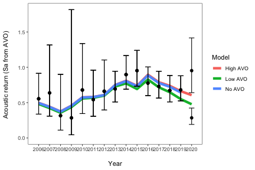
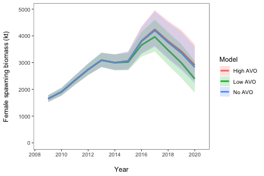

## Summary
The SSC selected model from December 2019 was 16.2. The following are 
draft results of simply updating anticipated 2020 catches over three cases:     
1.  No AVO or other survey data     
2.  A 2020 AVO data point that is equal to the lowest on record (from Sail drones)     
3.  A 2020 AVO data point that is equal to the highest on record (from Sail drones)     

\begin{table}[ht]
\centering
\caption{Summary of model 16.2 results and the stock condition for EBS pollock. Biomass units are thousands of t.} 
\label{tab:res_summ}
\begin{tabular}{llll}
  \hline
Component & No AVO & Low AVO & High AVO \\ 
  \hline
${B}_{2021}$ & 2,500 & 2,000 & 2,600 \\ 
  $CV_{B_{2021}}$ & 0.13 & 0.14 & 0.13 \\ 
  $B_{MSY}$ & 2,181 & 2,119 & 2,194 \\ 
  $CV_{B_{MSY}}$ & 0.22 & 0.22 & 0.23 \\ 
  ${B}_{2021}/B_{MSY}$ & 113\% & 93\% & 116\% \\ 
  $B_0$ & 5,721 & 5,567 & 5,752 \\ 
  $B_{35\%}$ & 2,168 & 2,123 & 2,177 \\ 
  SPR rate at $F_{MSY}$ & 28\% & 28\% & 28\% \\ 
  Steepness & 0.66 & 0.67 & 0.66 \\ 
  Est. $B_{2020} / B_{2020,no fishing}$ & 0.58 & 0.53 & 0.59 \\ 
  $B_{2020} / B_{MSY}$ & 130\% & 113\% & 133\% \\ 
   \hline
\end{tabular}
\end{table}
\begin{table}[ht]
\centering
\caption{Summary results of Tier 1 2020 yield projections for EBS pollock.} 
\label{tab:tab2}
\begin{tabular}{lrrr}
  \hline
Component & No AVO & Low AVO & High AVO \\ 
  \hline
2021 fishable biomass (GM) & 6,838,000 & 5,618,000 & 7,073,000 \\ 
  Equilibrium fishable biomass at MSY & 6,018,000 & 6,236,000 & 5,983,000 \\ 
  MSY R (HM) & 0.367 & 0.347 & 0.37 \\ 
  2021 Tier 1 ABC & 2,509,000 & 1,814,000 & 2,620,000 \\ 
  2021 Tier 1 $F_{OFL}$ & 0.421 & 0.395 & 0.426 \\ 
  2021 Tier 1 OFL & 2,880,000 & 2,070,000 & 3,011,000 \\ 
  MSY R (HM) & 0.312 & 0.295 & 0.314 \\ 
  Recommended ABC & 1,381,000 & 872,000 & 1,492,000 \\ 
   \hline
\end{tabular}
\end{table}

# The end
Bye
