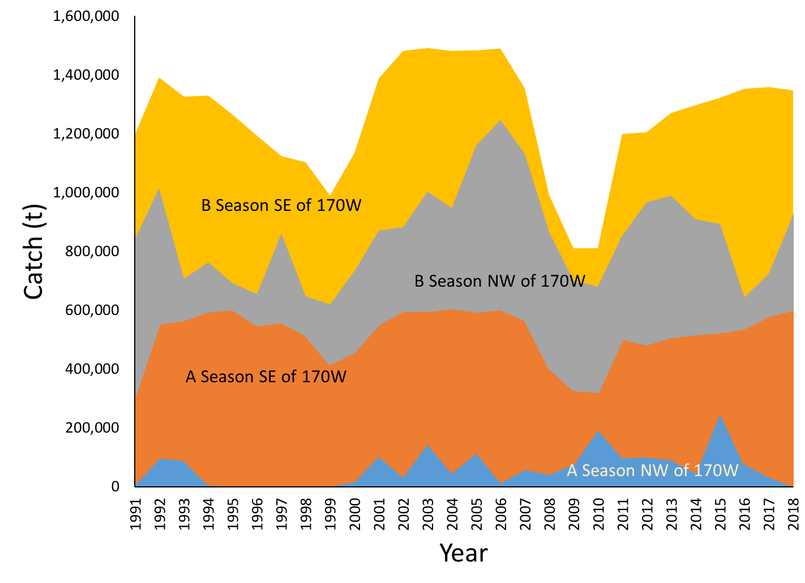

#Figures

\clearpage

\clearpage

\clearpage

\clearpage

\clearpage

![Pollock catch distribution during June – October, 2014-2016.] 

\clearpage

![EBS pollock roe production in A and B seasons compared to overall landed catch, 2000-2015.]

\clearpage

\clearpage

![EBS pollock observer sampling summarized for number of ages, hauls from which ages were collected, and lengths (total measured and hauls sampled), 1991-2015.]

\clearpage
![Bottom-trawl survey biomass estimates with approximate 95% confidence bounds (density-dependent correction method; DDC) for EBS pollock, 1982-2016, bottom panel. These estimates include the northern strata except for 1982-84, and 1986. Horizontal line represents the long-term mean. The top panel shows the design-based estimates (DB) together with the density dependence-corrected (DDC) series and three specifications of a random-effects geostatistical approach (Thorson 2016)

\clearpage
![Bottom and surface temperatures for the Bering Sea from the NMFS summer bottom-trawl surveys (1987-2016). 

\clearpage
![EBS pollock CPUE (shades = relative kg/hectare) and bottom temperature isotherms of 0º, 2º, and 4º Celsius from summer bottom-trawl surveys, 2007-2016.

\clearpage
![Bottom trawl survey pollock catch in kg per hectare for 2014 - 2016. Height of vertical lines are proportional to station-specific pollock densities by weight (kg per hectare) with constant scales for all years.
 
\clearpage
![Pollock abundance levels by age and year as estimated directly from the NMFS bottom-trawl surveys (1990-2016). The 2006 and 2008 year-classes are shaded differently. 

\clearpage
![Evaluation of EBS pollock cohort abundances as observed for age 5 and older in the NMFS summer bottom trawl surveys, 1982-2016. The bottom panel shows the raw log-abundances at age while the top panel shows the estimates of total mortality by cohort (the 2007 year-class had anomalous increases in abundance from age 5-8). 

\clearpage
![Pollock abundance at age estimates from the AT survey, 1991-2016 (note that the 2016 estimates are based on the BTS age length data applied to the ATS length compositions). 

![EBS pollock acoustic-trawl survey transects (superimposed) over bottom-trawl survey stations and density estimates (in both settings contoured in the yellow-red heat map) comparing 2016 (top) and 2014 (bottom). 

![EBS pollock profile likelihood over fixed values of age 3+ natural mortality under Model 16.1 showing negative log-likelihood selected components differences relative to the minimum value for the grid of M=0.1 to 0.3. Note that the range was selected based on initial attempts to estimate M within the assessment and that this is for expository purposes only (the fact that the survey age composition favors lower natural mortality is likely due to dynamics affecting availability of pollock in recent years—i.e., movement into the region).

![Schematic of EBS pollock fishery data (top) and model fits to estimate mean body weights-at-age (kg; bottom). Ages are in columns, years are in rows. Residuals expressed as (observed-predicted)/observed. Note that the data remain in the model and are used for computing fishery catch biomass, but model predictions for 2016-2018 (and their associated uncertainty shown in last three rows of lower-right table) are used for Tier 1 model projections and ABC/OFL estimates for models using these estimates.

![EBS pollock results of model evaluations comparing last year’s model and results with the same model using updated data and the proposed new model for 2016 (Model 16.1). Female spawning biomass is shown on top panel and recent recruitment at age one in lower panel.

Catch biomass only updated 
(no new age data in fitting)

Catch and fishery age data updated

Catch and fishery age data updated and bottom trawl survey data updated

Catch and fishery age, bottom trawl survey data, and acoustic-trawl data all included 
Age
![Model 16.1 fits to new EBS pollock age composition data. Captions on right depict data fitted for each row (new data in shaded bars). 

![EBS pollock Model 16.1 fits to AT biomass estimates (top) and BTS estimates (bottom). The four panels for each survey are for incremental additions of data to the current assessment (C=fishery catch only, CA adds in fishery catch-age data, CAB adds in BTS data, and CABE represents addition of echo integration AT data). Note that dots without error bars means that data point was excluded from estimation.

![Model 16.1 fits to observed mean age for the fishery (bottom) bottom trawl survey (middle) and the Acoustic trawl survey (top) for EBS pollock.

![Selectivity at age estimates for the EBS pollock fishery, 1978-2016 including the estimates (front-most panel) used for the future yield considerations.

![Model fit (dots) to the EBS pollock fishery proportion-at-age data (columns; 1964-2015). The 2015 data are new to this year’s assessment. Colors coincide with cohorts progressing through time.

![Japanese fishery CPUE (Low and Ikeda, 1980) model fits for EBS pollock, 1965-1976.

![Model results of predicted EBS pollock biomass following the AVO index (under model 1.0). Error bars represent assumed 95% confidence bounds.

![Estimates of bottom-trawl survey numbers (millions age 2 and older, lower panel) and selectivity-at-age (with maximum value equal to 1.0) over time (upper panel) for EBS pollock, 1982-2016. 

![Model fit (dots) to the bottom trawl survey proportion-at-age composition data (columns) for EBS pollock. Colors correspond to cohorts over time. Data new to this assessment are from 2016.

![Estimates of AT survey numbers (lower panel) and selectivity-at-age (with mean value equal to 1.0) over time (upper panel) for EBS pollock age 2 and older, 1979-2016. Note that the 1979 observed value (=46,314) is off the scale of the ![
![Fit to the AT survey EBS pollock age composition data (proportion of numbers). Lines represent model predictions while the vertical columns and dots represent data. The 2016 age composition data were based on age data from the BTS applied to the AT survey length frequency. 

 
![Estimated spawning exploitation rate (defined as the percent removal of egg production in a given spawning year), implied SPR rate (actually 1-SPR so that higher values imply more impact on spawning biomass per recruit) and average fishing mortality (ages 3-8) for EBS pollock, 1977-2016. Error bars represent two standard deviations from the estimates.

![Estimated instantaneous age-specific fishing mortality rates for EBS pollock, 1964-2016. (note that these are the continuous form of fishing mortality rate as specified in Eq. 1; colors correspond to low (green) and high (red) values). 
 

![Comparison of the current assessment results with past assessments of begin-year EBS age-3+ pollock biomass, 1978-2016. 

![Estimated spawning biomass relative to annually estimated FMSY values and fishing mortality rates for EBS pollock, 1977-2016 (plus 2017 and 2018 in highlighted dots). Note that the control rules for OFL and ABC are designed for setting specifications in future years. 

![Recruitment estimates (age-1 recruits) for EBS pollock from the current model compared with the previous assessment (top) and for all years since 1964 (1963-2015 year classes) for Model 16.1 (bottom panel). Error bars reflect 90% credible intervals based on model estimates of uncertainty.

![Year-class strengths relative to female spawning biomass (thousands of t) for EBS pollock. Labels on points correspond to year classes labels (measured as one-year olds). Vertical lines indicate BMSY and B40% levels whereas the solid curve represents fitted stock-recruitment relationship (dashed lines represent estimated 90% credible intervals). 

![EBS pollock productivity, as measured by logged recruits per spawning biomass—log(R/S)—as a function of spawning biomass with a linear fit (top) and over time,1964-2015 (bottom). 

![EBS pollock stock-recruit relationship with alternative affinities to conditioning within the model for moderate (top) and low conditioned (bottom) scenarios with the “base condition” where the model parameters are fully conditioned on recruit and spawning stock estimates (and related likelihood components). 

 

![Retrospective patterns of model 16.1 for EBS pollock spawning in retrospective year for 2004-2016 showing the point estimates relative to the terminal year (top panel) and approximate confidence bounds on absolute scale (+2 standard deviations). Mohn’s rho was estimated to be -0.004 for the 10-year period. 

![Projected EBS Tier 3 pollock yield (top) and female spawning biomass (bottom) relative to the long-term expected values under F35% and F40% (horizontal lines). B40% is computed from average recruitment from 1978-2013. Future harvest rates follow the guidelines specified under Tier 3 Scenario 1. The grey lines represent a sub-sample of simulated trajectories. Note that the numbers at age 2 in 2015 were set to their median value.
